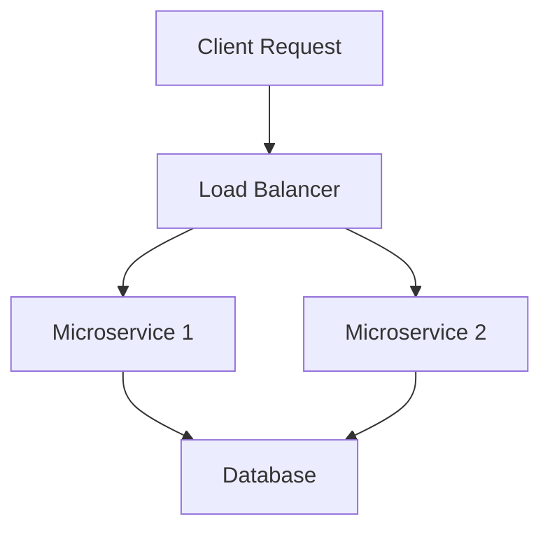

## 19.10.3 Scaling and Performance Improvements

As we delve into the realm of scaling and performance improvements for Clojure full-stack applications, it's essential to understand that the strategies we adopt can significantly impact the application's efficiency, responsiveness, and ability to handle increased loads. In this section, we'll explore various techniques, including adopting a microservices architecture, implementing caching layers, and leveraging serverless technologies. We'll draw parallels to Java, providing insights into how Clojure's unique features can enhance these strategies.

### Understanding the Need for Scaling and Performance Optimization

Scaling and performance optimization are crucial for applications that need to handle a growing number of users and data. As experienced Java developers, you're likely familiar with the challenges of scaling applications, such as managing state, ensuring data consistency, and optimizing resource usage. Clojure offers several advantages in these areas, thanks to its functional programming paradigm and immutable data structures.

#### Key Concepts in Scaling

- **Vertical Scaling**: Increasing the capacity of a single server by adding more resources (CPU, RAM, etc.).
- **Horizontal Scaling**: Adding more servers to distribute the load across multiple machines.
- **Elastic Scaling**: Dynamically adjusting resources based on demand, often used in cloud environments.

#### Performance Optimization Goals

- **Reducing Latency**: Ensuring that requests are processed quickly.
- **Increasing Throughput**: Handling more requests per unit of time.
- **Efficient Resource Utilization**: Making the most of available resources to reduce costs.

### Microservices Architecture

Microservices architecture involves breaking down an application into smaller, independent services that can be developed, deployed, and scaled independently. This approach contrasts with monolithic architectures, where all components are tightly coupled.

#### Benefits of Microservices

- **Scalability**: Each service can be scaled independently based on its specific needs.
- **Resilience**: Failures in one service do not necessarily impact others.
- **Flexibility**: Different services can be developed using different technologies.

#### Implementing Microservices in Clojure

Clojure's simplicity and expressiveness make it an excellent choice for microservices. Its immutable data structures and functional programming model facilitate building robust, maintainable services.

```clojure
;; Example of a simple Clojure microservice using Ring and Compojure
(ns my-microservice.core
  (:require [compojure.core :refer :all]
            [ring.adapter.jetty :refer [run-jetty]]))

(defroutes app-routes
  (GET "/hello" [] "Hello, World!"))

(defn -main []
  (run-jetty app-routes {:port 3000}))
```

**Explanation**: This code snippet demonstrates a basic microservice using Ring and Compojure. The service listens on port 3000 and responds with "Hello, World!" to GET requests at the `/hello` endpoint.

#### Comparing with Java

In Java, setting up a microservice might involve more boilerplate code and configuration. Clojure's concise syntax and powerful libraries reduce the complexity, allowing developers to focus on business logic.

### Caching Strategies

Caching is a technique used to store frequently accessed data in a temporary storage area to reduce access time and improve performance. Clojure provides several libraries and tools to implement caching effectively.

#### Types of Caching

- **In-Memory Caching**: Stores data in RAM for fast access. Suitable for small datasets.
- **Distributed Caching**: Uses a distributed system to cache data across multiple nodes. Ideal for large-scale applications.

#### Implementing Caching in Clojure

Clojure's immutable data structures make it easy to implement caching without worrying about data consistency issues.

```clojure
;; Example of using Clojure's core.cache library for caching
(ns my-app.cache
  (:require [clojure.core.cache :as cache]))

(def my-cache (cache/lru-cache-factory {} :threshold 100))

(defn get-from-cache [key]
  (cache/lookup my-cache key))

(defn add-to-cache [key value]
  (cache/assoc my-cache key value))
```

**Explanation**: This example uses the `core.cache` library to create a simple LRU (Least Recently Used) cache. The `get-from-cache` and `add-to-cache` functions demonstrate basic cache operations.

#### Comparing with Java

Java developers often use libraries like Ehcache or Guava for caching. While these libraries are powerful, Clojure's functional approach simplifies cache management by eliminating mutable state.

### Leveraging Serverless Technologies

Serverless computing allows developers to build and run applications without managing infrastructure. Functions are executed in response to events, and resources are automatically scaled.

#### Benefits of Serverless

- **Cost Efficiency**: Pay only for the compute time you use.
- **Automatic Scaling**: Resources are scaled automatically based on demand.
- **Reduced Operational Overhead**: No need to manage servers or infrastructure.

#### Implementing Serverless Functions in Clojure

Clojure can be used to write serverless functions, often deployed on platforms like AWS Lambda or Google Cloud Functions.

```clojure
;; Example of a simple AWS Lambda function in Clojure
(ns my-lambda.core
  (:gen-class
   :implements [com.amazonaws.services.lambda.runtime.RequestHandler]))

(defn -handleRequest [this input context]
  (str "Hello, " (get input "name")))
```

**Explanation**: This example demonstrates a basic AWS Lambda function written in Clojure. The function takes an input map and returns a greeting message.

#### Comparing with Java

Java is a popular choice for serverless functions, but Clojure's concise syntax and REPL-driven development can speed up the development process and reduce code complexity.

### Performance Monitoring and Optimization

Monitoring and optimizing performance is an ongoing process. Clojure provides several tools and techniques to help developers identify bottlenecks and improve application performance.

#### Profiling and Monitoring Tools

- **VisualVM**: A tool for monitoring and profiling Java applications, compatible with Clojure.
- **JVM Metrics**: Use JMX (Java Management Extensions) to monitor JVM performance metrics.
- **Clojure-Specific Tools**: Libraries like `criterium` for benchmarking and `re-frame-10x` for debugging ClojureScript applications.

#### Optimizing Clojure Code

- **Avoid Reflection**: Use type hints to avoid reflection and improve performance.
- **Leverage Transients**: Use transients for temporary mutable operations to improve performance.
- **Optimize Data Structures**: Choose the right data structures for your use case.

```clojure
;; Example of using type hints to avoid reflection
(defn add-numbers ^long [^long a ^long b]
  (+ a b))
```

**Explanation**: This function uses type hints to specify that the parameters and return value are `long`, avoiding reflection and improving performance.

### Try It Yourself

To deepen your understanding, try modifying the examples provided:

- **Microservices**: Add more endpoints to the microservice and explore how to handle different HTTP methods.
- **Caching**: Implement a cache eviction policy and test its impact on performance.
- **Serverless**: Deploy a Clojure serverless function on a cloud platform and test its scalability.

### Diagrams and Visualizations

Below are some diagrams to help visualize the concepts discussed:



**Diagram**: This flowchart illustrates a basic microservices architecture with a load balancer distributing requests to multiple services, each interacting with a shared database.


**Diagram**: This flowchart shows the caching process, where a request first checks the cache before fetching data from the database.

### Further Reading

For more information on the topics covered, consider exploring the following resources:

- [Official Clojure Documentation](https://clojure.org/)
- [ClojureDocs](https://clojuredocs.org/)
- [AWS Lambda Documentation](https://docs.aws.amazon.com/lambda/latest/dg/welcome.html)
- [Google Cloud Functions Documentation](https://cloud.google.com/functions/docs)

### Exercises

1. **Microservices Exercise**: Create a simple microservice that performs CRUD operations on a dataset. Use Clojure's Ring and Compojure libraries.
2. **Caching Exercise**: Implement a caching layer for a Clojure application and measure its impact on performance.
3. **Serverless Exercise**: Write a serverless function in Clojure that processes data from an external API and deploy it on a cloud platform.

### Key Takeaways

- **Microservices**: Clojure's simplicity and expressiveness make it well-suited for building microservices.
- **Caching**: Effective caching strategies can significantly improve application performance.
- **Serverless**: Leveraging serverless technologies can reduce operational overhead and improve scalability.
- **Performance Optimization**: Continuous monitoring and optimization are essential for maintaining high performance.

Now that we've explored various strategies for scaling and performance improvements in Clojure full-stack applications, let's apply these concepts to enhance your applications' efficiency and scalability.

## Quiz: Scaling and Performance Improvements in Clojure Full-Stack Applications



### What is a key benefit of using microservices architecture?

- [x] Scalability
- [ ] Increased complexity
- [ ] Monolithic design
- [ ] Single point of failure

> **Explanation:** Microservices architecture allows each service to be scaled independently, enhancing scalability.

### Which Clojure library is commonly used for caching?

- [x] core.cache
- [ ] core.async
- [ ] clojure.test
- [ ] clojure.java.jdbc

> **Explanation:** The `core.cache` library provides caching utilities in Clojure.

### What is a primary advantage of serverless computing?

- [x] Automatic scaling
- [ ] Manual server management
- [ ] Increased infrastructure costs
- [ ] Static resource allocation

> **Explanation:** Serverless computing automatically scales resources based on demand, reducing the need for manual server management.

### How can you avoid reflection in Clojure code?

- [x] Use type hints
- [ ] Use more macros
- [ ] Avoid using functions
- [ ] Use dynamic typing

> **Explanation:** Type hints in Clojure help avoid reflection, improving performance.

### What is the purpose of a load balancer in a microservices architecture?

- [x] Distribute requests across services
- [ ] Store data persistently
- [ ] Execute serverless functions
- [ ] Cache frequently accessed data

> **Explanation:** A load balancer distributes incoming requests across multiple services to ensure even load distribution.

### Which tool is used for profiling Java applications, including those written in Clojure?

- [x] VisualVM
- [ ] IntelliJ IDEA
- [ ] Eclipse
- [ ] NetBeans

> **Explanation:** VisualVM is a tool for monitoring and profiling Java applications, including Clojure applications running on the JVM.

### What is a common use case for serverless functions?

- [x] Event-driven processing
- [ ] Persistent data storage
- [ ] Long-running computations
- [ ] Manual resource allocation

> **Explanation:** Serverless functions are often used for event-driven processing, where functions are triggered by specific events.

### Which Clojure feature simplifies cache management by eliminating mutable state?

- [x] Immutable data structures
- [ ] Dynamic typing
- [ ] Macros
- [ ] Reflection

> **Explanation:** Clojure's immutable data structures simplify cache management by ensuring data consistency without mutable state.

### What is a benefit of using transients in Clojure?

- [x] Improved performance for temporary mutable operations
- [ ] Increased code complexity
- [ ] Enhanced security
- [ ] Simplified syntax

> **Explanation:** Transients provide a way to perform temporary mutable operations in Clojure, improving performance.

### True or False: Clojure's functional programming model facilitates building robust, maintainable microservices.

- [x] True
- [ ] False

> **Explanation:** Clojure's functional programming model, with its emphasis on immutability and simplicity, facilitates building robust, maintainable microservices.


