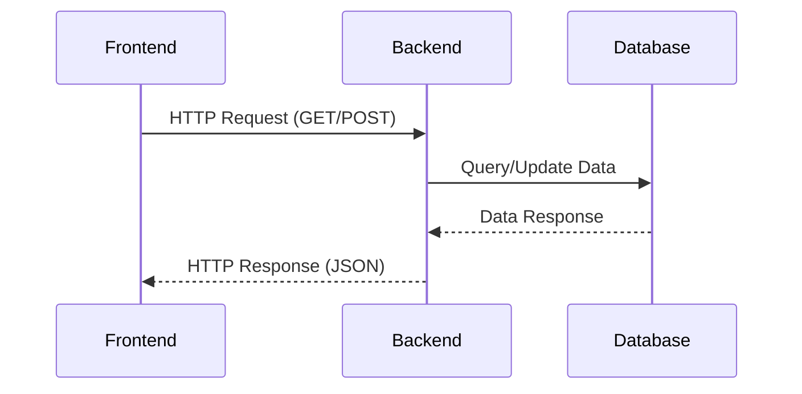
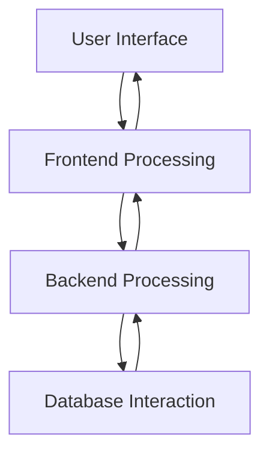

## 19.2.1 Architectural Overview

In this section, we will delve into the architectural design of a full-stack application using Clojure. We'll explore how the backend and frontend components interact, the flow of data, and how different layers such as data access, business logic, and presentation are organized. We'll also discuss the principles of separation of concerns and how they are applied in the application design, highlighting the benefits of this architectural approach in terms of scalability, maintainability, and flexibility.

### Understanding the Full-Stack Architecture

A full-stack application encompasses both the backend and frontend components, each playing a crucial role in delivering a seamless user experience. The backend is responsible for data processing, business logic, and database interactions, while the frontend handles user interface and experience.

#### Backend Architecture

The backend of our Clojure application is designed to be robust and scalable. It typically consists of several layers:

1. **Data Access Layer (DAL):** This layer is responsible for interacting with the database. It abstracts the complexities of database operations, providing a simple interface for the business logic layer to retrieve and manipulate data.

2. **Business Logic Layer (BLL):** This layer contains the core functionality of the application. It processes data, applies business rules, and ensures that the application behaves as expected.

3. **API Layer:** This layer exposes the application's functionality to the frontend through RESTful endpoints. It acts as a bridge between the frontend and the backend, ensuring secure and efficient data exchange.

4. **Security Layer:** This layer handles authentication and authorization, ensuring that only authorized users can access certain functionalities.

#### Frontend Architecture

The frontend of our application is built using ClojureScript, a dialect of Clojure that compiles to JavaScript. The frontend architecture typically includes:

1. **Presentation Layer:** This layer is responsible for rendering the user interface. It uses libraries like Reagent (a ClojureScript interface to React) to create dynamic and interactive web pages.

2. **State Management Layer:** This layer manages the application's state, ensuring that the UI reflects the current state of the application. Re-frame, a ClojureScript framework, is often used for this purpose.

3. **Routing Layer:** This layer handles navigation within the application, ensuring that users can move seamlessly between different pages and components.

### Interaction Between Backend and Frontend

The interaction between the backend and frontend is facilitated through RESTful APIs. The frontend sends HTTP requests to the backend, which processes these requests, interacts with the database if necessary, and sends back responses. This interaction is crucial for maintaining a dynamic and responsive user experience.

*Diagram 1: Interaction between frontend and backend through RESTful APIs.*

### Data Flow in the Application

Data flow in a full-stack application is a critical aspect of its architecture. It involves the movement of data from the user interface to the database and back, ensuring that the application remains responsive and consistent.

1. **User Interaction:** The user interacts with the frontend, triggering events such as button clicks or form submissions.

2. **Frontend Processing:** The frontend processes these events, updating the UI and sending requests to the backend if necessary.

3. **Backend Processing:** The backend receives these requests, processes them according to the business logic, and interacts with the database to retrieve or update data.

4. **Database Interaction:** The database stores and retrieves data as requested by the backend.

5. **Response to Frontend:** The backend sends a response back to the frontend, which updates the UI accordingly.

*Diagram 2: Data flow in a full-stack application.*

### Separation of Concerns

Separation of concerns is a design principle that promotes the division of a program into distinct sections, each addressing a separate concern. In our full-stack application, this principle is applied in several ways:

- **Layered Architecture:** By organizing the application into layers (e.g., data access, business logic, presentation), we ensure that each layer has a specific responsibility, making the application easier to understand and maintain.

- **Modular Design:** Each component of the application is designed to be self-contained and independent, allowing for easier testing and modification.

- **Clear Interfaces:** By defining clear interfaces between components, we ensure that changes in one part of the application do not affect others, enhancing flexibility and scalability.

### Benefits of This Architectural Approach

The architectural approach outlined above offers several benefits:

- **Scalability:** By separating concerns and defining clear interfaces, the application can be easily scaled to handle increased load or additional features.

- **Maintainability:** The modular design and separation of concerns make the application easier to understand, test, and modify, reducing the risk of introducing bugs.

- **Flexibility:** The clear interfaces and modular components allow for easy integration of new technologies or changes in business requirements.

- **Performance:** By optimizing each layer for its specific responsibility, the application can achieve high performance and responsiveness.

### Try It Yourself

To better understand the architectural concepts discussed, try modifying the code examples provided. For instance, you can:

- Add a new endpoint to the API layer and observe how it interacts with the frontend.
- Implement a new feature in the business logic layer and see how it affects the overall application.
- Experiment with different state management strategies in the frontend.

### Exercises

1. **Design a New Feature:** Choose a feature you would like to add to the application and design its architecture, considering how it will interact with existing components.

2. **Refactor an Existing Component:** Identify a component in the application that could benefit from refactoring and apply the principles of separation of concerns to improve its design.

3. **Implement a New Data Flow:** Create a new data flow in the application, ensuring that it follows the principles outlined in this section.

### Key Takeaways

- A full-stack application consists of both backend and frontend components, each with specific responsibilities.
- The backend is organized into layers, including data access, business logic, and API, while the frontend includes presentation, state management, and routing layers.
- Interaction between backend and frontend is facilitated through RESTful APIs, ensuring efficient data exchange.
- Separation of concerns is a key design principle that enhances scalability, maintainability, and flexibility.
- The architectural approach outlined offers several benefits, including improved performance and easier integration of new features.

By understanding and applying these architectural principles, you can design and build robust, scalable, and maintainable full-stack applications using Clojure.

## Quiz: Test Your Understanding of Full-Stack Architecture in Clojure



### What is the primary role of the data access layer in a full-stack application?

- [x] Interacting with the database
- [ ] Rendering the user interface
- [ ] Managing application state
- [ ] Handling user authentication

> **Explanation:** The data access layer is responsible for interacting with the database, abstracting the complexities of database operations.

### How does the frontend communicate with the backend in a full-stack application?

- [x] Through RESTful APIs
- [ ] By directly accessing the database
- [ ] Using WebSockets
- [ ] Via file system operations

> **Explanation:** The frontend communicates with the backend through RESTful APIs, which provide a standardized way to exchange data.

### What is the benefit of separating concerns in application architecture?

- [x] Enhances maintainability and scalability
- [ ] Increases code complexity
- [ ] Reduces performance
- [ ] Limits flexibility

> **Explanation:** Separation of concerns enhances maintainability and scalability by organizing the application into distinct sections, each addressing a separate concern.

### Which layer in the backend architecture is responsible for applying business rules?

- [x] Business Logic Layer
- [ ] Data Access Layer
- [ ] API Layer
- [ ] Security Layer

> **Explanation:** The Business Logic Layer is responsible for applying business rules and ensuring that the application behaves as expected.

### What is the role of the presentation layer in the frontend architecture?

- [x] Rendering the user interface
- [ ] Managing application state
- [ ] Handling HTTP requests
- [ ] Interacting with the database

> **Explanation:** The presentation layer is responsible for rendering the user interface, creating dynamic and interactive web pages.

### What principle promotes the division of a program into distinct sections, each addressing a separate concern?

- [x] Separation of Concerns
- [ ] Single Responsibility Principle
- [ ] Open/Closed Principle
- [ ] Dependency Inversion Principle

> **Explanation:** Separation of Concerns is a design principle that promotes the division of a program into distinct sections, each addressing a separate concern.

### What is a key benefit of using a modular design in application architecture?

- [x] Easier testing and modification
- [ ] Increased code duplication
- [ ] Reduced code readability
- [ ] Limited feature integration

> **Explanation:** A modular design makes the application easier to test and modify, as each component is self-contained and independent.

### How does the backend ensure secure and efficient data exchange with the frontend?

- [x] By exposing RESTful endpoints
- [ ] By directly accessing the frontend's state
- [ ] By using WebSockets
- [ ] By interacting with the file system

> **Explanation:** The backend ensures secure and efficient data exchange with the frontend by exposing RESTful endpoints.

### What is the role of the state management layer in the frontend architecture?

- [x] Managing the application's state
- [ ] Rendering the user interface
- [ ] Handling HTTP requests
- [ ] Interacting with the database

> **Explanation:** The state management layer manages the application's state, ensuring that the UI reflects the current state of the application.

### True or False: The architectural approach outlined in this section improves performance and responsiveness.

- [x] True
- [ ] False

> **Explanation:** The architectural approach improves performance and responsiveness by optimizing each layer for its specific responsibility.


