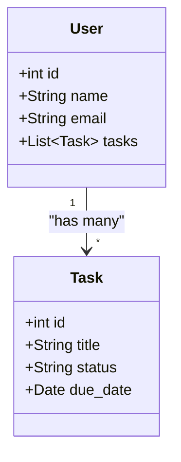

## 19.2.3 Database Schema and Data Modeling

In this section, we will delve into the intricacies of designing a database schema and data modeling for a full-stack application using Clojure. As experienced Java developers, you are likely familiar with the concepts of database design and entity relationships. Here, we will explore how these concepts translate into the Clojure ecosystem, leveraging its unique features to create robust and scalable data models.

### Understanding Database Schema Design

A database schema is a blueprint that defines the structure of a database, including tables, fields, relationships, and constraints. In a Clojure-based application, the schema design process involves:

- Identifying the entities and their attributes.
- Defining relationships between entities.
- Ensuring data integrity through constraints and validations.
- Choosing the appropriate database technology (relational or NoSQL).

### Relational vs. NoSQL Databases

Before diving into schema design, it's crucial to choose the right type of database for your application. Let's compare relational databases like PostgreSQL with NoSQL databases like MongoDB.

#### Relational Databases

Relational databases organize data into tables with predefined schemas. They are ideal for applications requiring complex queries and transactions. Key features include:

- **Structured Schema**: Tables with fixed columns and data types.
- **ACID Transactions**: Ensures data consistency and integrity.
- **SQL Queries**: Powerful querying capabilities.

**Example: PostgreSQL**

```sql
CREATE TABLE users (
    id SERIAL PRIMARY KEY,
    name VARCHAR(100),
    email VARCHAR(100) UNIQUE,
    created_at TIMESTAMP DEFAULT CURRENT_TIMESTAMP
);

CREATE TABLE tasks (
    id SERIAL PRIMARY KEY,
    user_id INTEGER REFERENCES users(id),
    title VARCHAR(255),
    status VARCHAR(50),
    due_date DATE
);
```

#### NoSQL Databases

NoSQL databases offer flexible schemas and are suitable for applications with dynamic data models or high scalability requirements. Key features include:

- **Schema-less Design**: Allows for flexible data structures.
- **Horizontal Scalability**: Easily scales across multiple servers.
- **Document-based Storage**: Stores data in JSON-like documents.

**Example: MongoDB**

```json
{
  "users": [
    {
      "_id": "1",
      "name": "Alice",
      "email": "alice@example.com",
      "created_at": "2024-11-25T12:00:00Z",
      "tasks": [
        {
          "title": "Complete project",
          "status": "in-progress",
          "due_date": "2024-12-01"
        }
      ]
    }
  ]
}
```

### Modeling Entity Relationships

In any application, entities often have relationships with one another. Let's explore how to model these relationships in both relational and NoSQL databases.

#### One-to-Many Relationships

In a relational database, a one-to-many relationship is typically represented using foreign keys.

**Example: Users and Tasks**

```sql
CREATE TABLE tasks (
    id SERIAL PRIMARY KEY,
    user_id INTEGER REFERENCES users(id),
    title VARCHAR(255),
    status VARCHAR(50),
    due_date DATE
);
```

In a NoSQL database, you might embed related documents within a parent document.

**Example: Embedded Tasks in MongoDB**

```json
{
  "user_id": "1",
  "name": "Alice",
  "tasks": [
    {
      "title": "Complete project",
      "status": "in-progress",
      "due_date": "2024-12-01"
    }
  ]
}
```

#### Many-to-Many Relationships

Many-to-many relationships require an intermediary table in relational databases.

**Example: Users and Projects**

```sql
CREATE TABLE projects (
    id SERIAL PRIMARY KEY,
    name VARCHAR(255)
);

CREATE TABLE user_projects (
    user_id INTEGER REFERENCES users(id),
    project_id INTEGER REFERENCES projects(id),
    PRIMARY KEY (user_id, project_id)
);
```

In NoSQL, you might use references or arrays to represent many-to-many relationships.

**Example: User Projects in MongoDB**

```json
{
  "user_id": "1",
  "name": "Alice",
  "project_ids": ["101", "102"]
}
```

### Data Integrity and Constraints

Ensuring data integrity is crucial for maintaining a reliable database. In relational databases, this is achieved through constraints such as primary keys, foreign keys, and unique constraints.

**Example: PostgreSQL Constraints**

```sql
CREATE TABLE users (
    id SERIAL PRIMARY KEY,
    email VARCHAR(100) UNIQUE
);
```

In NoSQL databases, data integrity is often enforced at the application level, using validations and checks within the application code.

### Data Modeling in Clojure

Clojure provides powerful tools for data modeling, leveraging its immutable data structures and functional programming paradigm. Let's explore how to represent data models using Clojure's maps and records.

#### Using Maps for Data Modeling

Maps in Clojure are versatile and can be used to represent entities and their attributes.

**Example: User Entity**

```clojure
(def user
  {:id 1
   :name "Alice"
   :email "alice@example.com"
   :created-at (java.time.Instant/now)})
```

#### Using Records for Data Modeling

Records provide a way to define structured data types with named fields, offering better performance and type safety.

**Example: User Record**

```clojure
(defrecord User [id name email created-at])

(def alice (->User 1 "Alice" "alice@example.com" (java.time.Instant/now)))
```

### Choosing Between Relational and NoSQL Databases

The choice between relational and NoSQL databases depends on the specific requirements of your application. Consider the following factors:

- **Data Structure**: If your data has a fixed schema, a relational database may be more suitable. For dynamic or hierarchical data, consider NoSQL.
- **Scalability**: NoSQL databases offer better horizontal scalability, making them ideal for applications with large volumes of data.
- **Consistency vs. Flexibility**: Relational databases provide strong consistency guarantees, while NoSQL databases offer more flexibility in data modeling.

### Try It Yourself

Experiment with the following Clojure code snippets to model different entities and relationships. Modify the attributes and relationships to fit your application's needs.

**Clojure Map Example**

```clojure
(def task
  {:id 1
   :title "Complete project"
   :status "in-progress"
   :due-date "2024-12-01"})

(def user
  {:id 1
   :name "Alice"
   :email "alice@example.com"
   :tasks [task]})
```

**Clojure Record Example**

```clojure
(defrecord Task [id title status due-date])

(defrecord User [id name email tasks])

(def task1 (->Task 1 "Complete project" "in-progress" "2024-12-01"))

(def alice (->User 1 "Alice" "alice@example.com" [task1]))
```

### Visualizing Data Models

Below is a diagram representing a simple data model with users and tasks, illustrating both relational and NoSQL approaches.



*Diagram: A class diagram showing the relationship between User and Task entities.*

### Exercises

1. **Design a Database Schema**: Create a schema for a simple e-commerce application with entities like products, orders, and customers. Use both relational and NoSQL approaches.
2. **Model Relationships**: Implement one-to-many and many-to-many relationships using Clojure maps and records.
3. **Data Integrity**: Write Clojure functions to validate data integrity for your models.

### Key Takeaways

- **Database Choice**: Choose between relational and NoSQL databases based on your application's requirements.
- **Entity Relationships**: Model relationships effectively using foreign keys in relational databases or embedded documents in NoSQL.
- **Data Integrity**: Ensure data integrity through constraints in relational databases or application-level validations in NoSQL.
- **Clojure Data Modeling**: Leverage Clojure's maps and records for flexible and efficient data modeling.

By understanding these concepts, you can design robust and scalable database schemas for your Clojure applications, ensuring data integrity and efficient data access.

### Further Reading

- [Official Clojure Documentation](https://clojure.org/)
- [ClojureDocs](https://clojuredocs.org/)
- [PostgreSQL Documentation](https://www.postgresql.org/docs/)
- [MongoDB Documentation](https://docs.mongodb.com/)

## Quiz: Mastering Database Schema and Data Modeling in Clojure



### What is a primary benefit of using a relational database like PostgreSQL?

- [x] Structured schema with strong consistency guarantees
- [ ] Flexible schema for dynamic data
- [ ] Horizontal scalability
- [ ] Document-based storage

> **Explanation:** Relational databases like PostgreSQL provide structured schemas with strong consistency guarantees, making them ideal for applications requiring complex queries and transactions.

### How are one-to-many relationships typically represented in a relational database?

- [x] Using foreign keys
- [ ] Using embedded documents
- [ ] Using arrays
- [ ] Using references

> **Explanation:** In relational databases, one-to-many relationships are typically represented using foreign keys, which link records in one table to records in another.

### What is a key feature of NoSQL databases like MongoDB?

- [x] Schema-less design
- [ ] ACID transactions
- [ ] SQL queries
- [ ] Fixed columns and data types

> **Explanation:** NoSQL databases like MongoDB offer a schema-less design, allowing for flexible data structures and easy scalability.

### In Clojure, which data structure is commonly used to represent entities and their attributes?

- [x] Maps
- [ ] Lists
- [ ] Sets
- [ ] Vectors

> **Explanation:** In Clojure, maps are commonly used to represent entities and their attributes due to their key-value pair structure.

### What is a benefit of using Clojure records over maps for data modeling?

- [x] Better performance and type safety
- [ ] More flexible data structure
- [ ] Easier to modify
- [ ] Supports dynamic keys

> **Explanation:** Clojure records provide better performance and type safety compared to maps, making them suitable for structured data types.

### Which factor should you consider when choosing between relational and NoSQL databases?

- [x] Data structure and scalability requirements
- [ ] Only the cost of the database
- [ ] The popularity of the database
- [ ] The color of the database logo

> **Explanation:** When choosing between relational and NoSQL databases, consider factors like data structure and scalability requirements to ensure the database meets your application's needs.

### How can data integrity be enforced in a NoSQL database?

- [x] Through application-level validations
- [ ] Using foreign keys
- [ ] Using SQL constraints
- [ ] Using ACID transactions

> **Explanation:** In NoSQL databases, data integrity is often enforced through application-level validations, as they do not support traditional SQL constraints.

### What is the purpose of using foreign keys in a relational database?

- [x] To link records in one table to records in another
- [ ] To store large binary data
- [ ] To create indexes
- [ ] To define data types

> **Explanation:** Foreign keys are used in relational databases to link records in one table to records in another, establishing relationships between entities.

### Which Clojure data structure provides a way to define structured data types with named fields?

- [x] Records
- [ ] Maps
- [ ] Lists
- [ ] Sets

> **Explanation:** Clojure records provide a way to define structured data types with named fields, offering better performance and type safety.

### True or False: NoSQL databases are ideal for applications with fixed schemas and complex queries.

- [ ] True
- [x] False

> **Explanation:** NoSQL databases are not ideal for applications with fixed schemas and complex queries. They are better suited for applications with dynamic data models and high scalability requirements.


