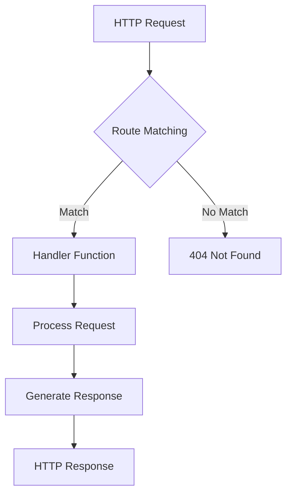

## 19.3.2 Defining Routes and Handlers

In this section, we will explore how to define routes and handlers in Clojure, focusing on popular libraries like Compojure and Pedestal. As experienced Java developers, you are likely familiar with frameworks such as Spring MVC or JAX-RS for defining routes and handling HTTP requests. In Clojure, we leverage the power of functional programming to create concise and expressive routing logic. Let's dive into the details.

### Understanding Routing in Clojure

Routing is a fundamental aspect of web development, allowing us to map HTTP requests to specific handler functions. In Clojure, we use libraries like Compojure and Pedestal to define routes. These libraries provide a declarative way to specify URL patterns and associate them with handler functions.

#### Compojure: A Simple and Elegant Routing Library

Compojure is a popular routing library in the Clojure ecosystem. It offers a straightforward syntax for defining routes and is often used in conjunction with Ring, a Clojure web application library. Let's start by looking at a basic example of defining routes using Compojure.

```clojure
(ns myapp.routes
  (:require [compojure.core :refer :all]
            [ring.util.response :refer [response]]))

(defroutes app-routes
  (GET "/" [] (response "Welcome to the Home Page"))
  (GET "/about" [] (response "About Us"))
  (POST "/contact" [] (response "Contact Form Submitted")))
```

In this example, we define a namespace `myapp.routes` and import necessary functions from Compojure and Ring. The `defroutes` macro is used to define a set of routes. Each route is associated with an HTTP method (e.g., `GET`, `POST`) and a handler function that returns a response.

**Key Concepts:**
- **GET, POST, etc.:** These are HTTP methods used to define the type of request the route will handle.
- **Handler Functions:** Functions that process the request and generate a response.

#### Pedestal: A Comprehensive Web Framework

Pedestal is another powerful option for building web applications in Clojure. It provides more features than Compojure, including support for asynchronous processing and advanced routing capabilities. Here's an example of defining routes using Pedestal.

```clojure
(ns myapp.service
  (:require [io.pedestal.http :as http]
            [io.pedestal.http.route :as route]))

(def routes
  (route/expand-routes
    #{["/" :get (fn [request] {:status 200 :body "Welcome to the Home Page"})]
      ["/about" :get (fn [request] {:status 200 :body "About Us"})]
      ["/contact" :post (fn [request] {:status 200 :body "Contact Form Submitted"})]}))

(def service {:env :prod
              ::http/routes routes
              ::http/type :jetty
              ::http/port 8080})
```

In this example, we define a set of routes using Pedestal's `route/expand-routes` function. Each route is associated with an HTTP method and a handler function that returns a map representing the response.

**Key Concepts:**
- **Route Definitions:** Use vectors to define the path, method, and handler.
- **Handler Functions:** Return a map with `:status` and `:body` keys to define the response.

### Associating Routes with Handler Functions

In both Compojure and Pedestal, handler functions are responsible for processing requests and generating responses. Let's explore how to create handlers that perform common operations like retrieving data, creating new resources, updating existing resources, and deleting resources.

#### Retrieving Data

To retrieve data, we typically use the `GET` method. Here's an example of a handler function that retrieves a list of users.

```clojure
(defn get-users [request]
  (let [users [{:id 1 :name "Alice"} {:id 2 :name "Bob"}]]
    (response users)))

(defroutes app-routes
  (GET "/users" [] get-users))
```

In this example, the `get-users` function returns a list of users as a response. We use the `response` function from Ring to convert the data into an HTTP response.

#### Creating New Resources

To create new resources, we use the `POST` method. Here's an example of a handler function that creates a new user.

```clojure
(defn create-user [request]
  (let [user (-> request :body slurp json/read-str)]
    (response (str "User created: " (:name user)))))

(defroutes app-routes
  (POST "/users" [] create-user))
```

In this example, the `create-user` function reads the request body, parses it as JSON, and returns a response indicating that the user was created.

#### Updating Existing Resources

To update existing resources, we use the `PUT` method. Here's an example of a handler function that updates a user's information.

```clojure
(defn update-user [request]
  (let [user-id (-> request :params :id)
        user-data (-> request :body slurp json/read-str)]
    (response (str "User " user-id " updated with name: " (:name user-data)))))

(defroutes app-routes
  (PUT "/users/:id" [id] update-user))
```

In this example, the `update-user` function extracts the user ID from the route parameters and the updated data from the request body.

#### Deleting Resources

To delete resources, we use the `DELETE` method. Here's an example of a handler function that deletes a user.

```clojure
(defn delete-user [request]
  (let [user-id (-> request :params :id)]
    (response (str "User " user-id " deleted"))))

(defroutes app-routes
  (DELETE "/users/:id" [id] delete-user))
```

In this example, the `delete-user` function extracts the user ID from the route parameters and returns a response indicating that the user was deleted.

### Best Practices for Organizing Routes and Handlers

When defining routes and handlers, it's important to organize your code for readability and maintainability. Here are some best practices to consider:

- **Modularize Your Code:** Break down your routes and handlers into separate namespaces or files based on functionality. This makes it easier to manage and navigate your codebase.
- **Use Descriptive Names:** Use clear and descriptive names for your routes and handler functions. This helps other developers understand the purpose of each route.
- **Leverage Middleware:** Use middleware to handle common tasks like authentication, logging, and error handling. This keeps your handler functions focused on their core responsibilities.
- **Document Your Routes:** Provide documentation for your routes, including the expected request parameters and response format. This is especially important for APIs that will be consumed by other developers.

### Comparing with Java

In Java, defining routes and handlers is often done using annotations or configuration files. For example, in Spring MVC, you might define a route using the `@RequestMapping` annotation:

```java
@RestController
public class UserController {

    @GetMapping("/users")
    public List<User> getUsers() {
        return userService.getAllUsers();
    }

    @PostMapping("/users")
    public ResponseEntity<String> createUser(@RequestBody User user) {
        userService.saveUser(user);
        return ResponseEntity.ok("User created");
    }
}
```

In Clojure, we achieve similar functionality using a more declarative and functional approach. The use of higher-order functions and immutability in Clojure can lead to more concise and expressive code.

### Try It Yourself

To deepen your understanding, try modifying the examples above:

1. **Add a new route** for retrieving a single user by ID.
2. **Implement error handling** for invalid input data.
3. **Use middleware** to log incoming requests.

### Diagrams and Visualizations

To better understand the flow of data through routes and handlers, let's visualize the process using a flowchart.



**Diagram Description:** This flowchart illustrates the process of handling an HTTP request in a Clojure web application. The request is matched against defined routes, and if a match is found, the corresponding handler function processes the request and generates a response.

### Further Reading

For more information on routing and handlers in Clojure, check out the following resources:

- [Compojure Documentation](https://github.com/weavejester/compojure)
- [Pedestal Documentation](https://pedestal.io/)
- [Ring Documentation](https://github.com/ring-clojure/ring)

### Exercises

1. **Define a new route** for updating a user's email address.
2. **Create a handler function** that returns a list of users filtered by a query parameter.
3. **Implement a middleware** that adds a custom header to all responses.

### Key Takeaways

- **Routing Libraries:** Compojure and Pedestal are popular choices for defining routes in Clojure.
- **Handler Functions:** Responsible for processing requests and generating responses.
- **Best Practices:** Organize routes and handlers for readability and maintainability.
- **Comparison with Java:** Clojure offers a more functional and declarative approach to routing.

Now that we've explored how to define routes and handlers in Clojure, you're ready to build robust APIs for your applications. Keep experimenting and applying these concepts to create efficient and maintainable web applications.

## Quiz: Mastering Routes and Handlers in Clojure



### What is the primary purpose of routing in a web application?

- [x] To map HTTP requests to specific handler functions
- [ ] To manage database connections
- [ ] To handle user authentication
- [ ] To generate HTML content

> **Explanation:** Routing is used to map HTTP requests to specific handler functions that process the request and generate a response.

### Which Clojure library is known for its simple and elegant routing capabilities?

- [x] Compojure
- [ ] Pedestal
- [ ] Ring
- [ ] Luminus

> **Explanation:** Compojure is a popular Clojure library known for its simple and elegant routing capabilities.

### In Compojure, what macro is used to define a set of routes?

- [x] `defroutes`
- [ ] `defn`
- [ ] `defmacro`
- [ ] `defroute`

> **Explanation:** The `defroutes` macro is used in Compojure to define a set of routes.

### What HTTP method is typically used to retrieve data from a server?

- [x] GET
- [ ] POST
- [ ] PUT
- [ ] DELETE

> **Explanation:** The GET method is typically used to retrieve data from a server.

### How do you handle JSON data in a Clojure handler function?

- [x] Use `slurp` and `json/read-str` to parse the request body
- [ ] Use `println` to output the data
- [ ] Use `str` to concatenate strings
- [ ] Use `map` to transform data

> **Explanation:** In Clojure, you can use `slurp` to read the request body and `json/read-str` to parse it as JSON.

### What is a common practice for organizing routes and handlers in Clojure?

- [x] Modularize code into separate namespaces or files
- [ ] Use a single file for all routes
- [ ] Avoid using middleware
- [ ] Use global variables for state management

> **Explanation:** Modularizing code into separate namespaces or files is a common practice for organizing routes and handlers in Clojure.

### Which HTTP method is used to update existing resources?

- [x] PUT
- [ ] GET
- [ ] POST
- [ ] DELETE

> **Explanation:** The PUT method is used to update existing resources on a server.

### What is the purpose of middleware in a Clojure web application?

- [x] To handle common tasks like authentication and logging
- [ ] To define routes
- [ ] To manage database connections
- [ ] To generate HTML content

> **Explanation:** Middleware is used to handle common tasks like authentication, logging, and error handling in a Clojure web application.

### How does Clojure's approach to routing differ from Java's?

- [x] Clojure uses a more declarative and functional approach
- [ ] Clojure uses annotations for routing
- [ ] Clojure requires XML configuration files
- [ ] Clojure does not support routing

> **Explanation:** Clojure uses a more declarative and functional approach to routing, unlike Java, which often uses annotations or configuration files.

### True or False: In Clojure, handler functions must always return a map with `:status` and `:body` keys.

- [x] True
- [ ] False

> **Explanation:** In Clojure, handler functions typically return a map with `:status` and `:body` keys to define the HTTP response.




