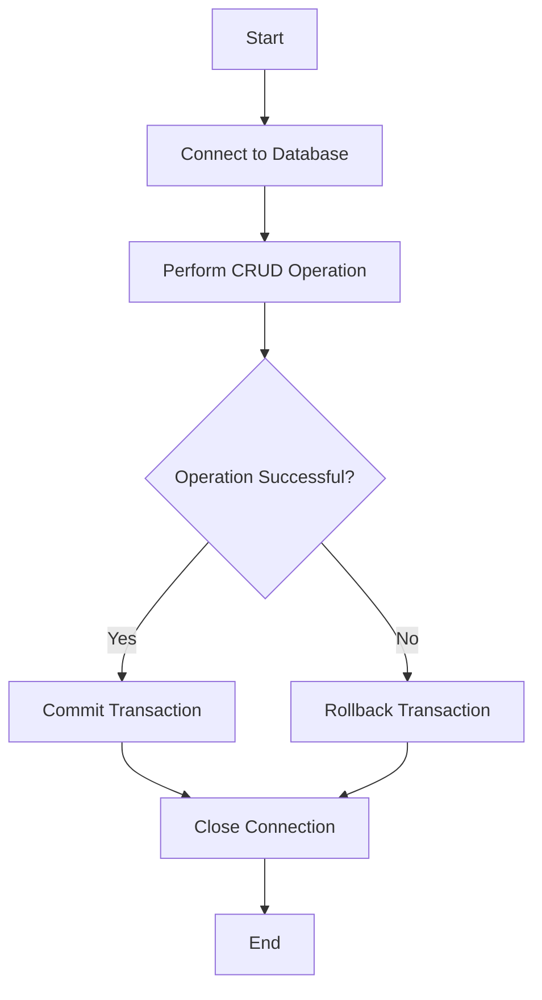

## 19.3.3 Data Persistence and Database Operations

In this section, we will delve into data persistence and database operations in Clojure, focusing on how to establish connections to databases, configure connection pooling, and manage resource cleanup. We will also explore performing CRUD (Create, Read, Update, Delete) operations, including parameterized queries and transaction management. Additionally, we will discuss techniques for preventing SQL injection and ensuring data security.

### Establishing Database Connections

Establishing a connection to a database is the first step in interacting with it. In Clojure, we commonly use libraries like `clojure.java.jdbc` or `next.jdbc` for database operations. Let's start by setting up a connection using `next.jdbc`, a modern and efficient library for database access in Clojure.

#### Setting Up `next.jdbc`

To begin, add `next.jdbc` to your project dependencies. In your `deps.edn` file, include:

```clojure
{:deps {seancorfield/next.jdbc {:mvn/version "1.2.772"}}}
```

Next, let's establish a connection to a PostgreSQL database. Ensure you have the PostgreSQL JDBC driver included in your dependencies:

```clojure
{:deps {org.postgresql/postgresql {:mvn/version "42.2.20"}}}
```

Now, we can create a database connection:

```clojure
(ns myapp.db
  (:require [next.jdbc :as jdbc]))

(def db-spec
  {:dbtype "postgresql"
   :dbname "mydatabase"
   :host "localhost"
   :user "myuser"
   :password "mypassword"})

(def datasource (jdbc/get-datasource db-spec))
```

In this example, `db-spec` is a map containing the database connection details. The `jdbc/get-datasource` function returns a datasource that can be used for executing queries.

### Configuring Connection Pooling

Connection pooling is crucial for managing database connections efficiently, especially in web applications where multiple requests may need to access the database simultaneously. `next.jdbc` supports connection pooling through the `HikariCP` library.

#### Setting Up HikariCP

To configure connection pooling, modify your `db-spec` to include HikariCP settings:

```clojure
(def db-spec
  {:dbtype "postgresql"
   :dbname "mydatabase"
   :host "localhost"
   :user "myuser"
   :password "mypassword"
   :maximum-pool-size 10
   :minimum-idle 2
   :idle-timeout 30000
   :connection-timeout 30000})
```

These settings control the pool size and connection timeouts, ensuring efficient resource usage.

### Performing CRUD Operations

CRUD operations are fundamental to interacting with databases. Let's explore how to perform these operations using `next.jdbc`.

#### Create Operation

To insert data into a table, use the `jdbc/execute!` function:

```clojure
(defn create-user [datasource user]
  (jdbc/execute! datasource
                 ["INSERT INTO users (name, email) VALUES (?, ?)"
                  (:name user) (:email user)]))
```

This function takes a `datasource` and a `user` map, inserting the user's name and email into the `users` table.

#### Read Operation

To retrieve data, use the `jdbc/execute!` function with a `SELECT` query:

```clojure
(defn get-user-by-id [datasource user-id]
  (jdbc/execute-one! datasource
                     ["SELECT * FROM users WHERE id = ?" user-id]))
```

The `jdbc/execute-one!` function returns a single result, which is useful for queries expected to return a single row.

#### Update Operation

Updating data is similar to inserting, using the `UPDATE` SQL command:

```clojure
(defn update-user-email [datasource user-id new-email]
  (jdbc/execute! datasource
                 ["UPDATE users SET email = ? WHERE id = ?"
                  new-email user-id]))
```

This function updates the email of a user with the specified `user-id`.

#### Delete Operation

To delete data, use the `DELETE` SQL command:

```clojure
(defn delete-user [datasource user-id]
  (jdbc/execute! datasource
                 ["DELETE FROM users WHERE id = ?" user-id]))
```

This function removes a user from the `users` table based on their `user-id`.

### Parameterized Queries and SQL Injection Prevention

Parameterized queries are essential for preventing SQL injection, a common security vulnerability. By using placeholders (`?`) in your SQL queries, you ensure that user input is treated as data, not executable code.

#### Example of Parameterized Query

```clojure
(defn find-users-by-name [datasource name]
  (jdbc/execute! datasource
                 ["SELECT * FROM users WHERE name = ?" name]))
```

In this example, the `name` parameter is safely included in the query, preventing SQL injection.

### Transaction Management

Transactions ensure that a series of database operations are executed atomically. If any operation fails, the entire transaction is rolled back.

#### Using Transactions in `next.jdbc`

```clojure
(defn transfer-funds [datasource from-user-id to-user-id amount]
  (jdbc/with-transaction [tx datasource]
    (jdbc/execute! tx
                   ["UPDATE accounts SET balance = balance - ? WHERE user_id = ?"
                    amount from-user-id])
    (jdbc/execute! tx
                   ["UPDATE accounts SET balance = balance + ? WHERE user_id = ?"
                    amount to-user-id])))
```

The `jdbc/with-transaction` macro ensures that both updates are part of a single transaction. If either update fails, the transaction is rolled back.

### Resource Cleanup

Proper resource cleanup is crucial to prevent resource leaks. Use the `with-open` macro to ensure resources are closed after use:

```clojure
(with-open [conn (jdbc/get-connection datasource)]
  ;; Perform database operations
  )
```

### Security Considerations

In addition to using parameterized queries, consider these security practices:

- **Use Least Privilege**: Ensure database users have only the permissions they need.
- **Encrypt Sensitive Data**: Use encryption for sensitive data both in transit and at rest.
- **Regularly Update Dependencies**: Keep your database and libraries up-to-date to protect against vulnerabilities.

### Try It Yourself

Experiment with the following:

- Modify the CRUD functions to handle additional fields in the `users` table.
- Implement a function to retrieve all users with pagination support.
- Add error handling to the transaction example to log failures.

### Diagrams

Below is a flowchart illustrating the CRUD operations in a typical database interaction:



**Diagram Description**: This flowchart represents the typical flow of database operations, including connection, CRUD operations, transaction management, and resource cleanup.

### Exercises

1. **Implement a Batch Insert**: Create a function to insert multiple users in a single database call.
2. **Secure Your Queries**: Refactor any non-parameterized queries in your codebase to use parameterized queries.
3. **Transaction Challenge**: Implement a transaction that transfers funds between two accounts, ensuring atomicity.

### Key Takeaways

- **Connection Management**: Use `next.jdbc` for efficient database connections and HikariCP for connection pooling.
- **CRUD Operations**: Perform CRUD operations using parameterized queries to prevent SQL injection.
- **Transaction Management**: Use transactions to ensure atomicity of multiple database operations.
- **Security Practices**: Implement security best practices to protect your database and data.

By mastering these concepts, you can effectively manage data persistence and database operations in your Clojure applications, leveraging the power of functional programming and the JVM ecosystem.

For further reading, explore the [Official Clojure Documentation](https://clojure.org/) and [ClojureDocs](https://clojuredocs.org/).

---

## Quiz: Mastering Data Persistence and Database Operations in Clojure



### What is the primary purpose of using connection pooling in database operations?

- [x] To manage database connections efficiently and improve performance
- [ ] To increase the number of database connections
- [ ] To reduce the size of the database
- [ ] To simplify SQL queries

> **Explanation:** Connection pooling helps manage database connections efficiently, reducing the overhead of opening and closing connections frequently, thus improving performance.

### Which Clojure library is commonly used for modern database access?

- [x] next.jdbc
- [ ] clojure.data.json
- [ ] ring
- [ ] compojure

> **Explanation:** `next.jdbc` is a modern library used for database access in Clojure, providing efficient and idiomatic ways to interact with databases.

### How do parameterized queries help prevent SQL injection?

- [x] By treating user input as data rather than executable code
- [ ] By encrypting the SQL query
- [ ] By using a different database user
- [ ] By logging all queries

> **Explanation:** Parameterized queries use placeholders for user input, ensuring that input is treated as data, not code, thus preventing SQL injection attacks.

### What is the role of the `with-transaction` macro in `next.jdbc`?

- [x] To ensure a series of database operations are executed atomically
- [ ] To open a new database connection
- [ ] To close the database connection
- [ ] To log database operations

> **Explanation:** The `with-transaction` macro ensures that a series of database operations are executed as a single transaction, providing atomicity.

### Which of the following is a best practice for database security?

- [x] Use parameterized queries
- [ ] Use hardcoded SQL queries
- [x] Encrypt sensitive data
- [ ] Use the same database user for all operations

> **Explanation:** Using parameterized queries and encrypting sensitive data are best practices for database security, preventing SQL injection and protecting data.

### What is the purpose of the `with-open` macro in Clojure?

- [x] To ensure resources are closed after use
- [ ] To open a new file
- [ ] To start a new transaction
- [ ] To log resource usage

> **Explanation:** The `with-open` macro ensures that resources, such as database connections, are closed after use, preventing resource leaks.

### How can you ensure atomicity in database operations?

- [x] By using transactions
- [ ] By using multiple connections
- [x] By using the `with-transaction` macro
- [ ] By executing operations in parallel

> **Explanation:** Transactions ensure atomicity in database operations, and the `with-transaction` macro in `next.jdbc` provides a way to manage transactions in Clojure.

### What is a common security vulnerability in database operations?

- [x] SQL injection
- [ ] File not found
- [ ] Null pointer exception
- [ ] Stack overflow

> **Explanation:** SQL injection is a common security vulnerability where malicious SQL code is executed in the database, often due to improper handling of user input.

### Which function is used to execute a single SQL query in `next.jdbc`?

- [x] jdbc/execute-one!
- [ ] jdbc/query
- [ ] jdbc/insert!
- [ ] jdbc/delete!

> **Explanation:** The `jdbc/execute-one!` function is used to execute a single SQL query and return a single result, suitable for queries expected to return one row.

### True or False: Connection pooling is only necessary for large-scale applications.

- [ ] True
- [x] False

> **Explanation:** Connection pooling is beneficial for applications of all sizes, as it improves the efficiency of database connections and reduces overhead.


