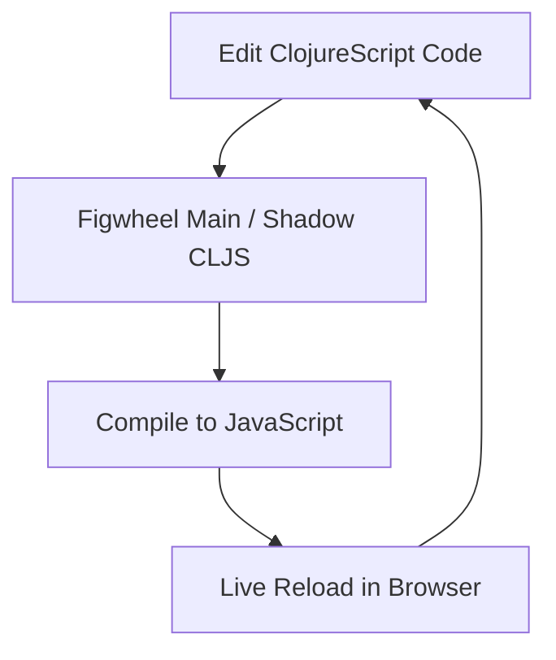

## 19.4.2 Setting Up the ClojureScript Environment

As experienced Java developers, you're likely familiar with setting up environments for Java applications. Transitioning to ClojureScript, a powerful tool for building modern web applications, involves setting up a development environment that supports live reloading and efficient builds. In this guide, we'll walk through setting up a ClojureScript environment using tools like **Figwheel Main** and **Shadow CLJS**. These tools streamline the development process by providing live reloading, hot code swapping, and efficient build processes.

### Understanding ClojureScript

ClojureScript is a variant of Clojure that compiles to JavaScript, allowing you to write Clojure code that runs in the browser. It leverages the power of functional programming and immutability, offering a robust alternative to JavaScript for frontend development. ClojureScript integrates seamlessly with JavaScript libraries and frameworks, making it a versatile choice for web applications.

### Key Tools for ClojureScript Development

Before diving into the setup, let's explore the key tools we'll be using:

- **Leiningen**: A build automation tool for Clojure projects, similar to Maven or Gradle in Java.
- **Figwheel Main**: Provides live reloading of ClojureScript code, enabling a smooth development experience.
- **Shadow CLJS**: A build tool that simplifies the process of compiling ClojureScript, offering advanced features like module splitting and npm integration.

### Setting Up Your ClojureScript Environment

#### Step 1: Install Java

Ensure that you have Java installed on your system, as ClojureScript relies on the Java Virtual Machine (JVM). You can verify your Java installation by running:

```bash
java -version
```

If Java is not installed, download and install it from the [official Oracle website](https://www.oracle.com/java/technologies/javase-jdk11-downloads.html).

#### Step 2: Install Leiningen

Leiningen is essential for managing Clojure projects. Install it by following these steps:

1. **Download the Leiningen script**:
   ```bash
   curl https://raw.githubusercontent.com/technomancy/leiningen/stable/bin/lein -o /usr/local/bin/lein
   ```

2. **Make the script executable**:
   ```bash
   chmod +x /usr/local/bin/lein
   ```

3. **Run Leiningen** to download dependencies:
   ```bash
   lein
   ```

#### Step 3: Create a New ClojureScript Project

Use Leiningen to create a new ClojureScript project. We'll use Figwheel Main for live reloading:

```bash
lein new figwheel-main my-clojurescript-app -- --reagent
```

This command creates a new project named `my-clojurescript-app` with Reagent, a minimalistic React wrapper for ClojureScript.

#### Step 4: Configure Figwheel Main

Navigate to your project directory and open the `deps.edn` file. Add the following configuration to enable Figwheel Main:

```clojure
{:paths ["src" "resources"]
 :deps {org.clojure/clojure {:mvn/version "1.10.3"}
        org.clojure/clojurescript {:mvn/version "1.10.844"}
        com.bhauman/figwheel-main {:mvn/version "0.2.14"}
        reagent {:mvn/version "1.1.0"}}
 :aliases {:fig {:main-opts ["-m" "figwheel.main" "-b" "dev" "-r"]}}}
```

This configuration specifies the paths, dependencies, and aliases for running Figwheel Main.

#### Step 5: Run Figwheel Main

Start the Figwheel Main server to enable live reloading:

```bash
clojure -A:fig
```

This command compiles your ClojureScript code and opens a browser window with live reloading enabled. Any changes you make to your code will automatically reflect in the browser.

#### Step 6: Install Shadow CLJS (Optional)

Shadow CLJS is an alternative to Figwheel Main, offering advanced features like npm integration. To install Shadow CLJS, follow these steps:

1. **Install Node.js**: Shadow CLJS requires Node.js. Download and install it from the [official Node.js website](https://nodejs.org/).

2. **Install Shadow CLJS globally**:
   ```bash
   npm install -g shadow-cljs
   ```

3. **Create a Shadow CLJS configuration file**: In your project directory, create a `shadow-cljs.edn` file with the following content:

   ```clojure
   {:source-paths ["src"]
    :dependencies [[reagent "1.1.0"]]
    :builds {:app {:target :browser
                   :output-dir "public/js"
                   :asset-path "/js"
                   :modules {:main {:entries [my-clojurescript-app.core]}}}}}
   ```

4. **Run Shadow CLJS**:
   ```bash
   shadow-cljs watch app
   ```

This command compiles your ClojureScript code and watches for changes, providing live reloading.

### Comparing Figwheel Main and Shadow CLJS

Both Figwheel Main and Shadow CLJS offer live reloading and efficient builds, but they have distinct features:

- **Figwheel Main**: Ideal for projects that prioritize simplicity and quick setup. It integrates seamlessly with Leiningen and is well-suited for smaller projects.
- **Shadow CLJS**: Offers advanced features like npm integration, module splitting, and better support for large-scale applications. It's a great choice for projects that require complex build configurations.

### Code Example: A Simple ClojureScript Component

Let's create a simple ClojureScript component using Reagent. Open the `src/my_clojurescript_app/core.cljs` file and add the following code:

```clojure
(ns my-clojurescript-app.core
  (:require [reagent.core :as r]))

(defn hello-world []
  [:div
   [:h1 "Hello, ClojureScript!"]
   [:p "This is a simple Reagent component."]])

(defn mount-root []
  (r/render [hello-world]
            (.getElementById js/document "app")))

(defn init []
  (mount-root))
```

This code defines a simple Reagent component that displays a greeting message. The `init` function mounts the component to the DOM element with the ID `app`.

### Try It Yourself

Experiment with the code by modifying the `hello-world` function to display different messages or add new HTML elements. Observe how Figwheel Main or Shadow CLJS automatically reloads the changes in your browser.

### Diagram: ClojureScript Development Workflow

Below is a diagram illustrating the ClojureScript development workflow using Figwheel Main or Shadow CLJS:



**Diagram Description**: This flowchart represents the iterative development process in ClojureScript, where code edits are compiled and live-reloaded in the browser.

### Further Reading

For more information on ClojureScript and its ecosystem, consider exploring the following resources:

- [Official ClojureScript Documentation](https://clojurescript.org/)
- [Figwheel Main GitHub Repository](https://github.com/bhauman/figwheel-main)
- [Shadow CLJS Documentation](https://shadow-cljs.github.io/docs/UsersGuide.html)

### Exercises

1. **Create a New Component**: Extend the example by creating a new Reagent component that displays a list of items. Use a vector to represent the list and map over it to generate HTML elements.

2. **Integrate a JavaScript Library**: Use Shadow CLJS to integrate a popular JavaScript library, such as Lodash or Moment.js, into your ClojureScript project. Create a component that utilizes the library's functionality.

3. **Explore Module Splitting**: With Shadow CLJS, experiment with module splitting by creating multiple entry points in your application. Observe how this affects the build process and application performance.

### Key Takeaways

- **ClojureScript** offers a powerful alternative to JavaScript for frontend development, leveraging Clojure's functional programming capabilities.
- **Figwheel Main** and **Shadow CLJS** are essential tools for ClojureScript development, providing live reloading and efficient builds.
- **Reagent** simplifies the creation of interactive UI components, making it easy to build dynamic web applications.
- **Experimentation** is key to mastering ClojureScript. Modify code examples, integrate libraries, and explore advanced features to deepen your understanding.

Now that we've set up the ClojureScript environment, you're ready to build interactive web applications with the power of Clojure. Let's continue to explore how these tools can enhance your development workflow.

## Quiz: Mastering ClojureScript Environment Setup



### What is the primary purpose of Figwheel Main in ClojureScript development?

- [x] To provide live reloading of ClojureScript code
- [ ] To compile ClojureScript to Java
- [ ] To manage database connections
- [ ] To handle HTTP requests

> **Explanation:** Figwheel Main is primarily used for live reloading of ClojureScript code, allowing developers to see changes in real-time.

### Which tool is known for advanced features like npm integration and module splitting?

- [ ] Figwheel Main
- [x] Shadow CLJS
- [ ] Leiningen
- [ ] Reagent

> **Explanation:** Shadow CLJS is known for its advanced features, including npm integration and module splitting, making it suitable for complex projects.

### What is the role of Leiningen in a ClojureScript project?

- [x] To manage project dependencies and build configurations
- [ ] To provide a graphical user interface
- [ ] To compile Java code
- [ ] To handle network requests

> **Explanation:** Leiningen is a build automation tool used to manage dependencies and build configurations in Clojure projects.

### How does Shadow CLJS differ from Figwheel Main?

- [x] Shadow CLJS offers npm integration and module splitting
- [ ] Shadow CLJS is only for backend development
- [ ] Shadow CLJS does not support live reloading
- [ ] Shadow CLJS is a database management tool

> **Explanation:** Shadow CLJS offers npm integration and module splitting, which are not available in Figwheel Main, making it more suitable for larger projects.

### What is the main advantage of using Reagent in ClojureScript?

- [x] It simplifies the creation of interactive UI components
- [ ] It compiles ClojureScript to Java
- [ ] It manages server-side logic
- [ ] It handles database transactions

> **Explanation:** Reagent simplifies the creation of interactive UI components by providing a minimalistic React wrapper for ClojureScript.

### Which command is used to start the Figwheel Main server?

- [x] `clojure -A:fig`
- [ ] `lein run`
- [ ] `npm start`
- [ ] `java -jar figwheel.jar`

> **Explanation:** The command `clojure -A:fig` is used to start the Figwheel Main server, enabling live reloading of ClojureScript code.

### What is the purpose of the `deps.edn` file in a ClojureScript project?

- [x] To specify project dependencies and configurations
- [ ] To store user data
- [ ] To compile Java code
- [ ] To manage HTTP requests

> **Explanation:** The `deps.edn` file is used to specify project dependencies and configurations in a ClojureScript project.

### Which tool requires Node.js for installation?

- [ ] Figwheel Main
- [x] Shadow CLJS
- [ ] Leiningen
- [ ] Reagent

> **Explanation:** Shadow CLJS requires Node.js for installation, as it integrates with npm and other JavaScript tools.

### What is the benefit of live reloading in ClojureScript development?

- [x] It allows developers to see changes in real-time without restarting the server
- [ ] It compiles ClojureScript to Java
- [ ] It manages database connections
- [ ] It handles HTTP requests

> **Explanation:** Live reloading allows developers to see changes in real-time without restarting the server, enhancing the development experience.

### True or False: ClojureScript can only be used for backend development.

- [ ] True
- [x] False

> **Explanation:** False. ClojureScript is primarily used for frontend development, compiling to JavaScript to run in the browser.


