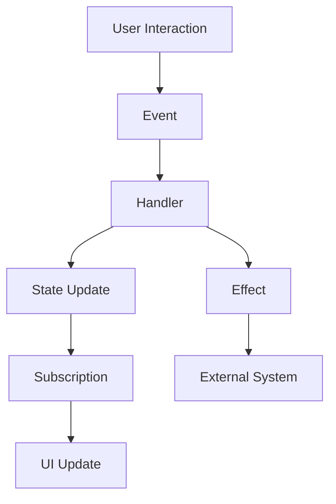

## 19.4.4 Managing State with Re-frame

In this section, we will delve into **Re-frame**, a powerful state management library designed for **Reagent** applications in ClojureScript. As experienced Java developers, you may be familiar with state management patterns in JavaScript frameworks like Redux. Re-frame offers a similar unidirectional data flow architecture but leverages the functional programming paradigms of ClojureScript. We'll explore the core concepts of Re-frame, including events, subscriptions, and effects, and provide practical examples to illustrate how to manage state effectively in your applications.

### Understanding Re-frame's Architecture

Re-frame is built on the principles of unidirectional data flow, which simplifies the management of application state by enforcing a single source of truth. This architecture consists of several key components:

1. **Events**: Actions that describe changes in the application state.
2. **Subscriptions**: Queries that derive data from the application state.
3. **Effects**: Side effects triggered by events, such as AJAX requests or local storage updates.
4. **Coeffects**: Data required to process an event, such as the current state or time.
5. **Handlers**: Functions that process events and update the state.

Let's visualize this architecture with a diagram:



**Diagram Description**: This flowchart illustrates the unidirectional data flow in Re-frame. User interactions trigger events, which are processed by handlers to update the state. Subscriptions derive data from the state to update the UI, while effects handle interactions with external systems.

### Setting Up a Re-frame Project

Before we dive into code examples, let's set up a basic Re-frame project. We'll use Leiningen, a popular build tool for Clojure, to bootstrap our project.

1. **Create a new project**:
   ```bash
   lein new re-frame my-app
   ```

2. **Navigate to the project directory**:
   ```bash
   cd my-app
   ```

3. **Start the development server**:
   ```bash
   lein figwheel
   ```

This will start a live-reloading development server, allowing you to see changes in real-time as you develop your application.

### Handling Events in Re-frame

Events in Re-frame are similar to actions in Redux. They represent changes in the application state and are dispatched in response to user interactions or other triggers.

#### Defining an Event

Let's define a simple event to increment a counter:

```clojure
(ns my-app.events
  (:require [re-frame.core :as re-frame]))

(re-frame/reg-event-db
  :increment-counter
  (fn [db _]
    (update db :counter inc)))
```

**Code Explanation**:
- `reg-event-db` is used to register an event handler.
- `:increment-counter` is the event identifier.
- The handler function takes the current state (`db`) and an event vector (`_`), and returns the updated state.

#### Dispatching an Event

To dispatch the `:increment-counter` event, we use the `dispatch` function:

```clojure
(re-frame/dispatch [:increment-counter])
```

This can be triggered by a button click in the UI:

```clojure
[:button {:on-click #(re-frame/dispatch [:increment-counter])} "Increment"]
```

### Subscriptions in Re-frame

Subscriptions are used to derive data from the application state and provide it to the UI. They are similar to selectors in Redux.

#### Defining a Subscription

Let's define a subscription to access the counter value:

```clojure
(ns my-app.subs
  (:require [re-frame.core :as re-frame]))

(re-frame/reg-sub
  :counter
  (fn [db _]
    (:counter db)))
```

**Code Explanation**:
- `reg-sub` registers a subscription.
- `:counter` is the subscription identifier.
- The subscription function takes the current state (`db`) and returns the counter value.

#### Using a Subscription

To use the `:counter` subscription in a Reagent component, we use the `subscribe` function:

```clojure
(ns my-app.views
  (:require [re-frame.core :as re-frame]
            [reagent.core :as reagent]))

(defn counter-view []
  (let [counter (re-frame/subscribe [:counter])]
    (fn []
      [:div
       [:p "Counter: " @counter]
       [:button {:on-click #(re-frame/dispatch [:increment-counter])} "Increment"]])))
```

**Code Explanation**:
- `subscribe` returns a reactive atom that updates when the subscription value changes.
- `@counter` dereferences the atom to get the current counter value.

### Managing Effects in Re-frame

Effects in Re-frame handle side effects, such as AJAX requests or local storage updates. They are defined using `reg-fx`.

#### Defining an Effect

Let's define an effect to log messages to the console:

```clojure
(re-frame/reg-fx
  :log
  (fn [message]
    (js/console.log message)))
```

**Code Explanation**:
- `reg-fx` registers an effect handler.
- `:log` is the effect identifier.
- The effect function takes a message and logs it to the console.

#### Triggering an Effect

To trigger the `:log` effect, we use `reg-event-fx` to define an event that returns an effect map:

```clojure
(re-frame/reg-event-fx
  :log-message
  (fn [_ [_ message]]
    {:log message}))
```

**Code Explanation**:
- `reg-event-fx` registers an event handler that returns an effect map.
- The effect map contains the `:log` effect and the message to log.

### Handling User Interactions

Re-frame makes it easy to handle user interactions by dispatching events in response to UI actions. Let's create a simple form that updates the application state based on user input.

#### Defining the Form Component

```clojure
(defn input-form []
  (let [input-value (reagent/atom "")]
    (fn []
      [:div
       [:input {:type "text"
                :value @input-value
                :on-change #(reset! input-value (-> % .-target .-value))}]
       [:button {:on-click #(re-frame/dispatch [:submit-input @input-value])} "Submit"]])))
```

**Code Explanation**:
- `reagent/atom` creates a local state for the input value.
- `reset!` updates the atom with the new input value.
- `dispatch` sends the `:submit-input` event with the input value.

#### Handling the Submit Event

```clojure
(re-frame/reg-event-db
  :submit-input
  (fn [db [_ input-value]]
    (assoc db :submitted-value input-value)))
```

**Code Explanation**:
- The event handler updates the state with the submitted input value.

### Triggering Side Effects

Re-frame allows you to trigger side effects, such as AJAX requests, using effects. Let's create an effect to fetch data from an API.

#### Defining the Fetch Effect

```clojure
(re-frame/reg-fx
  :fetch-data
  (fn [url]
    (js/fetch url
              (clj->js {:method "GET"})
              (.then (fn [response] (-> response .json (.then #(re-frame/dispatch [:data-received %]))))))))
```

**Code Explanation**:
- The effect function uses the Fetch API to make a GET request.
- The response is parsed as JSON and dispatched as a `:data-received` event.

#### Handling the Data Received Event

```clojure
(re-frame/reg-event-db
  :data-received
  (fn [db [_ data]]
    (assoc db :api-data data)))
```

**Code Explanation**:
- The event handler updates the state with the received data.

### Try It Yourself

Now that we've covered the basics of Re-frame, try modifying the examples to deepen your understanding:

- **Add a Decrement Button**: Extend the counter example to include a button that decrements the counter.
- **Display API Data**: Modify the input form example to fetch and display data from a public API when the form is submitted.
- **Log User Actions**: Use the `:log` effect to log user interactions to the console.

### Exercises

1. **Create a Todo List Application**: Use Re-frame to build a simple todo list application. Implement features like adding, removing, and marking tasks as complete.
2. **Implement a Weather App**: Create an application that fetches and displays weather data for a given location using a public API.
3. **Build a Shopping Cart**: Develop a shopping cart application that manages items, quantities, and calculates the total price.

### Key Takeaways

- **Unidirectional Data Flow**: Re-frame enforces a clear data flow, making it easier to reason about state changes.
- **Separation of Concerns**: Events, subscriptions, and effects separate state management logic from UI components.
- **Functional Programming**: Re-frame leverages ClojureScript's functional programming paradigms, promoting immutability and pure functions.

By mastering Re-frame, you'll be well-equipped to manage state in complex ClojureScript applications, leveraging the power of functional programming to build robust and maintainable software.

### Further Reading

- [Re-frame Documentation](https://github.com/day8/re-frame)
- [Reagent Documentation](https://reagent-project.github.io/)
- [ClojureScript Documentation](https://clojurescript.org/)

## Quiz: Mastering State Management with Re-frame



### What is the primary architectural pattern used by Re-frame?

- [x] Unidirectional data flow
- [ ] Bidirectional data flow
- [ ] Event-driven architecture
- [ ] Model-View-Controller (MVC)

> **Explanation:** Re-frame uses a unidirectional data flow architecture, where data flows in a single direction from events to state updates to UI updates.

### Which Re-frame component is responsible for querying derived data from the application state?

- [ ] Events
- [x] Subscriptions
- [ ] Effects
- [ ] Handlers

> **Explanation:** Subscriptions in Re-frame are used to derive data from the application state and provide it to the UI.

### How do you register an event handler in Re-frame?

- [ ] `reg-sub`
- [x] `reg-event-db`
- [ ] `reg-fx`
- [ ] `reg-cofx`

> **Explanation:** `reg-event-db` is used to register an event handler that updates the application state.

### What function is used to dispatch an event in Re-frame?

- [ ] `subscribe`
- [x] `dispatch`
- [ ] `reg-event-fx`
- [ ] `reg-fx`

> **Explanation:** The `dispatch` function is used to send events in Re-frame.

### Which Re-frame component handles side effects like AJAX requests?

- [ ] Events
- [ ] Subscriptions
- [x] Effects
- [ ] Handlers

> **Explanation:** Effects in Re-frame are responsible for handling side effects, such as making AJAX requests or updating local storage.

### What is the purpose of the `reg-fx` function in Re-frame?

- [ ] To register a subscription
- [x] To register an effect handler
- [ ] To register an event handler
- [ ] To register a coeffect

> **Explanation:** `reg-fx` is used to register an effect handler that performs side effects.

### How do you access a subscription value in a Reagent component?

- [ ] `dispatch`
- [ ] `reg-event-db`
- [x] `subscribe`
- [ ] `reg-fx`

> **Explanation:** The `subscribe` function is used to access a subscription value in a Reagent component.

### Which function is used to update a local state atom in Reagent?

- [ ] `dispatch`
- [ ] `subscribe`
- [x] `reset!`
- [ ] `reg-event-db`

> **Explanation:** The `reset!` function is used to update the value of a local state atom in Reagent.

### What is the role of handlers in Re-frame?

- [ ] To perform side effects
- [ ] To query derived data
- [x] To process events and update the state
- [ ] To manage subscriptions

> **Explanation:** Handlers in Re-frame are responsible for processing events and updating the application state.

### True or False: Re-frame promotes the use of mutable state to manage application data.

- [ ] True
- [x] False

> **Explanation:** False. Re-frame promotes the use of immutable state and functional programming principles to manage application data.


