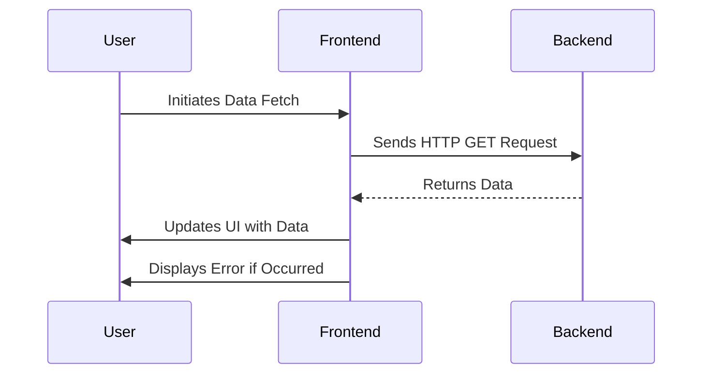

## 19.4.5 Integrating with the Backend API

In this section, we'll explore how to seamlessly integrate your ClojureScript frontend with a backend RESTful API. This integration is crucial for building dynamic web applications that can fetch, display, and manipulate data in real-time. We'll cover making HTTP requests using popular libraries like `cljs-ajax` and the browser's Fetch API, handling asynchronous data, updating the UI in response to API calls, and managing errors effectively.

### Understanding the Basics of API Integration

Before diving into the code, let's briefly discuss what API integration entails. An API (Application Programming Interface) allows different software applications to communicate with each other. In a typical web application, the frontend interacts with the backend via HTTP requests to perform operations like fetching data, submitting forms, or updating records.

#### Key Concepts:

- **HTTP Methods**: Common methods include GET (retrieve data), POST (send data), PUT (update data), and DELETE (remove data).
- **Endpoints**: URLs that represent specific resources or actions in the backend.
- **JSON**: A common data format for exchanging information between frontend and backend.
- **Asynchronous Programming**: Handling operations that may take time to complete, such as network requests, without blocking the main execution thread.

### Making HTTP Requests with `cljs-ajax`

`cljs-ajax` is a popular library in the ClojureScript ecosystem for making HTTP requests. It provides a simple and idiomatic way to interact with RESTful APIs.

#### Installation

First, add `cljs-ajax` to your project dependencies:

```clojure
;; project.clj
(defproject my-clojurescript-app "0.1.0-SNAPSHOT"
  :dependencies [[org.clojure/clojure "1.10.3"]
                 [org.clojure/clojurescript "1.10.844"]
                 [cljs-ajax "0.8.1"]])
```

#### Basic Usage

Here's a simple example of making a GET request to fetch data from an API:

```clojure
(ns my-app.core
  (:require [ajax.core :refer [GET]]))

(defn fetch-data []
  (GET "/api/data"
       {:handler (fn [response]
                   (println "Data received:" response))
        :error-handler (fn [error]
                         (println "Error occurred:" error))}))
```

- **GET**: The function to make a GET request.
- **Handler**: A callback function that processes the response.
- **Error-handler**: A callback function that handles errors.

#### Handling Asynchronous Data

In ClojureScript, handling asynchronous data is crucial for a responsive UI. Let's see how we can update the UI based on API responses.

```clojure
(ns my-app.core
  (:require [reagent.core :as r]
            [ajax.core :refer [GET]]))

(defonce app-state (r/atom {:data nil :error nil}))

(defn fetch-data []
  (GET "/api/data"
       {:handler (fn [response]
                   (reset! app-state {:data response :error nil}))
        :error-handler (fn [error]
                         (reset! app-state {:data nil :error error}))}))

(defn data-view []
  (let [{:keys [data error]} @app-state]
    [:div
     (if error
       [:p "Error loading data"]
       [:ul (for [item data]
              ^{:key item} [:li item])])]))

(defn main []
  (fetch-data)
  [data-view])
```

- **Reagent**: A minimalistic React wrapper for ClojureScript, used here to manage UI state.
- **Atom**: A ClojureScript construct for managing state.
- **Reset!**: Updates the state atom with new data.

### Using the Fetch API

The Fetch API is a modern, promise-based approach to making HTTP requests, available natively in browsers.

#### Basic Fetch Example

```clojure
(ns my-app.core
  (:require [cljs.core.async :refer [<!]]
            [cljs-http.client :as http]))

(defn fetch-data []
  (go
    (let [response (<! (http/get "/api/data"))]
      (if (= 200 (:status response))
        (println "Data received:" (:body response))
        (println "Error occurred:" (:status response))))))

(fetch-data)
```

- **Go block**: Used for asynchronous operations in ClojureScript.
- **<!**: A macro to wait for the result of an asynchronous operation.

### Updating the UI in Response to API Calls

Updating the UI based on API responses is a common requirement. Let's see how we can achieve this using Reagent.

```clojure
(defn update-ui []
  (let [{:keys [data error]} @app-state]
    (if error
      (js/alert "Failed to load data")
      (do
        ;; Update UI components with new data
        (println "Data loaded successfully")))))

(defn fetch-and-update []
  (GET "/api/data"
       {:handler (fn [response]
                   (reset! app-state {:data response :error nil})
                   (update-ui))
        :error-handler (fn [error]
                         (reset! app-state {:data nil :error error})
                         (update-ui))}))
```

### Error Handling Strategies

Handling errors gracefully is essential for a robust application. Here are some strategies:

- **User Feedback**: Inform users about errors with clear messages.
- **Retry Logic**: Implement retry mechanisms for transient errors.
- **Logging**: Log errors for debugging and monitoring.

```clojure
(defn fetch-with-retry [url retries]
  (let [attempt (atom 0)]
    (fn []
      (GET url
           {:handler (fn [response]
                       (reset! app-state {:data response :error nil}))
            :error-handler (fn [error]
                             (if (< @attempt retries)
                               (do
                                 (swap! attempt inc)
                                 (js/setTimeout #(fetch-with-retry url retries) 1000))
                               (reset! app-state {:data nil :error error}))))})))

(fetch-with-retry "/api/data" 3)
```

### Comparing with Java

In Java, you might use libraries like `HttpClient` or `OkHttp` for making HTTP requests. Here's a simple comparison:

**Java Example:**

```java
import java.net.http.HttpClient;
import java.net.http.HttpRequest;
import java.net.http.HttpResponse;
import java.net.URI;

public class ApiClient {
    public static void main(String[] args) {
        HttpClient client = HttpClient.newHttpClient();
        HttpRequest request = HttpRequest.newBuilder()
                .uri(URI.create("https://api.example.com/data"))
                .build();

        client.sendAsync(request, HttpResponse.BodyHandlers.ofString())
                .thenApply(HttpResponse::body)
                .thenAccept(System.out::println)
                .join();
    }
}
```

**ClojureScript Example:**

```clojure
(GET "/api/data"
     {:handler (fn [response] (println "Data received:" response))
      :error-handler (fn [error] (println "Error occurred:" error))})
```

- **Simplicity**: ClojureScript offers a more concise syntax.
- **Asynchronous Handling**: Both languages support asynchronous operations, but ClojureScript's use of callbacks and atoms provides a more functional approach.

### Try It Yourself

Experiment with the following:

1. Modify the `fetch-data` function to handle different HTTP methods (POST, PUT, DELETE).
2. Implement a loading indicator that displays while data is being fetched.
3. Add error handling to display specific error messages based on HTTP status codes.

### Diagrams and Visuals

To better understand the flow of data and control in our application, let's visualize it using a sequence diagram.



*Diagram 1: Sequence of interactions between the user, frontend, and backend.*

### Key Takeaways

- **ClojureScript** provides powerful tools for integrating with backend APIs, leveraging libraries like `cljs-ajax` and the Fetch API.
- **Asynchronous Programming** is crucial for responsive UIs, and ClojureScript's functional approach simplifies handling asynchronous data.
- **Error Handling** should be robust, providing user feedback and logging for debugging.
- **Comparison with Java** highlights ClojureScript's concise syntax and functional paradigms.

### Further Reading

- [ClojureScript Documentation](https://clojurescript.org/)
- [cljs-ajax GitHub Repository](https://github.com/JulianBirch/cljs-ajax)
- [Reagent Documentation](https://reagent-project.github.io/)

### Exercises

1. Create a simple ClojureScript application that fetches and displays data from a public API.
2. Implement a form submission feature using POST requests.
3. Add error handling to display custom messages for different error scenarios.

By mastering these techniques, you'll be well-equipped to build dynamic, data-driven web applications with ClojureScript.

## Quiz: Mastering API Integration in ClojureScript



### What is the primary purpose of an API in web development?

- [x] To enable communication between different software applications
- [ ] To store data in a database
- [ ] To render HTML content
- [ ] To manage user authentication

> **Explanation:** APIs allow different software applications to communicate with each other, enabling data exchange and functionality integration.

### Which library is commonly used in ClojureScript for making HTTP requests?

- [x] cljs-ajax
- [ ] axios
- [ ] jQuery
- [ ] Retrofit

> **Explanation:** `cljs-ajax` is a popular library in the ClojureScript ecosystem for making HTTP requests.

### What is the role of the `handler` function in a `cljs-ajax` request?

- [x] To process the response data from the API
- [ ] To handle errors that occur during the request
- [ ] To initiate the HTTP request
- [ ] To configure request headers

> **Explanation:** The `handler` function processes the response data received from the API.

### How does ClojureScript handle asynchronous operations?

- [x] Using callbacks and atoms
- [ ] Using synchronous blocking
- [ ] Using threads
- [ ] Using semaphores

> **Explanation:** ClojureScript handles asynchronous operations using callbacks and atoms, providing a functional approach.

### What is a common data format used for exchanging information between frontend and backend?

- [x] JSON
- [ ] XML
- [ ] CSV
- [ ] YAML

> **Explanation:** JSON (JavaScript Object Notation) is a common data format for exchanging information between frontend and backend.

### Which HTTP method is used to retrieve data from an API?

- [x] GET
- [ ] POST
- [ ] PUT
- [ ] DELETE

> **Explanation:** The GET method is used to retrieve data from an API.

### What is the purpose of the `error-handler` function in a `cljs-ajax` request?

- [x] To handle errors that occur during the request
- [ ] To process the response data from the API
- [ ] To initiate the HTTP request
- [ ] To configure request headers

> **Explanation:** The `error-handler` function handles errors that occur during the request.

### How can you update the UI in response to an API call in ClojureScript?

- [x] By using Reagent and atoms to manage state
- [ ] By directly manipulating the DOM
- [ ] By using JavaScript alerts
- [ ] By reloading the page

> **Explanation:** Reagent and atoms are used to manage state and update the UI in response to API calls in ClojureScript.

### What is a benefit of using the Fetch API in ClojureScript?

- [x] It provides a modern, promise-based approach to HTTP requests
- [ ] It is the only way to make HTTP requests in ClojureScript
- [ ] It automatically handles all errors
- [ ] It requires no configuration

> **Explanation:** The Fetch API provides a modern, promise-based approach to making HTTP requests, which is natively supported in browsers.

### True or False: ClojureScript's syntax for making HTTP requests is more concise than Java's.

- [x] True
- [ ] False

> **Explanation:** ClojureScript offers a more concise syntax for making HTTP requests compared to Java, leveraging its functional programming paradigms.


