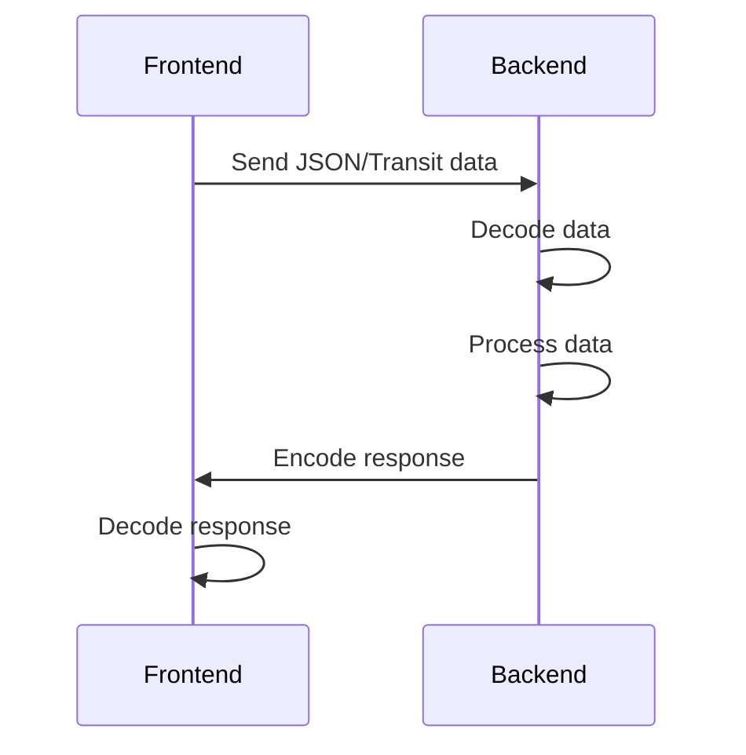

## 19.5.3 Data Serialization Formats

In the realm of full-stack application development, data serialization formats play a crucial role in facilitating communication between the frontend and backend. For Clojure developers, understanding these formats is essential to ensure efficient data exchange and seamless integration of components. In this section, we will explore popular data serialization formats such as JSON and Transit, and provide practical examples of encoding and decoding data on both sides of a Clojure application.

### Understanding Data Serialization

Data serialization is the process of converting data structures or object states into a format that can be easily stored or transmitted and subsequently reconstructed. This is particularly important in web applications where data needs to be sent over networks between different systems or components.

### Common Data Serialization Formats

#### JSON (JavaScript Object Notation)

JSON is a lightweight data interchange format that is easy for humans to read and write, and easy for machines to parse and generate. It is language-independent but uses conventions familiar to programmers of the C family, including C, C++, C#, Java, JavaScript, Perl, Python, and many others.

**Advantages of JSON:**

- **Human-readable**: JSON's text-based format is easy to read and understand.
- **Widely supported**: JSON is supported by virtually all programming languages and platforms.
- **Simple structure**: JSON's key-value pair structure is straightforward and easy to work with.

**Disadvantages of JSON:**

- **Limited data types**: JSON supports only a few data types, such as strings, numbers, arrays, and objects.
- **No support for binary data**: JSON is not suitable for binary data without encoding it as a string.

#### Transit

Transit is a data interchange format designed to be efficient and extensible. It is a joint effort by Cognitect and the Clojure community, specifically tailored for use with Clojure and ClojureScript.

**Advantages of Transit:**

- **Efficient**: Transit is designed to be more efficient than JSON, especially for complex data structures.
- **Extensible**: Transit allows for custom data types and extensions.
- **Supports rich data types**: Transit can handle a wider range of data types than JSON, including Clojure's native data structures.

**Disadvantages of Transit:**

- **Less human-readable**: Transit is not as human-readable as JSON.
- **Less widespread**: Transit is not as widely supported as JSON, although it is gaining popularity in the Clojure community.

### Encoding and Decoding Data

Let's explore how to encode and decode data using JSON and Transit in a Clojure full-stack application.

#### JSON Encoding and Decoding

In Clojure, JSON encoding and decoding can be accomplished using libraries such as `cheshire` for Clojure and `cljs-ajax` for ClojureScript.

**Clojure Example:**

```clojure
(ns myapp.backend
  (:require [cheshire.core :as json]))

(defn encode-to-json [data]
  ;; Convert Clojure data structure to JSON string
  (json/generate-string data))

(defn decode-from-json [json-str]
  ;; Convert JSON string to Clojure data structure
  (json/parse-string json-str true))

;; Example usage
(def my-data {:name "Alice" :age 30})
(def json-str (encode-to-json my-data))
;; json-str => "{\"name\":\"Alice\",\"age\":30}"

(def parsed-data (decode-from-json json-str))
;; parsed-data => {:name "Alice", :age 30}
```

**ClojureScript Example:**

```clojure
(ns myapp.frontend
  (:require [cljs-ajax.core :as ajax]))

(defn fetch-data []
  (ajax/GET "/api/data"
            {:handler (fn [response]
                        (let [data (js->clj response :keywordize-keys true)]
                          (println "Received data:" data)))
             :error-handler (fn [error]
                              (println "Error fetching data:" error))}))
```

#### Transit Encoding and Decoding

For Transit, we can use the `cognitect.transit` library in both Clojure and ClojureScript.

**Clojure Example:**

```clojure
(ns myapp.backend
  (:require [cognitect.transit :as transit]
            [java.io ByteArrayOutputStream ByteArrayInputStream]))

(defn encode-to-transit [data]
  (let [out (ByteArrayOutputStream.)]
    (transit/write (transit/writer out :json) data)
    (.toString out)))

(defn decode-from-transit [transit-str]
  (let [in (ByteArrayInputStream. (.getBytes transit-str))]
    (transit/read (transit/reader in :json))))

;; Example usage
(def my-data {:name "Bob" :age 25})
(def transit-str (encode-to-transit my-data))
;; transit-str => "[\"^ \",\"~:name\",\"Bob\",\"~:age\",25]"

(def parsed-data (decode-from-transit transit-str))
;; parsed-data => {:name "Bob", :age 25}
```

**ClojureScript Example:**

```clojure
(ns myapp.frontend
  (:require [cognitect.transit :as transit]))

(defn encode-to-transit [data]
  (let [writer (transit/writer :json)]
    (transit/write writer data)))

(defn decode-from-transit [transit-str]
  (let [reader (transit/reader :json)]
    (transit/read reader transit-str)))

;; Example usage
(def my-data {:name "Charlie" :age 40})
(def transit-str (encode-to-transit my-data))
;; transit-str => "[\"^ \",\"~:name\",\"Charlie\",\"~:age\",40]"

(def parsed-data (decode-from-transit transit-str))
;; parsed-data => {:name "Charlie", :age 40}
```

### Comparing JSON and Transit

When deciding between JSON and Transit for your Clojure application, consider the following factors:

- **Complexity of Data**: If your application deals with complex data structures or requires custom data types, Transit may be a better choice due to its extensibility and support for rich data types.
- **Performance**: Transit is generally more efficient than JSON, especially for large or complex data sets.
- **Readability**: JSON is more human-readable, which can be beneficial for debugging and logging.
- **Ecosystem Support**: JSON is more widely supported across different platforms and languages, making it a safer choice for interoperability with non-Clojure systems.

### Try It Yourself

To deepen your understanding, try modifying the examples above:

- **Experiment with different data structures**: Encode and decode nested maps, vectors, and sets.
- **Add custom data types**: Extend Transit to handle custom data types specific to your application.
- **Measure performance**: Compare the performance of JSON and Transit encoding/decoding for large data sets.

### Visualizing Data Flow

To better understand how data flows between the frontend and backend, let's visualize the process using a sequence diagram.



*Diagram 1: Sequence diagram illustrating the flow of data between frontend and backend using JSON or Transit.*

### Further Reading

For more information on data serialization formats and their use in Clojure applications, consider the following resources:

- [Official Clojure Documentation](https://clojure.org/)
- [Cheshire GitHub Repository](https://github.com/dakrone/cheshire)
- [Cognitect Transit Documentation](https://github.com/cognitect/transit-clj)

### Exercises

1. **Encode and Decode Nested Data**: Create a nested data structure and encode/decode it using both JSON and Transit. Compare the results.
2. **Custom Data Types in Transit**: Implement a custom data type in Transit and demonstrate encoding/decoding.
3. **Performance Benchmarking**: Write a script to benchmark the performance of JSON and Transit for a large dataset.

### Key Takeaways

- **JSON and Transit** are popular data serialization formats used in Clojure applications for frontend-backend communication.
- **JSON** is widely supported and human-readable, making it a good choice for simple data structures.
- **Transit** offers efficiency and support for complex data types, making it suitable for Clojure-specific applications.
- **Encoding and decoding** data is straightforward in Clojure using libraries like `cheshire` and `cognitect.transit`.
- **Choosing the right format** depends on factors such as data complexity, performance requirements, and ecosystem support.

Now that we've explored data serialization formats in Clojure, let's apply these concepts to build robust and efficient full-stack applications.

## Quiz: Mastering Data Serialization Formats in Clojure



### Which data serialization format is more human-readable?

- [x] JSON
- [ ] Transit
- [ ] XML
- [ ] YAML

> **Explanation:** JSON is known for its human-readable text-based format, making it easy to read and write.

### What is a key advantage of using Transit over JSON?

- [x] Supports rich data types
- [ ] More human-readable
- [ ] More widely supported
- [ ] Simpler structure

> **Explanation:** Transit supports a wider range of data types, including Clojure's native data structures, making it more suitable for complex data.

### Which library is commonly used for JSON encoding/decoding in Clojure?

- [x] Cheshire
- [ ] Transit
- [ ] Jackson
- [ ] GSON

> **Explanation:** Cheshire is a popular library in Clojure for JSON encoding and decoding.

### What is the primary purpose of data serialization?

- [x] Convert data structures into a format for storage or transmission
- [ ] Encrypt data for security
- [ ] Compress data to save space
- [ ] Validate data for correctness

> **Explanation:** Data serialization is used to convert data structures into a format that can be easily stored or transmitted.

### Which format is more efficient for complex data structures?

- [x] Transit
- [ ] JSON
- [ ] XML
- [ ] CSV

> **Explanation:** Transit is designed to be more efficient than JSON, especially for complex data structures.

### What is a disadvantage of using JSON?

- [x] Limited data types
- [ ] Not human-readable
- [ ] Poor performance
- [ ] Lack of ecosystem support

> **Explanation:** JSON supports only a few data types, such as strings, numbers, arrays, and objects.

### Which Clojure library is used for Transit encoding/decoding?

- [x] cognitect.transit
- [ ] cheshire
- [ ] clojure.data.json
- [ ] transit-clj

> **Explanation:** The `cognitect.transit` library is used for encoding and decoding Transit data in Clojure.

### What is a common use case for data serialization in web applications?

- [x] Communication between frontend and backend
- [ ] Data encryption
- [ ] Data compression
- [ ] Data validation

> **Explanation:** Data serialization is commonly used for communication between frontend and backend in web applications.

### Which format allows for custom data types and extensions?

- [x] Transit
- [ ] JSON
- [ ] XML
- [ ] YAML

> **Explanation:** Transit allows for custom data types and extensions, making it more flexible than JSON.

### True or False: JSON is more efficient than Transit for large datasets.

- [ ] True
- [x] False

> **Explanation:** Transit is generally more efficient than JSON, especially for large or complex datasets.


