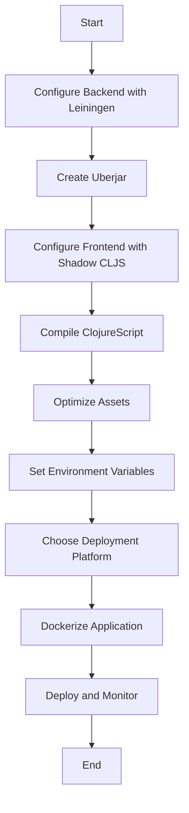

## 19.7.1 Packaging the Application

In this section, we will explore how to package a full-stack Clojure application for production deployment. Packaging involves creating production-ready artifacts for both the backend and frontend, configuring optimized builds, minimizing asset sizes, and preparing the application for deployment. As experienced Java developers, you will find parallels between Java and Clojure packaging processes, but also unique aspects of Clojure that enhance the deployment experience.

### Understanding the Packaging Process

Packaging an application is a crucial step in the software development lifecycle. It involves compiling the source code, bundling resources, and creating a deployable artifact. In Java, this typically means creating a JAR (Java Archive) or WAR (Web Application Archive) file. In Clojure, the process is similar, but with some additional considerations due to its functional nature and the use of both Clojure and ClojureScript.

#### Backend Packaging with Leiningen

Leiningen is a popular build automation tool for Clojure projects. It simplifies the process of compiling code, managing dependencies, and creating deployable artifacts.

**Leiningen Build Configuration**

To package a Clojure backend application, we start by configuring the `project.clj` file. This file defines the project settings, dependencies, and build instructions.

```clojure
(defproject my-clojure-app "0.1.0-SNAPSHOT"
  :description "A sample Clojure application"
  :url "http://example.com/my-clojure-app"
  :license {:name "Eclipse Public License"
            :url "http://www.eclipse.org/legal/epl-v10.html"}
  :dependencies [[org.clojure/clojure "1.10.3"]
                 [ring/ring-core "1.9.0"]
                 [compojure "1.6.2"]]
  :main ^:skip-aot my-clojure-app.core
  :target-path "target/%s"
  :profiles {:uberjar {:aot :all}})
```

- **Dependencies**: Specify the libraries your application depends on.
- **Main Namespace**: Define the entry point of your application.
- **Profiles**: Use profiles to customize the build process, such as creating an uberjar.

**Creating an Uberjar**

An uberjar is a standalone JAR file that includes all dependencies, making it easy to deploy.

```bash
lein uberjar
```

This command compiles the application and packages it into a single JAR file located in the `target` directory.

**Optimizing the Build**

To optimize the build, consider the following:

- **AOT Compilation**: Ahead-of-Time (AOT) compilation can improve startup time by pre-compiling namespaces.
- **Minimizing Dependencies**: Only include necessary libraries to reduce the artifact size.
- **Environment Variables**: Use environment variables to configure the application for different environments.

#### Frontend Packaging with ClojureScript

ClojureScript is the Clojure counterpart for JavaScript, enabling you to write frontend code in Clojure. Packaging a ClojureScript application involves compiling the code into JavaScript and bundling assets.

**ClojureScript Build Tools**

There are several tools available for building ClojureScript applications, such as Figwheel and Shadow CLJS. Shadow CLJS is particularly popular due to its ease of use and integration with npm.

**Configuring Shadow CLJS**

Create a `shadow-cljs.edn` file to define the build configuration.

```clojure
{:source-paths ["src"]
 :dependencies [[reagent "1.0.0"]
                [re-frame "1.2.0"]]
 :builds {:app {:target :browser
                :output-dir "public/js"
                :asset-path "/js"
                :modules {:main {:entries [my-clojure-app.core]}}
                :devtools {:http-root "public"
                           :http-port 3000}}}}
```

- **Source Paths**: Specify the directories containing source code.
- **Dependencies**: List the ClojureScript libraries used.
- **Builds**: Define build targets, output directories, and entry points.

**Building the Frontend**

To compile the ClojureScript code, run:

```bash
shadow-cljs release app
```

This command generates optimized JavaScript files in the `public/js` directory.

**Asset Management**

Minimize asset sizes by:

- **Code Splitting**: Divide the application into smaller chunks to load only necessary parts.
- **Minification**: Use tools like UglifyJS to reduce JavaScript file sizes.
- **Image Optimization**: Compress images to improve load times.

### Preparing for Deployment

Once the backend and frontend are packaged, the next step is to prepare the application for deployment. This involves configuring the environment, setting up servers, and ensuring the application is production-ready.

#### Environment Configuration

Use environment variables to manage configuration settings. This approach allows you to change settings without modifying the codebase.

**Example Environment Variables**

```bash
export DATABASE_URL=jdbc:postgresql://localhost:5432/mydb
export PORT=8080
export LOG_LEVEL=info
```

#### Setting Up Servers

Choose a server environment that suits your application's needs. Common options include:

- **Heroku**: A platform-as-a-service (PaaS) that simplifies deployment.
- **AWS**: Offers flexibility and scalability with services like EC2 and Elastic Beanstalk.
- **Docker**: Containerize the application for consistent deployment across environments.

**Dockerizing the Application**

Create a `Dockerfile` to define the container configuration.

```dockerfile
# Use an official Clojure image
FROM clojure:openjdk-11-lein

# Set the working directory
WORKDIR /app

# Copy the project files
COPY . .

# Build the application
RUN lein uberjar

# Run the application
CMD ["java", "-jar", "target/my-clojure-app-standalone.jar"]
```

Build and run the Docker container:

```bash
docker build -t my-clojure-app .
docker run -p 8080:8080 my-clojure-app
```

#### Ensuring Production Readiness

Before deploying, ensure the application is production-ready by:

- **Testing**: Conduct thorough testing, including unit, integration, and end-to-end tests.
- **Monitoring**: Set up monitoring tools to track application performance and detect issues.
- **Security**: Implement security measures, such as HTTPS and authentication.

### Try It Yourself

Experiment with the packaging process by:

- Modifying the `project.clj` and `shadow-cljs.edn` files to include additional dependencies.
- Creating a Docker container for a different environment, such as Node.js for the frontend.
- Implementing a CI/CD pipeline to automate the build and deployment process.

### Diagrams and Visuals

Below is a flowchart illustrating the packaging process for a Clojure full-stack application:



*Caption: Flowchart illustrating the steps involved in packaging a Clojure full-stack application.*

### Key Takeaways

- **Leiningen and Shadow CLJS** are essential tools for packaging Clojure applications.
- **Environment variables** provide flexibility in configuring applications for different environments.
- **Docker** offers a consistent deployment environment, simplifying the deployment process.
- **Testing and monitoring** are crucial for ensuring production readiness.

### Further Reading

- [Official Clojure Documentation](https://clojure.org/)
- [Leiningen Documentation](https://leiningen.org/)
- [Shadow CLJS User Guide](https://shadow-cljs.github.io/docs/UsersGuide.html)
- [Docker Documentation](https://docs.docker.com/)

### Exercises

1. **Create a Docker Container**: Package a simple Clojure application using Docker and deploy it locally.
2. **Optimize Asset Sizes**: Implement code splitting and minification for a ClojureScript application.
3. **Set Up a CI/CD Pipeline**: Automate the build and deployment process using a CI/CD tool like Jenkins or GitHub Actions.

Now that we've explored how to package a Clojure full-stack application, let's apply these concepts to build and deploy robust applications efficiently.

## Quiz: Mastering Clojure Application Packaging



### What is the primary purpose of packaging an application?

- [x] To create a deployable artifact
- [ ] To write unit tests
- [ ] To design the user interface
- [ ] To manage dependencies

> **Explanation:** Packaging an application involves creating a deployable artifact that includes compiled code and resources.

### Which tool is commonly used for building Clojure backend applications?

- [x] Leiningen
- [ ] Maven
- [ ] Gradle
- [ ] Ant

> **Explanation:** Leiningen is a popular build automation tool for Clojure projects, similar to Maven or Gradle in Java.

### What is an uberjar?

- [x] A standalone JAR file with all dependencies included
- [ ] A JavaScript bundle for frontend applications
- [ ] A configuration file for Docker
- [ ] A testing framework for Clojure

> **Explanation:** An uberjar is a standalone JAR file that includes all dependencies, making it easy to deploy.

### Which file is used to configure Shadow CLJS builds?

- [x] shadow-cljs.edn
- [ ] project.clj
- [ ] build.gradle
- [ ] package.json

> **Explanation:** The `shadow-cljs.edn` file is used to configure Shadow CLJS builds for ClojureScript applications.

### What is the benefit of using environment variables in deployment?

- [x] They allow configuration changes without modifying code
- [ ] They increase application performance
- [ ] They reduce application size
- [ ] They improve code readability

> **Explanation:** Environment variables enable configuration changes without modifying the codebase, providing flexibility.

### What is the purpose of Docker in application deployment?

- [x] To provide a consistent deployment environment
- [ ] To compile Clojure code
- [ ] To manage frontend assets
- [ ] To write unit tests

> **Explanation:** Docker provides a consistent deployment environment by containerizing applications, ensuring they run the same across different environments.

### Which command is used to create an uberjar with Leiningen?

- [x] lein uberjar
- [ ] lein build
- [ ] lein compile
- [ ] lein run

> **Explanation:** The `lein uberjar` command compiles the application and packages it into a standalone JAR file.

### What is code splitting in frontend development?

- [x] Dividing the application into smaller chunks for optimized loading
- [ ] Combining multiple JavaScript files into one
- [ ] Writing code in multiple languages
- [ ] Using multiple build tools

> **Explanation:** Code splitting involves dividing the application into smaller chunks to load only necessary parts, optimizing performance.

### Which tool can be used for monitoring application performance in production?

- [x] Prometheus
- [ ] Leiningen
- [ ] Shadow CLJS
- [ ] Docker

> **Explanation:** Prometheus is a monitoring tool that can be used to track application performance and detect issues in production.

### True or False: An uberjar includes only the compiled Clojure code.

- [ ] True
- [x] False

> **Explanation:** An uberjar includes both the compiled Clojure code and all its dependencies, making it a standalone artifact.


