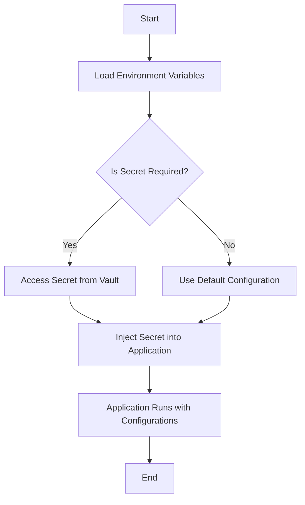

## 19.7.3 Environment Configuration and Secrets Management

In the world of full-stack application development, managing environment-specific configurations and secrets is crucial for maintaining secure and efficient deployments. As experienced Java developers transitioning to Clojure, you may be familiar with Java's approach to configuration management using properties files and environment variables. In this section, we will explore how Clojure handles these tasks, focusing on tools like `environ` for managing environment variables and best practices for secrets management.

### Understanding Environment Configuration

Environment configuration refers to the practice of setting up different configurations for various environments such as development, testing, staging, and production. This includes database connections, API keys, and other environment-specific settings.

#### Java vs. Clojure: Configuration Management

In Java, configuration is often managed using properties files, XML files, or environment variables. Clojure, being a functional language, offers a more flexible and dynamic approach to configuration management. Let's compare the two:

- **Java**: Typically uses `Properties` class or frameworks like Spring to manage configurations.
- **Clojure**: Leverages libraries like `environ` to handle environment variables in a more idiomatic way.

### Introducing `environ`

`environ` is a popular Clojure library that simplifies the management of environment variables. It allows you to access environment variables directly from your Clojure code, making it easy to configure your application based on the environment it is running in.

#### Installing `environ`

To use `environ` in your Clojure project, add it to your `project.clj` dependencies:

```clojure
(defproject my-clojure-app "0.1.0-SNAPSHOT"
  :dependencies [[org.clojure/clojure "1.10.3"]
                 [environ "1.2.0"]])
```

#### Accessing Environment Variables

With `environ`, accessing environment variables is straightforward. You can use the `env` function to retrieve the value of an environment variable:

```clojure
(ns my-clojure-app.core
  (:require [environ.core :refer [env]]))

(def db-url (env :database-url))

(println "Database URL:" db-url)
```

In this example, `:database-url` is the key for the environment variable. `environ` will automatically look for this variable in the system environment.

### Best Practices for Environment Configuration

1. **Use Environment Variables**: Store sensitive information like database credentials and API keys in environment variables rather than hardcoding them in your source code.

2. **Separate Configuration from Code**: Keep configuration data separate from your application code to ensure that changes in configuration do not require code changes.

3. **Use Profiles for Different Environments**: Define separate profiles for different environments (e.g., development, testing, production) to manage environment-specific configurations.

4. **Leverage Configuration Libraries**: Use libraries like `environ` to manage environment variables efficiently.

### Secrets Management

Secrets management involves securely storing and accessing sensitive information such as passwords, API keys, and tokens. Proper secrets management is essential to protect your application from unauthorized access and data breaches.

#### Java vs. Clojure: Secrets Management

In Java, secrets are often managed using configuration files or environment variables, sometimes with the help of external tools like HashiCorp Vault or AWS Secrets Manager. Clojure can integrate with these tools as well, providing a seamless experience for managing secrets.

### Tools for Secrets Management

1. **HashiCorp Vault**: A tool for securely storing and accessing secrets. It provides a unified interface to any secret while providing tight access control and recording a detailed audit log.

2. **AWS Secrets Manager**: A service that helps you protect access to your applications, services, and IT resources without the upfront investment and on-going maintenance costs of operating your own infrastructure.

3. **Doppler**: A universal secrets manager that works with any stack, providing a centralized place to manage secrets and environment variables.

### Implementing Secrets Management in Clojure

Let's explore how you can integrate secrets management tools with your Clojure application.

#### Using HashiCorp Vault with Clojure

To use HashiCorp Vault in your Clojure application, you can use the `vault-clj` library. Here's how you can set it up:

1. **Add Dependency**: Include `vault-clj` in your `project.clj`:

   ```clojure
   (defproject my-clojure-app "0.1.0-SNAPSHOT"
     :dependencies [[org.clojure/clojure "1.10.3"]
                    [vault-clj "0.1.0"]])
   ```

2. **Access Secrets**: Use the library to access secrets stored in Vault:

   ```clojure
   (ns my-clojure-app.core
     (:require [vault.core :as vault]))

   (defn get-secret [key]
     (vault/read-secret "secret/myapp" key))

   (println "API Key:" (get-secret "api-key"))
   ```

In this example, `vault/read-secret` is used to retrieve the secret value associated with the key `api-key` from the path `secret/myapp`.

### Best Practices for Secrets Management

1. **Use a Secrets Manager**: Utilize a dedicated secrets management tool like HashiCorp Vault or AWS Secrets Manager to store and access secrets securely.

2. **Limit Access**: Restrict access to secrets to only those who need it. Use role-based access control (RBAC) to enforce this.

3. **Audit and Monitor**: Regularly audit access to secrets and monitor for any unauthorized access attempts.

4. **Rotate Secrets Regularly**: Implement a process to rotate secrets periodically to minimize the risk of exposure.

### Try It Yourself

To solidify your understanding, try modifying the code examples to:

- Access a different environment variable using `environ`.
- Integrate with a different secrets management tool, such as AWS Secrets Manager.

### Diagram: Environment Configuration Flow

Below is a diagram illustrating the flow of environment configuration and secrets management in a Clojure application:



**Caption**: This diagram shows the process of loading environment variables and accessing secrets in a Clojure application.

### Exercises

1. **Exercise 1**: Set up a Clojure project using `environ` and configure it to read environment variables for database connection details.

2. **Exercise 2**: Integrate HashiCorp Vault into your Clojure application to securely access API keys.

3. **Exercise 3**: Implement a mechanism to rotate secrets in your application and update the configuration dynamically.

### Key Takeaways

- **Environment Configuration**: Use tools like `environ` to manage environment-specific configurations efficiently.
- **Secrets Management**: Securely store and access sensitive information using dedicated secrets management tools.
- **Best Practices**: Follow best practices for configuration and secrets management to ensure the security and reliability of your application.

By applying these concepts and practices, you can effectively manage environment configurations and secrets in your Clojure applications, ensuring a secure and efficient deployment process.

## Quiz: Mastering Environment Configuration and Secrets Management in Clojure



### What is the primary purpose of using the `environ` library in Clojure?

- [x] To manage environment variables efficiently
- [ ] To handle database connections
- [ ] To perform data serialization
- [ ] To create user interfaces

> **Explanation:** The `environ` library is used to manage environment variables in Clojure applications, allowing developers to configure applications based on the environment they are running in.

### Which of the following is a best practice for managing secrets in a Clojure application?

- [x] Use a dedicated secrets management tool
- [ ] Hardcode secrets in the source code
- [ ] Share secrets via email
- [ ] Store secrets in a public repository

> **Explanation:** Using a dedicated secrets management tool ensures that secrets are stored securely and access is controlled, reducing the risk of unauthorized access.

### How can you access an environment variable using `environ` in Clojure?

- [x] By using the `env` function
- [ ] By using the `get` function
- [ ] By using the `read` function
- [ ] By using the `fetch` function

> **Explanation:** The `env` function from the `environ` library is used to access environment variables in Clojure.

### What is a key advantage of separating configuration from code?

- [x] It allows changes in configuration without code changes
- [ ] It makes the codebase larger
- [ ] It increases the complexity of the application
- [ ] It reduces the flexibility of the application

> **Explanation:** Separating configuration from code allows developers to change configurations without modifying the code, making the application more flexible and easier to maintain.

### Which tool is commonly used for secrets management in Clojure applications?

- [x] HashiCorp Vault
- [ ] GitHub
- [ ] Docker
- [ ] Jenkins

> **Explanation:** HashiCorp Vault is a popular tool for managing secrets in Clojure applications, providing secure storage and access control.

### What is the role of role-based access control (RBAC) in secrets management?

- [x] To restrict access to secrets based on user roles
- [ ] To encrypt secrets
- [ ] To store secrets in a database
- [ ] To log access to secrets

> **Explanation:** Role-based access control (RBAC) restricts access to secrets based on user roles, ensuring that only authorized users can access sensitive information.

### Why is it important to rotate secrets regularly?

- [x] To minimize the risk of exposure
- [ ] To increase the complexity of the application
- [ ] To reduce the number of secrets
- [ ] To make the application run faster

> **Explanation:** Regularly rotating secrets minimizes the risk of exposure by ensuring that even if a secret is compromised, it is only valid for a limited time.

### How does `vault-clj` help in managing secrets in Clojure?

- [x] It provides an interface to access secrets stored in HashiCorp Vault
- [ ] It encrypts secrets in the source code
- [ ] It stores secrets in a local file
- [ ] It sends secrets via email

> **Explanation:** The `vault-clj` library provides an interface for accessing secrets stored in HashiCorp Vault, allowing Clojure applications to securely retrieve sensitive information.

### What is a common method for auditing access to secrets?

- [x] Logging access attempts and monitoring for unauthorized access
- [ ] Storing secrets in a public repository
- [ ] Sharing secrets with all team members
- [ ] Hardcoding secrets in the application

> **Explanation:** Auditing access to secrets involves logging access attempts and monitoring for unauthorized access to ensure that sensitive information is protected.

### True or False: Environment variables should be hardcoded in the source code for security.

- [ ] True
- [x] False

> **Explanation:** Environment variables should not be hardcoded in the source code. Instead, they should be managed externally to ensure security and flexibility.



By mastering environment configuration and secrets management, you can enhance the security and reliability of your Clojure applications, ensuring they are well-prepared for deployment in various environments.
