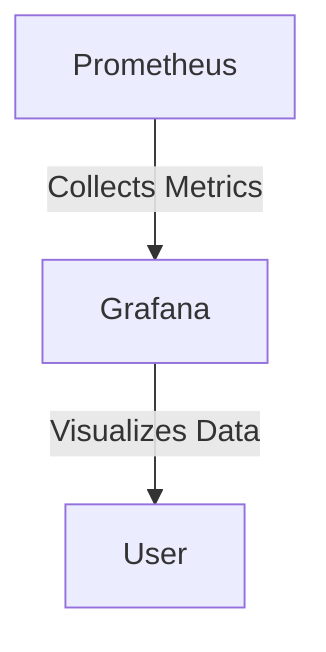

## 19.7.4 Monitoring and Logging in Production

In the world of software development, deploying an application to production is just the beginning. To ensure that your application remains healthy, performs optimally, and meets user expectations, **monitoring and logging** are crucial. This section will guide you through the essentials of setting up effective monitoring and logging for your Clojure applications, drawing parallels with Java practices where applicable.

### The Importance of Monitoring and Logging

Monitoring and logging are vital for several reasons:

- **Proactive Issue Detection**: By monitoring application metrics and logs, you can detect issues before they impact users.
- **Performance Optimization**: Continuous monitoring helps identify performance bottlenecks and optimize resource usage.
- **Security and Compliance**: Logs can provide an audit trail for security and compliance purposes.
- **User Experience**: Ensuring application uptime and performance directly impacts user satisfaction.

### Logging in Clojure Applications

Logging is the process of recording application events, errors, and other significant occurrences. In Clojure, logging can be achieved using libraries such as `clojure.tools.logging` and `logback`.

#### Setting Up Logging with `clojure.tools.logging`

`clojure.tools.logging` provides a simple and idiomatic way to log messages in Clojure.

```clojure
(ns myapp.core
  (:require [clojure.tools.logging :as log]))

(defn process-data [data]
  (log/info "Processing data" data)
  ;; Process data
  (log/debug "Data processed successfully"))
```

**Key Points**:
- **Log Levels**: Common log levels include `debug`, `info`, `warn`, and `error`. Use them appropriately to categorize log messages.
- **Configuration**: Logging configuration is typically done in a `logback.xml` file when using Logback as the backend.

#### Comparing with Java Logging

In Java, logging is often done using frameworks like Log4j or SLF4J. The concepts are similar, but Clojure's approach is more functional and concise.

```java
import org.slf4j.Logger;
import org.slf4j.LoggerFactory;

public class MyApp {
    private static final Logger logger = LoggerFactory.getLogger(MyApp.class);

    public void processData(String data) {
        logger.info("Processing data: {}", data);
        // Process data
        logger.debug("Data processed successfully");
    }
}
```

### Monitoring Metrics with Prometheus and Grafana

Metrics provide quantitative data about your application's performance and resource usage. Prometheus and Grafana are popular tools for collecting and visualizing metrics.

#### Setting Up Prometheus

Prometheus is an open-source monitoring solution that collects metrics from configured targets at given intervals.

1. **Install Prometheus**: Follow the [official installation guide](https://prometheus.io/docs/prometheus/latest/installation/).

2. **Configure Prometheus**: Define the targets (e.g., your Clojure application) in the `prometheus.yml` configuration file.

```yaml
scrape_configs:
  - job_name: 'clojure_app'
    static_configs:
      - targets: ['localhost:8080']
```

3. **Expose Metrics in Clojure**: Use libraries like `metrics-clojure` to expose application metrics.

```clojure
(ns myapp.metrics
  (:require [metrics.core :refer [default-registry]]
            [metrics.counters :refer [counter inc!]]))

(def request-counter (counter default-registry "requests"))

(defn handle-request [request]
  (inc! request-counter)
  ;; Handle request
)
```

#### Visualizing Metrics with Grafana

Grafana is a powerful visualization tool that integrates seamlessly with Prometheus.

1. **Install Grafana**: Follow the [official installation guide](https://grafana.com/docs/grafana/latest/installation/).

2. **Connect to Prometheus**: Add Prometheus as a data source in Grafana.

3. **Create Dashboards**: Use Grafana's dashboard features to visualize metrics like request rates, error rates, and resource usage.



*Diagram: Prometheus collects metrics from the application, and Grafana visualizes the data for user insights.*

### Setting Up Alerts for Critical Issues

Alerts notify you of critical issues that require immediate attention. Prometheus Alertmanager can be used to define and manage alerts.

#### Configuring Alerts in Prometheus

1. **Define Alert Rules**: Create alert rules in a separate configuration file.

```yaml
groups:
  - name: example
    rules:
    - alert: HighErrorRate
      expr: job:request_errors:rate5m > 0.05
      for: 5m
      labels:
        severity: critical
      annotations:
        summary: "High error rate detected"
```

2. **Set Up Alertmanager**: Configure Alertmanager to handle alerts and send notifications via email, Slack, etc.

```yaml
route:
  receiver: 'team-email'

receivers:
  - name: 'team-email'
    email_configs:
    - to: 'team@example.com'
```

### Comparing Monitoring and Logging in Java

In Java, monitoring and logging are often handled using tools like JMX for metrics and Log4j for logging. While the tools differ, the principles remain the same.

- **JMX**: Java Management Extensions (JMX) is used for monitoring and managing Java applications.
- **Log4j**: A popular logging framework for Java applications.

### Best Practices for Monitoring and Logging

- **Use Structured Logging**: Log messages should be structured to facilitate easy parsing and analysis.
- **Monitor Key Metrics**: Focus on metrics that impact user experience, such as response times and error rates.
- **Set Up Alerts**: Define alerts for critical metrics to ensure timely responses to issues.
- **Regularly Review Logs**: Periodically review logs to identify patterns and potential issues.

### Try It Yourself

- **Modify the Logging Level**: Change the log level in your Clojure application and observe the difference in log output.
- **Create a Custom Metric**: Define a new metric in your application and visualize it in Grafana.
- **Set Up a Test Alert**: Configure a test alert in Prometheus and verify that it triggers as expected.

### Exercises

1. **Implement Logging**: Add logging to a Clojure application and configure Logback to manage log output.
2. **Expose Metrics**: Use `metrics-clojure` to expose application metrics and visualize them in Grafana.
3. **Configure Alerts**: Set up Prometheus Alertmanager to send notifications for critical application metrics.

### Summary and Key Takeaways

- **Monitoring and logging are essential** for maintaining application health and performance.
- **Clojure offers powerful tools** for logging and metrics collection, such as `clojure.tools.logging` and `metrics-clojure`.
- **Prometheus and Grafana** provide a robust solution for metrics collection and visualization.
- **Alerts ensure timely responses** to critical issues, helping maintain application reliability.

By implementing effective monitoring and logging strategies, you can ensure that your Clojure applications run smoothly in production, providing a seamless experience for users.

## Quiz: Mastering Monitoring and Logging in Production



### What is the primary purpose of monitoring in production environments?

- [x] To detect issues before they impact users
- [ ] To increase application complexity
- [ ] To replace logging
- [ ] To reduce code quality

> **Explanation:** Monitoring helps detect issues early, ensuring they don't affect users.

### Which Clojure library is commonly used for logging?

- [x] clojure.tools.logging
- [ ] clojure.core.async
- [ ] clojure.java.jdbc
- [ ] clojure.spec.alpha

> **Explanation:** `clojure.tools.logging` is a popular library for logging in Clojure applications.

### What tool is used to visualize metrics collected by Prometheus?

- [x] Grafana
- [ ] Logback
- [ ] JMX
- [ ] SLF4J

> **Explanation:** Grafana is used to visualize metrics collected by Prometheus.

### In Clojure, which function is used to increment a counter metric?

- [x] inc!
- [ ] dec!
- [ ] reset!
- [ ] swap!

> **Explanation:** `inc!` is used to increment a counter metric in Clojure.

### What is a common use case for setting up alerts in production?

- [x] To notify of critical issues
- [ ] To log debug information
- [ ] To increase application load
- [ ] To replace monitoring

> **Explanation:** Alerts notify of critical issues that require immediate attention.

### Which Java tool is commonly used for monitoring Java applications?

- [x] JMX
- [ ] Log4j
- [ ] SLF4J
- [ ] Hibernate

> **Explanation:** JMX (Java Management Extensions) is used for monitoring Java applications.

### What is the role of Prometheus Alertmanager?

- [x] To handle alerts and send notifications
- [ ] To collect metrics
- [ ] To visualize data
- [ ] To replace logging

> **Explanation:** Alertmanager handles alerts and sends notifications based on defined rules.

### Which of the following is a best practice for logging?

- [x] Use structured logging
- [ ] Log everything at the debug level
- [ ] Avoid logging errors
- [ ] Use random log levels

> **Explanation:** Structured logging facilitates easy parsing and analysis of log messages.

### What is the benefit of using structured logging?

- [x] Easier parsing and analysis
- [ ] Increased application complexity
- [ ] Reduced performance
- [ ] Less information in logs

> **Explanation:** Structured logging makes it easier to parse and analyze log messages.

### True or False: Grafana can only be used with Prometheus.

- [ ] True
- [x] False

> **Explanation:** Grafana can integrate with various data sources, not just Prometheus.


