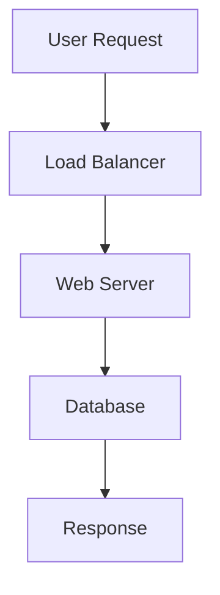

## 19.8.1 Understanding Scalability Requirements

In the realm of full-stack application development, scalability is a critical consideration that ensures your application can handle increased loads without compromising performance. As experienced Java developers transitioning to Clojure, understanding scalability requirements involves assessing various factors such as user load, data volume, and performance targets. This section will guide you through these considerations, drawing parallels between Java and Clojure, and providing practical examples to illustrate key concepts.

### Introduction to Scalability

Scalability refers to an application's ability to handle growth, whether in terms of user numbers, data volume, or transaction rates. A scalable application can maintain or improve its performance as demand increases. Let's delve into the core aspects of scalability:

- **User Load**: The number of concurrent users your application can support.
- **Data Volume**: The amount of data your application can process and store efficiently.
- **Performance Targets**: The speed and responsiveness of your application under varying loads.

### Assessing Scalability Needs

To effectively assess scalability needs, consider the following steps:

1. **Project Growth**: Estimate future user growth and data increase based on current trends and business goals.
2. **Identify Bottlenecks**: Determine potential performance bottlenecks in your application architecture.
3. **Set Performance Benchmarks**: Define acceptable performance metrics, such as response time and throughput.
4. **Evaluate Infrastructure**: Assess your current infrastructure's ability to scale, including hardware, network, and software components.

### User Load and Concurrency

User load is a primary factor in scalability. As the number of concurrent users increases, your application must efficiently manage resources to maintain performance. In Clojure, concurrency is handled through immutable data structures and concurrency primitives like atoms, refs, and agents.

#### Clojure Concurrency Example

```clojure
;; Using an atom to manage shared state
(def counter (atom 0))

;; Function to increment the counter
(defn increment-counter []
  (swap! counter inc))

;; Simulate concurrent updates
(doseq [i (range 1000)]
  (future (increment-counter)))

;; Print the final counter value
(println @counter) ;; Expected: 1000
```

**Explanation**: In this example, we use an `atom` to manage a shared counter state. The `swap!` function ensures atomic updates, allowing safe concurrent modifications.

#### Java Concurrency Comparison

In Java, concurrency is often managed using synchronized blocks or concurrent collections:

```java
import java.util.concurrent.atomic.AtomicInteger;

public class Counter {
    private AtomicInteger counter = new AtomicInteger(0);

    public void incrementCounter() {
        counter.incrementAndGet();
    }

    public int getCounter() {
        return counter.get();
    }
}

// Simulate concurrent updates
Counter counter = new Counter();
for (int i = 0; i < 1000; i++) {
    new Thread(counter::incrementCounter).start();
}

System.out.println(counter.getCounter()); // Expected: 1000
```

**Explanation**: Java's `AtomicInteger` provides a thread-safe way to manage concurrent updates, similar to Clojure's `atom`.

### Data Volume and Storage Solutions

As your application scales, managing data volume becomes crucial. Clojure offers several data storage solutions, including Datomic and other NoSQL databases, which provide scalability and flexibility.

#### Clojure Data Volume Example

```clojure
;; Using Datomic for scalable data storage
(require '[datomic.api :as d])

(def uri "datomic:mem://example")
(d/create-database uri)
(def conn (d/connect uri))

;; Define a schema
(def schema [{:db/ident :person/name
              :db/valueType :db.type/string
              :db/cardinality :db.cardinality/one}])

;; Transact the schema
(d/transact conn {:tx-data schema})

;; Add data
(d/transact conn {:tx-data [{:person/name "Alice"} {:person/name "Bob"}]})

;; Query data
(d/q '[:find ?name
       :where [?e :person/name ?name]]
     (d/db conn))
```

**Explanation**: Datomic allows for scalable data storage with a focus on immutability and temporal data.

### Performance Targets and Optimization

Setting performance targets involves defining acceptable response times and throughput levels. Clojure's functional programming paradigm, with its emphasis on immutability and pure functions, can lead to more predictable performance.

#### Performance Optimization Techniques

- **Memoization**: Cache results of expensive function calls.
- **Transducers**: Optimize data processing pipelines.
- **Parallel Processing**: Use `pmap` for parallel computation.

#### Clojure Performance Example

```clojure
;; Using transducers for efficient data processing
(def data (range 1000000))

(defn process-data [coll]
  (transduce (comp (filter even?) (map inc)) + coll))

(println (process-data data))
```

**Explanation**: Transducers provide a way to compose data transformations without intermediate collections, improving performance.

### Infrastructure and Scalability

Your application's infrastructure plays a significant role in scalability. Consider cloud-based solutions for dynamic scaling and load balancing.

#### Cloud Infrastructure Example

- **AWS Lambda**: Use serverless functions for scalable compute.
- **Kubernetes**: Orchestrate containerized applications for efficient resource management.

### Diagrams and Visualizations

To better understand scalability concepts, let's visualize data flow and concurrency models in Clojure.



**Diagram Description**: This flowchart illustrates a typical request-response cycle in a scalable web application, highlighting the role of load balancers and databases.

### Try It Yourself

Experiment with the provided Clojure code examples by:

- Modifying the concurrency example to use `refs` or `agents`.
- Implementing a data processing pipeline using transducers.
- Setting up a simple Datomic database and querying data.

### Further Reading

- [Official Clojure Documentation](https://clojure.org)
- [ClojureDocs](https://clojuredocs.org)
- [Datomic Documentation](https://docs.datomic.com)

### Exercises

1. Implement a Clojure function that processes a large dataset using parallel processing.
2. Set up a simple web server in Clojure and test its scalability with increasing user load.
3. Compare the performance of a Clojure application using different concurrency primitives.

### Key Takeaways

- Scalability involves managing user load, data volume, and performance targets.
- Clojure's concurrency primitives and functional programming paradigm offer unique advantages for scalability.
- Assessing scalability needs requires understanding projected growth and infrastructure capabilities.

By understanding and implementing these scalability requirements, you'll be well-equipped to build robust, scalable full-stack applications using Clojure.

## Quiz: Mastering Scalability in Full-Stack Applications



### What is scalability in the context of full-stack applications?

- [x] The ability of an application to handle increased loads without compromising performance.
- [ ] The speed at which an application can be developed.
- [ ] The security measures implemented in an application.
- [ ] The user interface design of an application.

> **Explanation:** Scalability refers to an application's ability to handle growth in user numbers, data volume, or transaction rates while maintaining or improving performance.

### Which Clojure concurrency primitive is used for managing shared state with atomic updates?

- [x] Atom
- [ ] Ref
- [ ] Agent
- [ ] Var

> **Explanation:** An `atom` in Clojure is used for managing shared state with atomic updates, ensuring safe concurrent modifications.

### What is the purpose of using transducers in Clojure?

- [x] To optimize data processing pipelines without intermediate collections.
- [ ] To manage state changes in concurrent applications.
- [ ] To handle exceptions in functional code.
- [ ] To define namespaces and imports.

> **Explanation:** Transducers in Clojure provide a way to compose data transformations efficiently, avoiding the creation of intermediate collections.

### In Java, which class provides a thread-safe way to manage concurrent updates similar to Clojure's atom?

- [x] AtomicInteger
- [ ] SynchronizedList
- [ ] ConcurrentHashMap
- [ ] ThreadLocal

> **Explanation:** Java's `AtomicInteger` provides a thread-safe way to manage concurrent updates, similar to Clojure's `atom`.

### Which of the following is a cloud-based solution for dynamic scaling?

- [x] AWS Lambda
- [ ] Apache Tomcat
- [ ] MySQL
- [ ] Docker

> **Explanation:** AWS Lambda is a cloud-based solution that allows for dynamic scaling through serverless functions.

### What is a key advantage of using immutable data structures in Clojure?

- [x] They simplify reasoning about code and improve concurrency.
- [ ] They increase the speed of data processing.
- [ ] They allow for dynamic typing.
- [ ] They enable direct memory access.

> **Explanation:** Immutable data structures simplify reasoning about code, enhance testability, and improve concurrency by eliminating shared mutable state.

### Which Clojure function is used for parallel computation?

- [x] pmap
- [ ] map
- [ ] filter
- [ ] reduce

> **Explanation:** The `pmap` function in Clojure is used for parallel computation, distributing work across multiple threads.

### What is the role of a load balancer in a scalable web application?

- [x] To distribute incoming requests across multiple servers.
- [ ] To store application data.
- [ ] To manage user authentication.
- [ ] To compile source code.

> **Explanation:** A load balancer distributes incoming requests across multiple servers, ensuring efficient resource utilization and improved performance.

### Which database solution is mentioned as scalable and flexible for Clojure applications?

- [x] Datomic
- [ ] MySQL
- [ ] SQLite
- [ ] MongoDB

> **Explanation:** Datomic is mentioned as a scalable and flexible database solution for Clojure applications, focusing on immutability and temporal data.

### True or False: Clojure's functional programming paradigm can lead to more predictable performance.

- [x] True
- [ ] False

> **Explanation:** Clojure's functional programming paradigm, with its emphasis on immutability and pure functions, can lead to more predictable performance.


