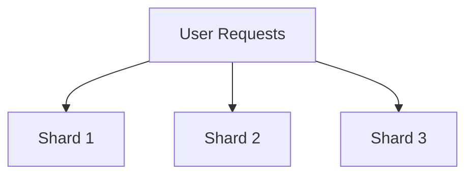

## 19.8.2 Backend Scalability Strategies

In the world of modern web applications, scalability is a critical concern. As your application grows, so does the demand for resources. In this section, we will explore various backend scalability strategies that can be applied to Clojure applications. We'll cover horizontal scaling, load balancing, database sharding, and optimizing resource usage. By the end of this section, you'll have a solid understanding of how to scale your Clojure backend effectively.

### Understanding Scalability

Before diving into specific strategies, let's clarify what scalability means. Scalability is the ability of a system to handle increased load by adding resources. There are two primary types of scalability:

- **Vertical Scaling**: Adding more power (CPU, RAM) to an existing server.
- **Horizontal Scaling**: Adding more servers to distribute the load.

While vertical scaling can be simpler, it has limitations and can become expensive. Horizontal scaling, on the other hand, offers more flexibility and is often more cost-effective in the long run.

### Horizontal Scaling

Horizontal scaling involves adding more servers to your infrastructure to handle increased load. This approach is particularly well-suited for stateless applications, where each server can handle any request independently.

#### Implementing Horizontal Scaling in Clojure

Clojure's functional nature and immutable data structures make it well-suited for horizontal scaling. Here's a simple example of a Clojure web server that can be horizontally scaled:

```clojure
(ns myapp.server
  (:require [ring.adapter.jetty :refer [run-jetty]]
            [ring.middleware.defaults :refer [wrap-defaults site-defaults]]))

(defn handler [request]
  {:status 200
   :headers {"Content-Type" "text/plain"}
   :body "Hello, World!"})

(defn -main []
  (run-jetty (wrap-defaults handler site-defaults) {:port 8080}))
```

**Explanation**:
- This code defines a simple web server using the Ring library.
- The `handler` function processes incoming requests and returns a response.
- The `run-jetty` function starts the server on port 8080.

To horizontally scale this server, you can deploy multiple instances behind a load balancer.

#### Load Balancing

Load balancing is the process of distributing incoming network traffic across multiple servers. It ensures that no single server becomes overwhelmed, improving reliability and performance.

##### Setting Up a Load Balancer

A load balancer can be set up using various tools like Nginx, HAProxy, or cloud-based solutions like AWS Elastic Load Balancing. Here's a basic configuration example using Nginx:

```nginx
http {
    upstream myapp {
        server 192.168.1.101:8080;
        server 192.168.1.102:8080;
    }

    server {
        listen 80;

        location / {
            proxy_pass http://myapp;
        }
    }
}
```

**Explanation**:
- The `upstream` block defines a group of servers (192.168.1.101 and 192.168.1.102) that Nginx will distribute requests to.
- The `proxy_pass` directive forwards incoming requests to the upstream group.

##### Benefits of Load Balancing

- **Improved Performance**: Distributes traffic evenly, reducing server load.
- **High Availability**: Automatically reroutes traffic if a server fails.
- **Scalability**: Easily add or remove servers from the pool.

### Database Sharding

As your application grows, the database can become a bottleneck. Database sharding is a technique to partition data across multiple databases, improving performance and scalability.

#### Implementing Database Sharding

Sharding involves dividing your data into smaller, more manageable pieces called shards. Each shard is stored on a separate database server. Here's a conceptual diagram of database sharding:



**Diagram Explanation**: This diagram illustrates how user requests are distributed across multiple shards, each handling a portion of the data.

#### Sharding Strategies

- **Range-Based Sharding**: Data is divided based on a range of values (e.g., user IDs).
- **Hash-Based Sharding**: A hash function determines the shard for each piece of data.
- **Geographic Sharding**: Data is partitioned based on geographic location.

##### Example: Hash-Based Sharding in Clojure

```clojure
(defn hash-shard [user-id num-shards]
  (mod (hash user-id) num-shards))

(defn get-shard [user-id]
  (let [shard-id (hash-shard user-id 3)]
    (case shard-id
      0 "db-shard-1"
      1 "db-shard-2"
      2 "db-shard-3")))
```

**Explanation**:
- The `hash-shard` function calculates the shard ID based on the user ID and the number of shards.
- The `get-shard` function returns the database shard for a given user ID.

### Optimizing Resource Usage

Efficient resource usage is crucial for scalability. Here are some strategies to optimize resource usage in your Clojure application:

#### Caching

Caching can significantly reduce the load on your servers by storing frequently accessed data in memory. Clojure provides several libraries for caching, such as `core.cache`.

##### Example: Using core.cache

```clojure
(ns myapp.cache
  (:require [clojure.core.cache :as cache]))

(def my-cache (cache/lru-cache-factory {} :limit 100))

(defn get-cached-value [key]
  (cache/lookup my-cache key))

(defn cache-value [key value]
  (swap! my-cache cache/miss key value))
```

**Explanation**:
- The `lru-cache-factory` creates a Least Recently Used (LRU) cache with a limit of 100 entries.
- The `get-cached-value` function retrieves a value from the cache.
- The `cache-value` function adds a value to the cache.

#### Asynchronous Processing

Asynchronous processing allows your application to handle more requests by performing tasks in the background. Clojure's `core.async` library provides powerful tools for asynchronous programming.

##### Example: Using core.async

```clojure
(ns myapp.async
  (:require [clojure.core.async :refer [go chan >! <!]]))

(defn process-request [request]
  (go
    (let [response (<! (async-task request))]
      (println "Processed request:" response))))

(defn async-task [request]
  (let [c (chan)]
    (go
      (>! c (str "Response for " request)))
    c))
```

**Explanation**:
- The `process-request` function processes a request asynchronously using a channel.
- The `async-task` function simulates an asynchronous task by sending a response to a channel.

### Try It Yourself

To deepen your understanding, try modifying the code examples above:

- **Horizontal Scaling**: Deploy multiple instances of the Clojure server and set up a load balancer.
- **Database Sharding**: Implement a different sharding strategy, such as range-based sharding.
- **Caching**: Experiment with different cache configurations and observe the impact on performance.
- **Asynchronous Processing**: Create a more complex asynchronous workflow using `core.async`.

### Exercises

1. **Implement a Load Balancer**: Set up a load balancer for a Clojure web application using Nginx or HAProxy.
2. **Database Sharding**: Design a sharding strategy for a sample dataset and implement it in Clojure.
3. **Optimize Resource Usage**: Identify a resource-intensive part of your application and apply caching or asynchronous processing to improve performance.

### Key Takeaways

- **Horizontal Scaling**: Distribute load across multiple servers to improve performance and reliability.
- **Load Balancing**: Use load balancers to evenly distribute traffic and ensure high availability.
- **Database Sharding**: Partition data across multiple databases to handle increased load.
- **Resource Optimization**: Use caching and asynchronous processing to make efficient use of resources.

By applying these strategies, you can build scalable and resilient Clojure applications that can handle increased demand with ease.

### Further Reading

- [Official Clojure Documentation](https://clojure.org/)
- [ClojureDocs](https://clojuredocs.org/)
- [AWS Elastic Load Balancing](https://aws.amazon.com/elasticloadbalancing/)
- [Nginx Load Balancing](https://www.nginx.com/resources/glossary/load-balancing/)

---

## Quiz: Test Your Knowledge on Backend Scalability Strategies



### What is horizontal scaling?

- [x] Adding more servers to distribute the load
- [ ] Adding more power (CPU, RAM) to an existing server
- [ ] Reducing the number of servers
- [ ] Using a single server for all requests

> **Explanation:** Horizontal scaling involves adding more servers to handle increased load, as opposed to vertical scaling, which adds more power to an existing server.

### Which tool can be used for load balancing?

- [x] Nginx
- [x] HAProxy
- [ ] Redis
- [ ] PostgreSQL

> **Explanation:** Nginx and HAProxy are popular tools for load balancing, while Redis and PostgreSQL are used for data storage.

### What is database sharding?

- [x] Partitioning data across multiple databases
- [ ] Storing all data in a single database
- [ ] Caching data in memory
- [ ] Using a single server for all database operations

> **Explanation:** Database sharding involves partitioning data across multiple databases to improve performance and scalability.

### Which Clojure library is used for caching?

- [x] core.cache
- [ ] core.async
- [ ] ring
- [ ] clojure.test

> **Explanation:** The `core.cache` library provides caching utilities in Clojure, while `core.async` is used for asynchronous programming.

### What is the purpose of load balancing?

- [x] Distribute traffic evenly across servers
- [x] Improve reliability and performance
- [ ] Store data in memory
- [ ] Reduce the number of servers

> **Explanation:** Load balancing distributes traffic evenly across servers, improving reliability and performance.

### How does asynchronous processing benefit an application?

- [x] Allows handling more requests by performing tasks in the background
- [ ] Reduces the number of servers needed
- [ ] Increases the power of a single server
- [ ] Stores data in memory

> **Explanation:** Asynchronous processing allows an application to handle more requests by performing tasks in the background, improving efficiency.

### What is the benefit of using a hash-based sharding strategy?

- [x] Even distribution of data across shards
- [ ] Storing all data in a single shard
- [ ] Caching data in memory
- [ ] Using a single server for all operations

> **Explanation:** Hash-based sharding provides an even distribution of data across shards, improving performance and scalability.

### Which of the following is a benefit of horizontal scaling?

- [x] Flexibility in adding or removing servers
- [ ] Increased power of a single server
- [ ] Storing data in memory
- [ ] Using a single server for all requests

> **Explanation:** Horizontal scaling offers flexibility in adding or removing servers, making it a scalable solution.

### What is the role of a load balancer in a horizontally scaled application?

- [x] Distribute incoming requests across multiple servers
- [ ] Store data in memory
- [ ] Increase the power of a single server
- [ ] Reduce the number of servers

> **Explanation:** A load balancer distributes incoming requests across multiple servers, ensuring even load distribution.

### True or False: Vertical scaling is more flexible than horizontal scaling.

- [ ] True
- [x] False

> **Explanation:** Horizontal scaling is generally more flexible than vertical scaling, as it allows for the addition or removal of servers as needed.


