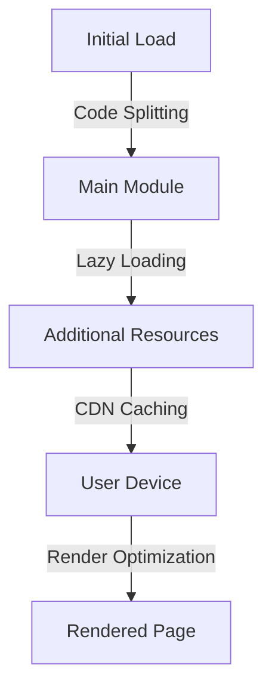

## 19.8.3 Frontend Performance Optimization

As we delve into building full-stack applications with Clojure, optimizing frontend performance becomes crucial. This section will guide you through advanced techniques to enhance the performance of your ClojureScript applications. We'll explore concepts like code splitting, lazy loading, caching assets with a Content Delivery Network (CDN), and minimizing render times. These strategies will not only improve the user experience but also ensure your applications are scalable and efficient.

### Understanding Frontend Performance

Frontend performance optimization is about delivering a smooth and responsive user experience. It involves reducing load times, minimizing resource usage, and ensuring that the application remains responsive under various conditions. For Java developers transitioning to Clojure, understanding these concepts in the context of ClojureScript is essential.

### Code Splitting

Code splitting is a technique that allows you to break down your application into smaller, manageable chunks. This approach ensures that only the necessary code is loaded initially, reducing the initial load time and improving performance.

#### Implementing Code Splitting in ClojureScript

In ClojureScript, code splitting can be achieved using tools like Webpack or by leveraging the `:modules` feature in the ClojureScript compiler. Here's a basic example of how you might configure code splitting:

```clojure
;; project.clj configuration for code splitting
:cljsbuild {
  :builds [{:id "main"
            :source-paths ["src"]
            :compiler {:output-to "resources/public/js/main.js"
                       :output-dir "resources/public/js/out"
                       :modules {:main {:entries [my-app.core]}
                                 :admin {:entries [my-app.admin]
                                         :depends-on #{:main}}}
                       :optimizations :advanced}}]}
```

In this configuration, we define two modules: `main` and `admin`. The `admin` module depends on `main`, ensuring that shared code is not duplicated.

#### Benefits of Code Splitting

- **Reduced Initial Load Time**: By loading only the necessary code, the initial load time is significantly reduced.
- **Improved User Experience**: Users experience faster load times and smoother interactions.
- **Efficient Resource Usage**: Only the required code is loaded, reducing bandwidth usage.

### Lazy Loading

Lazy loading is a technique where resources are loaded only when they are needed. This approach is particularly useful for images, videos, and other media that can be deferred until the user scrolls to them.

#### Implementing Lazy Loading in ClojureScript

Lazy loading in ClojureScript can be implemented using libraries like `react-lazy-load` or by manually handling the loading logic. Here's an example using a React component in ClojureScript:

```clojure
(ns my-app.components.lazy-image
  (:require [reagent.core :as r]))

(defn lazy-image [src alt]
  (let [loaded (r/atom false)]
    (fn []
      [:div {:class "lazy-image"}
       [:img {:src (if @loaded src "placeholder.jpg")
              :alt alt
              :on-load #(reset! loaded true)}]])))
```

In this example, we use a Reagent component to load an image lazily. The image is initially set to a placeholder, and once it loads, the actual image is displayed.

#### Benefits of Lazy Loading

- **Improved Load Times**: By deferring the loading of non-essential resources, the initial load time is reduced.
- **Enhanced Performance**: Resources are loaded only when needed, reducing unnecessary network requests.
- **Better User Experience**: Users experience faster interactions as they navigate through the application.

### Caching Assets with a CDN

A Content Delivery Network (CDN) is a network of servers distributed globally to deliver content more efficiently. By caching assets on a CDN, you can reduce load times and improve performance.

#### Configuring CDN Caching for ClojureScript

To cache assets with a CDN, you need to configure your build process to output files with unique names (e.g., using hashes) and set appropriate cache headers. Here's a basic example using Webpack:

```javascript
// webpack.config.js
module.exports = {
  output: {
    filename: '[name].[contenthash].js',
    path: path.resolve(__dirname, 'dist'),
    publicPath: 'https://cdn.example.com/'
  },
  plugins: [
    new HtmlWebpackPlugin({
      template: './src/index.html',
      inject: 'body'
    }),
    new CleanWebpackPlugin(),
    new CompressionPlugin()
  ]
};
```

In this configuration, we use `contenthash` to ensure that files are uniquely named, allowing the CDN to cache them effectively.

#### Benefits of CDN Caching

- **Reduced Latency**: By serving assets from a location closer to the user, latency is reduced.
- **Improved Load Times**: Cached assets load faster, improving the overall performance.
- **Scalability**: CDNs can handle large amounts of traffic, ensuring your application remains responsive.

### Minimizing Render Times

Render time optimization involves reducing the time it takes for the browser to render the page. This can be achieved by optimizing the DOM, reducing JavaScript execution time, and minimizing reflows and repaints.

#### Techniques for Minimizing Render Times

1. **Optimize the DOM**: Reduce the number of DOM elements and simplify the structure.
2. **Minimize JavaScript Execution**: Use efficient algorithms and avoid blocking the main thread.
3. **Reduce Reflows and Repaints**: Use CSS efficiently and avoid layout thrashing.

#### Example: Optimizing a ClojureScript Component

```clojure
(ns my-app.components.optimized-list
  (:require [reagent.core :as r]))

(defn optimized-list [items]
  (let [visible-items (r/atom (take 10 items))]
    (fn []
      [:ul
       (for [item @visible-items]
         ^{:key item} [:li item])])))
```

In this example, we limit the number of items rendered initially, reducing the render time. As the user scrolls, more items can be loaded dynamically.

### Try It Yourself

To solidify your understanding, try implementing these techniques in your own ClojureScript projects. Experiment with different configurations and observe the impact on performance. Consider the following challenges:

- Implement code splitting in a small ClojureScript application and measure the load time improvements.
- Add lazy loading to images in a React component and observe the difference in performance.
- Configure a CDN for your assets and test the load times from different geographical locations.

### Diagrams and Visualizations

To better understand these concepts, let's visualize the flow of data and resources in a ClojureScript application.



**Diagram 1**: This flowchart illustrates the process of optimizing frontend performance in a ClojureScript application, from initial load to rendering.

### Further Reading

For more information on frontend performance optimization, consider exploring the following resources:

- [Official ClojureScript Documentation](https://clojurescript.org/)
- [Webpack Documentation](https://webpack.js.org/)
- [Reagent Documentation](https://reagent-project.github.io/)

### Exercises and Practice Problems

1. **Code Splitting Exercise**: Implement code splitting in a ClojureScript project and measure the performance improvements.
2. **Lazy Loading Challenge**: Add lazy loading to a list of images and analyze the impact on load times.
3. **CDN Configuration Task**: Set up a CDN for your ClojureScript assets and test the performance from various locations.

### Key Takeaways

- **Code Splitting**: Break down your application into smaller chunks to reduce initial load times.
- **Lazy Loading**: Load resources only when needed to improve performance.
- **CDN Caching**: Use a CDN to cache assets and reduce latency.
- **Render Optimization**: Minimize render times by optimizing the DOM and JavaScript execution.

By applying these techniques, you can significantly enhance the performance of your ClojureScript applications, providing a better user experience and ensuring scalability.

## Quiz: Mastering Frontend Performance Optimization in ClojureScript



### What is the primary benefit of code splitting in ClojureScript applications?

- [x] Reduced initial load time
- [ ] Increased code complexity
- [ ] Larger bundle sizes
- [ ] Slower runtime performance

> **Explanation:** Code splitting reduces the initial load time by loading only the necessary code, improving performance.

### Which technique involves loading resources only when they are needed?

- [x] Lazy loading
- [ ] Code splitting
- [ ] CDN caching
- [ ] Render optimization

> **Explanation:** Lazy loading defers the loading of resources until they are needed, improving load times.

### What is the role of a CDN in frontend performance optimization?

- [x] Reducing latency by caching assets closer to the user
- [ ] Increasing server load
- [ ] Slowing down asset delivery
- [ ] Complicating deployment processes

> **Explanation:** A CDN reduces latency by caching assets closer to the user, improving load times.

### How can render times be minimized in ClojureScript applications?

- [x] By optimizing the DOM and reducing JavaScript execution time
- [ ] By increasing the number of DOM elements
- [ ] By using inefficient algorithms
- [ ] By blocking the main thread

> **Explanation:** Minimizing render times involves optimizing the DOM and reducing JavaScript execution time.

### Which of the following is a benefit of lazy loading?

- [x] Improved load times
- [ ] Increased network requests
- [x] Enhanced performance
- [ ] Slower interactions

> **Explanation:** Lazy loading improves load times and enhances performance by loading resources only when needed.

### What is the purpose of using `contenthash` in asset filenames?

- [x] To ensure files are uniquely named for effective caching
- [ ] To increase file size
- [ ] To complicate the build process
- [ ] To reduce cache effectiveness

> **Explanation:** Using `contenthash` ensures files are uniquely named, allowing for effective caching.

### Which tool can be used for code splitting in ClojureScript?

- [x] Webpack
- [ ] Maven
- [x] ClojureScript compiler
- [ ] Gradle

> **Explanation:** Webpack and the ClojureScript compiler can be used for code splitting.

### What is a key advantage of using a CDN for asset delivery?

- [x] Scalability and reduced latency
- [ ] Increased server load
- [ ] Slower asset delivery
- [ ] More complex deployment

> **Explanation:** A CDN provides scalability and reduced latency by caching assets closer to the user.

### How does lazy loading enhance user experience?

- [x] By deferring the loading of non-essential resources
- [ ] By increasing initial load times
- [ ] By loading all resources at once
- [ ] By complicating the user interface

> **Explanation:** Lazy loading enhances user experience by deferring the loading of non-essential resources.

### True or False: Code splitting increases the initial load time of an application.

- [ ] True
- [x] False

> **Explanation:** Code splitting decreases the initial load time by loading only the necessary code.


