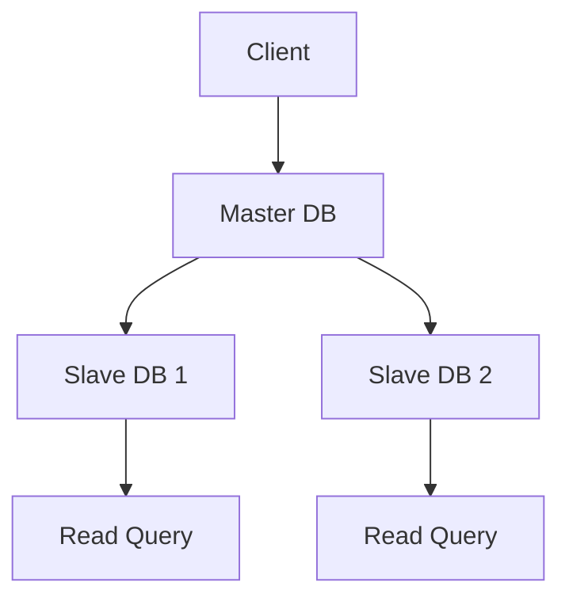

## 19.8.4 Database Scaling Solutions

As we build full-stack applications with Clojure, one of the critical challenges we face is scaling the database layer to handle increased loads and ensure high availability. In this section, we'll explore various strategies for scaling databases, including replication, partitioning, and the use of distributed databases. We'll also discuss the trade-offs involved, particularly in terms of data consistency and availability, which are crucial considerations in distributed systems.

### Understanding Database Scaling

Database scaling is the process of improving a database's ability to handle increased demand. This can involve increasing the number of transactions it can process, the amount of data it can store, or the speed at which it can retrieve data. There are two primary types of scaling:

1. **Vertical Scaling (Scaling Up):** Involves adding more resources to a single database server, such as CPU, RAM, or storage. While this can be effective to a point, it has limitations in terms of cost and physical constraints.

2. **Horizontal Scaling (Scaling Out):** Involves adding more database servers to distribute the load. This approach is more complex but offers greater scalability and fault tolerance.

### Replication

Replication involves copying data from one database server to another. This can improve availability and fault tolerance, as multiple copies of the data exist. There are several types of replication:

- **Master-Slave Replication:** In this model, the master server handles all write operations, and the slave servers replicate the data for read operations. This can improve read performance but introduces latency for writes.

- **Master-Master Replication:** Allows multiple servers to handle write operations, providing better write performance and availability. However, it introduces challenges in maintaining data consistency.

#### Clojure Example: Implementing Master-Slave Replication

Let's consider a simple Clojure application using a master-slave replication setup. We'll use a hypothetical library to demonstrate the concept.

```clojure
(ns myapp.database
  (:require [clojure.java.jdbc :as jdbc]))

(def master-db {:dbtype "postgresql" :dbname "master_db" :host "master-host" :user "user" :password "pass"})
(def slave-db {:dbtype "postgresql" :dbname "slave_db" :host "slave-host" :user "user" :password "pass"})

(defn write-to-master [data]
  ;; Write data to the master database
  (jdbc/insert! master-db :my_table data))

(defn read-from-slave []
  ;; Read data from the slave database
  (jdbc/query slave-db ["SELECT * FROM my_table"]))
```

In this example, we define two database connections: one for the master and one for the slave. We then create functions to write to the master and read from the slave.

### Partitioning (Sharding)

Partitioning, or sharding, involves dividing a database into smaller, more manageable pieces, called shards. Each shard is a separate database that contains a portion of the data. This approach can significantly improve performance and scalability.

- **Horizontal Partitioning:** Distributes rows across multiple tables or databases. Each shard contains a subset of the rows.

- **Vertical Partitioning:** Distributes columns across multiple tables or databases. Each shard contains a subset of the columns.

#### Clojure Example: Implementing Horizontal Partitioning

Let's implement a simple horizontal partitioning strategy in Clojure.

```clojure
(ns myapp.sharding
  (:require [clojure.java.jdbc :as jdbc]))

(def shard1-db {:dbtype "postgresql" :dbname "shard1" :host "shard1-host" :user "user" :password "pass"})
(def shard2-db {:dbtype "postgresql" :dbname "shard2" :host "shard2-host" :user "user" :password "pass"})

(defn get-shard [user-id]
  ;; Determine which shard to use based on user ID
  (if (even? user-id) shard1-db shard2-db))

(defn insert-user [user-id user-data]
  ;; Insert user data into the appropriate shard
  (let [shard (get-shard user-id)]
    (jdbc/insert! shard :users user-data)))

(defn query-user [user-id]
  ;; Query user data from the appropriate shard
  (let [shard (get-shard user-id)]
    (jdbc/query shard ["SELECT * FROM users WHERE id = ?" user-id])))
```

In this example, we determine the shard based on the user ID. Users with even IDs are stored in `shard1`, and those with odd IDs are stored in `shard2`.

### Distributed Databases

Distributed databases are designed to run on multiple servers, providing high availability and scalability. They often use a combination of replication and partitioning to achieve these goals. Examples include Apache Cassandra, Amazon DynamoDB, and Google Cloud Spanner.

#### Clojure Example: Using a Distributed Database

Let's explore how to use a distributed database like Apache Cassandra with Clojure.

```clojure
(ns myapp.cassandra
  (:require [clojurewerkz.cassaforte.client :as client]
            [clojurewerkz.cassaforte.query :as query]))

(def cluster (client/connect ["cassandra-host1" "cassandra-host2"]))
(def session (client/connect-keyspace cluster "my_keyspace"))

(defn insert-data [data]
  ;; Insert data into a Cassandra table
  (query/insert session :my_table data))

(defn query-data [id]
  ;; Query data from a Cassandra table
  (query/select session :my_table (query/where {:id id})))
```

In this example, we connect to a Cassandra cluster and perform basic insert and query operations.

### Trade-offs and Considerations

When scaling databases, it's essential to consider the trade-offs between consistency, availability, and partition tolerance, often referred to as the CAP theorem. In distributed systems, you can typically achieve only two of these three properties:

- **Consistency:** All nodes see the same data at the same time.
- **Availability:** Every request receives a response, even if it's not the latest data.
- **Partition Tolerance:** The system continues to operate despite network partitions.

#### Consistency Models

Different consistency models offer various trade-offs:

- **Strong Consistency:** Guarantees that all nodes see the same data simultaneously. This is often achieved at the expense of availability.

- **Eventual Consistency:** Guarantees that all nodes will eventually see the same data, but not necessarily at the same time. This model is more available but less consistent.

### Try It Yourself

Experiment with the code examples provided by modifying the database configurations or sharding logic. Try implementing a new sharding strategy based on a different attribute, such as geographic location.

### Diagrams and Visualizations

Below is a diagram illustrating the flow of data in a master-slave replication setup:



*Diagram 1: Master-Slave Replication Setup*

This diagram shows how data is written to the master database and replicated to slave databases, which handle read queries.

### Further Reading

For more in-depth information on database scaling, consider the following resources:

- [Official Clojure Documentation](https://clojure.org/)
- [ClojureDocs](https://clojuredocs.org/)
- [Apache Cassandra Documentation](https://cassandra.apache.org/doc/latest/)
- [Amazon DynamoDB Documentation](https://docs.aws.amazon.com/amazondynamodb/latest/developerguide/Introduction.html)

### Exercises

1. Implement a master-master replication setup in Clojure and discuss the challenges you encounter.
2. Create a new partitioning strategy based on a different attribute and evaluate its performance.
3. Explore a distributed database not covered in this section and integrate it with a Clojure application.

### Key Takeaways

- **Replication** improves availability and fault tolerance but can introduce consistency challenges.
- **Partitioning** allows for distributing data across multiple databases, enhancing performance and scalability.
- **Distributed databases** offer high availability and scalability but require careful consideration of consistency models.
- Understanding the **CAP theorem** is crucial for making informed decisions about database scaling strategies.

By mastering these database scaling solutions, we can build robust, scalable applications that meet the demands of modern users. Let's continue to explore and apply these concepts in our Clojure projects, leveraging the power of functional programming and distributed systems.

---

## Database Scaling Solutions Quiz



### What is the primary goal of database scaling?

- [x] To improve a database's ability to handle increased demand
- [ ] To reduce the size of the database
- [ ] To simplify database queries
- [ ] To decrease the number of database servers

> **Explanation:** Database scaling aims to enhance the database's capacity to manage more transactions, store more data, or retrieve data faster.

### Which type of scaling involves adding more resources to a single database server?

- [x] Vertical Scaling
- [ ] Horizontal Scaling
- [ ] Diagonal Scaling
- [ ] Lateral Scaling

> **Explanation:** Vertical scaling, or scaling up, involves adding more resources like CPU, RAM, or storage to a single database server.

### What is a key benefit of horizontal scaling?

- [x] Greater scalability and fault tolerance
- [ ] Simpler implementation
- [ ] Reduced hardware costs
- [ ] Increased complexity

> **Explanation:** Horizontal scaling, or scaling out, offers greater scalability and fault tolerance by distributing the load across multiple servers.

### In a master-slave replication setup, which server handles write operations?

- [x] Master server
- [ ] Slave server
- [ ] Both master and slave servers
- [ ] Neither server

> **Explanation:** In master-slave replication, the master server handles all write operations, while slave servers replicate the data for read operations.

### What is a potential challenge of master-master replication?

- [x] Maintaining data consistency
- [ ] Improving read performance
- [ ] Reducing write latency
- [ ] Simplifying database architecture

> **Explanation:** Master-master replication can improve write performance and availability but introduces challenges in maintaining data consistency.

### What is the primary purpose of partitioning (sharding) a database?

- [x] To divide a database into smaller, more manageable pieces
- [ ] To increase the number of database servers
- [ ] To simplify database queries
- [ ] To reduce data redundancy

> **Explanation:** Partitioning, or sharding, involves dividing a database into smaller pieces, each containing a portion of the data, to improve performance and scalability.

### Which consistency model guarantees that all nodes see the same data simultaneously?

- [x] Strong Consistency
- [ ] Eventual Consistency
- [ ] Weak Consistency
- [ ] Partial Consistency

> **Explanation:** Strong consistency ensures that all nodes see the same data at the same time, often at the expense of availability.

### What is a characteristic of eventual consistency?

- [x] All nodes will eventually see the same data
- [ ] All nodes see the same data simultaneously
- [ ] Data is never consistent across nodes
- [ ] Consistency is prioritized over availability

> **Explanation:** Eventual consistency guarantees that all nodes will eventually see the same data, but not necessarily at the same time.

### Which of the following is a distributed database?

- [x] Apache Cassandra
- [ ] MySQL
- [ ] SQLite
- [ ] Microsoft Access

> **Explanation:** Apache Cassandra is a distributed database designed to run on multiple servers, providing high availability and scalability.

### True or False: The CAP theorem states that you can achieve consistency, availability, and partition tolerance simultaneously in a distributed system.

- [ ] True
- [x] False

> **Explanation:** The CAP theorem states that in a distributed system, you can typically achieve only two of the three properties: consistency, availability, and partition tolerance.


