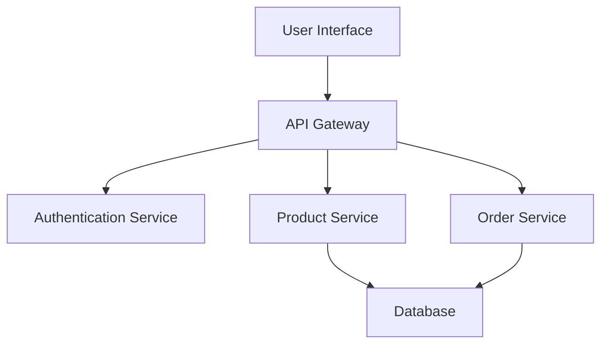
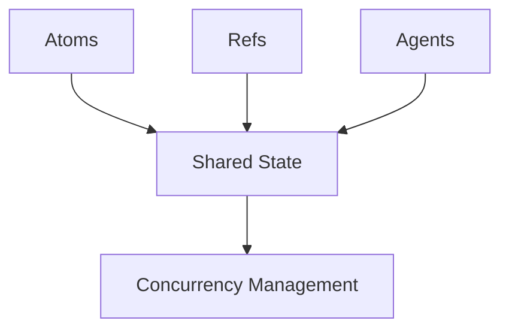
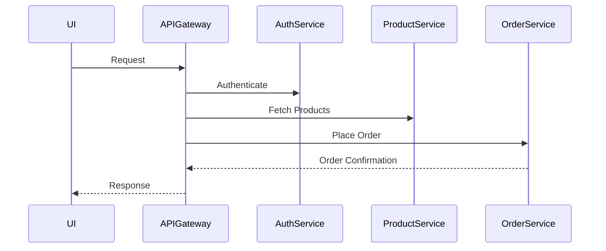

## 19.9.1 Project Retrospective

In this section, we will reflect on the journey of building a full-stack application using Clojure, examining both the triumphs and the hurdles encountered along the way. We'll explore how initial decisions shaped the development process and outcomes, and draw parallels with Java development to provide a comprehensive understanding for experienced Java developers transitioning to Clojure.

### Introduction

Building a full-stack application is a complex endeavor that requires careful planning, execution, and reflection. As we delve into the retrospective of our Clojure-based project, we'll focus on key areas such as architecture, technology choices, team dynamics, and the overall development process. This reflection will not only highlight what went well but also identify areas for improvement, providing valuable insights for future projects.

### Setting the Stage: Initial Decisions

The foundation of any successful project lies in the initial decisions made during the planning phase. In our Clojure full-stack application, these decisions included choosing the technology stack, defining the architecture, and setting clear goals and objectives.

#### Technology Stack

Our choice of Clojure for both the backend and frontend (via ClojureScript) was driven by its strengths in functional programming, immutability, and seamless Java interoperability. These features promised to enhance code maintainability, concurrency handling, and overall developer productivity.

**Comparison with Java:**

- **Clojure's Immutability**: Unlike Java, where mutable state is common, Clojure's immutable data structures reduce the risk of side effects, making concurrent programming more straightforward.
- **Functional Paradigm**: Clojure's emphasis on functions as first-class citizens contrasts with Java's object-oriented approach, encouraging a different mindset in problem-solving.

#### Architectural Decisions

We adopted a microservices architecture to promote modularity and scalability. This decision was influenced by the need to handle complex business logic and the desire to deploy services independently.

**Mermaid Diagram: Microservices Architecture Overview**



*Caption: The diagram illustrates the microservices architecture, highlighting the interaction between the user interface, API gateway, and various services.*

### What Went Well

Reflecting on the project's successes provides a foundation for understanding the benefits of our approach and the strengths of Clojure as a development language.

#### Seamless Java Interoperability

Clojure's ability to interoperate with Java allowed us to leverage existing Java libraries and tools, reducing development time and effort. This interoperability was particularly beneficial in integrating with legacy systems and utilizing Java's robust ecosystem.

**Clojure Code Example: Java Interoperability**

```clojure
(import '(java.util Date))

(defn current-date []
  ;; Create a new Java Date object
  (Date.))

;; Usage
(println "Current Date:" (current-date))
```

*Comment: This example demonstrates how to import and use Java classes in Clojure, showcasing the ease of interoperability.*

#### Functional Programming Benefits

The functional programming paradigm facilitated by Clojure led to more concise and expressive code. Higher-order functions and immutability contributed to a cleaner codebase, making it easier to reason about and maintain.

**Clojure Code Example: Higher-Order Functions**

```clojure
(defn apply-discount [discount-fn prices]
  ;; Apply a discount function to a list of prices
  (map discount-fn prices))

;; Usage
(def prices [100 200 300])
(defn ten-percent-discount [price] (* price 0.9))
(println "Discounted Prices:" (apply-discount ten-percent-discount prices))
```

*Comment: This example illustrates the use of higher-order functions to apply a discount to a list of prices, highlighting Clojure's functional capabilities.*

#### Enhanced Concurrency Handling

Clojure's concurrency primitives, such as atoms and refs, simplified the management of shared state across multiple threads. This feature was crucial in building a responsive and scalable application.

**Mermaid Diagram: Concurrency Model in Clojure**



*Caption: The diagram depicts Clojure's concurrency model, showcasing the role of atoms, refs, and agents in managing shared state.*

### Challenges Faced

No project is without its challenges. Identifying and understanding these obstacles is key to improving future development efforts.

#### Learning Curve

Transitioning from Java to Clojure posed a significant learning curve for the team. The shift from an object-oriented to a functional paradigm required a change in mindset and approach to problem-solving.

**Comparison with Java:**

- **Object-Oriented vs. Functional**: Java developers are accustomed to thinking in terms of classes and objects, whereas Clojure emphasizes functions and data transformations.
- **Immutability**: While Java developers often rely on mutable state, Clojure's immutability requires a different approach to managing data and state changes.

#### Debugging and Tooling

While Clojure offers powerful features, the debugging and tooling ecosystem is not as mature as Java's. This limitation occasionally slowed down the development process, particularly when diagnosing complex issues.

**Clojure Code Example: Debugging with REPL**

```clojure
(defn divide [a b]
  ;; Divide two numbers, handling division by zero
  (try
    (/ a b)
    (catch ArithmeticException e
      (println "Error: Division by zero"))))

;; Usage
(divide 10 0)
```

*Comment: This example demonstrates error handling in Clojure, using a try-catch block to manage exceptions.*

### Impact of Initial Decisions

The initial decisions made during the planning phase had a profound impact on the project's trajectory and outcomes.

#### Technology Stack

Choosing Clojure and ClojureScript proved advantageous in terms of code maintainability and developer productivity. However, the learning curve and tooling challenges highlighted the need for comprehensive training and support.

#### Architectural Choices

The microservices architecture facilitated scalability and modularity, allowing for independent deployment and scaling of services. However, it also introduced complexity in service coordination and communication.

**Mermaid Diagram: Service Communication in Microservices**



*Caption: The sequence diagram illustrates the communication flow between services in the microservices architecture.*

### Lessons Learned

Reflecting on the project, several key lessons emerged that will inform future development efforts.

#### Embrace the Functional Paradigm

The transition to functional programming requires a shift in mindset, but the benefits in terms of code clarity and maintainability are substantial. Embracing immutability and higher-order functions can lead to more robust and scalable applications.

#### Invest in Training and Tooling

Providing comprehensive training and investing in robust tooling can mitigate the challenges associated with transitioning to a new language and paradigm. This investment pays off in terms of developer productivity and code quality.

#### Balance Modularity and Complexity

While a microservices architecture offers scalability and flexibility, it also introduces complexity. Striking the right balance between modularity and simplicity is crucial for maintaining a manageable and efficient system.

### Conclusion

The retrospective of our Clojure full-stack application project highlights both the strengths and challenges of using Clojure in a real-world setting. By reflecting on what went well and identifying areas for improvement, we can apply these insights to future projects, ensuring continued growth and success in our development endeavors.

### Try It Yourself

To deepen your understanding of Clojure's capabilities, try modifying the code examples provided in this section. Experiment with different higher-order functions, explore Clojure's concurrency primitives, and integrate Java libraries to see firsthand how Clojure can enhance your development process.

### Exercises

1. **Refactor a Java Class**: Choose a simple Java class and refactor it into a Clojure function, focusing on immutability and functional programming principles.
2. **Build a Simple Microservice**: Create a small microservice using Clojure, implementing basic CRUD operations and exploring service communication.
3. **Experiment with Concurrency**: Implement a concurrent task using Clojure's atoms or agents, comparing the approach with Java's concurrency mechanisms.

### Key Takeaways

- **Clojure's Functional Paradigm**: Embrace the functional approach for cleaner, more maintainable code.
- **Java Interoperability**: Leverage Clojure's seamless integration with Java to enhance your applications.
- **Concurrency Simplified**: Utilize Clojure's concurrency primitives for efficient state management.
- **Reflect and Improve**: Regular retrospectives are essential for continuous improvement and project success.

### Further Reading

- [Official Clojure Documentation](https://clojure.org/)
- [ClojureDocs](https://clojuredocs.org/)
- [Functional Programming in Clojure](https://www.braveclojure.com/)

---

## Quiz: Reflecting on Clojure Full-Stack Development



### What is one of the main advantages of using Clojure's immutable data structures?

- [x] They reduce the risk of side effects in concurrent programming.
- [ ] They allow for faster execution of code.
- [ ] They make it easier to write object-oriented code.
- [ ] They simplify the use of mutable state.

> **Explanation:** Immutable data structures in Clojure help reduce side effects, which is particularly beneficial in concurrent programming.

### How does Clojure's functional paradigm differ from Java's object-oriented approach?

- [x] Clojure emphasizes functions and data transformations.
- [ ] Clojure uses classes and objects extensively.
- [ ] Java does not support functional programming.
- [ ] Clojure lacks support for higher-order functions.

> **Explanation:** Clojure's functional paradigm focuses on functions and data transformations, contrasting with Java's object-oriented approach that emphasizes classes and objects.

### What is a key benefit of Clojure's interoperability with Java?

- [x] It allows leveraging existing Java libraries and tools.
- [ ] It eliminates the need for learning Java.
- [ ] It restricts the use of Java classes.
- [ ] It simplifies the use of mutable state in Clojure.

> **Explanation:** Clojure's interoperability with Java enables developers to use existing Java libraries and tools, enhancing productivity.

### What challenge is commonly faced when transitioning from Java to Clojure?

- [x] The learning curve associated with the functional paradigm.
- [ ] The lack of support for object-oriented programming.
- [ ] The inability to use Java libraries.
- [ ] The absence of concurrency primitives.

> **Explanation:** Transitioning from Java to Clojure often involves a learning curve due to the shift from an object-oriented to a functional paradigm.

### Which Clojure feature simplifies concurrency management?

- [x] Atoms, refs, and agents.
- [ ] Classes and objects.
- [ ] Mutable state.
- [ ] Java's synchronized blocks.

> **Explanation:** Clojure's concurrency primitives, such as atoms, refs, and agents, simplify the management of shared state across multiple threads.

### What is a potential downside of a microservices architecture?

- [x] Increased complexity in service coordination.
- [ ] Lack of scalability.
- [ ] Difficulty in deploying services independently.
- [ ] Inability to handle complex business logic.

> **Explanation:** While microservices architecture offers scalability, it can introduce complexity in coordinating and communicating between services.

### How can the challenges of transitioning to Clojure be mitigated?

- [x] By investing in comprehensive training and robust tooling.
- [ ] By avoiding the use of functional programming principles.
- [ ] By limiting the use of Java libraries.
- [ ] By focusing solely on object-oriented programming.

> **Explanation:** Investing in training and tooling can help mitigate the challenges associated with transitioning to Clojure.

### What is a key takeaway from the project retrospective?

- [x] Embracing the functional paradigm leads to more maintainable code.
- [ ] Object-oriented programming is more suitable for Clojure.
- [ ] Java interoperability is unnecessary in Clojure projects.
- [ ] Concurrency is best managed with mutable state.

> **Explanation:** Embracing the functional paradigm in Clojure leads to cleaner, more maintainable code.

### Which diagram best illustrates service communication in a microservices architecture?

- [x] Sequence diagram.
- [ ] Class diagram.
- [ ] Flowchart.
- [ ] Data structure diagram.

> **Explanation:** A sequence diagram effectively illustrates the communication flow between services in a microservices architecture.

### True or False: Clojure's tooling ecosystem is as mature as Java's.

- [ ] True
- [x] False

> **Explanation:** Clojure's tooling ecosystem is not as mature as Java's, which can pose challenges in debugging and development.


