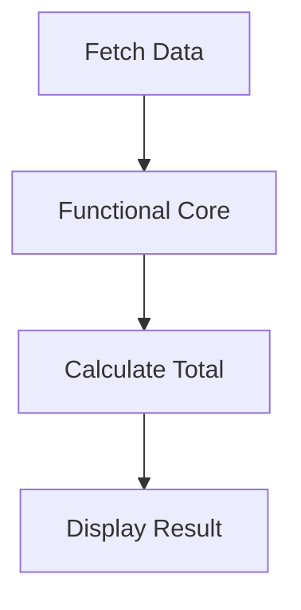
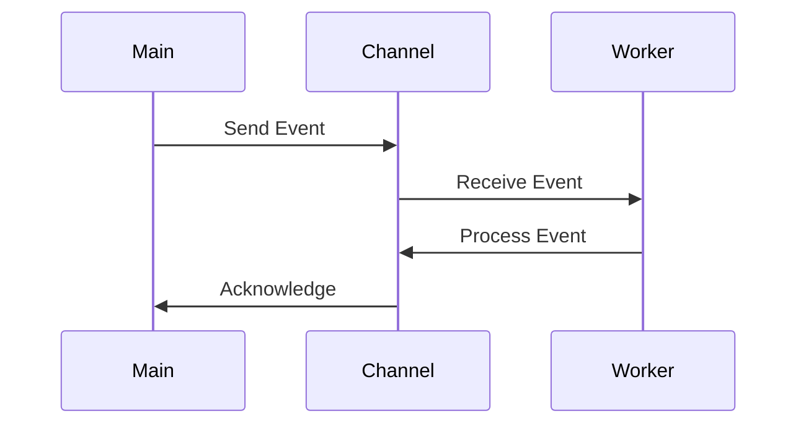

## 19.9.2 Technical Insights: Building a Full-Stack Application with Clojure

In this section, we delve into the technical insights gained from building a full-stack application using Clojure. We'll explore the effective use of specific libraries, architectural patterns that proved successful, and performance tuning techniques that enhanced the application's efficiency. As experienced Java developers transitioning to Clojure, you'll find these insights valuable in leveraging Clojure's unique features to build robust and scalable applications.

### Leveraging Clojure Libraries

Clojure's ecosystem offers a plethora of libraries that simplify full-stack development. Here, we discuss some of the most impactful libraries used in our project and how they compare to Java equivalents.

#### Ring and Compojure for Web Development

**Ring** is a Clojure library that provides a simple and flexible way to handle HTTP requests and responses. It serves as the foundation for building web applications in Clojure, similar to Java's Servlet API but with a more functional approach.

**Compojure** builds on top of Ring, offering a concise syntax for defining routes. It allows developers to map URLs to handler functions seamlessly.

```clojure
(ns myapp.core
  (:require [compojure.core :refer :all]
            [ring.adapter.jetty :refer :run-jetty]))

(defroutes app-routes
  (GET "/" [] "Hello, World!")
  (GET "/user/:id" [id] (str "User ID: " id)))

(defn -main []
  (run-jetty app-routes {:port 3000}))
```

*Comments:*
- **`defroutes`**: Defines a set of routes.
- **`GET`**: Maps HTTP GET requests to handler functions.
- **`run-jetty`**: Starts a Jetty server with the specified routes.

**Comparison with Java:**

In Java, setting up a similar server would involve configuring servlets, which can be more verbose and less intuitive. Clojure's functional approach allows for more concise and readable code.

#### Reagent and Re-frame for Frontend Development

**Reagent** is a minimalistic ClojureScript interface to React, enabling developers to build reactive user interfaces using Clojure's functional paradigms. **Re-frame** builds on Reagent, providing a framework for managing application state in a predictable and scalable way.

```clojure
(ns myapp.ui
  (:require [reagent.core :as r]
            [re-frame.core :as rf]))

(defn greeting []
  [:div "Hello, ClojureScript!"])

(defn mount-root []
  (r/render [greeting] (.getElementById js/document "app")))

(defn init []
  (mount-root))
```

*Comments:*
- **`reagent.core`**: Provides functions for creating React components.
- **`re-frame.core`**: Manages application state and side effects.
- **`r/render`**: Renders a Reagent component into the DOM.

**Comparison with JavaScript:**

Reagent and Re-frame offer a more functional and declarative approach compared to traditional JavaScript frameworks, reducing boilerplate and improving maintainability.

### Architectural Patterns

Choosing the right architectural patterns is crucial for building scalable and maintainable applications. Here, we discuss some patterns that worked well in our Clojure project.

#### Functional Core, Imperative Shell

This pattern involves separating the pure, functional core of the application from the imperative shell that handles side effects. This separation enhances testability and maintainability.

**Functional Core Example:**

```clojure
(defn calculate-total [items]
  (reduce + (map :price items)))
```

**Imperative Shell Example:**

```clojure
(defn fetch-items []
  ;; Simulate fetching items from a database
  [{:name "Item 1" :price 10}
   {:name "Item 2" :price 20}])

(defn display-total []
  (let [items (fetch-items)
        total (calculate-total items)]
    (println "Total price:" total)))
```

*Comments:*
- **`calculate-total`**: A pure function that calculates the total price.
- **`fetch-items`**: An impure function that simulates data fetching.

**Comparison with Java:**

In Java, achieving this separation often requires more boilerplate and design patterns like Dependency Injection. Clojure's emphasis on immutability and pure functions naturally aligns with this pattern.

#### Event-Driven Architecture

Clojure's support for asynchronous programming makes it well-suited for event-driven architectures. Using libraries like **core.async**, we can build systems that respond to events in a non-blocking manner.

```clojure
(ns myapp.events
  (:require [clojure.core.async :refer [chan go <! >!]]))

(def event-chan (chan))

(defn process-event [event]
  (println "Processing event:" event))

(go
  (while true
    (let [event (<! event-chan)]
      (process-event event))))

(defn trigger-event [event]
  (>! event-chan event))
```

*Comments:*
- **`chan`**: Creates a channel for communication between threads.
- **`go`**: Launches a lightweight thread for asynchronous processing.
- **`<!` and `>!`**: Read from and write to channels.

**Comparison with Java:**

Java's concurrency model often relies on threads and executors, which can be more complex to manage. Clojure's core.async provides a simpler and more expressive model for handling concurrency.

### Performance Tuning Techniques

Performance is a critical aspect of any application. Here, we share some techniques that helped optimize our Clojure application.

#### Profiling and Benchmarking

Profiling tools like **VisualVM** and **Criterium** are invaluable for identifying bottlenecks and measuring performance.

```clojure
(ns myapp.benchmark
  (:require [criterium.core :refer [quick-bench]]))

(defn expensive-operation []
  (Thread/sleep 1000)
  42)

(quick-bench (expensive-operation))
```

*Comments:*
- **`criterium.core`**: Provides functions for benchmarking Clojure code.
- **`quick-bench`**: Measures the execution time of a function.

**Comparison with Java:**

Java developers often use tools like JMH (Java Microbenchmark Harness) for benchmarking. Criterium offers similar capabilities with a focus on simplicity and ease of use.

#### Leveraging Persistent Data Structures

Clojure's persistent data structures provide efficient immutability, reducing the need for defensive copying and improving performance.

```clojure
(defn update-items [items]
  (conj items {:name "New Item" :price 30}))
```

*Comments:*
- **`conj`**: Adds an element to a collection, returning a new collection.

**Comparison with Java:**

In Java, achieving immutability often involves creating new copies of objects, which can be less efficient. Clojure's persistent data structures use structural sharing to optimize performance.

#### Optimizing Database Access

Efficient database access is crucial for performance. Using libraries like **next.jdbc**, we can streamline database interactions.

```clojure
(ns myapp.db
  (:require [next.jdbc :as jdbc]))

(def db-spec {:dbtype "h2" :dbname "test"})

(defn fetch-users []
  (jdbc/execute! db-spec ["SELECT * FROM users"]))
```

*Comments:*
- **`next.jdbc`**: A modern JDBC wrapper for Clojure.
- **`execute!`**: Executes a SQL query and returns the results.

**Comparison with Java:**

Java developers often use frameworks like Hibernate or Spring Data for database access. Next.jdbc offers a more lightweight and functional approach.

### Try It Yourself

To deepen your understanding, try modifying the code examples above:

- **Extend the `app-routes`** in the Ring and Compojure example to handle POST requests.
- **Add state management** to the Reagent and Re-frame example using Re-frame's subscription and event system.
- **Implement a new event type** in the core.async example and observe how it affects the event-driven architecture.
- **Profile a different function** using Criterium and analyze the results.

### Diagrams and Visualizations

To further illustrate these concepts, let's explore some diagrams.

#### Data Flow in a Functional Core, Imperative Shell



*Caption:* This diagram illustrates the flow of data through a functional core, where pure functions handle data processing, and an imperative shell manages side effects.

#### Concurrency Model with core.async



*Caption:* This sequence diagram shows how core.async channels facilitate communication between different parts of an application, enabling concurrency.

### Further Reading

For more information on the topics covered in this section, consider exploring the following resources:

- [Official Clojure Documentation](https://clojure.org/)
- [ClojureDocs](https://clojuredocs.org/)
- [Reagent GitHub Repository](https://github.com/reagent-project/reagent)
- [Re-frame GitHub Repository](https://github.com/day8/re-frame)
- [core.async GitHub Repository](https://github.com/clojure/core.async)

### Exercises and Practice Problems

1. **Extend the Web Server**: Add a new route to the Compojure example that returns a JSON response.
2. **State Management**: Implement a simple counter in the Reagent example using Re-frame's state management.
3. **Concurrency Challenge**: Modify the core.async example to handle multiple types of events concurrently.
4. **Database Optimization**: Optimize the database access example by adding connection pooling.

### Key Takeaways

- **Clojure's Libraries**: Libraries like Ring, Compojure, Reagent, and Re-frame simplify full-stack development with a functional approach.
- **Architectural Patterns**: Patterns like Functional Core, Imperative Shell, and Event-Driven Architecture enhance maintainability and scalability.
- **Performance Tuning**: Techniques like profiling, leveraging persistent data structures, and optimizing database access are crucial for building efficient applications.

Now that we've explored these technical insights, you're well-equipped to build robust and scalable full-stack applications with Clojure. Embrace the functional paradigm and leverage Clojure's unique features to enhance your development process.

---

## Quiz: Test Your Knowledge on Technical Insights in Clojure Full-Stack Development



### Which Clojure library is used for handling HTTP requests and responses?

- [x] Ring
- [ ] Reagent
- [ ] core.async
- [ ] next.jdbc

> **Explanation:** Ring is a Clojure library that provides a simple and flexible way to handle HTTP requests and responses, serving as the foundation for web applications.

### What is the primary purpose of Reagent in ClojureScript?

- [x] To provide a minimalistic interface to React
- [ ] To manage application state
- [ ] To handle HTTP requests
- [ ] To perform database operations

> **Explanation:** Reagent is a minimalistic ClojureScript interface to React, enabling developers to build reactive user interfaces using Clojure's functional paradigms.

### In the Functional Core, Imperative Shell pattern, what is the role of the functional core?

- [x] To handle pure data processing
- [ ] To manage side effects
- [ ] To handle HTTP requests
- [ ] To perform database operations

> **Explanation:** The functional core is responsible for handling pure data processing, while the imperative shell manages side effects.

### Which Clojure library is used for asynchronous programming?

- [x] core.async
- [ ] Reagent
- [ ] Ring
- [ ] next.jdbc

> **Explanation:** core.async is a Clojure library that provides support for asynchronous programming, enabling non-blocking operations and event-driven architectures.

### What is the purpose of the `quick-bench` function in Criterium?

- [x] To measure the execution time of a function
- [ ] To handle HTTP requests
- [ ] To manage application state
- [ ] To perform database operations

> **Explanation:** The `quick-bench` function in Criterium is used to measure the execution time of a function, helping identify performance bottlenecks.

### How do persistent data structures in Clojure improve performance?

- [x] By using structural sharing to optimize immutability
- [ ] By creating new copies of objects
- [ ] By using mutable data structures
- [ ] By avoiding function calls

> **Explanation:** Persistent data structures in Clojure use structural sharing to optimize immutability, reducing the need for defensive copying and improving performance.

### Which Clojure library is a modern JDBC wrapper?

- [x] next.jdbc
- [ ] Ring
- [ ] Reagent
- [ ] core.async

> **Explanation:** next.jdbc is a modern JDBC wrapper for Clojure, providing a lightweight and functional approach to database access.

### What is the advantage of using core.async channels?

- [x] They facilitate communication between different parts of an application
- [ ] They handle HTTP requests
- [ ] They manage application state
- [ ] They perform database operations

> **Explanation:** core.async channels facilitate communication between different parts of an application, enabling concurrency and non-blocking operations.

### Which architectural pattern involves separating pure functions from side effects?

- [x] Functional Core, Imperative Shell
- [ ] Event-Driven Architecture
- [ ] Microservices Architecture
- [ ] Layered Architecture

> **Explanation:** The Functional Core, Imperative Shell pattern involves separating pure functions from side effects, enhancing testability and maintainability.

### True or False: Clojure's core.async provides a simpler concurrency model compared to Java's threads and executors.

- [x] True
- [ ] False

> **Explanation:** True. Clojure's core.async provides a simpler and more expressive model for handling concurrency compared to Java's threads and executors.


