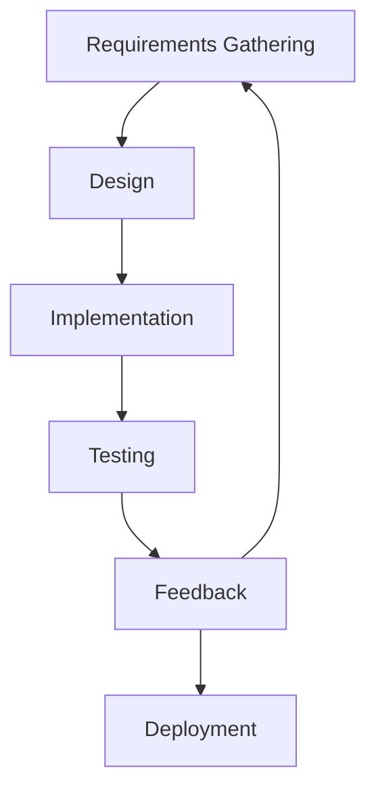

## 19.9.4 Iterative Development and Agile Practices

In the rapidly evolving world of software development, the ability to adapt to change and continuously improve is crucial. This is where iterative development and agile practices come into play. For Java developers transitioning to Clojure, understanding these methodologies can significantly enhance the development process, especially when building full-stack applications. In this section, we will delve into how iterative development and agile practices can be effectively applied in Clojure projects, emphasizing the benefits of continuous feedback, adaptability, and incremental improvements.

### Understanding Iterative Development

Iterative development is a process where software is developed and refined through repeated cycles (iterations) and smaller portions at a time (increments). This approach allows developers to incorporate feedback and make adjustments throughout the development lifecycle, rather than waiting until the end to evaluate the product.

#### Key Characteristics of Iterative Development

- **Incremental Delivery**: Software is developed in small, manageable increments, allowing for regular feedback and adjustments.
- **Continuous Feedback**: Regular feedback from stakeholders and users is integrated into the development process to ensure the product meets user needs.
- **Adaptability**: The process is flexible, allowing for changes and improvements based on feedback and evolving requirements.

### Agile Practices in Clojure Development

Agile methodologies complement iterative development by providing a framework that emphasizes collaboration, flexibility, and customer satisfaction. Agile practices are particularly beneficial in Clojure development due to the language's emphasis on simplicity and expressiveness.

#### Core Agile Principles

- **Customer Collaboration**: Engaging with customers and stakeholders to ensure the product aligns with their needs.
- **Responding to Change**: Embracing changes in requirements, even late in development, to deliver a competitive advantage.
- **Working Software**: Prioritizing the delivery of functional software over comprehensive documentation.

### Applying Agile Practices in Clojure Projects

#### 1. **Scrum Framework**

Scrum is a popular agile framework that organizes work into sprints, typically lasting two to four weeks. Each sprint results in a potentially shippable product increment.

- **Sprint Planning**: Define the goals and deliverables for the upcoming sprint.
- **Daily Stand-ups**: Short, daily meetings to discuss progress and obstacles.
- **Sprint Review and Retrospective**: Evaluate the sprint's outcomes and identify areas for improvement.

#### 2. **Kanban Methodology**

Kanban focuses on visualizing work, limiting work in progress, and maximizing efficiency. It is particularly useful for managing continuous delivery and improving workflow.

- **Visual Boards**: Use Kanban boards to track tasks and progress.
- **Work in Progress (WIP) Limits**: Set limits on the number of tasks in each stage to prevent bottlenecks.
- **Continuous Delivery**: Aim for a steady flow of work and regular releases.

### Benefits of Iterative and Agile Practices

#### 1. **Enhanced Flexibility and Adaptability**

By breaking down development into smaller increments and incorporating regular feedback, teams can quickly adapt to changes and new requirements. This flexibility is particularly valuable in Clojure projects, where the language's dynamic nature allows for rapid prototyping and experimentation.

#### 2. **Improved Quality and User Satisfaction**

Continuous feedback loops ensure that the product aligns with user needs and expectations. By regularly testing and refining the software, teams can identify and address issues early, leading to higher quality and user satisfaction.

#### 3. **Increased Collaboration and Communication**

Agile practices emphasize collaboration among team members and stakeholders. Regular meetings and open communication channels foster a collaborative environment, leading to better decision-making and problem-solving.

### Clojure Code Example: Implementing Agile Practices

Let's explore a simple Clojure code example that demonstrates how agile practices can be applied in a development project. We'll create a basic RESTful API using Clojure and iterate on it based on feedback.

```clojure
(ns myapp.core
  (:require [ring.adapter.jetty :refer [run-jetty]]
            [compojure.core :refer [defroutes GET POST]]
            [compojure.route :as route]
            [ring.middleware.json :refer [wrap-json-body wrap-json-response]]))

;; Define routes for the API
(defroutes app-routes
  (GET "/api/hello" [] {:status 200 :body {:message "Hello, World!"}})
  (POST "/api/echo" request
    {:status 200 :body (:body request)})
  (route/not-found "Not Found"))

;; Wrap routes with JSON middleware
(def app
  (-> app-routes
      (wrap-json-body)
      (wrap-json-response)))

;; Start the server
(defn -main []
  (run-jetty app {:port 3000 :join? false}))

;; Run the server
;; (comment
;;   (-main))
```

**Code Explanation:**

- **Routes Definition**: We define two routes using Compojure, a routing library for Clojure. The `GET` route returns a simple "Hello, World!" message, while the `POST` route echoes the request body.
- **Middleware**: We use middleware to handle JSON requests and responses, making it easier to work with data in a web application.
- **Server Initialization**: The `-main` function starts the Jetty server on port 3000, serving our API.

**Try It Yourself**: Modify the API to include a new route that returns the current server time. Consider how you might iterate on this API based on user feedback, such as adding authentication or additional data endpoints.

### Diagram: Iterative Development Cycle

Below is a diagram illustrating the iterative development cycle, highlighting the continuous feedback loop and incremental improvements.



**Diagram Explanation**: This diagram represents the iterative development cycle, where each phase feeds into the next, allowing for continuous refinement and improvement.

### Comparing Clojure and Java in Agile Development

While both Clojure and Java can be used in agile development, there are some key differences:

- **Simplicity and Expressiveness**: Clojure's concise syntax and functional nature make it easier to implement changes quickly, which aligns well with agile's emphasis on adaptability.
- **Immutability**: Clojure's immutable data structures reduce the risk of side effects, making it easier to manage changes and maintain code quality.
- **Concurrency**: Clojure's concurrency primitives (atoms, refs, agents) simplify the development of concurrent applications, a common requirement in modern software.

### Challenges and Solutions in Agile Clojure Development

#### 1. **Managing Dependencies**

In Clojure projects, managing dependencies can be challenging due to the dynamic nature of the language. Tools like Leiningen and tools.deps can help manage dependencies effectively.

#### 2. **Ensuring Code Quality**

With frequent changes, maintaining code quality is crucial. Practices like test-driven development (TDD) and continuous integration (CI) can help ensure that code remains robust and reliable.

#### 3. **Balancing Speed and Quality**

While agile emphasizes speed, it's important not to compromise on quality. Regular code reviews and refactoring sessions can help maintain a balance between speed and quality.

### Exercises and Practice Problems

1. **Exercise**: Implement a new feature in the provided Clojure API, such as user authentication. Consider how you would gather feedback and iterate on this feature.

2. **Practice Problem**: Create a Kanban board for a Clojure project, outlining tasks for the next sprint. Identify potential bottlenecks and propose solutions.

### Key Takeaways

- **Iterative Development**: Emphasizes continuous feedback and incremental improvements, allowing for flexibility and adaptability.
- **Agile Practices**: Enhance collaboration, communication, and customer satisfaction, aligning well with Clojure's strengths.
- **Clojure Advantages**: Simplicity, expressiveness, and concurrency support make Clojure an excellent choice for agile development.

By embracing iterative development and agile practices, Java developers transitioning to Clojure can build robust, adaptable, and user-focused applications. Now that we've explored these methodologies, let's apply them to your next Clojure project and see the benefits firsthand.

### Further Reading

- [Official Clojure Documentation](https://clojure.org/)
- [ClojureDocs](https://clojuredocs.org/)
- [Agile Alliance](https://www.agilealliance.org/)

## Quiz: Mastering Iterative Development and Agile Practices in Clojure



### What is a key characteristic of iterative development?

- [x] Incremental delivery
- [ ] Comprehensive documentation
- [ ] Fixed requirements
- [ ] Waterfall approach

> **Explanation:** Iterative development focuses on delivering software in small, manageable increments, allowing for regular feedback and adjustments.

### Which agile framework organizes work into sprints?

- [x] Scrum
- [ ] Kanban
- [ ] Waterfall
- [ ] Lean

> **Explanation:** Scrum organizes work into sprints, typically lasting two to four weeks, with each sprint resulting in a potentially shippable product increment.

### What is a benefit of using Kanban in agile development?

- [x] Visualizing work and limiting work in progress
- [ ] Fixed timelines
- [ ] Comprehensive documentation
- [ ] Sequential development

> **Explanation:** Kanban focuses on visualizing work, limiting work in progress, and maximizing efficiency, making it ideal for managing continuous delivery.

### How does Clojure's immutability benefit agile development?

- [x] Reduces the risk of side effects
- [ ] Increases code complexity
- [ ] Requires more memory
- [ ] Slows down development

> **Explanation:** Clojure's immutable data structures reduce the risk of side effects, making it easier to manage changes and maintain code quality.

### What is the purpose of a sprint retrospective in Scrum?

- [x] Evaluate the sprint's outcomes and identify areas for improvement
- [ ] Plan the next sprint
- [ ] Assign tasks to team members
- [ ] Deliver the final product

> **Explanation:** A sprint retrospective is held at the end of each sprint to evaluate its outcomes and identify areas for improvement.

### Which tool is commonly used for dependency management in Clojure?

- [x] Leiningen
- [ ] Maven
- [ ] Gradle
- [ ] Ant

> **Explanation:** Leiningen is a popular tool for managing dependencies and building Clojure projects.

### What is a common challenge in agile Clojure development?

- [x] Managing dependencies
- [ ] Lack of concurrency support
- [ ] Inflexible syntax
- [ ] Limited library support

> **Explanation:** Managing dependencies can be challenging in Clojure projects due to the dynamic nature of the language.

### How can code quality be ensured in agile development?

- [x] Test-driven development (TDD) and continuous integration (CI)
- [ ] Skipping code reviews
- [ ] Avoiding refactoring
- [ ] Focusing solely on speed

> **Explanation:** Practices like test-driven development (TDD) and continuous integration (CI) help ensure that code remains robust and reliable.

### What is a benefit of continuous feedback in agile development?

- [x] Ensures the product aligns with user needs and expectations
- [ ] Delays product delivery
- [ ] Increases documentation requirements
- [ ] Limits flexibility

> **Explanation:** Continuous feedback loops ensure that the product aligns with user needs and expectations, leading to higher quality and user satisfaction.

### True or False: Agile practices prioritize comprehensive documentation over working software.

- [ ] True
- [x] False

> **Explanation:** Agile practices prioritize working software over comprehensive documentation, focusing on delivering value to the customer.


