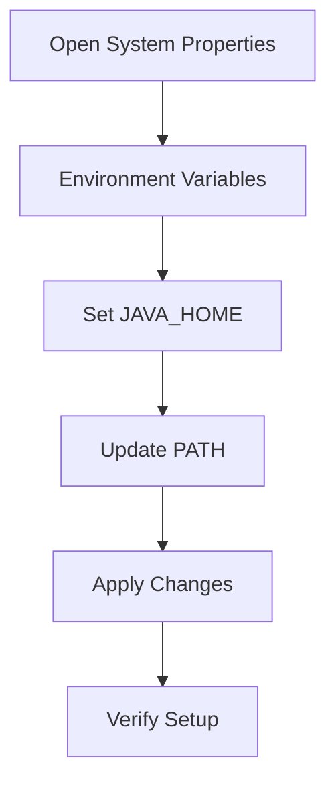
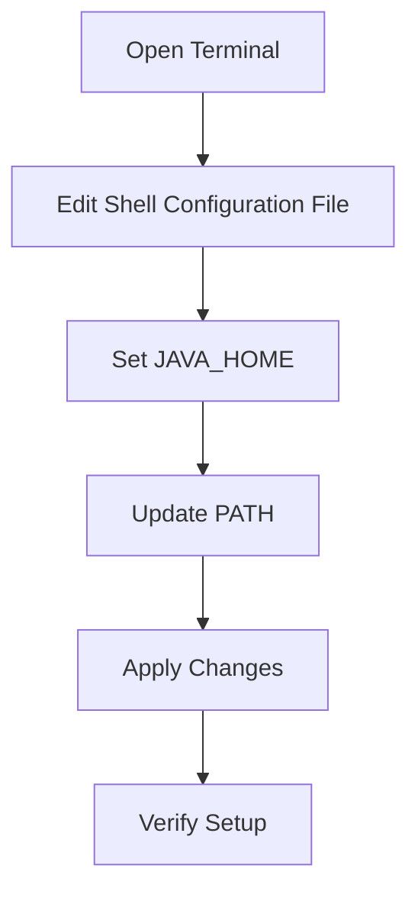

## 2.1.3 Setting Up Environment Variables

Setting up environment variables is a crucial step in configuring your development environment for Java and Clojure. This guide will walk you through the process of setting the `JAVA_HOME` environment variable and updating the system's `PATH` variable across different operating systems: Windows, macOS, and Linux. These steps ensure that your system can locate the Java Development Kit (JDK) and execute Java applications seamlessly.

### Why Environment Variables Matter

Environment variables are key-value pairs that can influence the behavior of running processes on your computer. For Java developers, setting the `JAVA_HOME` variable is essential because it tells your system where the JDK is installed. This is particularly important when compiling Java code or running Java-based applications like Clojure.

### Setting Up Environment Variables on Windows

On Windows, environment variables can be set through the Control Panel or the Settings app. Here’s how you can set up `JAVA_HOME` and update the `PATH` variable:

#### Step-by-Step Instructions

1. **Open System Properties**:
   - Press `Win + X` and select **System**.
   - Click on **Advanced system settings** on the left panel.
   - In the **System Properties** window, click on the **Environment Variables** button.

2. **Set JAVA_HOME**:
   - In the **Environment Variables** window, click **New** under the **System variables** section.
   - Enter `JAVA_HOME` as the **Variable name**.
   - Enter the path to your JDK installation as the **Variable value** (e.g., `C:\Program Files\Java\jdk-17`).

3. **Update PATH Variable**:
   - In the **System variables** section, find and select the `Path` variable, then click **Edit**.
   - Click **New** and add `%JAVA_HOME%\bin` to the list.

4. **Apply Changes**:
   - Click **OK** to close all dialog boxes.

5. **Verify Setup**:
   - Open a new Command Prompt window and type `echo %JAVA_HOME%` to verify the `JAVA_HOME` path.
   - Type `java -version` to ensure Java is accessible from the command line.

#### Diagram: Windows Environment Variable Setup



*Caption: Flowchart illustrating the steps to set environment variables on Windows.*

### Setting Up Environment Variables on macOS

On macOS, environment variables are typically set in shell configuration files such as `.bash_profile` or `.zshrc`, depending on the shell you are using.

#### Step-by-Step Instructions

1. **Open Terminal**:
   - Launch the Terminal application from the Utilities folder or by searching in Spotlight.

2. **Edit Shell Configuration File**:
   - For Bash users, open `.bash_profile`:
     ```bash
     nano ~/.bash_profile
     ```
   - For Zsh users, open `.zshrc`:
     ```bash
     nano ~/.zshrc
     ```

3. **Set JAVA_HOME**:
   - Add the following line to the file:
     ```bash
     export JAVA_HOME=$(/usr/libexec/java_home)
     ```

4. **Update PATH Variable**:
   - Add the following line to include the Java binaries:
     ```bash
     export PATH=$JAVA_HOME/bin:$PATH
     ```

5. **Apply Changes**:
   - Save the file and exit the editor (Ctrl + X, then Y, then Enter).
   - Run the following command to apply the changes:
     ```bash
     source ~/.bash_profile
     ```
   - Or for Zsh:
     ```bash
     source ~/.zshrc
     ```

6. **Verify Setup**:
   - In Terminal, type `echo $JAVA_HOME` to verify the `JAVA_HOME` path.
   - Type `java -version` to ensure Java is accessible.

#### Diagram: macOS Environment Variable Setup



*Caption: Flowchart illustrating the steps to set environment variables on macOS.*

### Setting Up Environment Variables on Linux

On Linux, environment variables can be set in files like `.bashrc`, `.bash_profile`, or `/etc/profile`, depending on your distribution and shell.

#### Step-by-Step Instructions

1. **Open Terminal**:
   - Use your preferred method to open a terminal window.

2. **Edit Shell Configuration File**:
   - Open `.bashrc` or `.bash_profile` for editing:
     ```bash
     nano ~/.bashrc
     ```
   - Or for global settings, edit `/etc/profile` (requires sudo):
     ```bash
     sudo nano /etc/profile
     ```

3. **Set JAVA_HOME**:
   - Add the following line to the file:
     ```bash
     export JAVA_HOME=/usr/lib/jvm/java-17-openjdk-amd64
     ```

4. **Update PATH Variable**:
   - Add the following line to include the Java binaries:
     ```bash
     export PATH=$JAVA_HOME/bin:$PATH
     ```

5. **Apply Changes**:
   - Save the file and exit the editor (Ctrl + X, then Y, then Enter).
   - Run the following command to apply the changes:
     ```bash
     source ~/.bashrc
     ```

6. **Verify Setup**:
   - In Terminal, type `echo $JAVA_HOME` to verify the `JAVA_HOME` path.
   - Type `java -version` to ensure Java is accessible.

#### Diagram: Linux Environment Variable Setup


*Caption: Flowchart illustrating the steps to set environment variables on Linux.*

### Importance of Restarting the Terminal or System

After setting environment variables, it's crucial to restart your terminal or even your system to ensure that the changes take effect. This is because environment variables are loaded when a terminal session starts, and changes won't be recognized in already open sessions.

### Try It Yourself

To solidify your understanding, try modifying the environment variable setup:

- **Change the Java version**: If you have multiple JDKs installed, switch the `JAVA_HOME` path to point to a different version and verify the change.
- **Add a custom script directory**: Update your `PATH` variable to include a directory where you store custom scripts, and test if you can execute a script from any location.

### Key Takeaways

- **Environment variables** are essential for configuring your development environment.
- **JAVA_HOME** and **PATH** are critical variables for Java and Clojure development.
- **Platform-specific instructions** ensure you can set up your environment on Windows, macOS, or Linux.
- **Restarting your terminal or system** is necessary for changes to take effect.

### Further Reading

- [Official Clojure Documentation](https://clojure.org/)
- [ClojureDocs](https://clojuredocs.org/)
- [Java SE Development Kit Documentation](https://docs.oracle.com/en/java/javase/)

### Exercises

1. **Set up a new environment variable** for a different tool you use frequently and ensure it is accessible from the command line.
2. **Experiment with different shells** (e.g., Bash, Zsh) and observe how environment variable settings differ.

## Quiz: Mastering Environment Variables for Java and Clojure Development



### What is the purpose of setting the `JAVA_HOME` environment variable?

- [x] To specify the location of the Java Development Kit (JDK) on your system.
- [ ] To set the default Java version for your applications.
- [ ] To configure the Java runtime environment.
- [ ] To enable Java debugging features.

> **Explanation:** The `JAVA_HOME` environment variable is used to specify the location of the JDK installation on your system, which is essential for compiling and running Java applications.

### Which command is used to apply changes to environment variables in a Bash shell on Linux?

- [x] `source ~/.bashrc`
- [ ] `apply ~/.bashrc`
- [ ] `refresh ~/.bashrc`
- [ ] `reload ~/.bashrc`

> **Explanation:** The `source` command is used to apply changes made to shell configuration files like `.bashrc` without restarting the terminal.

### On macOS, which file is typically used to set environment variables for the Zsh shell?

- [x] `.zshrc`
- [ ] `.bash_profile`
- [ ] `.profile`
- [ ] `.bashrc`

> **Explanation:** On macOS, the `.zshrc` file is used to set environment variables for the Zsh shell, which is the default shell in recent macOS versions.

### What should you do after setting environment variables to ensure they take effect?

- [x] Restart the terminal or system.
- [ ] Clear the terminal history.
- [ ] Reinstall the JDK.
- [ ] Update the system registry.

> **Explanation:** Restarting the terminal or system ensures that the changes to environment variables are recognized by new terminal sessions.

### Which environment variable is updated to include the Java binaries for command-line access?

- [x] `PATH`
- [ ] `JAVA_HOME`
- [ ] `CLASSPATH`
- [ ] `JAVA_OPTS`

> **Explanation:** The `PATH` environment variable is updated to include the Java binaries, allowing Java commands to be executed from the command line.

### How can you verify the `JAVA_HOME` variable is set correctly on Windows?

- [x] Use the command `echo %JAVA_HOME%` in Command Prompt.
- [ ] Use the command `java -version` in Command Prompt.
- [ ] Check the System Properties window.
- [ ] Use the command `set JAVA_HOME` in Command Prompt.

> **Explanation:** The command `echo %JAVA_HOME%` in Command Prompt will display the current value of the `JAVA_HOME` environment variable, verifying its correctness.

### What is the effect of adding `$JAVA_HOME/bin` to the `PATH` variable?

- [x] It allows Java commands to be executed from any directory in the terminal.
- [ ] It sets the default Java version for the system.
- [ ] It enables Java debugging features.
- [ ] It configures the Java runtime environment.

> **Explanation:** Adding `$JAVA_HOME/bin` to the `PATH` variable allows Java commands to be executed from any directory in the terminal, making Java tools accessible globally.

### Which file should you edit to set environment variables globally for all users on a Linux system?

- [x] `/etc/profile`
- [ ] `~/.bashrc`
- [ ] `~/.bash_profile`
- [ ] `/etc/environment`

> **Explanation:** The `/etc/profile` file is used to set environment variables globally for all users on a Linux system.

### What is the command to open the `.bash_profile` file for editing on macOS?

- [x] `nano ~/.bash_profile`
- [ ] `edit ~/.bash_profile`
- [ ] `open ~/.bash_profile`
- [ ] `vi ~/.bash_profile`

> **Explanation:** The command `nano ~/.bash_profile` opens the `.bash_profile` file for editing using the Nano text editor on macOS.

### True or False: Environment variables set in a terminal session are automatically available in all new terminal sessions.

- [ ] True
- [x] False

> **Explanation:** Environment variables set in a terminal session are not automatically available in new terminal sessions. They must be set in shell configuration files to persist across sessions.


