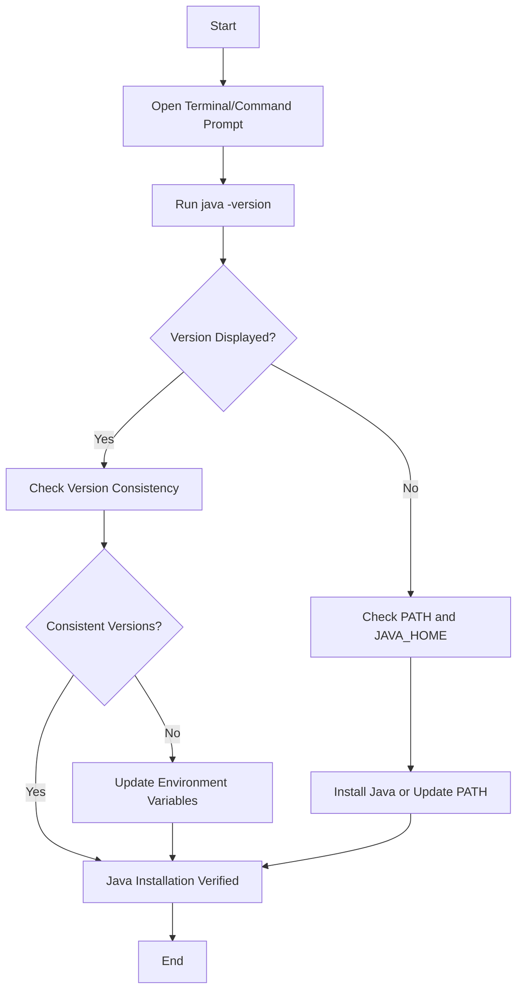

## 2.1.4 Verifying the Java Installation

As experienced Java developers transitioning to Clojure, ensuring that your Java installation is correctly configured is crucial for a seamless development experience. This section will guide you through verifying your Java installation, checking both the Java Runtime Environment (JRE) and the Java Development Kit (JDK) versions, and troubleshooting common issues that may arise.

### Why Verify Your Java Installation?

Before diving into Clojure development, it's essential to confirm that your Java environment is set up correctly. Clojure runs on the Java Virtual Machine (JVM), and any issues with your Java installation can lead to unexpected errors and hinder your development process. Verifying your Java installation ensures:

- **Compatibility**: Ensures that the Java version is compatible with Clojure.
- **Functionality**: Confirms that both the runtime and compiler are functioning correctly.
- **Troubleshooting**: Identifies potential issues early, saving time and effort later.

### Checking Java Version

To verify your Java installation, you need to check the versions of both the Java runtime and the Java compiler. This can be done using the `java -version` and `javac -version` commands.

#### Step-by-Step Guide

1. **Open a Terminal or Command Prompt**: Depending on your operating system, open the terminal (macOS/Linux) or command prompt (Windows).

2. **Check Java Runtime Version**:
   - Run the following command:
     ```bash
     java -version
     ```
   - **Expected Output**: This command should display the version of the Java runtime installed on your system. The output typically includes the Java version, the build number, and additional information about the runtime environment.

     Example Output:
     ```
     java version "17.0.1" 2021-10-19 LTS
     Java(TM) SE Runtime Environment (build 17.0.1+12-LTS-39)
     Java HotSpot(TM) 64-Bit Server VM (build 17.0.1+12-LTS-39, mixed mode, sharing)
     ```

3. **Check Java Compiler Version**:
   - Run the following command:
     ```bash
     javac -version
     ```
   - **Expected Output**: This command should display the version of the Java compiler. Ensure that it matches the runtime version.

     Example Output:
     ```
     javac 17.0.1
     ```

#### Understanding the Output

- **Java Version**: The version number indicates the major version of Java installed. For Clojure development, it's recommended to use Java 8 or later.
- **Build Number**: Provides additional details about the specific build of the Java version.
- **Runtime and Compiler Consistency**: Ensure that both the runtime and compiler versions are consistent to avoid compatibility issues.

### Troubleshooting Common Issues

If the commands above do not return the expected results, you may encounter some common issues. Let's explore how to troubleshoot them.

#### Issue 1: Command Not Found

- **Symptom**: When running `java -version` or `javac -version`, you receive a "command not found" error.
- **Solution**: This indicates that Java is not installed or the PATH environment variable is not set correctly. Ensure that Java is installed and the PATH variable includes the directory containing the Java binaries.

#### Issue 2: Incorrect Version Displayed

- **Symptom**: The version displayed does not match the version you installed.
- **Solution**: Multiple Java versions may be installed on your system. Ensure that the correct version is set as the default by checking and updating your PATH and JAVA_HOME environment variables.

#### Issue 3: Inconsistent Runtime and Compiler Versions

- **Symptom**: The runtime and compiler versions do not match.
- **Solution**: This can occur if different versions of the JRE and JDK are installed. Ensure that both are from the same Java version.

### Setting Environment Variables

To ensure that your Java installation is correctly configured, you may need to set or update environment variables such as PATH and JAVA_HOME.

#### Setting JAVA_HOME

1. **Identify the Java Installation Directory**: Locate the directory where Java is installed on your system.

2. **Set JAVA_HOME**:
   - **Windows**:
     - Open the System Properties dialog (Control Panel > System and Security > System > Advanced system settings).
     - Click on "Environment Variables."
     - Under "System variables," click "New" and enter `JAVA_HOME` as the variable name and the Java installation directory as the value.
   - **macOS/Linux**:
     - Open a terminal and edit the shell configuration file (e.g., `~/.bash_profile`, `~/.bashrc`, or `~/.zshrc`).
     - Add the following line:
       ```bash
       export JAVA_HOME=/path/to/java
       ```

#### Updating PATH

1. **Add Java to PATH**:
   - **Windows**:
     - In the Environment Variables dialog, find the PATH variable under "System variables" and click "Edit."
     - Add the path to the Java `bin` directory (e.g., `C:\Program Files\Java\jdk-17\bin`).
   - **macOS/Linux**:
     - Edit the shell configuration file and add the following line:
       ```bash
       export PATH=$JAVA_HOME/bin:$PATH
       ```

2. **Apply Changes**:
   - **Windows**: Restart the command prompt or your computer.
   - **macOS/Linux**: Run `source ~/.bash_profile` or the equivalent command for your shell.

### Try It Yourself

To ensure your Java installation is correctly configured, try the following:

- **Experiment with Different Java Versions**: Install multiple Java versions and switch between them using environment variables.
- **Check for Java Updates**: Regularly check for updates to ensure you have the latest security patches and features.
- **Test Java Installation**: Write a simple Java program to compile and run, verifying that both the runtime and compiler are functioning correctly.

### Visualizing Java Installation Verification

Below is a flowchart illustrating the process of verifying your Java installation:



**Caption**: This flowchart outlines the steps to verify your Java installation, ensuring that both the runtime and compiler are correctly configured.

### Further Reading

For more information on Java installation and configuration, consider the following resources:

- [Official Java Documentation](https://docs.oracle.com/en/java/)
- [Clojure Documentation](https://clojure.org/)
- [ClojureDocs](https://clojuredocs.org/)

### Exercises

1. **Verify Java Installation**: Follow the steps outlined in this section to verify your Java installation. Document any issues you encounter and how you resolved them.
2. **Environment Variables Practice**: Practice setting and updating environment variables on your system. Test the changes by running Java commands.
3. **Java Program Compilation**: Write a simple Java program, compile it using `javac`, and run it using `java` to ensure your installation is functioning correctly.

### Key Takeaways

- Verifying your Java installation is crucial for a smooth transition to Clojure development.
- Ensure that both the Java runtime and compiler are correctly installed and configured.
- Troubleshoot common issues by checking environment variables and ensuring version consistency.
- Regularly update your Java installation to maintain compatibility and security.

By following these steps, you'll ensure that your Java environment is ready for Clojure development, allowing you to focus on mastering functional programming concepts and building robust applications.

## Java Installation Verification Quiz



### What command is used to check the Java runtime version?

- [x] java -version
- [ ] javac -version
- [ ] java --check
- [ ] javac --check

> **Explanation:** The `java -version` command is used to check the Java runtime version.

### What command is used to check the Java compiler version?

- [ ] java -version
- [x] javac -version
- [ ] java --check
- [ ] javac --check

> **Explanation:** The `javac -version` command is used to check the Java compiler version.

### What should you do if `java -version` returns "command not found"?

- [ ] Reinstall your operating system
- [x] Check if Java is installed and update the PATH variable
- [ ] Ignore the error
- [ ] Use a different command

> **Explanation:** If `java -version` returns "command not found," it indicates that Java is not installed or the PATH variable is not set correctly.

### What environment variable should point to the Java installation directory?

- [ ] PATH
- [x] JAVA_HOME
- [ ] CLASSPATH
- [ ] JRE_HOME

> **Explanation:** The `JAVA_HOME` environment variable should point to the Java installation directory.

### How can you ensure that the Java runtime and compiler versions are consistent?

- [ ] By using different versions for each
- [x] By installing both from the same Java version
- [ ] By ignoring version differences
- [ ] By setting the CLASSPATH variable

> **Explanation:** Ensuring that both the runtime and compiler are from the same Java version helps maintain consistency.

### What should you do if the Java version displayed is incorrect?

- [ ] Reinstall Java
- [x] Check and update the PATH and JAVA_HOME variables
- [ ] Ignore the version
- [ ] Use a different Java version

> **Explanation:** If the incorrect version is displayed, check and update the PATH and JAVA_HOME variables to point to the correct Java installation.

### What is the purpose of the PATH environment variable in Java installation?

- [x] To specify the directories where executable programs are located
- [ ] To store Java source files
- [ ] To compile Java programs
- [ ] To run Java applications

> **Explanation:** The PATH environment variable specifies the directories where executable programs are located, allowing the system to find Java binaries.

### What is the recommended Java version for Clojure development?

- [ ] Java 6
- [ ] Java 7
- [x] Java 8 or later
- [ ] Java 5

> **Explanation:** Java 8 or later is recommended for Clojure development due to its compatibility and features.

### What should you do if the runtime and compiler versions do not match?

- [ ] Ignore the mismatch
- [x] Ensure both are from the same Java version
- [ ] Use a different compiler
- [ ] Reinstall the operating system

> **Explanation:** If the runtime and compiler versions do not match, ensure both are from the same Java version to avoid compatibility issues.

### True or False: The `javac` command is used to run Java applications.

- [ ] True
- [x] False

> **Explanation:** The `javac` command is used to compile Java programs, not to run them.


