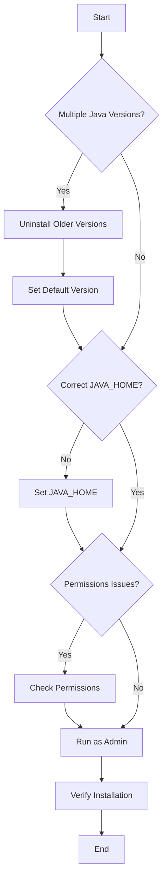

## 2.1.5 Troubleshooting Common Java Installation Issues

As experienced Java developers transitioning to Clojure, setting up your development environment is crucial. However, Java installation issues can often be a stumbling block. In this section, we'll address common problems such as multiple Java versions causing conflicts, incorrect `JAVA_HOME` settings, and permissions issues during installation. We'll provide solutions and tips for resolving these issues, ensuring a smooth setup for your Clojure development journey.

### Understanding Java Installation Issues

Before diving into solutions, it's essential to understand the common issues that can arise during Java installation:

1. **Multiple Java Versions Causing Conflicts**: Having multiple versions of Java installed can lead to conflicts, especially if the system defaults to an older version.
2. **Incorrect `JAVA_HOME` Settings**: The `JAVA_HOME` environment variable must point to the correct Java installation directory for tools like Maven and Gradle to function correctly.
3. **Permissions Issues During Installation**: Insufficient permissions can prevent Java from installing correctly, especially on Unix-based systems.

Let's explore each of these issues in detail and provide practical solutions.

### Resolving Multiple Java Versions Conflicts

Having multiple Java versions installed can cause your system to default to an unintended version, leading to compatibility issues with Clojure and other Java-based tools.

#### Identifying Installed Java Versions

First, identify all installed Java versions on your system. Open a terminal or command prompt and run the following command:

```bash
java -version
```

This command displays the current default Java version. To list all installed versions, use:

- **Windows**: Check the `Program Files` directory for Java installations.
- **macOS/Linux**: Use the `update-alternatives` command:

```bash
sudo update-alternatives --config java
```

This command lists all available Java versions and allows you to select the default.

#### Uninstalling Older Java Versions

To avoid conflicts, uninstall older Java versions:

- **Windows**: Use the Control Panel to uninstall Java versions.
- **macOS**: Remove Java versions from `/Library/Java/JavaVirtualMachines`.
- **Linux**: Use package managers like `apt` or `yum` to remove Java versions.

#### Setting the Default Java Version

After uninstalling unnecessary versions, set the default Java version:

- **Windows**: Update the `Path` environment variable to point to the desired Java version's `bin` directory.
- **macOS/Linux**: Use `update-alternatives` to set the default:

```bash
sudo update-alternatives --set java /path/to/java
```

### Correcting `JAVA_HOME` Settings

The `JAVA_HOME` environment variable is crucial for Java-based applications. It should point to the root directory of your Java installation.

#### Setting `JAVA_HOME` on Windows

1. Open the System Properties dialog (`Win + Pause`).
2. Click on "Advanced system settings."
3. Click on "Environment Variables."
4. Under "System variables," click "New" and add `JAVA_HOME` with the path to your Java installation (e.g., `C:\Program Files\Java\jdk-17`).
5. Add `%JAVA_HOME%\bin` to the `Path` variable.

#### Setting `JAVA_HOME` on macOS/Linux

Edit your shell profile file (`~/.bashrc`, `~/.zshrc`, or `~/.bash_profile`) and add:

```bash
export JAVA_HOME=/path/to/java
export PATH=$JAVA_HOME/bin:$PATH
```

Reload the profile:

```bash
source ~/.bashrc
```

#### Verifying `JAVA_HOME`

Verify the `JAVA_HOME` setting by running:

```bash
echo $JAVA_HOME
```

Ensure it points to the correct Java directory.

### Addressing Permissions Issues

Permissions issues can prevent Java from installing correctly, especially on Unix-based systems.

#### Checking Permissions on macOS/Linux

Ensure you have the necessary permissions to install Java:

1. Use `sudo` to gain administrative privileges during installation.
2. Verify directory permissions with `ls -l` and adjust using `chmod` or `chown` if necessary.

#### Running Installers as Administrator on Windows

On Windows, run Java installers as an administrator:

1. Right-click the installer and select "Run as administrator."
2. Follow the installation prompts.

### Common Error Messages and Solutions

Here are some common error messages you might encounter during Java installation and their solutions:

#### "Java Not Recognized as an Internal or External Command"

This error indicates that the Java executable is not in your system's `Path`.

- **Solution**: Ensure the `Path` variable includes the Java `bin` directory.

#### "Could Not Find or Load Main Class"

This error often occurs when the `JAVA_HOME` variable is incorrectly set.

- **Solution**: Verify that `JAVA_HOME` points to the correct Java directory.

#### "Permission Denied"

This error indicates insufficient permissions to install or execute Java.

- **Solution**: Use `sudo` on Unix-based systems or run as administrator on Windows.

### Try It Yourself

To solidify your understanding, try the following:

1. **Check Installed Java Versions**: Use the commands provided to list all installed Java versions on your system.
2. **Set `JAVA_HOME`**: Practice setting the `JAVA_HOME` variable on your operating system.
3. **Uninstall an Older Java Version**: If you have multiple versions, uninstall an older version and set the default to the latest.

### Diagrams and Visual Aids

Below is a flowchart illustrating the process of troubleshooting Java installation issues:



*Flowchart illustrating the steps to troubleshoot common Java installation issues.*

### Further Reading

For more detailed information on Java installation and troubleshooting, consider the following resources:

- [Official Java Documentation](https://docs.oracle.com/en/java/)
- [Clojure Documentation](https://clojure.org/guides/getting_started)
- [ClojureDocs](https://clojuredocs.org/)

### Exercises

1. **Exercise 1**: Identify and uninstall an older Java version on your system. Set the default to the latest version.
2. **Exercise 2**: Set the `JAVA_HOME` variable on your system and verify its correctness.
3. **Exercise 3**: Simulate a permissions issue by attempting to install Java without administrative privileges. Resolve the issue by adjusting permissions.

### Key Takeaways

- **Multiple Java Versions**: Can cause conflicts; uninstall older versions and set the default.
- **`JAVA_HOME` Variable**: Must be correctly set for Java-based tools to function.
- **Permissions**: Ensure you have the necessary permissions to install and run Java.

By addressing these common Java installation issues, you'll ensure a smooth setup for your Clojure development environment. Now that we've explored these troubleshooting techniques, let's move on to installing Clojure and setting up your development environment.

## Quiz: Troubleshooting Java Installation for Clojure Development



### What is a common issue when multiple Java versions are installed?

- [x] Version conflicts
- [ ] Increased performance
- [ ] Enhanced security
- [ ] Automatic updates

> **Explanation:** Multiple Java versions can lead to version conflicts, causing compatibility issues with applications.

### How can you list all installed Java versions on a Linux system?

- [x] `sudo update-alternatives --config java`
- [ ] `java -list`
- [ ] `java -version`
- [ ] `java --show-versions`

> **Explanation:** The `update-alternatives` command lists all installed Java versions and allows you to select the default.

### What should the `JAVA_HOME` variable point to?

- [x] The root directory of the Java installation
- [ ] The `bin` directory of the Java installation
- [ ] The `lib` directory of the Java installation
- [ ] The `src` directory of the Java installation

> **Explanation:** `JAVA_HOME` should point to the root directory of the Java installation for tools to function correctly.

### What command can you use to verify the `JAVA_HOME` setting?

- [x] `echo $JAVA_HOME`
- [ ] `java -version`
- [ ] `java -home`
- [ ] `java --show-home`

> **Explanation:** The `echo $JAVA_HOME` command displays the current setting of the `JAVA_HOME` variable.

### What is a common solution for "Java Not Recognized as an Internal or External Command"?

- [x] Ensure the `Path` variable includes the Java `bin` directory
- [ ] Reinstall Java
- [ ] Update the operating system
- [ ] Disable antivirus software

> **Explanation:** This error indicates that the Java executable is not in the system's `Path`, so adding it resolves the issue.

### How can you run a Java installer with administrative privileges on Windows?

- [x] Right-click the installer and select "Run as administrator"
- [ ] Double-click the installer
- [ ] Use the command prompt
- [ ] Use the task manager

> **Explanation:** Running the installer as an administrator ensures it has the necessary permissions to install Java.

### What is a common cause of "Could Not Find or Load Main Class"?

- [x] Incorrect `JAVA_HOME` setting
- [ ] Missing Java installation
- [ ] Corrupted Java files
- [ ] Outdated Java version

> **Explanation:** This error often occurs when the `JAVA_HOME` variable is incorrectly set, leading to classpath issues.

### How can you check directory permissions on a Unix-based system?

- [x] Use the `ls -l` command
- [ ] Use the `chmod` command
- [ ] Use the `chown` command
- [ ] Use the `pwd` command

> **Explanation:** The `ls -l` command lists directory contents with permissions, helping identify permission issues.

### What should you do if you encounter a "Permission Denied" error during Java installation?

- [x] Use `sudo` on Unix-based systems or run as administrator on Windows
- [ ] Disable the firewall
- [ ] Reinstall the operating system
- [ ] Update Java

> **Explanation:** Using `sudo` or running as administrator provides the necessary permissions to install Java.

### True or False: Setting `JAVA_HOME` is optional for Java-based tools.

- [ ] True
- [x] False

> **Explanation:** Setting `JAVA_HOME` is essential for Java-based tools to locate the correct Java installation.


