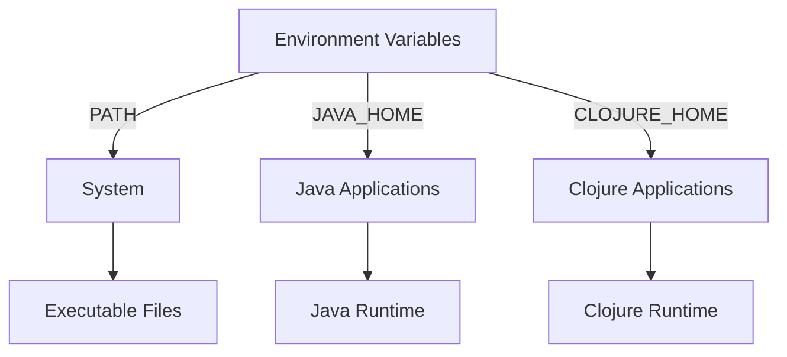

## 2.10.2 Fixing Environment Variable Problems

Setting up a development environment for Clojure, especially for those transitioning from Java, can sometimes lead to issues with environment variables. These variables are crucial for ensuring that your system can locate and execute the necessary programs and scripts. In this guide, we'll explore common environment variable problems, how to diagnose them, and effective solutions to ensure your Clojure development setup runs smoothly.

### Understanding Environment Variables

Environment variables are dynamic values that the operating system and applications use to determine the environment in which they run. They can influence the behavior of running processes and are often used to store configuration settings.

#### Key Environment Variables

- **PATH**: A system variable that tells the operating system where to look for executable files. It's crucial for running programs from the command line without specifying their full path.
- **JAVA_HOME**: Specifies the location of the Java Development Kit (JDK) installation. This is particularly important for Java developers.
- **CLOJURE_HOME**: Although not always necessary, setting this can help some tools locate your Clojure installation.

### Common Environment Variable Issues

1. **Incorrect PATH Settings**: If the PATH variable is not set correctly, your system may not be able to find Java or Clojure executables.
2. **Non-Executable Scripts**: Scripts that are not marked as executable can cause issues when trying to run them.
3. **Conflicting Versions**: Multiple versions of Java or Clojure can lead to conflicts if the environment variables point to the wrong version.

### Checking and Modifying PATH Settings

Let's start by ensuring that your PATH variable is set correctly. This is crucial for both Java and Clojure to function properly.

#### Checking PATH on Windows

1. **Open Command Prompt**: Press `Win + R`, type `cmd`, and press Enter.
2. **Display PATH**: Type `echo %PATH%` and press Enter. This will display the current PATH settings.

#### Checking PATH on macOS/Linux

1. **Open Terminal**: Use Spotlight (Cmd + Space) and type `Terminal`, then press Enter.
2. **Display PATH**: Type `echo $PATH` and press Enter to view the current PATH settings.

#### Modifying PATH

To modify the PATH variable, you need to append the directories of your Java and Clojure installations.

**Windows**:
- Right-click on 'This PC' or 'My Computer' and select 'Properties'.
- Click on 'Advanced system settings'.
- In the System Properties window, click on 'Environment Variables'.
- Under 'System variables', find and select 'Path', then click 'Edit'.
- Add the paths to your Java and Clojure installations.

**macOS/Linux**:
- Open Terminal and type `nano ~/.bash_profile` (or `~/.bashrc` for Linux).
- Add the following lines, replacing `/path/to/java` and `/path/to/clojure` with your actual installation paths:
  ```bash
  export PATH=$PATH:/path/to/java/bin:/path/to/clojure/bin
  ```
- Save the file and reload it using `source ~/.bash_profile` or `source ~/.bashrc`.

### Ensuring Scripts are Executable

On Unix-based systems, scripts need to have executable permissions. Here's how to ensure your scripts are executable:

1. **Navigate to the Script Directory**: Use `cd /path/to/your/script`.
2. **Make the Script Executable**: Run `chmod +x your-script.sh`.

### Dealing with Conflicting Versions

Conflicting versions can cause unexpected behavior. Here's how to manage them:

#### Java Version Conflicts

- **Check Installed Versions**: Use `java -version` to see the current version.
- **Switch Versions**: On macOS/Linux, you can use tools like `jenv` to manage multiple Java versions.

#### Clojure Version Conflicts

- **Check Installed Versions**: Use `clojure -M:version` to see the current version.
- **Switch Versions**: Use tools like `lein` or `tools.deps` to specify the version of Clojure for your project.

### Practical Example: Setting Up Environment Variables

Let's walk through a practical example of setting up environment variables for a Clojure project.

#### Step 1: Verify Java Installation

Ensure Java is installed and the JAVA_HOME variable is set correctly.

```bash
# Check Java version
java -version

# Set JAVA_HOME on macOS/Linux
export JAVA_HOME=$(/usr/libexec/java_home)

# Verify JAVA_HOME
echo $JAVA_HOME
```

#### Step 2: Install Clojure

Install Clojure and ensure it's added to your PATH.

```bash
# Install Clojure using Homebrew on macOS
brew install clojure

# Verify Clojure installation
clojure -M:version
```

#### Step 3: Configure PATH

Ensure both Java and Clojure are in your PATH.

```bash
# Add Java and Clojure to PATH
export PATH=$PATH:$JAVA_HOME/bin:/usr/local/bin/clojure

# Verify PATH
echo $PATH
```

### Try It Yourself

Experiment with modifying your PATH variable. Try adding a new directory and verify that executables in that directory can be run from any location in your terminal.

### Visualizing Environment Variable Flow

Below is a diagram illustrating the flow of data through environment variables, showing how they interact with the system and applications.



*Diagram: Interaction of environment variables with system and applications.*

### Additional Resources

For further reading on environment variables and their management, consider the following resources:

- [Official Clojure Documentation](https://clojure.org/)
- [ClojureDocs](https://clojuredocs.org/)
- [Java SE Documentation](https://docs.oracle.com/javase/8/docs/)

### Exercises

1. **Modify PATH**: Add a new directory to your PATH and verify that you can run scripts from that directory.
2. **Script Permissions**: Create a simple shell script and ensure it has executable permissions.
3. **Version Management**: Use a version management tool to switch between different Java versions.

### Key Takeaways

- **Environment Variables**: Crucial for configuring the development environment, especially PATH, JAVA_HOME, and CLOJURE_HOME.
- **PATH Configuration**: Ensures that executables can be found and run from any location.
- **Executable Permissions**: Necessary for running scripts on Unix-based systems.
- **Version Management**: Helps avoid conflicts between different versions of Java and Clojure.

By understanding and managing environment variables effectively, you can ensure a smooth setup and operation of your Clojure development environment, leveraging your existing Java knowledge to transition seamlessly.

## Quiz: Mastering Environment Variables in Clojure Development



### What is the primary purpose of the PATH environment variable?

- [x] To specify directories where executable programs are located
- [ ] To define the default text editor
- [ ] To set the system's time zone
- [ ] To store user preferences

> **Explanation:** The PATH variable tells the operating system where to look for executable files.

### Which command is used to display the current PATH settings on a Unix-based system?

- [x] `echo $PATH`
- [ ] `printenv PATH`
- [ ] `show PATH`
- [ ] `list PATH`

> **Explanation:** The `echo $PATH` command outputs the current PATH settings in Unix-based systems.

### How can you make a script executable on a Unix-based system?

- [x] Use the `chmod +x` command
- [ ] Use the `make` command
- [ ] Use the `run` command
- [ ] Use the `exec` command

> **Explanation:** The `chmod +x` command changes the permissions of a file to make it executable.

### What is the role of the JAVA_HOME environment variable?

- [x] To specify the location of the Java Development Kit (JDK)
- [ ] To define the default Java classpath
- [ ] To set the Java runtime options
- [ ] To store Java application logs

> **Explanation:** JAVA_HOME specifies the directory where the JDK is installed.

### Which tool can be used to manage multiple Java versions on macOS/Linux?

- [x] `jenv`
- [ ] `nvm`
- [ ] `rbenv`
- [ ] `pyenv`

> **Explanation:** `jenv` is a tool for managing multiple Java versions on Unix-based systems.

### What command would you use to verify the Java version installed on your system?

- [x] `java -version`
- [ ] `javac -version`
- [ ] `java --check`
- [ ] `java --info`

> **Explanation:** The `java -version` command displays the installed Java version.

### How can you reload your shell configuration file after editing it?

- [x] Use the `source` command
- [ ] Use the `reload` command
- [ ] Use the `refresh` command
- [ ] Use the `restart` command

> **Explanation:** The `source` command reloads the shell configuration file.

### What is a common issue caused by incorrect PATH settings?

- [x] The system cannot find executables
- [ ] The system runs out of memory
- [ ] The system time is incorrect
- [ ] The system cannot connect to the internet

> **Explanation:** Incorrect PATH settings can prevent the system from locating executables.

### Which environment variable is not typically necessary for Clojure development?

- [x] CLOJURE_HOME
- [ ] PATH
- [ ] JAVA_HOME
- [ ] None of the above

> **Explanation:** CLOJURE_HOME is not always required, but PATH and JAVA_HOME are essential.

### True or False: Environment variables can only be set at the system level.

- [ ] True
- [x] False

> **Explanation:** Environment variables can be set at both the system and user levels.


