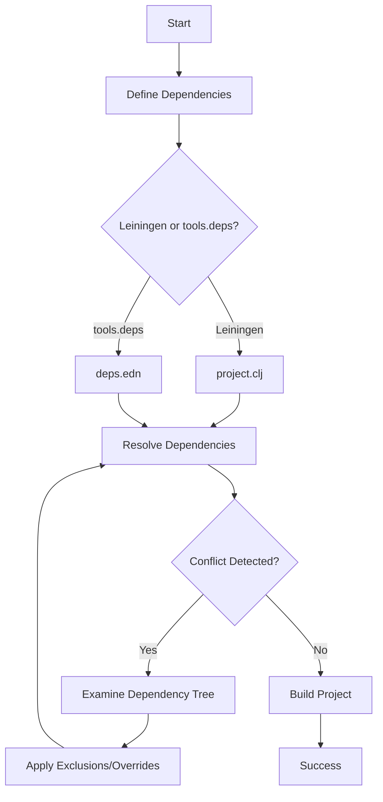

## 2.10.3 Dealing with Dependency Issues

As experienced Java developers transitioning to Clojure, understanding and managing dependencies is crucial for maintaining a smooth development workflow. In this section, we will explore common dependency issues you might encounter in Clojure, such as missing dependencies and conflicting library versions, and provide strategies for resolving these conflicts. We'll also draw parallels with Java's dependency management systems to help you leverage your existing knowledge.

### Understanding Dependency Management in Clojure

Clojure's dependency management is primarily handled through two tools: **Leiningen** and **tools.deps**. Both tools allow you to specify the libraries your project depends on, but they have different approaches and configurations.

#### Leiningen

Leiningen is a build automation tool for Clojure, similar to Maven in the Java ecosystem. It uses a `project.clj` file to manage dependencies.

Example `project.clj`:

```clojure
(defproject my-clojure-project "0.1.0-SNAPSHOT"
  :dependencies [[org.clojure/clojure "1.10.3"]
                 [cheshire "5.10.0"]])
```

- **Dependencies** are listed under the `:dependencies` key.
- Each dependency is specified by its group ID, artifact ID, and version.

#### tools.deps

tools.deps is a more recent addition to the Clojure ecosystem, providing a simpler and more flexible way to manage dependencies using a `deps.edn` file.

Example `deps.edn`:

```clojure
{:deps {org.clojure/clojure {:mvn/version "1.10.3"}
        cheshire {:mvn/version "5.10.0"}}}
```

- Dependencies are specified in a map under the `:deps` key.
- The `:mvn/version` key indicates the version of the dependency.

### Common Dependency Issues

#### Missing Dependencies

A missing dependency occurs when a required library is not available in your project's classpath. This can happen if the dependency is not specified correctly or if there is a network issue preventing it from being downloaded.

**Resolution Strategies:**

1. **Verify Dependency Declaration:**
   - Double-check the dependency coordinates (group ID, artifact ID, version) in your `project.clj` or `deps.edn` file.
   - Ensure there are no typos or incorrect versions.

2. **Check Network Connectivity:**
   - Ensure your internet connection is stable.
   - Verify that the repository hosting the dependency is accessible.

3. **Force Dependency Resolution:**
   - In Leiningen, use the `lein deps` command to force a re-download of dependencies.
   - For tools.deps, use `clj -Sforce` to refresh the dependency cache.

4. **Local Repository Issues:**
   - Clear the local Maven repository cache (`~/.m2/repository`) if a dependency is corrupted or incomplete.

#### Conflicting Library Versions

Conflicting versions occur when different libraries require different versions of the same dependency, leading to version clashes.

**Resolution Strategies:**

1. **Examine Dependency Tree:**
   - Use `lein deps :tree` or `clj -Stree` to visualize the dependency tree and identify conflicts.

2. **Exclude Conflicting Dependencies:**
   - In Leiningen, use the `:exclusions` key to exclude specific transitive dependencies.
   - Example:
     ```clojure
     :dependencies [[cheshire "5.10.0" :exclusions [org.clojure/clojure]]]
     ```

3. **Override Dependency Versions:**
   - In tools.deps, use the `:override-deps` key to enforce a specific version.
   - Example:
     ```clojure
     :override-deps {org.clojure/clojure {:mvn/version "1.10.3"}}
     ```

4. **Use Dependency Aliases:**
   - Define aliases in `deps.edn` to manage different dependency sets for different environments or tasks.

### Comparing with Java's Dependency Management

Java developers are familiar with Maven and Gradle for dependency management. Let's compare these with Clojure's tools:

- **Maven vs. Leiningen:**
  - Both use XML/EDN files to declare dependencies.
  - Maven has a more rigid structure, while Leiningen is more flexible and Clojure-centric.

- **Gradle vs. tools.deps:**
  - Gradle uses Groovy/Kotlin DSLs, while tools.deps uses EDN for configuration.
  - tools.deps offers a more lightweight and straightforward approach, focusing on dependency resolution rather than build automation.

### Code Example: Resolving Dependency Conflicts

Let's see a practical example of resolving a dependency conflict using Leiningen.

Suppose you have the following `project.clj`:

```clojure
(defproject conflict-example "0.1.0-SNAPSHOT"
  :dependencies [[org.clojure/clojure "1.10.3"]
                 [ring/ring-core "1.8.2"]
                 [compojure "1.6.1"]])
```

If `ring-core` and `compojure` depend on different versions of a library, you might encounter a conflict.

**Step-by-Step Resolution:**

1. **Check Dependency Tree:**

   Run `lein deps :tree` to identify the conflicting versions.

2. **Exclude Conflicting Dependency:**

   Modify `project.clj` to exclude the conflicting version:

   ```clojure
   :dependencies [[org.clojure/clojure "1.10.3"]
                  [ring/ring-core "1.8.2" :exclusions [commons-codec]]
                  [compojure "1.6.1"]]
   ```

3. **Add Correct Version:**

   Add the correct version of the excluded dependency:

   ```clojure
   :dependencies [[org.clojure/clojure "1.10.3"]
                  [ring/ring-core "1.8.2" :exclusions [commons-codec]]
                  [compojure "1.6.1"]
                  [commons-codec "1.15"]]
   ```

### Try It Yourself

Experiment with the following:

- **Add a new dependency** to your `project.clj` or `deps.edn` and resolve any conflicts that arise.
- **Use `lein deps :tree` or `clj -Stree`** to explore the dependency tree and understand the relationships between libraries.
- **Create a scenario** where two libraries depend on different versions of the same library and resolve the conflict using exclusions or overrides.

### Visualizing Dependency Management

Below is a diagram illustrating the flow of dependency resolution in Clojure using Leiningen and tools.deps.



**Diagram Explanation:** This flowchart shows the process of defining dependencies, resolving them, and handling conflicts in Clojure projects.

### External Resources

- [Official Clojure Documentation](https://clojure.org/reference/deps_and_cli)
- [Leiningen Documentation](https://leiningen.org/)
- [tools.deps Guide](https://clojure.org/guides/deps_and_cli)

### Exercises

1. **Create a new Clojure project** using Leiningen and add dependencies that have known conflicts. Resolve these conflicts using the strategies discussed.
2. **Explore the dependency tree** of an existing project and identify any potential issues or optimizations.
3. **Experiment with tools.deps** by creating aliases for different environments and observe how dependencies change.

### Key Takeaways

- **Dependency management** in Clojure is handled by Leiningen and tools.deps, each offering unique features.
- **Common issues** include missing dependencies and conflicting versions, which can be resolved through careful examination and configuration.
- **Understanding the dependency tree** is crucial for identifying and resolving conflicts.
- **Comparing with Java's tools** can help leverage existing knowledge and ease the transition to Clojure.

By mastering these dependency management techniques, you'll ensure a smoother development experience and maintain robust, conflict-free Clojure projects.

---

## Quiz: Mastering Dependency Management in Clojure



### What is the primary file used by Leiningen to manage dependencies in a Clojure project?

- [x] project.clj
- [ ] deps.edn
- [ ] pom.xml
- [ ] build.gradle

> **Explanation:** Leiningen uses the `project.clj` file to manage dependencies, similar to Maven's `pom.xml`.

### Which tool is more recent in the Clojure ecosystem for managing dependencies?

- [ ] Leiningen
- [x] tools.deps
- [ ] Gradle
- [ ] Maven

> **Explanation:** tools.deps is a more recent addition to the Clojure ecosystem, providing a simpler way to manage dependencies.

### How can you force a re-download of dependencies in Leiningen?

- [x] lein deps
- [ ] lein clean
- [ ] lein run
- [ ] lein test

> **Explanation:** The `lein deps` command forces a re-download of dependencies in Leiningen.

### What command is used to visualize the dependency tree in tools.deps?

- [ ] lein deps :tree
- [x] clj -Stree
- [ ] clj -Sdeps
- [ ] clj -Sforce

> **Explanation:** The `clj -Stree` command is used to visualize the dependency tree in tools.deps.

### Which key in `deps.edn` is used to enforce a specific version of a dependency?

- [ ] :exclusions
- [x] :override-deps
- [ ] :mvn/version
- [ ] :dependencies

> **Explanation:** The `:override-deps` key in `deps.edn` is used to enforce a specific version of a dependency.

### What is a common cause of missing dependencies in Clojure projects?

- [x] Incorrect dependency coordinates
- [ ] Using the wrong editor
- [ ] Incorrect syntax in code
- [ ] Network issues

> **Explanation:** Incorrect dependency coordinates, such as typos in group ID or version, are a common cause of missing dependencies.

### How can you exclude a transitive dependency in Leiningen?

- [x] Use the :exclusions key
- [ ] Use the :override-deps key
- [ ] Use the :mvn/version key
- [ ] Use the :dependencies key

> **Explanation:** The `:exclusions` key in Leiningen is used to exclude specific transitive dependencies.

### What is the equivalent of Maven's `pom.xml` in a tools.deps project?

- [ ] project.clj
- [x] deps.edn
- [ ] build.gradle
- [ ] settings.xml

> **Explanation:** The `deps.edn` file is used in tools.deps projects, similar to Maven's `pom.xml`.

### True or False: tools.deps can manage build automation tasks like Leiningen.

- [ ] True
- [x] False

> **Explanation:** tools.deps focuses on dependency resolution and does not manage build automation tasks like Leiningen.

### Which command can be used to clear the local Maven repository cache?

- [x] Delete the ~/.m2/repository directory
- [ ] Run lein clean
- [ ] Run clj -Sforce
- [ ] Use the :override-deps key

> **Explanation:** Deleting the `~/.m2/repository` directory clears the local Maven repository cache.


