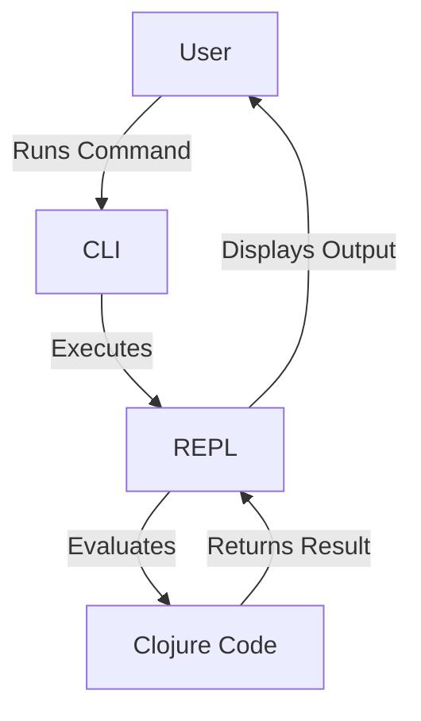

## 2.2.2 Installing Clojure on Windows

As an experienced Java developer, you're likely familiar with setting up development environments. Transitioning to Clojure involves a few different steps, but rest assured, it's a straightforward process. In this section, we'll guide you through installing Clojure on a Windows system, using both the official installer and the Chocolatey package manager. We'll also cover how to verify your installation to ensure everything is set up correctly.

### Why Clojure on Windows?

Before diving into the installation process, let's briefly discuss why you might choose to develop Clojure applications on Windows. Windows is a popular operating system for many developers due to its user-friendly interface and compatibility with a wide range of software. Clojure, being a JVM language, runs seamlessly on Windows, allowing you to leverage your existing Java knowledge while exploring functional programming paradigms.

### Installation Methods

There are two primary methods to install Clojure on Windows:

1. **Using the Official Windows Installer**: This method is straightforward and recommended for those who prefer a guided installation process.
2. **Using Chocolatey**: A package manager for Windows that simplifies the installation and management of software.

Let's explore each method in detail.

### Method 1: Installing Clojure Using the Official Windows Installer

The official Clojure installer for Windows provides a simple way to set up Clojure on your system. Follow these steps to get started:

#### Step 1: Download the Installer

1. Visit the [Clojure download page](https://clojure.org/guides/getting_started#windows).
2. Locate the Windows installer link and download the executable file.

#### Step 2: Run the Installer

1. Double-click the downloaded executable file to start the installation process.
2. Follow the on-screen instructions to complete the installation. The installer will set up the necessary environment variables and paths for you.

#### Step 3: Verify the Installation

To ensure that Clojure is installed correctly, open a command prompt and run the following command:

```shell
clj -h
```

or

```shell
clojure -h
```

If the installation was successful, you should see a help message displaying the available Clojure commands and options.

### Method 2: Installing Clojure Using Chocolatey

Chocolatey is a package manager for Windows that simplifies the installation of software. If you prefer using command-line tools, this method is for you.

#### Step 1: Install Chocolatey

If you haven't already installed Chocolatey, follow these steps:

1. Open a command prompt with administrative privileges.
2. Run the following command to install Chocolatey:

```shell
@"%SystemRoot%\System32\WindowsPowerShell\v1.0\powershell.exe" -NoProfile -InputFormat None -ExecutionPolicy Bypass -Command "iex ((New-Object System.Net.WebClient).DownloadString('https://chocolatey.org/install.ps1'))" && SET "PATH=%PATH%;%ALLUSERSPROFILE%\chocolatey\bin"
```

3. Close and reopen the command prompt to refresh the environment variables.

#### Step 2: Install Clojure

With Chocolatey installed, you can now install Clojure by running the following command:

```shell
choco install clojure
```

Chocolatey will handle the download and installation process for you.

#### Step 3: Verify the Installation

As with the official installer, verify your installation by running:

```shell
clj -h
```

or

```shell
clojure -h
```

You should see the Clojure help message, confirming that the installation was successful.

### Understanding the Clojure CLI

The Clojure CLI (`clj` or `clojure`) is a powerful tool that allows you to run Clojure code, manage dependencies, and interact with the REPL (Read-Eval-Print Loop). Let's explore some basic commands to familiarize ourselves with the CLI.

#### Running a Clojure Script

Create a simple Clojure script file named `hello.clj` with the following content:

```clojure
;; hello.clj
(println "Hello, Clojure!")
```

To run this script, use the following command:

```shell
clj hello.clj
```

You should see the output:

```
Hello, Clojure!
```

#### Starting the REPL

The REPL is an interactive environment where you can evaluate Clojure expressions and test your code. To start the REPL, simply run:

```shell
clj
```

Once in the REPL, you can enter Clojure expressions and see the results immediately. For example:

```clojure
;; Calculate the sum of two numbers
(+ 2 3)
```

This will output `5`.

### Comparing with Java

In Java, setting up a development environment typically involves installing the JDK and configuring environment variables. Clojure's installation process is similar but includes additional tools like the CLI and REPL, which enhance the development experience by providing interactive coding capabilities.

#### Java Code Example

Here's a simple Java program that prints "Hello, Java!":

```java
// HelloJava.java
public class HelloJava {
    public static void main(String[] args) {
        System.out.println("Hello, Java!");
    }
}
```

To run this program, you would compile it with `javac` and then execute it with `java`, which involves multiple steps compared to Clojure's single command execution.

### Try It Yourself

To deepen your understanding, try modifying the `hello.clj` script to perform different tasks, such as:

- Calculating the factorial of a number.
- Printing the Fibonacci sequence up to a certain number.
- Implementing a simple function to reverse a string.

### Diagrams and Visual Aids

To better understand the flow of data and execution in Clojure, let's look at a diagram illustrating the interaction between the CLI, REPL, and your code.



**Diagram 1**: This flowchart illustrates how the Clojure CLI interacts with the REPL and your code, providing an interactive development experience.

### Additional Resources

For more information on Clojure and its installation, consider exploring the following resources:

- [Official Clojure Documentation](https://clojure.org/)
- [ClojureDocs](https://clojuredocs.org/)
- [Clojure GitHub Repository](https://github.com/clojure/clojure)

### Exercises

1. **Modify the Script**: Change the `hello.clj` script to print a personalized greeting.
2. **Explore the REPL**: Use the REPL to perform basic arithmetic operations and string manipulations.
3. **Install a Library**: Use the Clojure CLI to add a dependency to your project and explore its functionality.

### Summary and Key Takeaways

- **Installation Methods**: We explored two methods for installing Clojure on Windows: the official installer and Chocolatey.
- **Verification**: Ensured the installation was successful by running `clj -h` or `clojure -h`.
- **Clojure CLI and REPL**: Introduced the CLI and REPL, highlighting their roles in the development process.
- **Comparison with Java**: Compared the simplicity of running Clojure scripts with Java's compilation and execution process.

By following these steps, you've successfully set up Clojure on your Windows system. Now, you're ready to dive deeper into functional programming and explore the powerful features Clojure has to offer.

## Quiz: Mastering Clojure Installation on Windows



### What is the recommended method for installing Clojure on Windows for beginners?

- [x] Using the official Windows installer
- [ ] Compiling from source
- [ ] Using a virtual machine
- [ ] Installing via Docker

> **Explanation:** The official Windows installer provides a straightforward and guided installation process, making it ideal for beginners.

### Which command is used to verify the Clojure installation?

- [x] `clj -h`
- [ ] `java -version`
- [ ] `clojure -version`
- [ ] `clj --verify`

> **Explanation:** Running `clj -h` or `clojure -h` displays the help message, confirming that Clojure is installed correctly.

### What is Chocolatey?

- [x] A package manager for Windows
- [ ] A Clojure library
- [ ] A Java IDE
- [ ] A type of chocolate

> **Explanation:** Chocolatey is a package manager for Windows that simplifies the installation and management of software.

### How do you start the Clojure REPL?

- [x] By running `clj` in the command prompt
- [ ] By opening a Java IDE
- [ ] By executing a `.jar` file
- [ ] By using a web browser

> **Explanation:** Running `clj` in the command prompt starts the Clojure REPL, an interactive environment for evaluating Clojure expressions.

### What is the purpose of the Clojure CLI?

- [x] To run Clojure code and manage dependencies
- [ ] To compile Java code
- [ ] To create graphical user interfaces
- [ ] To manage databases

> **Explanation:** The Clojure CLI is used to run Clojure code, manage dependencies, and interact with the REPL.

### Which of the following is a benefit of using the REPL?

- [x] Immediate feedback on code execution
- [ ] Automatic code compilation
- [ ] Built-in graphical interface
- [ ] Direct access to Java bytecode

> **Explanation:** The REPL provides immediate feedback on code execution, allowing developers to test and iterate quickly.

### What is the primary advantage of using Chocolatey for installation?

- [x] Simplifies the installation process with command-line tools
- [ ] Provides a graphical user interface
- [ ] Offers automatic updates for all software
- [ ] Ensures compatibility with all operating systems

> **Explanation:** Chocolatey simplifies the installation process by allowing users to install software using command-line tools.

### How can you modify the `hello.clj` script to print a different message?

- [x] Change the string inside the `println` function
- [ ] Add a new `System.out.println` statement
- [ ] Modify the Java classpath
- [ ] Use a different programming language

> **Explanation:** Changing the string inside the `println` function will modify the message printed by the script.

### What is the output of the following Clojure expression: `(+ 2 3)`?

- [x] 5
- [ ] 23
- [ ] `2 + 3`
- [ ] An error message

> **Explanation:** The expression `(+ 2 3)` evaluates to `5` in Clojure, as it performs addition.

### True or False: Clojure can only be installed on Windows using the official installer.

- [ ] True
- [x] False

> **Explanation:** Clojure can be installed on Windows using multiple methods, including the official installer and Chocolatey.


