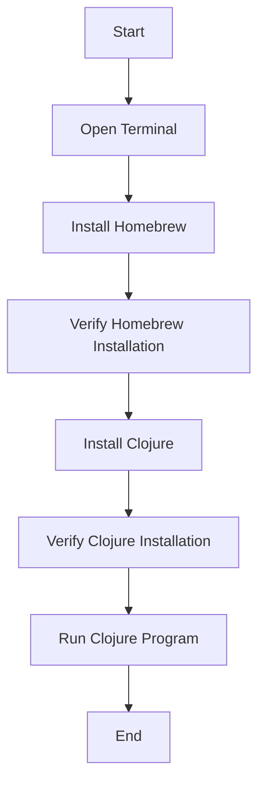

## 2.2.3 Installing Clojure on macOS

Welcome to the world of Clojure, a dynamic, functional programming language that runs on the Java Virtual Machine (JVM). As an experienced Java developer, you're about to embark on a journey that will expand your programming paradigm and enhance your ability to write concise, expressive code. In this section, we'll guide you through the process of installing Clojure on macOS, leveraging your existing knowledge of Java to make the transition as smooth as possible.

### Why Clojure?

Before diving into the installation process, let's briefly discuss why Clojure is a valuable addition to your programming toolkit. Clojure offers several advantages over traditional Java programming:

- **Immutability by Default**: Clojure's data structures are immutable, which simplifies reasoning about code and enhances concurrency.
- **Conciseness and Expressiveness**: Clojure's syntax is minimalistic, allowing you to express complex ideas with fewer lines of code.
- **Interoperability with Java**: Clojure runs on the JVM, enabling seamless integration with existing Java libraries and frameworks.

### Prerequisites

To install Clojure on macOS, you'll need to have a few prerequisites in place:

1. **macOS System**: Ensure your macOS version is up-to-date.
2. **Terminal Access**: Familiarity with using the terminal is essential for executing commands.
3. **Homebrew**: A package manager for macOS that simplifies the installation of software.

### Step 1: Installing Homebrew

If you haven't already installed Homebrew, follow these steps:

1. **Open Terminal**: You can find Terminal in the Applications > Utilities folder or by searching for it using Spotlight (Cmd + Space).

2. **Install Homebrew**: Run the following command in the terminal to install Homebrew:

   ```bash
   /bin/bash -c "$(curl -fsSL https://raw.githubusercontent.com/Homebrew/install/HEAD/install.sh)"
   ```

   This command downloads and executes the Homebrew installation script. Follow the on-screen instructions to complete the installation.

3. **Verify Homebrew Installation**: Once installed, verify that Homebrew is working correctly by running:

   ```bash
   brew --version
   ```

   You should see the version number of Homebrew, confirming that it's installed successfully.

### Step 2: Installing Clojure

With Homebrew installed, you can now proceed to install Clojure:

1. **Install Clojure**: Use the following command to install Clojure via Homebrew:

   ```bash
   brew install clojure/tools/clojure
   ```

   This command installs the latest version of Clojure along with its dependencies.

2. **Verify Clojure Installation**: After the installation completes, verify that Clojure is installed by running:

   ```bash
   clj -h
   ```

   or

   ```bash
   clojure -h
   ```

   You should see a list of available commands and options, indicating that Clojure is ready to use.

### Understanding the Installation Process

Let's break down what happens during the installation process:

- **Homebrew**: Acts as a package manager, simplifying the installation and management of software on macOS. It automates the download and setup of Clojure, ensuring that all necessary dependencies are installed.

- **Clojure CLI**: The command-line interface (CLI) for Clojure, which provides tools for running Clojure code, managing dependencies, and interacting with the Clojure ecosystem.

### Comparing with Java Installation

As a Java developer, you're likely familiar with installing the Java Development Kit (JDK) and setting up environment variables. Installing Clojure is similar in that it involves using a package manager (Homebrew) to automate the process. However, Clojure's installation is generally more straightforward, as it doesn't require manual configuration of environment variables.

### Code Example: Running a Simple Clojure Program

Now that Clojure is installed, let's run a simple Clojure program to ensure everything is working correctly. Open your terminal and create a new file named `hello.clj`:

```clojure
;; hello.clj
(ns hello-world)

(defn -main []
  (println "Hello, World!"))
```

To run this program, use the following command:

```bash
clj -M -m hello-world
```

**Explanation**:

- **`ns`**: Defines a namespace, similar to a package in Java.
- **`defn`**: Defines a function, akin to a method in Java.
- **`-main`**: The entry point of the program, similar to the `main` method in Java.
- **`println`**: Prints a message to the console, equivalent to `System.out.println` in Java.

### Try It Yourself

Experiment with modifying the `hello.clj` program:

- Change the message printed by `println`.
- Add a new function that performs a simple calculation and prints the result.
- Explore how namespaces work by creating additional files and requiring them in `hello.clj`.

### Diagram: Clojure Installation Process

Below is a diagram illustrating the flow of the Clojure installation process on macOS:



**Diagram Description**: This flowchart outlines the steps involved in installing Clojure on macOS, from opening the terminal to running a simple Clojure program.

### Key Takeaways

- **Homebrew** simplifies the installation of Clojure on macOS, automating the download and setup process.
- **Clojure CLI** provides a powerful interface for running Clojure code and managing dependencies.
- **Interoperability** with Java allows you to leverage existing Java libraries and frameworks within Clojure applications.

### Further Reading

For more information on Clojure and its installation, consider exploring the following resources:

- [Official Clojure Documentation](https://clojure.org/)
- [ClojureDocs](https://clojuredocs.org/)
- [Homebrew Documentation](https://brew.sh/)

### Exercises

1. **Install Clojure**: Follow the steps outlined in this guide to install Clojure on your macOS system.
2. **Run a Clojure Program**: Create and run a simple Clojure program, experimenting with different functions and namespaces.
3. **Explore Homebrew**: Use Homebrew to install additional software packages, familiarizing yourself with its capabilities.

### Summary

In this section, we've covered the process of installing Clojure on macOS using Homebrew. By leveraging your existing knowledge of Java, you can seamlessly transition to Clojure and begin exploring its powerful features. As you continue your journey, remember to experiment with code examples and explore the rich ecosystem of Clojure libraries and tools.

## Quiz: Mastering Clojure Installation on macOS



### What is the primary package manager used for installing Clojure on macOS?

- [x] Homebrew
- [ ] MacPorts
- [ ] npm
- [ ] apt-get

> **Explanation:** Homebrew is the recommended package manager for installing Clojure on macOS, providing a simple and efficient way to manage software installations.

### Which command is used to install Clojure using Homebrew?

- [x] `brew install clojure/tools/clojure`
- [ ] `brew install clojure`
- [ ] `brew install clojure-cli`
- [ ] `brew install clojure-lang`

> **Explanation:** The correct command is `brew install clojure/tools/clojure`, which installs the latest version of Clojure along with its dependencies.

### How can you verify that Clojure is installed correctly on macOS?

- [x] Run `clj -h` or `clojure -h` in the terminal
- [ ] Check the Applications folder
- [ ] Use the `java -version` command
- [ ] Open System Preferences

> **Explanation:** Running `clj -h` or `clojure -h` in the terminal displays the available commands and options, confirming that Clojure is installed correctly.

### What is the equivalent of Java's `System.out.println` in Clojure?

- [x] `println`
- [ ] `print`
- [ ] `console.log`
- [ ] `echo`

> **Explanation:** In Clojure, `println` is used to print messages to the console, similar to Java's `System.out.println`.

### Which of the following is a benefit of using Clojure over Java?

- [x] Immutability by default
- [x] Conciseness and expressiveness
- [ ] Strong typing
- [ ] Built-in GUI libraries

> **Explanation:** Clojure offers immutability by default and a concise syntax, enhancing code expressiveness and reducing complexity.

### What is the purpose of the `ns` keyword in Clojure?

- [x] Define a namespace
- [ ] Import a library
- [ ] Declare a variable
- [ ] Create a class

> **Explanation:** The `ns` keyword is used to define a namespace in Clojure, similar to a package in Java.

### Which command is used to verify the Homebrew installation?

- [x] `brew --version`
- [ ] `brew check`
- [ ] `brew verify`
- [ ] `brew status`

> **Explanation:** Running `brew --version` in the terminal displays the version number of Homebrew, confirming its installation.

### What is the entry point of a Clojure program, similar to Java's `main` method?

- [x] `-main`
- [ ] `main`
- [ ] `start`
- [ ] `entry`

> **Explanation:** In Clojure, the `-main` function serves as the entry point of the program, similar to the `main` method in Java.

### True or False: Clojure can seamlessly integrate with existing Java libraries.

- [x] True
- [ ] False

> **Explanation:** Clojure runs on the JVM, allowing seamless integration with existing Java libraries and frameworks.

### Which command is used to open the terminal on macOS?

- [x] Cmd + Space, then type "Terminal"
- [ ] Ctrl + Alt + T
- [ ] Cmd + T
- [ ] Alt + F2

> **Explanation:** On macOS, you can open the terminal by pressing Cmd + Space to open Spotlight, then typing "Terminal" and pressing Enter.


