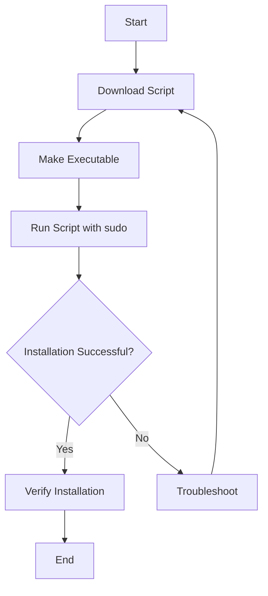

## 2.2.4 Installing Clojure on Linux

As an experienced Java developer, transitioning to Clojure on a Linux platform can be a rewarding journey. This guide will walk you through the installation process, leveraging your existing knowledge of Java and Linux systems. We'll explore using the official installation script, package managers, and verification steps to ensure a smooth setup.

### Understanding the Installation Process

Before diving into the installation, it's essential to understand the components involved in setting up Clojure. Clojure runs on the Java Virtual Machine (JVM), making it a natural fit for Java developers. The installation process involves setting up the Clojure command-line tools, which include the `clj` and `clojure` commands. These tools are essential for running Clojure code and interacting with the Read-Eval-Print Loop (REPL).

### Using the Official Installation Script

The Clojure website provides an official installation script that simplifies the setup process on Linux. This method is straightforward and ensures you have the latest stable version of Clojure.

#### Step-by-Step Installation

1. **Download the Installation Script**

   Open your terminal and execute the following command to download the installation script:

   ```bash
   curl -O https://download.clojure.org/install/linux-install-1.10.3.1020.sh
   ```

   This command uses `curl` to download the script from the official Clojure website. The `-O` option saves the file with its original name.

2. **Make the Script Executable**

   Change the file permissions to make the script executable:

   ```bash
   chmod +x linux-install-1.10.3.1020.sh
   ```

   This command uses `chmod` to add execute permissions to the script, allowing you to run it.

3. **Run the Installation Script**

   Execute the script with superuser privileges to install Clojure:

   ```bash
   sudo ./linux-install-1.10.3.1020.sh
   ```

   The `sudo` command elevates your permissions, enabling the script to install Clojure system-wide.

#### Verifying the Installation

After the installation, verify that Clojure is correctly installed by running:

```bash
clj -h
```

or

```bash
clojure -h
```

These commands should display help information for the Clojure CLI tools, confirming a successful installation.

### Using Package Managers

Linux distributions often come with package managers that simplify software installation. Depending on your distribution, you can use `apt`, `yum`, or other package managers to install Clojure.

#### Installing on Debian/Ubuntu with `apt`

1. **Update Package Lists**

   Ensure your package lists are up-to-date:

   ```bash
   sudo apt update
   ```

2. **Install Clojure**

   Use `apt` to install Clojure:

   ```bash
   sudo apt install clojure
   ```

   This command installs Clojure and its dependencies from the official repositories.

#### Installing on Fedora with `dnf`

1. **Update Package Lists**

   Refresh your package lists:

   ```bash
   sudo dnf check-update
   ```

2. **Install Clojure**

   Use `dnf` to install Clojure:

   ```bash
   sudo dnf install clojure
   ```

   This command installs Clojure using Fedora's package manager.

### Comparing Installation Methods

| Method                  | Pros                                       | Cons                                      |
|-------------------------|--------------------------------------------|-------------------------------------------|
| Official Script         | Latest version, easy setup                 | Requires manual download and execution    |
| Package Manager (`apt`) | Integrated with system updates, easy to use | May not have the latest version           |
| Package Manager (`dnf`) | Integrated with system updates, easy to use | May not have the latest version           |

### Try It Yourself

To deepen your understanding, try modifying the installation script to install a specific version of Clojure. Explore the script's contents to see how it manages dependencies and environment variables.

### Visualizing the Installation Process

Below is a flowchart illustrating the installation process using the official script:



**Caption**: Flowchart depicting the steps involved in installing Clojure on Linux using the official script.

### Further Reading

For more detailed information on Clojure installation and configuration, visit the [Official Clojure Documentation](https://clojure.org/guides/getting_started#_linux) and [ClojureDocs](https://clojuredocs.org/).

### Exercises

1. **Script Exploration**: Open the installation script in a text editor and identify the steps it performs. What environment variables does it set?
2. **Package Manager Comparison**: Compare the versions of Clojure available through `apt` and the official script. Which one is newer?
3. **Custom Installation**: Try installing Clojure in a custom directory by modifying the script. How does this affect your PATH settings?

### Key Takeaways

- **Installation Methods**: You can install Clojure on Linux using the official script or package managers like `apt` and `dnf`.
- **Verification**: Always verify your installation with `clj -h` or `clojure -h` to ensure everything is set up correctly.
- **Customization**: The installation script can be customized for specific needs, such as installing in a different directory.

By following these steps, you can set up a robust Clojure development environment on Linux, leveraging your Java expertise to explore the world of functional programming.

## Quiz: Mastering Clojure Installation on Linux



### What is the primary purpose of the Clojure installation script on Linux?

- [x] To simplify the installation process by automating the setup of Clojure and its dependencies.
- [ ] To provide a graphical user interface for Clojure installation.
- [ ] To install additional Java libraries required for Clojure.
- [ ] To configure the Linux kernel for Clojure compatibility.

> **Explanation:** The installation script automates the setup process, ensuring that Clojure and its dependencies are correctly installed.

### Which command is used to make the Clojure installation script executable?

- [x] `chmod +x linux-install-1.10.3.1020.sh`
- [ ] `chmod -r linux-install-1.10.3.1020.sh`
- [ ] `chmod 777 linux-install-1.10.3.1020.sh`
- [ ] `chmod 644 linux-install-1.10.3.1020.sh`

> **Explanation:** The `chmod +x` command adds execute permissions to the script, allowing it to be run.

### How can you verify that Clojure is installed correctly on your system?

- [x] By running `clj -h` or `clojure -h` and checking for help information.
- [ ] By opening a Clojure IDE and running a sample program.
- [ ] By checking the system logs for installation messages.
- [ ] By verifying the presence of Clojure files in the `/usr/local/bin` directory.

> **Explanation:** Running `clj -h` or `clojure -h` should display help information, confirming that the installation was successful.

### What is a potential disadvantage of using package managers like `apt` for installing Clojure?

- [x] They may not provide the latest version of Clojure.
- [ ] They require manual configuration of environment variables.
- [ ] They are only available on specific Linux distributions.
- [ ] They do not install dependencies automatically.

> **Explanation:** Package managers may not always have the latest version of Clojure, as they rely on repository updates.

### Which command is used to install Clojure on Fedora using `dnf`?

- [x] `sudo dnf install clojure`
- [ ] `sudo apt install clojure`
- [ ] `sudo yum install clojure`
- [ ] `sudo pacman -S clojure`

> **Explanation:** The `dnf` package manager is used on Fedora to install software, including Clojure.

### What is the role of the `sudo` command in the installation process?

- [x] It grants superuser privileges to execute the installation script.
- [ ] It verifies the integrity of the installation script.
- [ ] It downloads the necessary dependencies for Clojure.
- [ ] It configures the system environment variables.

> **Explanation:** `sudo` elevates permissions, allowing the script to make system-wide changes during installation.

### What is the advantage of using the official Clojure installation script over package managers?

- [x] It ensures the installation of the latest stable version of Clojure.
- [ ] It provides a graphical interface for installation.
- [ ] It automatically configures all development tools.
- [ ] It integrates with all Linux distributions seamlessly.

> **Explanation:** The official script is maintained by the Clojure team and provides the latest stable version directly from the source.

### Which of the following is a step in the official Clojure installation process on Linux?

- [x] Downloading the installation script using `curl`.
- [ ] Compiling Clojure from source code.
- [ ] Installing a Clojure IDE.
- [ ] Configuring the Linux kernel for Clojure.

> **Explanation:** The installation process involves downloading the script using `curl`, making it executable, and running it.

### What is the purpose of the `clj` command in Clojure?

- [x] It is used to run Clojure code and interact with the REPL.
- [ ] It compiles Java code to be used with Clojure.
- [ ] It manages Clojure project dependencies.
- [ ] It configures the Clojure environment variables.

> **Explanation:** The `clj` command is a tool for running Clojure code and interacting with the REPL.

### True or False: The installation script for Clojure on Linux can be customized to install in a specific directory.

- [x] True
- [ ] False

> **Explanation:** The script can be modified to change the installation directory, allowing for customization based on user needs.


