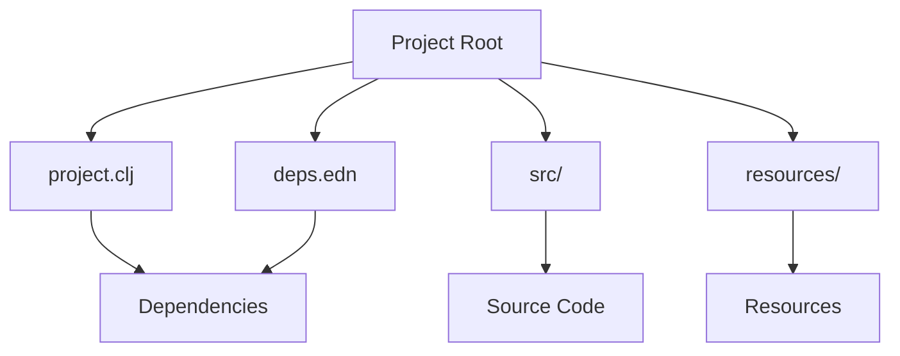

## 2.2.5 Understanding Leiningen and Tools.deps

As experienced Java developers, you're likely familiar with build tools like Maven and Gradle. In the Clojure ecosystem, **Leiningen** and **tools.deps** serve similar purposes, facilitating project management and dependency handling. This section will delve into these tools, highlighting their features, differences, and how to choose the right one for your projects.

### Introduction to Leiningen

**Leiningen** is a build automation and project management tool for Clojure, akin to Maven in the Java world. It provides a comprehensive suite of features, including dependency management, project scaffolding, and task automation.

#### Key Features of Leiningen

- **Dependency Management**: Leiningen uses a `project.clj` file to specify dependencies, similar to Maven's `pom.xml`.
- **Project Templates**: Quickly scaffold new projects with predefined templates.
- **Task Automation**: Automate repetitive tasks with custom scripts.
- **Plugin Ecosystem**: Extend functionality with a wide range of plugins.

#### Leiningen Project Structure

A typical Leiningen project includes:

- `project.clj`: Defines project metadata, dependencies, and build configurations.
- `src/`: Contains source code.
- `test/`: Houses test files.
- `resources/`: Stores non-code resources like configuration files.

Here's a simple `project.clj` example:

```clojure
(defproject my-clojure-app "0.1.0-SNAPSHOT"
  :description "A sample Clojure application"
  :url "http://example.com/my-clojure-app"
  :license {:name "Eclipse Public License"
            :url "http://www.eclipse.org/legal/epl-v10.html"}
  :dependencies [[org.clojure/clojure "1.10.3"]]
  :main ^:skip-aot my-clojure-app.core
  :target-path "target/%s"
  :profiles {:uberjar {:aot :all}})
```

**Try It Yourself**: Modify the `:dependencies` vector to include additional libraries, such as `ring` for web applications.

### Introduction to tools.deps

**tools.deps** is a more recent addition to the Clojure ecosystem, focusing on dependency management with a simpler approach. It uses a `deps.edn` file to specify dependencies and is part of the Clojure CLI tools.

#### Key Features of tools.deps

- **Simplicity**: Focuses solely on dependency management without the additional features of a full build tool.
- **Flexibility**: Allows for more flexible dependency resolution and version management.
- **Integration with Clojure CLI**: Seamlessly integrates with the Clojure command-line tools.

#### tools.deps Project Structure

A typical tools.deps project includes:

- `deps.edn`: Defines dependencies and paths.
- `src/`: Contains source code.
- `resources/`: Stores non-code resources.

Here's a simple `deps.edn` example:

```clojure
{:deps {org.clojure/clojure {:mvn/version "1.10.3"}
        ring/ring-core {:mvn/version "1.9.0"}}
 :paths ["src" "resources"]}
```

**Try It Yourself**: Add a new dependency to the `:deps` map, such as `compojure` for routing in web applications.

### Comparing Leiningen and tools.deps

Both Leiningen and tools.deps are powerful tools, but they serve slightly different purposes. Here's a comparison to help you decide which tool to use:

| Feature               | Leiningen                                      | tools.deps                                  |
|-----------------------|------------------------------------------------|---------------------------------------------|
| **Focus**             | Comprehensive build automation                 | Dependency management                       |
| **Configuration**     | `project.clj`                                  | `deps.edn`                                  |
| **Plugins**           | Extensive plugin ecosystem                     | Limited, relies on CLI tools                |
| **Project Templates** | Yes                                            | No                                          |
| **Task Automation**   | Built-in task automation                       | Requires external scripts                   |
| **Flexibility**       | More opinionated, structured                   | More flexible, less opinionated             |

### Choosing the Right Tool

The choice between Leiningen and tools.deps depends on your project's needs and your personal preferences:

- **Use Leiningen** if you need a comprehensive build tool with task automation and a rich plugin ecosystem.
- **Use tools.deps** if you prefer a lightweight, flexible approach focused on dependency management.

### Code Example: Building a Simple Application

Let's build a simple "Hello, World!" application using both tools to illustrate their usage.

#### Using Leiningen

1. **Create a new project**:
   ```bash
   lein new app hello-world
   ```

2. **Navigate to the project directory**:
   ```bash
   cd hello-world
   ```

3. **Edit `src/hello_world/core.clj`**:
   ```clojure
   (ns hello-world.core)

   (defn -main
     "I don't do a whole lot ... yet."
     [& args]
     (println "Hello, World!"))
   ```

4. **Run the application**:
   ```bash
   lein run
   ```

#### Using tools.deps

1. **Create a new directory**:
   ```bash
   mkdir hello-world
   cd hello-world
   ```

2. **Create a `deps.edn` file**:
   ```clojure
   {:deps {org.clojure/clojure {:mvn/version "1.10.3"}}}
   ```

3. **Create a `src/hello_world/core.clj` file**:
   ```clojure
   (ns hello-world.core)

   (defn -main
     [& args]
     (println "Hello, World!"))
   ```

4. **Run the application**:
   ```bash
   clj -M -m hello-world.core
   ```

**Try It Yourself**: Modify the `-main` function to accept command-line arguments and print them.

### Diagrams and Visualizations

To better understand the flow of data and dependencies in Clojure projects, let's look at a diagram illustrating the relationship between project files and their roles in both Leiningen and tools.deps.



**Diagram Caption**: This diagram shows the typical structure of a Clojure project using both Leiningen and tools.deps, highlighting the roles of `project.clj` and `deps.edn`.

### Further Reading and Resources

- [Leiningen Official Documentation](https://leiningen.org/)
- [Clojure CLI and tools.deps Guide](https://clojure.org/guides/deps_and_cli)
- [ClojureDocs](https://clojuredocs.org/)

### Exercises and Practice Problems

1. **Exercise**: Create a new Clojure project using both Leiningen and tools.deps. Compare the setup process and note any differences in configuration and execution.
2. **Challenge**: Extend the "Hello, World!" application to read a configuration file from the `resources/` directory and print its contents.
3. **Problem**: Integrate a third-party library for JSON processing, such as `cheshire`, into both a Leiningen and a tools.deps project. Compare the dependency management process.

### Key Takeaways

- **Leiningen** is a comprehensive build tool with a rich feature set, ideal for projects requiring extensive automation and plugin support.
- **tools.deps** offers a lightweight, flexible approach to dependency management, perfect for developers who prefer simplicity and integration with the Clojure CLI.
- Choosing between these tools depends on your project's requirements and your personal workflow preferences.

Now that we've explored the fundamentals of Leiningen and tools.deps, you're equipped to manage Clojure projects effectively. Let's continue to build on this foundation as we delve deeper into Clojure's unique features and capabilities.

## Quiz: Mastering Leiningen and tools.deps for Clojure Projects



### What is the primary focus of tools.deps in Clojure?

- [x] Dependency management
- [ ] Build automation
- [ ] Task automation
- [ ] Plugin management

> **Explanation:** tools.deps is primarily focused on managing dependencies in Clojure projects.

### Which file does Leiningen use to define project dependencies?

- [x] project.clj
- [ ] deps.edn
- [ ] build.gradle
- [ ] pom.xml

> **Explanation:** Leiningen uses the `project.clj` file to define project dependencies and configurations.

### What is a key advantage of using Leiningen over tools.deps?

- [x] Comprehensive build automation and plugin ecosystem
- [ ] Simplicity and lightweight configuration
- [ ] Integration with Clojure CLI
- [ ] Flexibility in dependency resolution

> **Explanation:** Leiningen offers comprehensive build automation and a rich plugin ecosystem, which is a key advantage over tools.deps.

### How does tools.deps specify dependencies?

- [x] Using a deps.edn file
- [ ] Using a project.clj file
- [ ] Using a build.gradle file
- [ ] Using a pom.xml file

> **Explanation:** tools.deps specifies dependencies using a `deps.edn` file.

### Which tool is more suitable for a project requiring extensive task automation?

- [x] Leiningen
- [ ] tools.deps
- [ ] Maven
- [ ] Gradle

> **Explanation:** Leiningen is more suitable for projects requiring extensive task automation due to its built-in task automation features.

### What is the main configuration file for a tools.deps project?

- [x] deps.edn
- [ ] project.clj
- [ ] build.gradle
- [ ] pom.xml

> **Explanation:** The main configuration file for a tools.deps project is `deps.edn`.

### Which tool integrates seamlessly with the Clojure CLI?

- [x] tools.deps
- [ ] Leiningen
- [ ] Maven
- [ ] Gradle

> **Explanation:** tools.deps integrates seamlessly with the Clojure CLI, providing a streamlined workflow for dependency management.

### What is a common feature of both Leiningen and tools.deps?

- [x] Dependency management
- [ ] Task automation
- [ ] Plugin ecosystem
- [ ] Project templates

> **Explanation:** Both Leiningen and tools.deps provide dependency management capabilities for Clojure projects.

### Which tool would you choose for a lightweight, dependency-focused project?

- [x] tools.deps
- [ ] Leiningen
- [ ] Maven
- [ ] Gradle

> **Explanation:** tools.deps is ideal for lightweight, dependency-focused projects due to its simplicity and focus on dependency management.

### True or False: Leiningen and tools.deps can be used together in the same project.

- [x] True
- [ ] False

> **Explanation:** While it's uncommon, Leiningen and tools.deps can be used together in the same project, leveraging the strengths of both tools.


