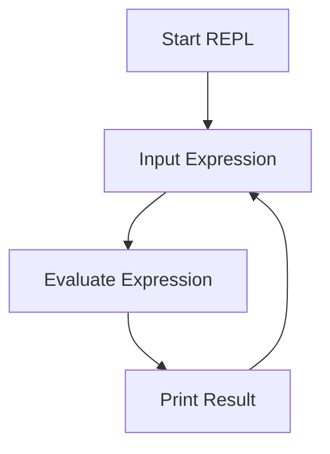

## 2.2.7 Verifying the Clojure Installation

As experienced Java developers transitioning to Clojure, ensuring that your development environment is correctly set up is crucial for a smooth workflow. In this section, we will guide you through verifying your Clojure installation, focusing on running the Clojure REPL and Leiningen REPL, and evaluating simple expressions to confirm that everything is functioning as expected.

### Introduction to the Clojure REPL

The **REPL** (Read-Eval-Print Loop) is a powerful tool in the Clojure ecosystem, allowing you to interactively evaluate expressions, test code snippets, and explore Clojure's capabilities. This interactive environment is akin to Java's `jshell`, introduced in Java 9, but with the added benefits of Clojure's functional programming paradigm.

#### Why Use the REPL?

- **Immediate Feedback**: Instantly see the results of your code, facilitating rapid experimentation and learning.
- **Interactive Development**: Modify and test parts of your application without restarting the entire program.
- **Debugging**: Quickly isolate and test problematic code segments.

### Running the Clojure REPL

To verify your Clojure installation, start by running the Clojure REPL using the `clj` command. This command initializes the Clojure environment and opens a REPL session.

#### Steps to Start the Clojure REPL

1. **Open Terminal or Command Prompt**: Depending on your operating system, open the terminal (macOS/Linux) or command prompt (Windows).

2. **Run the `clj` Command**: Type `clj` and press Enter.

   ```shell
   clj
   ```

3. **Observe the REPL Prompt**: You should see a prompt similar to `Clojure 1.x.x`, indicating that the REPL is ready for input.

4. **Evaluate a Simple Expression**: Test the REPL by evaluating a simple arithmetic expression, such as `(+ 1 2)`.

   ```clojure
   ;; Evaluating a simple arithmetic expression
   (+ 1 2)
   ```

   **Expected Output**: `3`

### Running the Leiningen REPL

Leiningen is a popular build automation tool for Clojure, similar to Maven or Gradle in the Java ecosystem. It simplifies project management and dependency handling. Verifying the Leiningen REPL ensures that Leiningen is correctly installed and configured.

#### Steps to Start the Leiningen REPL

1. **Open Terminal or Command Prompt**: As before, open your terminal or command prompt.

2. **Run the `lein repl` Command**: Type `lein repl` and press Enter.

   ```shell
   lein repl
   ```

3. **Observe the REPL Prompt**: You should see a prompt indicating that the Leiningen REPL is ready.

4. **Evaluate a Simple Expression**: Test the Leiningen REPL by evaluating the same arithmetic expression, `(+ 1 2)`.

   ```clojure
   ;; Evaluating a simple arithmetic expression in Leiningen REPL
   (+ 1 2)
   ```

   **Expected Output**: `3`

### Comparing Clojure REPL and Leiningen REPL

While both REPLs allow you to evaluate Clojure expressions, they serve different purposes:

- **Clojure REPL (`clj`)**: Ideal for quick experiments and learning Clojure syntax.
- **Leiningen REPL (`lein repl`)**: Integrated with your project, allowing you to test code in the context of your project's dependencies and configurations.

### Troubleshooting Common Issues

If you encounter issues starting the REPL or evaluating expressions, consider the following troubleshooting steps:

- **Check Java Installation**: Ensure that Java is correctly installed and configured, as Clojure runs on the JVM.
- **Verify Environment Variables**: Confirm that environment variables such as `JAVA_HOME` and `PATH` are set correctly.
- **Review Error Messages**: Carefully read any error messages for clues on what might be wrong.
- **Consult Documentation**: Refer to the [Official Clojure Documentation](https://clojure.org/guides/getting_started) for additional guidance.

### Try It Yourself

Encourage experimentation by modifying the code examples:

- **Change the Arithmetic Operation**: Try different operations, such as subtraction or multiplication.
  
  ```clojure
  ;; Subtracting numbers
  (- 5 3)
  ```

- **Define a Simple Function**: Create and test a simple function within the REPL.

  ```clojure
  ;; Defining a simple function
  (defn greet [name]
    (str "Hello, " name "!"))

  ;; Testing the function
  (greet "Clojure")
  ```

  **Expected Output**: `"Hello, Clojure!"`

### Visualizing the REPL Workflow

Below is a diagram illustrating the flow of data through the REPL as you evaluate expressions:



**Diagram Description**: This flowchart represents the cycle of reading an input expression, evaluating it, printing the result, and waiting for the next input in the REPL.

### Exercises

To reinforce your understanding, try the following exercises:

1. **Experiment with Data Structures**: Use the REPL to create and manipulate Clojure data structures such as lists, vectors, and maps.

   ```clojure
   ;; Creating a vector
   (def my-vector [1 2 3 4 5])

   ;; Accessing an element
   (nth my-vector 2)
   ```

2. **Explore Higher-Order Functions**: Write a simple higher-order function that takes another function as an argument.

   ```clojure
   ;; Defining a higher-order function
   (defn apply-twice [f x]
     (f (f x)))

   ;; Using the higher-order function
   (apply-twice inc 5)
   ```

   **Expected Output**: `7`

### Summary and Key Takeaways

- **Clojure REPL**: A powerful tool for interactive development, allowing you to test and debug code snippets quickly.
- **Leiningen REPL**: Provides project-specific context, integrating with your project's dependencies and configurations.
- **Troubleshooting**: Ensure Java is correctly installed, and environment variables are set up properly.
- **Experimentation**: Use the REPL to explore Clojure's syntax and features, enhancing your understanding through practice.

By verifying your Clojure installation and becoming comfortable with the REPL, you're well on your way to mastering Clojure's functional programming paradigm. Now, let's continue our journey by exploring more advanced Clojure features and concepts.

## Quiz: Verifying Your Clojure Installation



### What command is used to start the Clojure REPL?

- [x] clj
- [ ] lein
- [ ] repl
- [ ] java

> **Explanation:** The `clj` command is used to start the Clojure REPL.

### What is the primary purpose of the Leiningen REPL?

- [x] To test code in the context of a project
- [ ] To replace the Clojure REPL
- [ ] To compile Java code
- [ ] To manage Java dependencies

> **Explanation:** The Leiningen REPL is used to test code within the context of a project, utilizing its dependencies and configurations.

### Which of the following is a valid Clojure expression to evaluate in the REPL?

- [x] (+ 1 2)
- [ ] 1 + 2
- [ ] add(1, 2)
- [ ] sum(1, 2)

> **Explanation:** `(+ 1 2)` is the correct syntax for adding numbers in Clojure.

### What should you check if the REPL does not start?

- [x] Java installation and environment variables
- [ ] Internet connection
- [ ] Disk space
- [ ] Monitor resolution

> **Explanation:** Ensuring Java is installed and environment variables are set correctly is crucial for starting the REPL.

### How can you define a simple function in the Clojure REPL?

- [x] (defn greet [name] (str "Hello, " name "!"))
- [ ] function greet(name) { return "Hello, " + name + "!"; }
- [ ] def greet(name): return "Hello, " + name + "!"
- [ ] greet(name) => "Hello, " + name + "!"

> **Explanation:** The correct Clojure syntax for defining a function is `(defn greet [name] (str "Hello, " name "!"))`.

### What is the expected output of the expression `(+ 1 2)` in the REPL?

- [x] 3
- [ ] 12
- [ ] 1 + 2
- [ ] Error

> **Explanation:** The expression `(+ 1 2)` evaluates to `3` in Clojure.

### Which tool is similar to Leiningen in the Java ecosystem?

- [x] Maven
- [ ] JUnit
- [ ] Eclipse
- [ ] IntelliJ IDEA

> **Explanation:** Maven is a build automation tool in the Java ecosystem, similar to Leiningen for Clojure.

### What does the REPL prompt indicate?

- [x] The REPL is ready for input
- [ ] The REPL is compiling code
- [ ] The REPL is shutting down
- [ ] The REPL is installing dependencies

> **Explanation:** The REPL prompt indicates that it is ready to accept and evaluate input.

### What is the role of the REPL in Clojure development?

- [x] To provide an interactive environment for evaluating expressions
- [ ] To compile Clojure code into Java bytecode
- [ ] To manage version control
- [ ] To deploy applications

> **Explanation:** The REPL provides an interactive environment for evaluating expressions and testing code snippets.

### True or False: The Clojure REPL can be used for debugging code.

- [x] True
- [ ] False

> **Explanation:** The Clojure REPL is a valuable tool for debugging code by allowing developers to test and isolate problematic code segments interactively.


