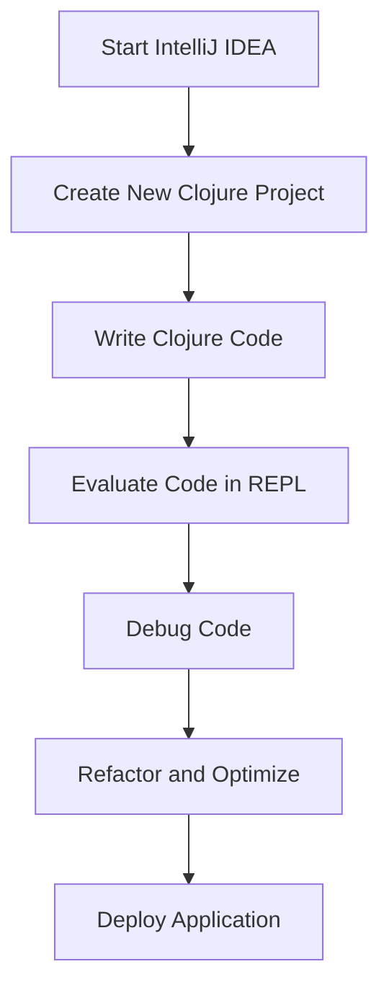

## 2.3.2 Installing and Configuring IntelliJ IDEA with Cursive

As experienced Java developers, you're likely familiar with IntelliJ IDEA, a powerful and versatile IDE that supports a wide range of programming languages, including Java. For Clojure development, IntelliJ IDEA becomes even more potent with the addition of the Cursive plugin. This guide will walk you through the process of setting up IntelliJ IDEA with Cursive, enabling you to leverage its features for efficient Clojure development.

### Downloading and Installing IntelliJ IDEA

Before we dive into Clojure-specific configurations, let's start by installing IntelliJ IDEA.

1. **Visit the JetBrains Website**: Navigate to [JetBrains IntelliJ IDEA](https://www.jetbrains.com/idea/) to download the IDE. You can choose between the Community Edition, which is free, and the Ultimate Edition, which offers additional features. For Clojure development, the Community Edition is sufficient.

2. **Download IntelliJ IDEA**: Click on the download button for your operating system (Windows, macOS, or Linux) and follow the installation instructions.

3. **Install IntelliJ IDEA**: Once downloaded, run the installer and follow the on-screen instructions. During installation, you can customize the installation directory and choose additional components like plugins for version control systems.

4. **Launch IntelliJ IDEA**: After installation, launch IntelliJ IDEA. You may be prompted to import settings from a previous installation or start fresh. Choose the option that best suits your needs.

### Installing the Cursive Plugin via the Plugins Marketplace

With IntelliJ IDEA installed, the next step is to add Clojure support through the Cursive plugin.

1. **Open IntelliJ IDEA**: Start IntelliJ IDEA and navigate to the main welcome screen.

2. **Access the Plugins Marketplace**: Click on "Plugins" in the left-hand menu to open the Plugins Marketplace.

3. **Search for Cursive**: In the search bar, type "Cursive" to find the plugin. Cursive is a popular plugin that provides comprehensive support for Clojure development.

4. **Install Cursive**: Click on the "Install" button next to the Cursive plugin. Once the installation is complete, restart IntelliJ IDEA to activate the plugin.

### Creating a New Clojure Project and Configuring the SDK and Build Tool

Now that IntelliJ IDEA is equipped with Cursive, let's create a new Clojure project and configure it for development.

1. **Start a New Project**: From the welcome screen, click on "New Project."

2. **Select Clojure**: In the "New Project" dialog, select "Clojure" from the list of available project types.

3. **Configure Project SDK**: Ensure that you have a Java SDK installed. If not, you can download and configure it within IntelliJ IDEA. The SDK is necessary for running Clojure projects since Clojure runs on the Java Virtual Machine (JVM).

4. **Choose a Build Tool**: You can choose between Leiningen and tools.deps for managing your Clojure project dependencies. Both are supported by Cursive, but Leiningen is more commonly used for its simplicity and ease of use.

5. **Set Project Location**: Specify the location where you want to save your project and click "Finish" to create the project.

### Exploring Features: Syntax Highlighting, Code Completion, REPL Integration, and Debugging

With your Clojure project set up, let's explore some of the powerful features that IntelliJ IDEA with Cursive offers.

#### Syntax Highlighting and Code Completion

Cursive provides robust syntax highlighting and code completion features that enhance the Clojure development experience.

- **Syntax Highlighting**: Cursive highlights Clojure syntax, making it easier to read and understand your code. Keywords, functions, and variables are color-coded for quick identification.

- **Code Completion**: As you type, Cursive offers suggestions for function names, variables, and keywords, helping you write code faster and with fewer errors.

#### REPL Integration

One of the standout features of Clojure is its interactive REPL (Read-Eval-Print Loop), and Cursive integrates seamlessly with it.

- **Starting the REPL**: You can start a REPL session directly from IntelliJ IDEA. Navigate to "Run" > "Run REPL" to launch the REPL.

- **Evaluating Code**: With the REPL running, you can evaluate Clojure expressions directly from your code editor. Highlight an expression and press `Ctrl+Enter` (or `Cmd+Enter` on macOS) to send it to the REPL for evaluation.

- **Interactive Development**: The REPL allows for interactive development, enabling you to test functions and debug code on the fly.

#### Debugging

Debugging Clojure code in IntelliJ IDEA is straightforward with Cursive's integrated debugging tools.

- **Set Breakpoints**: You can set breakpoints in your Clojure code by clicking in the gutter next to the line numbers.

- **Start Debugging**: Run your Clojure application in debug mode by selecting "Debug" from the run configurations.

- **Inspect Variables**: During a debugging session, you can inspect variables and evaluate expressions to understand the state of your application.

### Try It Yourself

To get hands-on experience, try creating a simple Clojure function and evaluate it in the REPL. Experiment with setting breakpoints and stepping through your code to see how the debugger works.

```clojure
;; Define a simple function to calculate the factorial of a number
(defn factorial [n]
  (if (<= n 1)
    1
    (* n (factorial (dec n)))))

;; Evaluate this function in the REPL
(factorial 5) ; => 120
```

### Diagram: Clojure Development Workflow in IntelliJ IDEA

Below is a diagram illustrating the typical workflow when developing Clojure applications using IntelliJ IDEA with Cursive.



*Diagram Caption*: This flowchart represents the iterative development process in IntelliJ IDEA with Cursive, highlighting key steps such as writing code, evaluating in the REPL, debugging, and deploying.

### Further Reading and Resources

For more information on using IntelliJ IDEA with Cursive, consider exploring the following resources:

- [Cursive Official Documentation](https://cursive-ide.com/userguide/)
- [IntelliJ IDEA Documentation](https://www.jetbrains.com/help/idea/discover-intellij-idea.html)
- [Clojure Official Website](https://clojure.org/)

### Exercises

1. **Create a New Project**: Set up a new Clojure project in IntelliJ IDEA and write a simple program that calculates the Fibonacci sequence.

2. **Explore REPL Features**: Use the REPL to test different functions and explore how changes in your code are reflected in real-time.

3. **Debugging Practice**: Introduce a bug in your code and use the debugger to identify and fix it.

### Key Takeaways

- IntelliJ IDEA with Cursive provides a powerful environment for Clojure development, offering features like syntax highlighting, code completion, REPL integration, and debugging.
- The Cursive plugin enhances IntelliJ IDEA with comprehensive support for Clojure, making it easier to write, test, and debug Clojure code.
- By leveraging IntelliJ IDEA's features, you can streamline your Clojure development workflow and improve productivity.

Now that you've set up IntelliJ IDEA with Cursive, you're ready to dive deeper into Clojure development and explore the language's unique features and capabilities.

## Quiz: Mastering IntelliJ IDEA with Cursive for Clojure Development



### What is the primary purpose of the Cursive plugin in IntelliJ IDEA?

- [x] To provide comprehensive support for Clojure development
- [ ] To enhance Java development features
- [ ] To integrate with Python projects
- [ ] To manage database connections

> **Explanation:** The Cursive plugin is specifically designed to support Clojure development in IntelliJ IDEA, offering features like syntax highlighting, code completion, and REPL integration.

### Which edition of IntelliJ IDEA is sufficient for Clojure development with Cursive?

- [x] Community Edition
- [ ] Ultimate Edition
- [ ] Enterprise Edition
- [ ] Professional Edition

> **Explanation:** The Community Edition of IntelliJ IDEA is free and provides all the necessary features for Clojure development with the Cursive plugin.

### How can you evaluate a Clojure expression in the REPL using IntelliJ IDEA?

- [x] Highlight the expression and press `Ctrl+Enter` (or `Cmd+Enter` on macOS)
- [ ] Right-click the expression and select "Evaluate"
- [ ] Use the "Run" menu to evaluate
- [ ] Press `Alt+F4`

> **Explanation:** Highlighting the expression and pressing `Ctrl+Enter` (or `Cmd+Enter` on macOS) sends the expression to the REPL for evaluation.

### What is the role of the REPL in Clojure development?

- [x] To allow interactive development and testing of code
- [ ] To compile Clojure code into Java bytecode
- [ ] To manage project dependencies
- [ ] To deploy applications to production

> **Explanation:** The REPL (Read-Eval-Print Loop) is used for interactive development, allowing developers to test and debug code in real-time.

### Which feature of IntelliJ IDEA with Cursive helps in identifying errors in Clojure code?

- [x] Syntax Highlighting
- [ ] Project Explorer
- [ ] Version Control
- [ ] Terminal

> **Explanation:** Syntax highlighting helps in identifying errors by color-coding different elements of the code, making it easier to spot mistakes.

### What is the first step in setting up a new Clojure project in IntelliJ IDEA?

- [x] Click on "New Project" from the welcome screen
- [ ] Install the Java SDK
- [ ] Configure the build tool
- [ ] Set up version control

> **Explanation:** The first step is to click on "New Project" from the welcome screen to start the project setup process.

### Which build tool is commonly used for managing Clojure project dependencies?

- [x] Leiningen
- [ ] Maven
- [ ] Gradle
- [ ] Ant

> **Explanation:** Leiningen is a popular build tool for Clojure projects, known for its simplicity and ease of use.

### How do you start a debugging session in IntelliJ IDEA with Cursive?

- [x] Select "Debug" from the run configurations
- [ ] Press `F5`
- [ ] Use the "Tools" menu
- [ ] Click on "Start Debugging" in the toolbar

> **Explanation:** To start a debugging session, you select "Debug" from the run configurations in IntelliJ IDEA.

### What is the purpose of setting breakpoints in Clojure code?

- [x] To pause execution and inspect variables during debugging
- [ ] To improve code performance
- [ ] To compile the code
- [ ] To deploy the application

> **Explanation:** Breakpoints are used to pause execution at specific points in the code, allowing developers to inspect variables and understand the application's state during debugging.

### True or False: The Cursive plugin allows for seamless integration of Clojure code with Java projects.

- [x] True
- [ ] False

> **Explanation:** The Cursive plugin supports seamless integration of Clojure code with Java projects, leveraging IntelliJ IDEA's capabilities for both languages.


