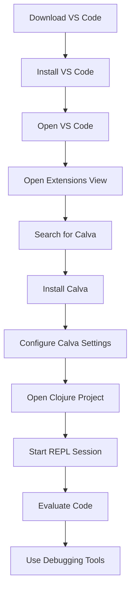

## 2.3.3 Setting Up Visual Studio Code with Calva

Visual Studio Code (VS Code) is a popular, lightweight, and versatile code editor that supports a wide range of programming languages, including Clojure. With the Calva extension, VS Code becomes a powerful tool for Clojure development, offering features such as syntax highlighting, code evaluation, and debugging. In this section, we'll guide you through the process of setting up Visual Studio Code with Calva, configuring it for optimal use, and leveraging its features to enhance your Clojure development workflow.

### Installing Visual Studio Code

Before we dive into Clojure-specific configurations, let's start by installing Visual Studio Code. If you already have VS Code installed, feel free to skip to the next section.

1. **Download Visual Studio Code**: Visit the [official Visual Studio Code website](https://code.visualstudio.com/) and download the installer for your operating system (Windows, macOS, or Linux).

2. **Install Visual Studio Code**:
   - **Windows**: Run the downloaded `.exe` file and follow the installation wizard. Ensure you select the option to add VS Code to your PATH for easy command-line access.
   - **macOS**: Open the downloaded `.dmg` file and drag Visual Studio Code to your Applications folder.
   - **Linux**: Follow the instructions on the website for your specific distribution. You can use package managers like `apt` or `yum` for installation.

3. **Launch Visual Studio Code**: Once installed, open Visual Studio Code. You should see the welcome screen, which provides links to documentation, tutorials, and extensions.

### Installing the Calva Extension

Calva is an extension for Visual Studio Code that provides Clojure and ClojureScript support. It includes features like syntax highlighting, code evaluation, and integration with the REPL.

1. **Open the Extensions View**: Click on the Extensions icon in the Activity Bar on the side of the window or press `Ctrl+Shift+X` (Windows/Linux) or `Cmd+Shift+X` (macOS).

2. **Search for Calva**: In the Extensions view, type "Calva" into the search bar. The Calva extension should appear in the list of results.

3. **Install Calva**: Click the "Install" button next to the Calva extension. Once installed, you may need to reload VS Code for the changes to take effect.

### Configuring Calva for Optimal Development

With Calva installed, let's configure it to enhance your Clojure development experience. These settings will help you leverage the full potential of Calva and VS Code.

1. **Open Settings**: Go to `File > Preferences > Settings` (or `Code > Preferences > Settings` on macOS).

2. **Configure Calva Settings**:
   - **Format on Save**: Enable automatic code formatting on save by searching for "Format On Save" in the settings and checking the box. This ensures your code adheres to Clojure's formatting conventions.
   - **Linting**: Calva includes linting capabilities to help you catch errors and improve code quality. Search for "Calva Lint" in the settings and enable it.
   - **REPL Configuration**: Ensure that the REPL is set to start automatically when you open a Clojure project. Search for "Calva REPL" and adjust the settings as needed.

3. **Keybindings**: Customize keybindings to suit your workflow. For example, you might want to set shortcuts for evaluating code or starting the REPL.

### Starting a REPL Session

The Read-Eval-Print Loop (REPL) is a powerful tool in Clojure development, allowing you to interactively evaluate code and test functions. Let's see how to start a REPL session in VS Code with Calva.

1. **Open a Clojure Project**: Navigate to a Clojure project directory and open it in VS Code. You can use the `File > Open Folder` option.

2. **Start the REPL**: Press `Ctrl+Alt+C` followed by `Ctrl+Alt+J` to start a REPL session. Calva will prompt you to select a project type (Leiningen, deps.edn, etc.). Choose the appropriate option for your project.

3. **Evaluate Code**: Once the REPL is running, you can evaluate Clojure code directly from your editor. Place your cursor on a line of code and press `Ctrl+Enter` to evaluate it. The result will be displayed in the REPL window.

### Using Debugging Tools

Calva provides debugging tools to help you identify and fix issues in your Clojure code. Here's how to use them effectively:

1. **Set Breakpoints**: Click in the gutter next to a line of code to set a breakpoint. This will pause execution at that line when the code is run.

2. **Start Debugging**: Use the `Debug` menu or press `F5` to start a debugging session. The code will run until it hits a breakpoint, allowing you to inspect variables and step through the code.

3. **Inspect Variables**: Hover over variables to see their current values. You can also use the Debug Console to evaluate expressions and inspect the program state.

### Try It Yourself

Now that you've set up Visual Studio Code with Calva, try experimenting with the following:

- **Modify Code**: Change a function in your Clojure project and evaluate it in the REPL to see the results.
- **Explore Debugging**: Set breakpoints in different parts of your code and use the debugging tools to step through execution.
- **Customize Settings**: Adjust Calva settings and keybindings to optimize your workflow.

### Diagrams and Visual Aids

To help visualize the setup process, here's a flowchart illustrating the steps to set up Visual Studio Code with Calva:

*Figure 1: Flowchart of Setting Up Visual Studio Code with Calva*

### Key Takeaways

- **Visual Studio Code** is a versatile editor that, when combined with Calva, provides a robust environment for Clojure development.
- **Calva** offers essential features like syntax highlighting, code evaluation, and debugging, enhancing your productivity.
- **REPL integration** allows for interactive development, making it easier to test and refine your code.
- **Debugging tools** in Calva help you identify and resolve issues efficiently.

### Exercises

1. **Create a New Clojure Project**: Use Leiningen or deps.edn to create a new Clojure project. Open it in VS Code and set up a REPL session.
2. **Implement a Simple Function**: Write a simple Clojure function and evaluate it in the REPL. Experiment with different inputs and observe the outputs.
3. **Debug a Clojure Program**: Introduce a bug in your code and use Calva's debugging tools to identify and fix it.

### Further Reading

- [Official Visual Studio Code Documentation](https://code.visualstudio.com/docs)
- [Calva GitHub Repository](https://github.com/BetterThanTomorrow/calva)
- [Clojure Official Documentation](https://clojure.org/)

By following these steps and utilizing the resources provided, you'll be well-equipped to develop Clojure applications using Visual Studio Code and Calva. Embrace the power of functional programming and explore the unique features Clojure offers to enhance your development experience.

## Quiz: Mastering Visual Studio Code with Calva for Clojure Development



### What is the primary purpose of the Calva extension in Visual Studio Code?

- [x] To provide Clojure support with features like syntax highlighting and REPL integration
- [ ] To enhance JavaScript development
- [ ] To manage project dependencies
- [ ] To offer version control capabilities

> **Explanation:** Calva is specifically designed to support Clojure development in Visual Studio Code, offering features like syntax highlighting, code evaluation, and REPL integration.

### How can you start a REPL session in Visual Studio Code with Calva?

- [x] Press `Ctrl+Alt+C` followed by `Ctrl+Alt+J`
- [ ] Use the `File > New REPL` menu option
- [ ] Press `F5`
- [ ] Click the "Start REPL" button in the toolbar

> **Explanation:** The correct key combination to start a REPL session in Visual Studio Code with Calva is `Ctrl+Alt+C` followed by `Ctrl+Alt+J`.

### Which setting should be enabled to automatically format Clojure code on save?

- [x] Format On Save
- [ ] Auto Indent
- [ ] Code Linting
- [ ] Syntax Highlighting

> **Explanation:** Enabling "Format On Save" ensures that your Clojure code is automatically formatted according to conventions whenever you save a file.

### What is the benefit of using the REPL in Clojure development?

- [x] It allows for interactive code evaluation and testing
- [ ] It compiles code for production
- [ ] It manages project dependencies
- [ ] It provides version control

> **Explanation:** The REPL allows developers to interactively evaluate and test code, making it easier to experiment and refine their Clojure programs.

### What is the function of breakpoints in debugging?

- [x] To pause execution at specific lines of code
- [ ] To automatically fix errors
- [ ] To compile the code
- [ ] To manage dependencies

> **Explanation:** Breakpoints are used to pause the execution of code at specific lines, allowing developers to inspect variables and step through the code during debugging.

### How can you inspect the value of a variable during a debugging session in VS Code?

- [x] Hover over the variable or use the Debug Console
- [ ] Use the "Inspect Variable" button
- [ ] Press `Ctrl+I`
- [ ] Open the Variable Explorer

> **Explanation:** During a debugging session, you can inspect the value of a variable by hovering over it or using the Debug Console in Visual Studio Code.

### Which of the following is a key feature of Calva?

- [x] Syntax highlighting for Clojure
- [ ] JavaScript transpilation
- [ ] Project management
- [ ] Version control

> **Explanation:** Calva provides syntax highlighting for Clojure, among other features like code evaluation and REPL integration.

### What is the purpose of customizing keybindings in VS Code?

- [x] To optimize workflow and increase productivity
- [ ] To change the color scheme
- [ ] To manage extensions
- [ ] To compile code

> **Explanation:** Customizing keybindings allows developers to optimize their workflow and increase productivity by setting shortcuts that suit their preferences.

### Which command is used to open the Extensions view in Visual Studio Code?

- [x] `Ctrl+Shift+X` (Windows/Linux) or `Cmd+Shift+X` (macOS)
- [ ] `Ctrl+E`
- [ ] `Alt+X`
- [ ] `Ctrl+Alt+E`

> **Explanation:** The command to open the Extensions view in Visual Studio Code is `Ctrl+Shift+X` on Windows/Linux or `Cmd+Shift+X` on macOS.

### True or False: Calva can be used for Java development in Visual Studio Code.

- [ ] True
- [x] False

> **Explanation:** Calva is specifically designed for Clojure development in Visual Studio Code, not for Java development.



By mastering Visual Studio Code with Calva, you'll enhance your ability to develop robust Clojure applications efficiently. Happy coding!
