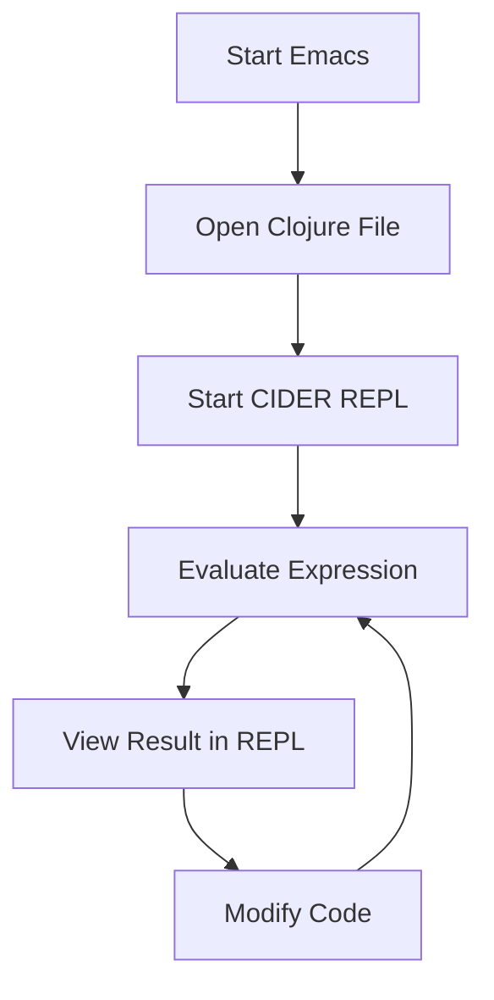

## 2.3.4 Configuring Emacs with CIDER

Welcome to the world of Emacs, a powerful and extensible text editor that, when combined with CIDER (Clojure Interactive Development Environment that Rocks), provides a robust environment for Clojure development. This guide will walk you through setting up Emacs with CIDER, focusing on the needs of Java developers transitioning to Clojure. We'll cover installation, package management, configuration, and usage of key features like the REPL.

### Why Emacs and CIDER?

Emacs, with its Lisp-based extensibility, is a natural fit for Clojure development. CIDER enhances this experience by providing an interactive REPL, code evaluation, debugging, and more. For Java developers, Emacs offers a different paradigm from traditional IDEs like IntelliJ IDEA, emphasizing keyboard-driven workflows and customization.

### Installing Emacs

First, let's install Emacs on your operating system. The installation process varies slightly depending on your OS.

#### Windows

1. **Download Emacs**: Visit the [GNU Emacs website](https://www.gnu.org/software/emacs/) and download the latest version for Windows.
2. **Install Emacs**: Run the installer and follow the on-screen instructions.
3. **Add Emacs to PATH**: Ensure Emacs is added to your system's PATH for easy access from the command line.

#### macOS

1. **Using Homebrew**: Open Terminal and run:
   ```bash
   brew install emacs
   ```
2. **Alternative**: Download the latest Emacs build from [emacsformacosx.com](https://emacsformacosx.com/).

#### Linux

1. **Using Package Manager**: Open your terminal and run:
   ```bash
   sudo apt-get install emacs  # For Debian/Ubuntu
   sudo dnf install emacs      # For Fedora
   sudo pacman -S emacs        # For Arch
   ```

### Setting Up Package Management with MELPA

Emacs uses packages to extend its functionality. MELPA (Milkypostman’s Emacs Lisp Package Archive) is a popular repository for Emacs packages.

1. **Open Emacs**: Launch Emacs from your applications or terminal.
2. **Access Init File**: Press `C-x C-f` (Control + x followed by Control + f) and open `~/.emacs` or `~/.emacs.d/init.el`.
3. **Add MELPA Repository**: Add the following lines to your init file:
   ```elisp
   (require 'package)
   (add-to-list 'package-archives
                '("melpa" . "https://melpa.org/packages/") t)
   (package-initialize)
   ```

### Installing CIDER and Clojure Mode

With MELPA set up, you can now install CIDER and `clojure-mode`.

1. **Install Packages**: Run the following commands in Emacs:
   - Press `M-x` (Alt + x), type `package-refresh-contents`, and press Enter.
   - Press `M-x`, type `package-install`, press Enter, and type `cider`.
   - Repeat the above step for `clojure-mode`.

### Configuring Emacs Initialization Files

To enhance your Clojure development experience, configure your Emacs initialization files.

1. **Basic Configuration**: Add the following to your init file:
   ```elisp
   ;; Enable Clojure mode for Clojure files
   (require 'clojure-mode)

   ;; Enable CIDER for Clojure development
   (require 'cider)

   ;; Enable paredit for structured editing of S-expressions
   (add-hook 'clojure-mode-hook #'paredit-mode)
   (add-hook 'cider-repl-mode-hook #'paredit-mode)

   ;; Enable rainbow delimiters for better readability
   (add-hook 'clojure-mode-hook #'rainbow-delimiters-mode)
   (add-hook 'cider-repl-mode-hook #'rainbow-delimiters-mode)
   ```

2. **Custom Keybindings**: Customize keybindings to suit your workflow:
   ```elisp
   ;; Example: Bind C-c C-k to compile the current buffer
   (define-key clojure-mode-map (kbd "C-c C-k") 'cider-load-buffer)
   ```

### Demonstrating REPL Usage

The REPL (Read-Eval-Print Loop) is a cornerstone of Clojure development, allowing interactive coding and testing.

1. **Starting the REPL**: Open a Clojure file and press `C-c M-j` to start a CIDER REPL session.
2. **Evaluating Code**: Place the cursor over a Clojure expression and press `C-x C-e` to evaluate it.
3. **Interactive Development**: Use the REPL to test functions and debug code in real-time.

### Code Evaluation and Other Features

CIDER offers powerful features beyond basic REPL usage.

- **Debugging**: Use `C-u C-M-x` to instrument a function for debugging.
- **Documentation Lookup**: Press `C-c C-d C-d` to view documentation for a symbol.
- **Code Navigation**: Use `M-.` to jump to a function's definition and `M-,` to return.

### Comparing with Java IDEs

Java developers are accustomed to IDEs like IntelliJ IDEA, which offer integrated tools for building, testing, and debugging. Emacs with CIDER provides similar capabilities but with a focus on keyboard-driven workflows and extensibility. Here's a comparison:

| Feature               | Emacs + CIDER                      | IntelliJ IDEA                  |
|-----------------------|------------------------------------|--------------------------------|
| **Code Evaluation**   | Interactive REPL                   | Run configurations             |
| **Debugging**         | Instrumentation and REPL           | Integrated debugger            |
| **Navigation**        | Keyboard shortcuts, tags           | Mouse and keyboard navigation  |
| **Customization**     | Highly customizable via Emacs Lisp | Plugin-based customization     |

### Try It Yourself

To deepen your understanding, try modifying the code examples:

- **Experiment with Keybindings**: Customize keybindings in your init file to streamline your workflow.
- **Explore Paredit**: Practice using Paredit for structured editing of S-expressions.
- **Debugging**: Instrument a function and step through its execution using CIDER's debugger.

### Diagrams and Visuals

Below is a diagram illustrating the flow of data through a Clojure REPL session:



*Diagram: Flow of data through a Clojure REPL session in Emacs.*

### Further Reading

For more information on Emacs and CIDER, consider the following resources:

- [Official CIDER Documentation](https://docs.cider.mx/cider/)
- [Emacs Wiki](https://www.emacswiki.org/)
- [ClojureDocs](https://clojuredocs.org/)

### Exercises

1. **Install and Configure**: Set up Emacs with CIDER on your machine and configure it as described.
2. **Interactive Development**: Write a simple Clojure function and test it using the REPL.
3. **Customization**: Customize your Emacs environment with additional packages and keybindings.

### Key Takeaways

- **Emacs with CIDER** provides a powerful environment for Clojure development, emphasizing keyboard-driven workflows and extensibility.
- **Interactive REPL** usage allows for real-time code evaluation and debugging.
- **Customization** through Emacs Lisp enables a tailored development experience.

Now that we've explored configuring Emacs with CIDER, you're equipped to start developing Clojure applications with a powerful, customizable toolset. Embrace the flexibility of Emacs and the interactive capabilities of CIDER to enhance your Clojure development journey.

## Quiz: Mastering Emacs and CIDER for Clojure Development



### What is the primary purpose of CIDER in Emacs?

- [x] To provide an interactive development environment for Clojure
- [ ] To manage Java dependencies
- [ ] To compile Java code
- [ ] To replace the Emacs editor

> **Explanation:** CIDER is designed to enhance Emacs with features specifically for Clojure development, such as an interactive REPL and debugging tools.

### Which package repository is commonly used to install CIDER in Emacs?

- [ ] ELPA
- [x] MELPA
- [ ] NPM
- [ ] PyPI

> **Explanation:** MELPA is a popular package repository for Emacs, providing access to a wide range of packages, including CIDER.

### How do you start a CIDER REPL session in Emacs?

- [x] Press `C-c M-j` in a Clojure file
- [ ] Use the command `M-x cider-repl`
- [ ] Open a terminal and type `cider`
- [ ] Press `C-x C-c`

> **Explanation:** `C-c M-j` is the keybinding to start a CIDER REPL session from a Clojure file in Emacs.

### What is the purpose of Paredit in Emacs?

- [ ] To compile Clojure code
- [x] To provide structured editing of S-expressions
- [ ] To manage project dependencies
- [ ] To replace the REPL

> **Explanation:** Paredit is a minor mode in Emacs that helps with the structured editing of S-expressions, making it easier to work with Lisp code.

### Which command is used to evaluate a Clojure expression in Emacs?

- [x] `C-x C-e`
- [ ] `C-c C-c`
- [ ] `M-x eval`
- [ ] `C-c C-k`

> **Explanation:** `C-x C-e` evaluates the Clojure expression before the cursor in Emacs.

### What is the benefit of using the REPL in Clojure development?

- [x] Real-time code evaluation and testing
- [ ] Automatic code formatting
- [ ] Dependency management
- [ ] Version control integration

> **Explanation:** The REPL allows developers to interactively evaluate and test code, facilitating a more dynamic development process.

### How can you view documentation for a symbol in CIDER?

- [x] Press `C-c C-d C-d`
- [ ] Use `M-x doc`
- [ ] Press `C-h C-d`
- [ ] Use `C-c C-h`

> **Explanation:** `C-c C-d C-d` is the keybinding in CIDER to view documentation for a symbol.

### What is a key advantage of using Emacs for Clojure development?

- [x] Highly customizable environment
- [ ] Built-in Java compiler
- [ ] Automatic code generation
- [ ] Integrated GUI designer

> **Explanation:** Emacs is known for its high level of customization, allowing developers to tailor their environment to their specific needs.

### Which feature of CIDER allows for debugging Clojure code?

- [x] Instrumentation
- [ ] Code folding
- [ ] Syntax highlighting
- [ ] Auto-completion

> **Explanation:** CIDER's instrumentation feature allows developers to debug Clojure code by stepping through function executions.

### True or False: Emacs with CIDER can replace traditional Java IDEs for Clojure development.

- [x] True
- [ ] False

> **Explanation:** Emacs with CIDER provides a comprehensive set of tools for Clojure development, making it a viable alternative to traditional Java IDEs.


