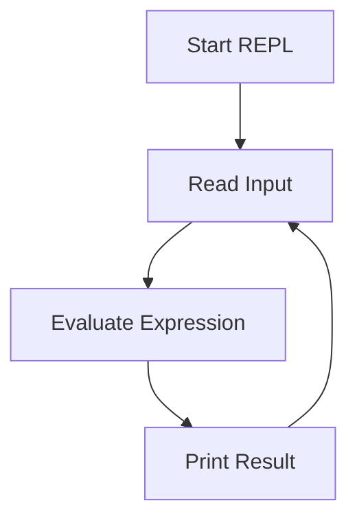

## 2.4.1 Understanding the REPL

As experienced Java developers, you're likely accustomed to a development cycle that involves writing code, compiling it, and then running it to see the results. This process, while effective, can sometimes be cumbersome, especially when you're trying to experiment with new ideas or debug complex issues. Enter the **REPL**—a tool that transforms the way you interact with your code.

### What is the REPL?

The REPL stands for **Read-Eval-Print Loop**. It's an interactive programming environment that allows you to enter expressions, evaluate them, and see the results immediately. This cycle of reading, evaluating, printing, and looping is what makes the REPL a powerful tool for rapid development and testing.

#### The Components of the REPL

1. **Read**: The REPL reads the input from the user. This input is typically a Clojure expression that you want to evaluate.

2. **Eval**: The REPL evaluates the expression. In Clojure, this means interpreting the expression and executing it.

3. **Print**: The result of the evaluation is printed out. This immediate feedback is invaluable for understanding how your code behaves.

4. **Loop**: The REPL then loops back to the beginning, ready to read the next input.

This cycle continues, allowing you to iteratively develop and test your code.

### Why is the REPL Important?

For Java developers transitioning to Clojure, the REPL offers several advantages:

- **Immediate Feedback**: Unlike Java, where you must compile your code before running it, the REPL allows you to see the results of your code instantly. This can significantly speed up the development process.

- **Interactive Development**: The REPL encourages experimentation. You can try out new ideas, test functions, and explore libraries without the overhead of setting up a full project.

- **Debugging**: The REPL is an excellent tool for debugging. You can isolate problems by testing small pieces of code and examining their behavior in real-time.

- **Learning and Exploration**: For those new to Clojure, the REPL is a fantastic learning tool. You can explore the language's features and libraries interactively.

### The REPL in Action

Let's see the REPL in action with some simple examples. We'll start with basic arithmetic operations and then move on to more complex expressions.

```clojure
;; Start the REPL and enter the following expressions:

;; Basic arithmetic
(+ 1 2 3) ; => 6

;; Defining a function
(defn greet [name]
  (str "Hello, " name "!"))

;; Calling the function
(greet "World") ; => "Hello, World!"

;; Using a higher-order function
(map inc [1 2 3 4]) ; => (2 3 4 5)
```

In these examples, you can see how the REPL reads each expression, evaluates it, prints the result, and then loops back for more input.

### Comparing REPL with Java's Development Cycle

In Java, the typical development cycle involves writing code in an IDE, compiling it, and then running the compiled code to see the results. This process can be time-consuming, especially when you're making small changes or trying to debug an issue.

In contrast, the REPL allows you to skip the compilation step and see the results of your code immediately. This can lead to a more fluid and dynamic development process.

#### Java Code Example

```java
// Java code to add two numbers
public class Main {
    public static void main(String[] args) {
        int sum = add(1, 2);
        System.out.println("Sum: " + sum);
    }

    public static int add(int a, int b) {
        return a + b;
    }
}
```

In Java, you would need to write this code in a file, compile it, and then run it to see the output. With the REPL, you can achieve the same result with a single line of Clojure code:

```clojure
(+ 1 2) ; => 3
```

### Setting Up the REPL

To start using the REPL, you'll need to have Clojure installed on your system. Once installed, you can start the REPL by running the `clj` command in your terminal.

```bash
$ clj
Clojure 1.10.3
user=>
```

This will start the REPL, and you'll see the `user=>` prompt, indicating that the REPL is ready to accept input.

### Advanced REPL Features

The REPL is not just for evaluating simple expressions. It offers several advanced features that can enhance your development workflow:

- **Namespace Management**: You can switch between different namespaces, load libraries, and manage dependencies directly from the REPL.

- **History and Autocompletion**: The REPL keeps a history of your commands, allowing you to navigate through previous inputs. Some REPL environments also offer autocompletion to speed up coding.

- **Integration with Editors**: Many editors and IDEs, such as Emacs with CIDER or IntelliJ IDEA with Cursive, offer REPL integration, allowing you to evaluate code directly from your editor.

### Try It Yourself

To get the most out of the REPL, try experimenting with the following exercises:

1. **Define a Function**: Create a function that takes a list of numbers and returns their sum. Test it with different inputs.

2. **Explore a Library**: Use the REPL to explore a Clojure library, such as `clojure.string`. Try out different functions and see what they do.

3. **Debugging**: Write a function that contains a bug. Use the REPL to test different parts of the function and identify the issue.

### Diagrams and Visualizations

To help visualize the REPL process, let's look at a simple flowchart:



**Diagram Caption**: This flowchart illustrates the Read-Eval-Print Loop process in the REPL, showing how it continuously reads input, evaluates it, prints the result, and loops back for more input.

### Key Takeaways

- The REPL is a powerful tool for interactive development, offering immediate feedback and encouraging experimentation.
- It simplifies the development process by eliminating the need for compilation, allowing for a more dynamic workflow.
- The REPL is an excellent tool for learning, debugging, and exploring Clojure's features and libraries.

### Further Reading

For more information on the REPL and its capabilities, check out these resources:

- [Official Clojure Documentation](https://clojure.org/reference/repl_and_main)
- [ClojureDocs REPL Guide](https://clojuredocs.org/quickref#repl)

### Exercises

1. **Create a Calculator**: Use the REPL to build a simple calculator that can perform addition, subtraction, multiplication, and division.

2. **Explore Data Structures**: Experiment with Clojure's data structures (lists, vectors, maps, sets) in the REPL. Try different operations and see how they behave.

3. **Build a Small Program**: Write a small program in the REPL that reads user input, processes it, and prints a result. For example, a program that converts temperatures from Celsius to Fahrenheit.

### Summary

The REPL is an indispensable tool for Clojure developers, offering a unique and efficient way to interact with your code. By understanding and leveraging the REPL, you can enhance your productivity, improve your debugging skills, and gain a deeper understanding of Clojure's capabilities. Now that we've explored the REPL, let's continue our journey into the world of Clojure and discover how its features can transform your development experience.

## Clojure REPL Quiz: Test Your Understanding



### What does the "R" in REPL stand for?

- [x] Read
- [ ] Run
- [ ] Repeat
- [ ] Return

> **Explanation:** The "R" in REPL stands for "Read," which is the first step in the Read-Eval-Print Loop process.

### What is the primary advantage of using a REPL in Clojure?

- [x] Immediate feedback and interactive development
- [ ] Faster compilation times
- [ ] Better error messages
- [ ] Automatic code optimization

> **Explanation:** The primary advantage of using a REPL is the immediate feedback it provides, allowing for interactive development and testing.

### Which command is used to start the Clojure REPL?

- [x] clj
- [ ] java
- [ ] repl
- [ ] start-repl

> **Explanation:** The `clj` command is used to start the Clojure REPL in the terminal.

### How does the REPL differ from Java's typical development cycle?

- [x] It provides immediate feedback without compilation
- [ ] It requires more setup time
- [ ] It only works with small code snippets
- [ ] It is less reliable

> **Explanation:** The REPL provides immediate feedback by evaluating code without the need for compilation, unlike Java's typical development cycle.

### What is the role of the "Print" step in the REPL?

- [x] To display the result of the evaluated expression
- [ ] To print the source code
- [ ] To print error messages
- [ ] To print the next input

> **Explanation:** The "Print" step in the REPL displays the result of the evaluated expression to the user.

### Which of the following is NOT a feature of the REPL?

- [ ] Immediate feedback
- [ ] Interactive development
- [x] Automatic code refactoring
- [ ] Debugging support

> **Explanation:** The REPL does not automatically refactor code; it provides immediate feedback, interactive development, and debugging support.

### What is a common use case for the REPL?

- [x] Experimenting with new ideas and testing functions
- [ ] Compiling large projects
- [ ] Managing version control
- [ ] Writing documentation

> **Explanation:** A common use case for the REPL is experimenting with new ideas and testing functions interactively.

### How can you navigate through previous inputs in the REPL?

- [x] Using the history feature
- [ ] Using the back button
- [ ] Using the undo command
- [ ] Using the reset command

> **Explanation:** The REPL has a history feature that allows you to navigate through previous inputs.

### What is the purpose of the "Eval" step in the REPL?

- [x] To evaluate the expression and execute it
- [ ] To edit the expression
- [ ] To export the expression
- [ ] To encrypt the expression

> **Explanation:** The "Eval" step in the REPL evaluates the expression and executes it.

### True or False: The REPL can be integrated with editors and IDEs for enhanced functionality.

- [x] True
- [ ] False

> **Explanation:** True. The REPL can be integrated with editors and IDEs like Emacs with CIDER or IntelliJ IDEA with Cursive for enhanced functionality.


