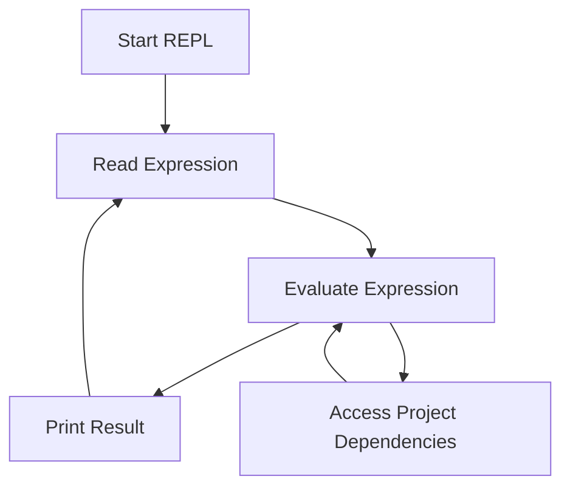

## 2.4.2 Starting the REPL

The Read-Eval-Print Loop (REPL) is a powerful tool in Clojure that allows developers to interactively evaluate code, test functions, and explore libraries in real-time. For Java developers, this might be a new concept, as Java traditionally relies on compiling and running entire programs. In this section, we will explore how to start the REPL in different environments, including the command line and popular IDEs, and discuss the differences between a standalone REPL and one connected to a project.

### Understanding the REPL

Before diving into the specifics of starting the REPL, let's briefly discuss what the REPL is and why it's beneficial. The REPL is an interactive programming environment that reads user inputs (expressions), evaluates them, prints the result, and loops back to read the next input. This cycle allows for rapid prototyping, debugging, and learning.

In Java, you might be accustomed to writing code, compiling it, and then running it to see the results. The REPL eliminates the compile step, allowing you to test snippets of code immediately. This can significantly speed up the development process and enhance your understanding of Clojure's syntax and semantics.

### Starting the REPL from the Command Line

#### Using `clj`

The `clj` command is part of the Clojure CLI tools and is the simplest way to start a REPL. It provides a lightweight environment for evaluating Clojure code.

1. **Open your terminal**.
2. **Type `clj` and press Enter**.

```shell
clj
```

This command starts a REPL session. You can now enter Clojure expressions, and the REPL will evaluate them and print the results.

```clojure
;; Example: Adding two numbers
(+ 1 2)
;; => 3
```

#### Using `lein repl`

Leiningen is a popular build automation tool for Clojure projects. It provides additional features like dependency management and project scaffolding.

1. **Navigate to your project directory** (if you want to start a project-connected REPL).
2. **Type `lein repl` and press Enter**.

```shell
lein repl
```

This command starts a REPL session with your project's dependencies and configurations loaded. This is particularly useful for testing code within the context of a specific project.

```clojure
;; Example: Using a library function
(require '[clojure.string :as str])
(str/upper-case "hello")
;; => "HELLO"
```

### Starting the REPL from an IDE or Editor

#### IntelliJ IDEA with Cursive

Cursive is a popular Clojure plugin for IntelliJ IDEA that provides excellent support for Clojure development, including REPL integration.

1. **Open your Clojure project in IntelliJ IDEA**.
2. **Navigate to the "Run" menu and select "Run REPL"**.
3. **Choose the appropriate configuration** (e.g., standalone or project).

This will start a REPL session within the IDE, allowing you to evaluate code directly from your editor.

#### Visual Studio Code with Calva

Calva is a Clojure extension for Visual Studio Code that provides REPL support.

1. **Open your Clojure project in Visual Studio Code**.
2. **Press `Ctrl+Shift+P` to open the command palette**.
3. **Type "Calva: Start REPL" and select the command**.

Calva will start a REPL session, and you can evaluate code by selecting it and pressing `Ctrl+Enter`.

#### Emacs with CIDER

CIDER is a powerful Clojure development environment for Emacs.

1. **Open your Clojure project in Emacs**.
2. **Press `M-x` and type `cider-jack-in`**.

This command starts a REPL session connected to your project, allowing you to evaluate code interactively.

### Standalone vs. Project-Connected REPL

A **standalone REPL** is started without any project context. It's useful for experimenting with Clojure code or testing small snippets. However, it doesn't have access to project-specific dependencies or configurations.

A **project-connected REPL** is started within the context of a specific project. It loads the project's dependencies and configurations, allowing you to test and debug code within the project's environment. This is particularly useful for larger applications where you need to ensure that your code interacts correctly with other components.

### Diagrams and Visuals

To better understand the flow of data and the interaction between different components in a REPL session, let's look at a diagram that illustrates the REPL process.



**Diagram Caption**: This flowchart illustrates the REPL process, showing how expressions are read, evaluated, and printed. It also highlights the interaction with project dependencies in a project-connected REPL.

### Try It Yourself

To get hands-on experience with the REPL, try the following exercises:

1. **Start a standalone REPL using `clj`** and evaluate a few basic expressions, such as arithmetic operations and string manipulations.
2. **Create a simple Clojure project using Leiningen** and start a project-connected REPL with `lein repl`. Experiment with requiring libraries and using their functions.
3. **Explore REPL features in your preferred IDE**. Try evaluating code directly from the editor and observe how the REPL responds.

### Key Takeaways

- The REPL is a powerful tool for interactive programming in Clojure, allowing for rapid prototyping and testing.
- You can start the REPL from the command line using `clj` or `lein repl`, or from within an IDE like IntelliJ IDEA, Visual Studio Code, or Emacs.
- A standalone REPL is useful for quick experiments, while a project-connected REPL provides access to project-specific dependencies and configurations.

### Further Reading

For more information on using the REPL and integrating it into your workflow, check out the following resources:

- [Official Clojure Documentation](https://clojure.org/guides/repl)
- [ClojureDocs](https://clojuredocs.org/)
- [Cursive Plugin for IntelliJ IDEA](https://cursive-ide.com/)
- [Calva Extension for Visual Studio Code](https://marketplace.visualstudio.com/items?itemName=betterthantomorrow.calva)
- [CIDER for Emacs](https://cider.mx/)

### Exercises

1. **Modify a Clojure expression in the REPL** to explore different functions and their outputs.
2. **Create a new Clojure project** and add a dependency. Start a project-connected REPL and use the dependency in your code.
3. **Experiment with REPL features in different IDEs** to find the setup that works best for you.

## SEO optimized quiz title



### What is the primary purpose of the REPL in Clojure?

- [x] To interactively evaluate code and test functions in real-time
- [ ] To compile and run entire programs
- [ ] To manage project dependencies
- [ ] To generate documentation

> **Explanation:** The REPL allows developers to interactively evaluate code, test functions, and explore libraries in real-time, which is different from the traditional compile-and-run approach in Java.

### How do you start a standalone REPL using the Clojure CLI tools?

- [x] By typing `clj` in the terminal
- [ ] By typing `lein repl` in the terminal
- [ ] By opening IntelliJ IDEA
- [ ] By using the `java` command

> **Explanation:** The `clj` command is used to start a standalone REPL session with the Clojure CLI tools.

### Which command is used to start a project-connected REPL with Leiningen?

- [x] `lein repl`
- [ ] `clj`
- [ ] `java -jar`
- [ ] `mvn exec:java`

> **Explanation:** The `lein repl` command starts a REPL session with the project's dependencies and configurations loaded.

### What is the advantage of a project-connected REPL?

- [x] It loads the project's dependencies and configurations
- [ ] It runs faster than a standalone REPL
- [ ] It requires no setup
- [ ] It is only available in IntelliJ IDEA

> **Explanation:** A project-connected REPL loads the project's dependencies and configurations, allowing you to test and debug code within the project's environment.

### Which IDE uses the Cursive plugin for Clojure development?

- [x] IntelliJ IDEA
- [ ] Visual Studio Code
- [ ] Emacs
- [ ] Eclipse

> **Explanation:** Cursive is a popular Clojure plugin for IntelliJ IDEA that provides excellent support for Clojure development, including REPL integration.

### How do you start a REPL session in Visual Studio Code with Calva?

- [x] By typing "Calva: Start REPL" in the command palette
- [ ] By typing `clj` in the terminal
- [ ] By using the `java` command
- [ ] By opening the REPL tab

> **Explanation:** In Visual Studio Code, you can start a REPL session with Calva by typing "Calva: Start REPL" in the command palette.

### What is the purpose of the `require` function in a project-connected REPL?

- [x] To load libraries and namespaces
- [ ] To start the REPL
- [ ] To compile the project
- [ ] To generate documentation

> **Explanation:** The `require` function is used to load libraries and namespaces in a project-connected REPL.

### Which command is used to start a REPL session in Emacs with CIDER?

- [x] `M-x cider-jack-in`
- [ ] `clj`
- [ ] `lein repl`
- [ ] `java -jar`

> **Explanation:** In Emacs, the `M-x cider-jack-in` command starts a REPL session connected to your project using CIDER.

### What is the main difference between a standalone REPL and a project-connected REPL?

- [x] A project-connected REPL has access to project-specific dependencies
- [ ] A standalone REPL runs faster
- [ ] A standalone REPL is only available in IntelliJ IDEA
- [ ] A project-connected REPL requires no setup

> **Explanation:** A project-connected REPL has access to project-specific dependencies and configurations, while a standalone REPL does not.

### True or False: The REPL eliminates the compile step, allowing you to test snippets of code immediately.

- [x] True
- [ ] False

> **Explanation:** The REPL allows you to test snippets of code immediately without the need for a separate compile step, which is different from the traditional Java development process.


