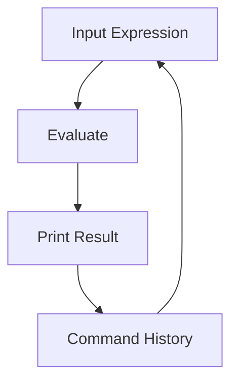

## 2.4.3 Basic REPL Usage

The Read-Eval-Print Loop (REPL) is a powerful tool in Clojure that allows developers to interactively evaluate code, test functions, and experiment with new ideas. For Java developers transitioning to Clojure, the REPL offers a dynamic and immediate feedback loop that can significantly enhance your development workflow. In this section, we'll explore the basics of using the REPL, including evaluating expressions, defining functions and variables, and utilizing common REPL commands.

### Evaluating Expressions

At its core, the REPL allows you to evaluate expressions and see immediate results. This is akin to using a Java interactive shell, but with the added benefits of Clojure's functional programming paradigm.

#### Simple Arithmetic

Let's start with a simple arithmetic expression:

```clojure
;; Evaluate a simple arithmetic expression
(+ 1 2 3)
```

When you enter this expression into the REPL, it will immediately return `6`. This is because the `+` function in Clojure can take multiple arguments, summing them together.

#### Function Calls

You can also call functions directly:

```clojure
;; Call a function to get the length of a string
(count "Hello, Clojure!")
```

This will return `14`, the number of characters in the string.

#### Comparing with Java

In Java, evaluating expressions typically requires writing a complete program, compiling it, and then running it. The REPL eliminates this overhead, allowing for rapid prototyping and testing.

### Defining Functions and Variables

One of the strengths of the REPL is the ability to define functions and variables on the fly. This is particularly useful for testing small pieces of code before integrating them into a larger application.

#### Defining Variables

You can define variables using the `def` keyword:

```clojure
;; Define a variable
(def greeting "Hello, World!")
```

Now, typing `greeting` in the REPL will return `"Hello, World!"`.

#### Defining Functions

Functions are defined using the `defn` keyword:

```clojure
;; Define a simple function
(defn square [x]
  (* x x))

;; Call the function
(square 5)
```

This will return `25`, as the function squares its input.

#### Java Equivalent

In Java, defining a function requires creating a class and a method, which is more verbose. Clojure's REPL allows for concise function definitions that can be tested immediately.

### Using Common REPL Commands

The REPL provides several built-in commands to help you explore and understand Clojure code.

#### `doc`

The `doc` command displays documentation for a given function or macro:

```clojure
;; Get documentation for the map function
(doc map)
```

This will display information about the `map` function, including its parameters and usage.

#### `find-doc`

Use `find-doc` to search for documentation containing a specific keyword:

```clojure
;; Search for documentation containing "sequence"
(find-doc "sequence")
```

This is useful for discovering functions related to a particular concept.

#### `source`

The `source` command shows the source code of a function:

```clojure
;; View the source code of the map function
(source map)
```

This can provide insights into how functions are implemented.

#### `apropos`

The `apropos` command lists all symbols that match a given pattern:

```clojure
;; Find symbols related to "map"
(apropos "map")
```

This is helpful for exploring the available functions and macros in Clojure.

### Navigating Command History

The REPL maintains a history of commands, allowing you to navigate through previous inputs using the up and down arrow keys. This is similar to command-line interfaces in Unix-based systems.

#### Re-executing Commands

You can re-execute previous commands by navigating to them in the history and pressing Enter. This is useful for iterating on expressions or functions.

#### Modifying Previous Commands

If you need to modify a previous command, simply navigate to it, make your changes, and press Enter to execute the updated command.

### Try It Yourself

To get the most out of the REPL, try experimenting with the following:

- Modify the `square` function to cube its input instead.
- Use `find-doc` to explore functions related to "filter".
- Define a variable that holds a list of numbers, and use `map` to square each number.

### Diagrams and Visuals

To better understand the flow of data in the REPL, consider the following diagram:



**Diagram Description**: This flowchart illustrates the basic cycle of input, evaluation, and output in the REPL, emphasizing the interactive nature of the tool.

### Further Reading

For more information on using the REPL, consider the following resources:

- [Official Clojure Documentation](https://clojure.org/reference/repl_and_main)
- [ClojureDocs REPL Guide](https://clojuredocs.org/quickref)

### Exercises

1. Define a function that takes a list of numbers and returns a list of their squares.
2. Use the `doc` command to explore the `reduce` function and write a simple example using it.
3. Experiment with `source` to view the implementation of the `filter` function.

### Key Takeaways

- The REPL is a powerful tool for interactive programming in Clojure, allowing for immediate feedback and rapid prototyping.
- You can define and test functions and variables directly in the REPL, streamlining the development process.
- Common REPL commands like `doc`, `find-doc`, `source`, and `apropos` are invaluable for exploring and understanding Clojure code.
- Navigating command history enhances productivity by allowing quick access to previous inputs.

Now that we've explored basic REPL usage, let's continue to build on these skills by integrating them into your Clojure development workflow.

## Quiz: Mastering Basic REPL Usage in Clojure



### What does the REPL stand for in Clojure?

- [x] Read-Eval-Print Loop
- [ ] Run-Evaluate-Print Loop
- [ ] Read-Execute-Print Loop
- [ ] Run-Execute-Print Loop

> **Explanation:** REPL stands for Read-Eval-Print Loop, which is a simple interactive programming environment.

### How do you define a variable in Clojure?

- [x] Using the `def` keyword
- [ ] Using the `var` keyword
- [ ] Using the `let` keyword
- [ ] Using the `set` keyword

> **Explanation:** In Clojure, variables are defined using the `def` keyword.

### Which command is used to view the source code of a function in the REPL?

- [x] `source`
- [ ] `doc`
- [ ] `find-doc`
- [ ] `apropos`

> **Explanation:** The `source` command is used to view the source code of a function in the REPL.

### What is the purpose of the `doc` command in the REPL?

- [x] To display documentation for a function or macro
- [ ] To execute a function
- [ ] To find a function by name
- [ ] To list all available functions

> **Explanation:** The `doc` command displays documentation for a function or macro, including its parameters and usage.

### How can you navigate through command history in the REPL?

- [x] Using the up and down arrow keys
- [ ] Using the left and right arrow keys
- [ ] Using the `history` command
- [ ] Using the `navigate` command

> **Explanation:** You can navigate through command history in the REPL using the up and down arrow keys.

### What is the equivalent of Clojure's REPL in Java?

- [x] Java does not have a direct equivalent
- [ ] Java Shell (JShell)
- [ ] Java Interactive Console
- [ ] Java Command Line

> **Explanation:** Java does not have a direct equivalent to the REPL, but JShell provides similar functionality.

### Which command would you use to search for documentation containing a specific keyword?

- [x] `find-doc`
- [ ] `doc`
- [ ] `source`
- [ ] `apropos`

> **Explanation:** The `find-doc` command is used to search for documentation containing a specific keyword.

### What does the `apropos` command do in the REPL?

- [x] Lists all symbols that match a given pattern
- [ ] Displays documentation for a function
- [ ] Shows the source code of a function
- [ ] Evaluates an expression

> **Explanation:** The `apropos` command lists all symbols that match a given pattern, helping to explore available functions and macros.

### True or False: The REPL allows for immediate feedback and rapid prototyping.

- [x] True
- [ ] False

> **Explanation:** True. The REPL provides immediate feedback and rapid prototyping, making it a powerful tool for interactive programming.

### Which keyword is used to define functions in Clojure?

- [x] `defn`
- [ ] `def`
- [ ] `fn`
- [ ] `let`

> **Explanation:** The `defn` keyword is used to define functions in Clojure.


