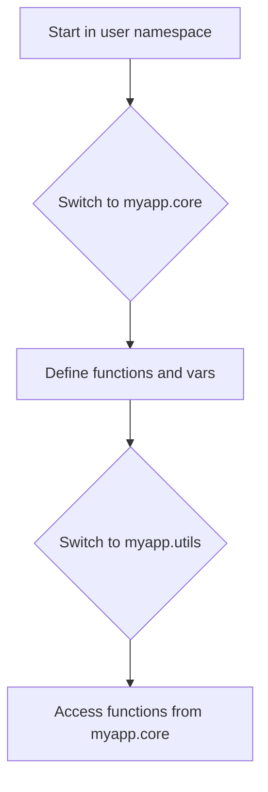
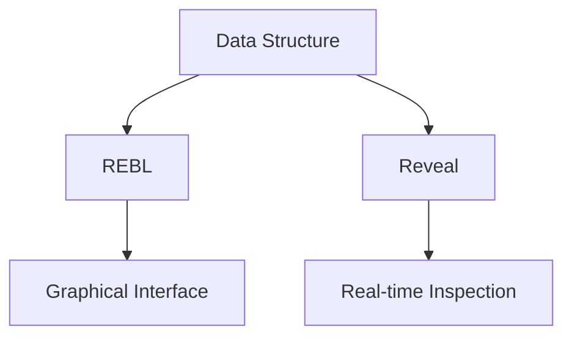

## 2.4.4 Advanced REPL Features

The Read-Eval-Print Loop (REPL) is a powerful tool in Clojure that allows developers to interactively write and test code. For Java developers transitioning to Clojure, the REPL offers a dynamic and iterative approach to development that contrasts with the more static compile-run-debug cycle of Java. In this section, we'll delve into advanced REPL features that can enhance your productivity and understanding of Clojure.

### Namespace Management

Namespaces in Clojure are akin to packages in Java. They help organize code and avoid name clashes. Managing namespaces effectively in the REPL is crucial for a smooth development experience.

#### Switching Between Namespaces

In Clojure, you can switch between namespaces using the `(in-ns 'namespace-name)` function. This is similar to changing the current package context in Java.

```clojure
;; Switch to the user namespace
(in-ns 'user)

;; Define a new namespace and switch to it
(ns myapp.core)

;; Now, switch to a different namespace
(in-ns 'myapp.utils)
```

**Try It Yourself**: Create a few namespaces and switch between them using `(in-ns)`. Observe how the REPL context changes with each switch.

#### Loading Files

Loading files into the REPL allows you to execute code from a file, much like running a Java class file. Use `(load-file "path/to/file.clj")` to load and evaluate a Clojure file.

```clojure
;; Load a Clojure file
(load-file "src/myapp/core.clj")
```

This command reads the file, evaluates its contents, and makes the functions and variables defined in the file available in the current namespace.

**Try It Yourself**: Write a simple Clojure script in a file and load it into the REPL. Modify the file and reload it to see changes reflected immediately.

### Interrupting Evaluations

Long-running computations can be interrupted in the REPL, allowing you to regain control without restarting the session. This is particularly useful when experimenting with new algorithms or debugging.

To interrupt an evaluation, you typically use a keyboard shortcut like `Ctrl+C`. This sends an interrupt signal to the REPL, stopping the current computation.

**Try It Yourself**: Write a function that performs a long-running computation, such as a recursive Fibonacci sequence, and practice interrupting it.

### Using REPL Tools

Clojure's ecosystem includes several tools that enhance the REPL experience. Two notable tools are `REBL` and `Reveal`, which provide rich visualization capabilities.

#### REBL (REPL for Data Browsing)

REBL is a tool for exploring data structures interactively. It provides a graphical interface to visualize and navigate complex data.

- **Installation**: REBL can be added to your project dependencies and started from the REPL.
- **Usage**: Once installed, you can send data to REBL for visualization using `(rebl/inspect data)`.

```clojure
;; Example of using REBL to inspect a data structure
(require '[cognitect.rebl :as rebl])
(rebl/inspect {:name "Clojure" :type "Language" :features ["Functional" "Lisp"]})
```

#### Reveal

Reveal is another tool that enhances the REPL with a focus on data visualization and exploration. It integrates seamlessly with the REPL, allowing you to inspect data in real-time.

- **Installation**: Add Reveal to your project dependencies.
- **Usage**: Use `(tap> data)` to send data to Reveal for inspection.

```clojure
;; Example of using Reveal to inspect data
(require '[vlaaad.reveal :as reveal])
(tap> {:framework "Reveal" :purpose "Visualization"})
```

**Try It Yourself**: Install REBL or Reveal and experiment with visualizing different data structures. Observe how these tools can help you understand complex data at a glance.

### Diagrams and Visualizations

To better understand the flow of data and namespace management in Clojure, let's use a few diagrams.

#### Namespace Management Flow



*Caption*: This diagram illustrates the flow of switching between namespaces and defining functions in Clojure.

#### Data Visualization with REBL and Reveal



*Caption*: This diagram shows how data structures can be visualized using REBL and Reveal, enhancing the REPL experience.

### Exercises and Practice Problems

1. **Namespace Exploration**: Create a project with multiple namespaces. Practice switching between them and calling functions across namespaces.
2. **File Loading**: Write a script that defines a few functions and load it into the REPL. Modify the script and reload it to see changes.
3. **Interrupt Handling**: Implement a long-running computation and practice interrupting it. Reflect on how this can aid in debugging.
4. **Visualization Tools**: Install REBL or Reveal and visualize a complex data structure. Experiment with different data types and observe the visual output.

### Key Takeaways

- **Namespace Management**: Use `(in-ns)` to switch contexts and organize code effectively.
- **File Loading**: `(load-file)` allows you to execute scripts and see changes in real-time.
- **Interrupting Evaluations**: Regain control of the REPL during long computations.
- **REPL Tools**: Enhance your development experience with tools like REBL and Reveal for data visualization.

By mastering these advanced REPL features, you'll be well-equipped to leverage Clojure's dynamic capabilities, making your development process more efficient and enjoyable.

### Further Reading

- [Official Clojure Documentation](https://clojure.org/reference/repl_and_main)
- [ClojureDocs](https://clojuredocs.org/)
- [REBL GitHub Repository](https://github.com/cognitect-labs/REBL-distro)
- [Reveal GitHub Repository](https://github.com/vlaaad/reveal)

Now that we've explored advanced REPL features, let's apply these concepts to enhance your Clojure development workflow.

## Quiz: Mastering Advanced REPL Features in Clojure



### What is the primary purpose of using `(in-ns 'namespace-name)` in Clojure?

- [x] To switch the current namespace in the REPL
- [ ] To import a namespace from a library
- [ ] To define a new function in the current namespace
- [ ] To load a file into the current namespace

> **Explanation:** `(in-ns 'namespace-name)` is used to switch the current namespace in the REPL, allowing you to work within different contexts.

### How can you load a Clojure file into the REPL?

- [x] Using `(load-file "path/to/file.clj")`
- [ ] Using `(require 'file)`
- [ ] Using `(import 'file)`
- [ ] Using `(include 'file)`

> **Explanation:** `(load-file "path/to/file.clj")` reads and evaluates the contents of a Clojure file, making its functions and variables available in the current namespace.

### Which keyboard shortcut is commonly used to interrupt a long-running computation in the REPL?

- [x] Ctrl+C
- [ ] Ctrl+Z
- [ ] Ctrl+X
- [ ] Ctrl+V

> **Explanation:** Ctrl+C is commonly used to send an interrupt signal to the REPL, stopping the current computation.

### What is the main advantage of using REBL or Reveal in the REPL?

- [x] Enhanced data visualization and exploration
- [ ] Faster code execution
- [ ] Automatic code formatting
- [ ] Built-in debugging tools

> **Explanation:** REBL and Reveal provide enhanced data visualization and exploration capabilities, allowing developers to interactively inspect complex data structures.

### Which function is used to send data to Reveal for inspection?

- [x] `(tap> data)`
- [ ] `(inspect data)`
- [ ] `(view data)`
- [ ] `(show data)`

> **Explanation:** `(tap> data)` is used to send data to Reveal for inspection, enabling real-time visualization.

### What is a key benefit of using namespaces in Clojure?

- [x] Organizing code and avoiding name clashes
- [ ] Improving code execution speed
- [ ] Simplifying syntax
- [ ] Reducing memory usage

> **Explanation:** Namespaces help organize code and avoid name clashes, similar to packages in Java.

### How does `(load-file)` differ from `(require)` in Clojure?

- [x] `(load-file)` reads and evaluates a file, while `(require)` loads a namespace
- [ ] `(load-file)` is faster than `(require)`
- [ ] `(load-file)` is used for Java interop
- [ ] `(load-file)` only works with scripts

> **Explanation:** `(load-file)` reads and evaluates the contents of a file, while `(require)` loads a namespace, making its functions available.

### What is the purpose of using `(rebl/inspect data)`?

- [x] To visualize data structures in REBL
- [ ] To format data for output
- [ ] To convert data to JSON
- [ ] To save data to a file

> **Explanation:** `(rebl/inspect data)` is used to visualize data structures in REBL, providing a graphical interface for exploration.

### True or False: Interrupting a computation in the REPL requires restarting the session.

- [ ] True
- [x] False

> **Explanation:** Interrupting a computation in the REPL does not require restarting the session; you can regain control without losing your current state.

### Which tool focuses on real-time data inspection in the REPL?

- [x] Reveal
- [ ] Leiningen
- [ ] CIDER
- [ ] Maven

> **Explanation:** Reveal focuses on real-time data inspection in the REPL, providing interactive visualization capabilities.


