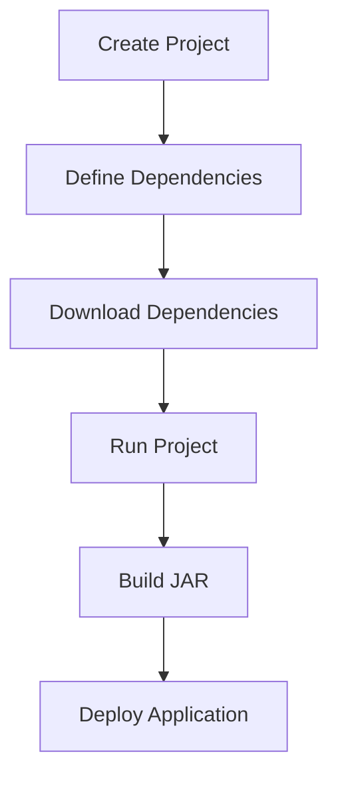

## 2.5.1 Understanding Leiningen

As experienced Java developers, you're likely familiar with build tools like Maven and Gradle. In the Clojure ecosystem, **Leiningen** serves a similar purpose, but with a focus on simplicity and ease of use. Leiningen is a build automation tool that helps manage Clojure projects, handle dependencies, and automate tasks. In this section, we'll explore Leiningen's role in Clojure development, its configuration through `project.clj` files, and common commands that streamline your workflow.

### The Role of Leiningen in Clojure Development

Leiningen is to Clojure what Maven is to Java. It simplifies the process of setting up new projects, managing dependencies, and running tasks. Here's how Leiningen fits into the Clojure development lifecycle:

- **Project Creation**: Leiningen provides templates for creating new Clojure projects, ensuring a standardized structure.
- **Dependency Management**: It handles dependencies through a declarative configuration, automatically downloading and managing libraries.
- **Task Execution**: Leiningen automates common tasks such as running tests, building jars, and deploying applications.

#### Comparing Leiningen to Java's Maven

While Maven uses an XML-based `pom.xml` file for configuration, Leiningen uses a Clojure-based `project.clj` file. This allows for more expressive and flexible configurations. Here's a quick comparison:

| Feature          | Maven (Java)        | Leiningen (Clojure)  |
|------------------|---------------------|----------------------|
| Configuration    | XML (`pom.xml`)     | Clojure (`project.clj`) |
| Dependency Mgmt  | Central Repository  | Clojars, Maven Central |
| Build Lifecycle  | Phases and Goals    | Tasks and Plugins    |
| Extensibility    | Plugins             | Plugins              |

### Structure of `project.clj` Files

The `project.clj` file is the heart of a Leiningen project. It defines the project's metadata, dependencies, and configuration. Let's break down a typical `project.clj` file:

```clojure
(defproject my-clojure-app "0.1.0-SNAPSHOT"
  :description "A simple Clojure application"
  :url "http://example.com/my-clojure-app"
  :license {:name "Eclipse Public License"
            :url "http://www.eclipse.org/legal/epl-v10.html"}
  :dependencies [[org.clojure/clojure "1.10.3"]
                 [ring/ring-core "1.9.0"]]
  :main ^:skip-aot my-clojure-app.core
  :target-path "target/%s"
  :profiles {:uberjar {:aot :all}})
```

#### Key Components of `project.clj`

- **`defproject`**: Defines the project name and version.
- **`:description`**: A brief description of the project.
- **`:url`**: The project's homepage or repository URL.
- **`:license`**: Information about the project's license.
- **`:dependencies`**: A vector of dependencies, each specified by a group ID, artifact ID, and version.
- **`:main`**: Specifies the main namespace for the application.
- **`:target-path`**: Defines where compiled files are stored.
- **`:profiles`**: Allows for different configurations, such as for development or production.

#### Understanding Dependencies

Dependencies in Leiningen are similar to those in Maven. They are specified in the `:dependencies` vector, and Leiningen resolves them from repositories like Clojars or Maven Central. This is akin to Maven's dependency management but with a more concise syntax.

### Common Leiningen Commands

Leiningen provides a rich set of commands to manage your Clojure projects. Here are some of the most commonly used commands:

- **`lein new`**: Creates a new Clojure project from a template.
- **`lein deps`**: Downloads and installs project dependencies.
- **`lein run`**: Runs the project, executing the main function specified in `project.clj`.
- **`lein test`**: Runs the project's test suite.
- **`lein uberjar`**: Packages the project into a standalone JAR file, including all dependencies.
- **`lein repl`**: Starts a REPL session for interactive development.

#### Example: Creating and Running a New Project

Let's walk through creating a new Clojure project using Leiningen:

1. **Create a New Project**:
   ```bash
   lein new app my-clojure-app
   ```
   This command generates a new project with a basic structure.

2. **Navigate to the Project Directory**:
   ```bash
   cd my-clojure-app
   ```

3. **Run the Project**:
   ```bash
   lein run
   ```
   This command compiles and runs the project, executing the main function.

### Try It Yourself

Experiment with modifying the `project.clj` file by adding a new dependency or changing the main namespace. Observe how Leiningen handles these changes when you run `lein deps` or `lein run`.

### Visualizing Leiningen's Workflow

To better understand how Leiningen manages a Clojure project, let's visualize the workflow:



**Diagram Caption**: This flowchart illustrates the typical workflow of a Clojure project managed by Leiningen, from creation to deployment.

### Further Reading and Resources

For more in-depth information about Leiningen, consider exploring the following resources:

- [Official Leiningen Documentation](https://leiningen.org/)
- [ClojureDocs: Leiningen](https://clojuredocs.org/)
- [GitHub: Leiningen Repository](https://github.com/technomancy/leiningen)

### Exercises and Practice Problems

1. **Create a New Project**: Use Leiningen to create a new Clojure project and modify the `project.clj` file to include a new dependency.
2. **Build an Uberjar**: Package your project into an uberjar and run it to ensure all dependencies are included.
3. **Explore Profiles**: Create a new profile in `project.clj` for a production environment and configure it to optimize performance.

### Key Takeaways

- **Leiningen** is a powerful tool for managing Clojure projects, offering features similar to Maven but with a focus on simplicity.
- The **`project.clj` file** is central to configuring a Leiningen project, defining dependencies, and setting up project metadata.
- **Common commands** like `lein new`, `lein run`, and `lein uberjar` streamline the development process, from project creation to deployment.

By understanding and utilizing Leiningen, you'll be well-equipped to manage Clojure projects efficiently, leveraging your existing Java knowledge to transition smoothly into the Clojure ecosystem.

## Quiz: Mastering Leiningen for Clojure Development



### What is the primary role of Leiningen in Clojure development?

- [x] Project creation, dependency management, and task automation
- [ ] Only dependency management
- [ ] Only project creation
- [ ] Only task automation

> **Explanation:** Leiningen is a comprehensive tool that handles project creation, dependency management, and task automation in Clojure development.

### How does Leiningen's `project.clj` file differ from Maven's `pom.xml`?

- [x] It uses Clojure syntax instead of XML
- [ ] It uses JSON syntax
- [ ] It is less expressive than `pom.xml`
- [ ] It is not used for dependency management

> **Explanation:** The `project.clj` file uses Clojure syntax, making it more expressive and flexible compared to Maven's XML-based `pom.xml`.

### Which command is used to create a new Clojure project with Leiningen?

- [x] `lein new`
- [ ] `lein create`
- [ ] `lein init`
- [ ] `lein start`

> **Explanation:** The `lein new` command is used to create a new Clojure project with Leiningen.

### What is the purpose of the `lein uberjar` command?

- [x] To package the project into a standalone JAR file
- [ ] To run the project
- [ ] To start a REPL session
- [ ] To download dependencies

> **Explanation:** The `lein uberjar` command packages the project into a standalone JAR file, including all dependencies.

### Which section of `project.clj` specifies the main namespace of the application?

- [x] `:main`
- [ ] `:dependencies`
- [ ] `:profiles`
- [ ] `:description`

> **Explanation:** The `:main` section of `project.clj` specifies the main namespace of the application.

### What is the function of the `lein deps` command?

- [x] To download and install project dependencies
- [ ] To run the project's test suite
- [ ] To create a new project
- [ ] To start a REPL session

> **Explanation:** The `lein deps` command downloads and installs the project's dependencies.

### How can you start a REPL session using Leiningen?

- [x] `lein repl`
- [ ] `lein run`
- [ ] `lein start`
- [ ] `lein console`

> **Explanation:** The `lein repl` command starts a REPL session for interactive development.

### Which of the following is NOT a common Leiningen command?

- [ ] `lein new`
- [ ] `lein run`
- [ ] `lein test`
- [x] `lein compile`

> **Explanation:** While `lein compile` is a valid command, it is not as commonly used as `lein new`, `lein run`, and `lein test`.

### What does the `:dependencies` vector in `project.clj` do?

- [x] Specifies the libraries and versions required for the project
- [ ] Defines the main namespace
- [ ] Sets the project's description
- [ ] Configures the build profiles

> **Explanation:** The `:dependencies` vector specifies the libraries and versions required for the project.

### True or False: Leiningen can only manage Clojure dependencies.

- [ ] True
- [x] False

> **Explanation:** False. Leiningen can manage dependencies from Clojars and Maven Central, which may include Java libraries.


