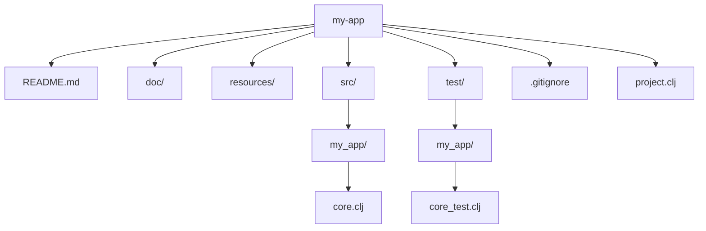

## 2.5.2 Creating a Project with Leiningen

Leiningen is a build automation tool for Clojure that simplifies project management, dependency resolution, and builds. For Java developers, Leiningen is akin to Maven or Gradle but tailored specifically for Clojure's functional programming paradigm. In this section, we'll explore how to create a new Clojure project using Leiningen, delve into the project structure, and run your application.

### Understanding Leiningen

Before we dive into creating a project, let's understand what Leiningen offers:

- **Dependency Management**: Similar to Maven's `pom.xml`, Leiningen uses `project.clj` to manage dependencies.
- **Build Automation**: Automate tasks like compiling, testing, and packaging.
- **REPL Integration**: Seamlessly integrates with the Clojure REPL for interactive development.
- **Plugin Ecosystem**: Extend functionality with a rich set of plugins.

### Creating a New Project

Creating a new Clojure project with Leiningen is straightforward. Let's create a simple application named `my-app`.

#### Step 1: Install Leiningen

Ensure Leiningen is installed on your system. If not, follow the installation instructions from the [official Leiningen website](https://leiningen.org/).

#### Step 2: Create a New Project

Open your terminal and execute the following command:

```bash
lein new app my-app
```

This command generates a new Clojure application with the name `my-app`. The `app` template is a basic starting point for applications, providing a standard project structure.

#### Step 3: Explore the Project Structure

Navigate into the newly created `my-app` directory:

```bash
cd my-app
```

Let's explore the structure of the generated project:

```plaintext
my-app/
├── README.md
├── doc/
├── resources/
├── src/
│   └── my_app/
│       └── core.clj
├── test/
│   └── my_app/
│       └── core_test.clj
├── .gitignore
└── project.clj
```

- **README.md**: A markdown file for project documentation.
- **doc/**: Directory for additional documentation.
- **resources/**: Contains static resources like configuration files.
- **src/**: The source code directory. By default, it contains `core.clj`, which is the entry point of your application.
- **test/**: Directory for test files, following the same namespace structure as `src/`.
- **.gitignore**: Specifies files and directories to be ignored by Git.
- **project.clj**: The configuration file for Leiningen, similar to `pom.xml` in Maven.

#### Step 4: Understand the `project.clj` File

The `project.clj` file is crucial for managing your project. Here's a breakdown of a typical `project.clj`:

```clojure
(defproject my-app "0.1.0-SNAPSHOT"
  :description "A simple Clojure application"
  :url "http://example.com/FIXME"
  :license {:name "Eclipse Public License"
            :url "http://www.eclipse.org/legal/epl-v10.html"}
  :dependencies [[org.clojure/clojure "1.10.3"]]
  :main ^:skip-aot my-app.core
  :target-path "target/%s"
  :profiles {:uberjar {:aot :all}})
```

- **`:dependencies`**: Lists project dependencies. By default, it includes Clojure itself.
- **`:main`**: Specifies the main namespace to run when executing `lein run`.
- **`:profiles`**: Defines build profiles, such as `:uberjar` for creating standalone JAR files.

#### Step 5: Running the Application

To run your application, use the following command:

```bash
lein run
```

This command compiles the source code and executes the `-main` function in the `my-app.core` namespace. By default, it prints "Hello, World!" to the console.

### Comparing with Java Project Setup

For Java developers, the transition to Clojure's project setup with Leiningen can be smooth, given the similarities to Maven or Gradle. Here's a comparison:

- **Dependency Management**: `project.clj` vs. `pom.xml` or `build.gradle`.
- **Build Automation**: `lein` commands vs. `mvn` or `gradle`.
- **Directory Structure**: Similar separation of source and test directories.

### Code Example: `core.clj`

Let's take a closer look at the `core.clj` file:

```clojure
(ns my-app.core
  (:gen-class))

(defn -main
  "I don't do a whole lot ... yet."
  [& args]
  (println "Hello, World!"))
```

- **`ns`**: Defines the namespace, similar to a package in Java.
- **`defn`**: Defines a function. `-main` is the entry point.
- **`println`**: Prints output to the console.

### Try It Yourself

Experiment with the `core.clj` file:

- Modify the `println` statement to print a different message.
- Add a new function and call it from `-main`.
- Explore adding a dependency in `project.clj` and using it in your code.

### Visualizing Project Structure

Below is a diagram representing the typical Leiningen project structure:



*Diagram: A visual representation of the Leiningen project structure.*

### Exercises

1. **Create a New Project**: Use Leiningen to create a new project with a different name and explore its structure.
2. **Modify `project.clj`**: Add a new dependency and use it in your application.
3. **Implement a Simple Feature**: Write a function that takes user input and processes it.

### Key Takeaways

- **Leiningen** is a powerful tool for managing Clojure projects, akin to Maven or Gradle for Java.
- **Project Structure**: Familiarize yourself with the standard directory layout and the role of `project.clj`.
- **Interactive Development**: Use the REPL and Leiningen commands to streamline your development workflow.

### Further Reading

- [Official Leiningen Documentation](https://leiningen.org/)
- [ClojureDocs](https://clojuredocs.org/)
- [Clojure Getting Started Guide](https://clojure.org/guides/getting_started)

By mastering Leiningen, you'll be well-equipped to manage and build Clojure projects efficiently, leveraging your Java experience to explore the functional programming paradigm.

## Quiz: Mastering Leiningen for Clojure Project Setup



### What is the primary purpose of Leiningen in Clojure development?

- [x] Build automation and dependency management
- [ ] Version control
- [ ] Code formatting
- [ ] Debugging

> **Explanation:** Leiningen is primarily used for build automation and managing dependencies in Clojure projects.

### Which file in a Leiningen project is similar to Maven's `pom.xml`?

- [x] `project.clj`
- [ ] `README.md`
- [ ] `build.gradle`
- [ ] `settings.xml`

> **Explanation:** The `project.clj` file in Leiningen serves a similar purpose to Maven's `pom.xml`, managing dependencies and project configuration.

### What command is used to create a new Clojure project with Leiningen?

- [x] `lein new app my-app`
- [ ] `lein create project my-app`
- [ ] `lein init my-app`
- [ ] `lein generate my-app`

> **Explanation:** The command `lein new app my-app` is used to create a new Clojure project with Leiningen.

### In a Leiningen project, where is the main application code typically located?

- [x] `src/`
- [ ] `test/`
- [ ] `resources/`
- [ ] `doc/`

> **Explanation:** The main application code is typically located in the `src/` directory of a Leiningen project.

### What is the purpose of the `:main` key in `project.clj`?

- [x] To specify the main namespace for the application
- [ ] To define the project's dependencies
- [ ] To set the project's version
- [ ] To configure the test environment

> **Explanation:** The `:main` key in `project.clj` specifies the main namespace to be executed when running the application.

### How can you run a Clojure application using Leiningen?

- [x] `lein run`
- [ ] `lein execute`
- [ ] `lein start`
- [ ] `lein launch`

> **Explanation:** The command `lein run` is used to execute a Clojure application managed by Leiningen.

### Which directory in a Leiningen project is used for test files?

- [x] `test/`
- [ ] `src/`
- [ ] `resources/`
- [ ] `doc/`

> **Explanation:** The `test/` directory is used to store test files in a Leiningen project.

### What is the default output of the `lein run` command in a new Leiningen project?

- [x] "Hello, World!"
- [ ] "Welcome to Clojure!"
- [ ] "Project initialized"
- [ ] "Running application"

> **Explanation:** By default, the `lein run` command in a new Leiningen project outputs "Hello, World!".

### True or False: Leiningen can be used to manage Java dependencies in a Clojure project.

- [x] True
- [ ] False

> **Explanation:** Leiningen can manage Java dependencies in a Clojure project, allowing integration with Java libraries.

### Which of the following is NOT a typical directory in a Leiningen project?

- [ ] `src/`
- [ ] `test/`
- [ ] `resources/`
- [x] `bin/`

> **Explanation:** The `bin/` directory is not typically part of a Leiningen project structure.


