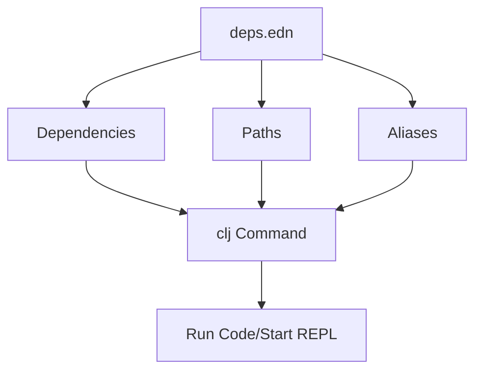

## 2.5.3 Understanding tools.deps and the Clojure CLI

As experienced Java developers, you are likely familiar with Maven or Gradle for managing dependencies and building projects. In Clojure, while Leiningen is a popular choice, the `tools.deps` library and the Clojure CLI offer a more lightweight and flexible approach to dependency management and project execution. This section will guide you through understanding and utilizing `tools.deps` and the Clojure CLI effectively.

### Introduction to tools.deps and the Clojure CLI

`tools.deps` is a Clojure library that provides a declarative way to manage dependencies using a file called `deps.edn`. The Clojure CLI (`clj` and `clojure` commands) leverages `tools.deps` to run Clojure code, start REPL sessions, and manage project dependencies. This approach is particularly beneficial for Java developers transitioning to Clojure, as it aligns with the simplicity and flexibility of Clojure's design philosophy.

#### Key Concepts

- **deps.edn**: A configuration file where you declare your project's dependencies, paths, and aliases.
- **clj and clojure commands**: Command-line tools for running Clojure code and managing dependencies.

### Managing Dependencies with deps.edn

The `deps.edn` file is the cornerstone of dependency management in `tools.deps`. It allows you to specify libraries and their versions, similar to `pom.xml` in Maven or `build.gradle` in Gradle, but with a more concise and readable syntax.

#### Structure of deps.edn

A typical `deps.edn` file consists of several key sections:

- **:deps**: Specifies the dependencies your project requires.
- **:paths**: Lists directories containing source code and resources.
- **:aliases**: Defines custom command-line options for different tasks.

Here's an example of a simple `deps.edn` file:

```clojure
{
  :deps {org.clojure/clojure {:mvn/version "1.10.3"}
         org.clojure/core.async {:mvn/version "1.3.610"}}
  :paths ["src" "resources"]
  :aliases {:dev {:extra-paths ["dev"]
                  :extra-deps {org.clojure/tools.namespace {:mvn/version "1.1.0"}}}}
}
```

- **:deps**: Lists dependencies with their Maven coordinates.
- **:paths**: Specifies directories for source code and resources.
- **:aliases**: Allows for environment-specific configurations, such as adding extra dependencies or paths for development.

#### Adding Dependencies

To add a dependency, simply include it in the `:deps` map with its Maven coordinates. For example, to add the `ring` library:

```clojure
:deps {org.clojure/clojure {:mvn/version "1.10.3"}
       ring/ring-core {:mvn/version "1.9.0"}}
```

#### Using Aliases

Aliases in `deps.edn` provide a powerful way to customize your development environment. They can add extra dependencies, paths, or even modify JVM options. For instance, you might define an alias for running tests:

```clojure
:aliases {:test {:extra-paths ["test"]
                 :extra-deps {lambdaisland/kaocha {:mvn/version "1.0.732"}}
                 :main-opts ["-m" "kaocha.runner"]}}
```

### Running Code and Starting REPL Sessions with clj

The `clj` command is a versatile tool for running Clojure code and managing REPL sessions. It integrates seamlessly with `tools.deps`, allowing you to execute code with the dependencies specified in `deps.edn`.

#### Starting a REPL

To start a REPL session, simply run:

```bash
clj
```

This command will launch a REPL with the dependencies and paths specified in your `deps.edn` file. You can also use aliases to customize the REPL environment:

```bash
clj -A:dev
```

This command starts a REPL with the additional paths and dependencies specified under the `:dev` alias.

#### Running Clojure Code

You can execute a Clojure script using the `-m` option followed by the namespace containing the `-main` function:

```bash
clj -m my.namespace
```

This is analogous to running a Java application with a `main` method.

#### Using the clojure Command

The `clojure` command is similar to `clj` but is optimized for scripting and automation. It does not start a REPL by default and is often used in scripts or CI/CD pipelines.

### Comparing tools.deps with Java's Dependency Management

While Maven and Gradle are powerful tools for Java projects, `tools.deps` offers a more lightweight and flexible approach, aligning with Clojure's philosophy of simplicity and composability.

#### Key Differences

- **Declarative vs. Imperative**: `deps.edn` is purely declarative, focusing on what dependencies are needed rather than how to build the project.
- **Flexibility**: `tools.deps` allows for more dynamic and flexible dependency management, with aliases providing a way to customize environments without modifying the core configuration.
- **Simplicity**: The `deps.edn` format is simpler and more concise than XML or Groovy scripts.

#### Similarities

- **Centralized Dependency Management**: Like Maven's `pom.xml` or Gradle's `build.gradle`, `deps.edn` centralizes dependency declarations.
- **Integration with Maven Central**: `tools.deps` can pull dependencies from Maven Central, similar to Java's build tools.

### Practical Examples and Exercises

Let's explore some practical examples to solidify your understanding of `tools.deps` and the Clojure CLI.

#### Example 1: Adding a New Dependency

Suppose you want to add the `cheshire` library for JSON parsing. Update your `deps.edn` as follows:

```clojure
:deps {org.clojure/clojure {:mvn/version "1.10.3"}
       cheshire/cheshire {:mvn/version "5.10.0"}}
```

Try running a simple script that uses `cheshire` to parse JSON:

```clojure
(ns my.json
  (:require [cheshire.core :as json]))

(defn parse-json [json-str]
  (json/parse-string json-str true))

;; Test the function
(println (parse-json "{\"name\":\"Clojure\",\"type\":\"language\"}"))
```

Run this script using:

```bash
clj -m my.json
```

#### Example 2: Using Aliases for Development

Create a `:dev` alias to include development tools like `cider-nrepl` for enhanced REPL capabilities:

```clojure
:aliases {:dev {:extra-deps {nrepl/nrepl {:mvn/version "0.8.3"}
                             cider/cider-nrepl {:mvn/version "0.25.9"}}
                :main-opts ["-m" "nrepl.cmdline" "--middleware" "[cider.nrepl/cider-middleware]"]}}
```

Start a REPL with:

```bash
clj -A:dev
```

This command sets up a REPL with additional middleware for a richer development experience.

### Try It Yourself

- **Modify the deps.edn**: Add a new library and write a script to utilize it.
- **Experiment with Aliases**: Create an alias for running tests or starting a specific REPL configuration.
- **Compare with Java**: Reflect on how `tools.deps` simplifies or complicates tasks compared to Maven or Gradle.

### Diagrams and Visual Aids

Below is a diagram illustrating the flow of data and dependencies in a Clojure project using `tools.deps`.



*Diagram 1: The flow of data and dependencies in a Clojure project using `tools.deps`.*

### Further Reading

- [Official Clojure Documentation on tools.deps](https://clojure.org/guides/deps_and_cli)
- [Clojure CLI and tools.deps User Guide](https://clojure.org/reference/deps_and_cli)
- [ClojureDocs: A Community-Powered Documentation Resource](https://clojuredocs.org/)

### Exercises

1. **Create a New Project**: Set up a new Clojure project using `tools.deps` and `deps.edn`. Add a few dependencies and write a simple application.
2. **Explore Aliases**: Define multiple aliases for different environments (e.g., development, testing) and experiment with running your project using these aliases.
3. **Dependency Management**: Add a dependency with a specific version and then update it to a newer version. Observe how `tools.deps` handles version conflicts.

### Key Takeaways

- **Simplicity and Flexibility**: `tools.deps` offers a simple yet flexible way to manage dependencies, aligning with Clojure's philosophy.
- **Powerful Aliases**: Use aliases to customize your development environment without altering the core configuration.
- **Integration with Clojure CLI**: The `clj` command provides a seamless way to run Clojure code and manage dependencies, enhancing productivity.

Now that we've explored how `tools.deps` and the Clojure CLI work, let's apply these concepts to manage dependencies and run Clojure code effectively in your projects.

## Quiz: Mastering tools.deps and the Clojure CLI



### What is the primary purpose of the `deps.edn` file in a Clojure project?

- [x] To declare project dependencies, paths, and aliases
- [ ] To compile Clojure code into Java bytecode
- [ ] To manage version control for Clojure projects
- [ ] To configure the Clojure REPL environment

> **Explanation:** The `deps.edn` file is used to declare dependencies, paths, and aliases for a Clojure project, similar to how Maven or Gradle manage dependencies in Java projects.

### How do you start a REPL session using the Clojure CLI?

- [x] By running the `clj` command
- [ ] By executing `java -jar clojure.jar`
- [ ] By using the `lein repl` command
- [ ] By running `clojure -repl`

> **Explanation:** The `clj` command is used to start a REPL session with the dependencies and paths specified in the `deps.edn` file.

### Which section in `deps.edn` allows you to define custom command-line options?

- [x] :aliases
- [ ] :deps
- [ ] :paths
- [ ] :main-opts

> **Explanation:** The `:aliases` section in `deps.edn` allows you to define custom command-line options for different tasks, such as adding extra dependencies or paths.

### What is the equivalent of Maven's `pom.xml` in a Clojure project using `tools.deps`?

- [x] deps.edn
- [ ] build.gradle
- [ ] project.clj
- [ ] settings.xml

> **Explanation:** The `deps.edn` file serves a similar purpose to Maven's `pom.xml`, as it declares dependencies and configuration for a Clojure project.

### Which command is optimized for scripting and automation in Clojure?

- [x] clojure
- [ ] clj
- [ ] lein
- [ ] gradle

> **Explanation:** The `clojure` command is optimized for scripting and automation, as it does not start a REPL by default and is often used in scripts or CI/CD pipelines.

### How can you add a new dependency to a Clojure project using `tools.deps`?

- [x] By adding it to the `:deps` map in `deps.edn`
- [ ] By modifying the `project.clj` file
- [ ] By using the `lein deps` command
- [ ] By updating the `pom.xml` file

> **Explanation:** To add a new dependency in a Clojure project using `tools.deps`, you add it to the `:deps` map in the `deps.edn` file.

### What is the purpose of the `:paths` section in `deps.edn`?

- [x] To specify directories containing source code and resources
- [ ] To define JVM options for the project
- [ ] To list external libraries used in the project
- [ ] To configure network settings for the REPL

> **Explanation:** The `:paths` section in `deps.edn` specifies directories containing source code and resources that should be included in the classpath.

### Which tool is used to manage dependencies in a Clojure project?

- [x] tools.deps
- [ ] Gradle
- [ ] Ant
- [ ] Maven

> **Explanation:** `tools.deps` is the tool used to manage dependencies in a Clojure project, providing a declarative way to specify libraries and their versions.

### What is the advantage of using aliases in `deps.edn`?

- [x] They allow for environment-specific configurations without modifying the core configuration
- [ ] They automatically update dependencies to the latest versions
- [ ] They provide a graphical interface for managing dependencies
- [ ] They compile Clojure code into native binaries

> **Explanation:** Aliases in `deps.edn` allow for environment-specific configurations, such as adding extra dependencies or paths, without modifying the core configuration.

### True or False: The `clj` command is used to compile Clojure code into Java bytecode.

- [ ] True
- [x] False

> **Explanation:** The `clj` command is not used to compile Clojure code into Java bytecode; it is used to run Clojure code and manage REPL sessions with the specified dependencies.


