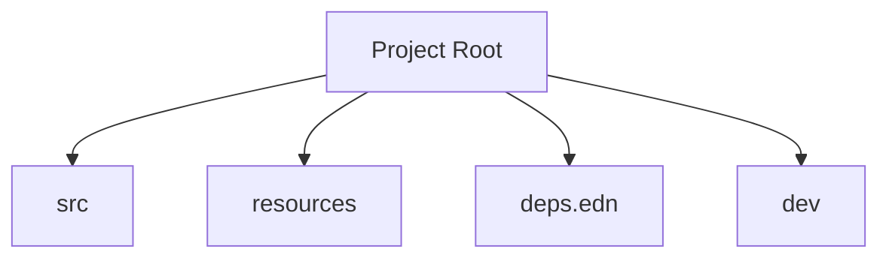
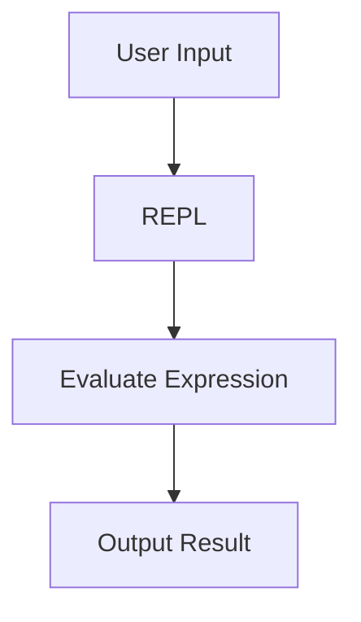

## 2.5.4 Creating a Project with tools.deps

As experienced Java developers, you are likely familiar with Maven or Gradle for managing dependencies and building projects. In Clojure, **tools.deps** is a powerful alternative that offers a flexible and straightforward way to manage dependencies and run your applications. In this section, we'll guide you through setting up a new Clojure project using tools.deps, writing a `deps.edn` file, and running your application using the Clojure CLI.

### Setting Up a New Project Directory

Before we dive into the specifics of the `deps.edn` file, let's start by setting up a new project directory. This is similar to creating a new project in Java, where you would typically set up a directory structure and configuration files.

1. **Create a New Directory**: Open your terminal and create a new directory for your Clojure project. You can name it anything you like, but for this example, we'll call it `my-clojure-app`.

   ```bash
   mkdir my-clojure-app
   cd my-clojure-app
   ```

2. **Initialize the Project Structure**: Unlike Java, where you might have a complex directory structure, Clojure projects are often simpler. For now, we'll just create a `src` directory to hold our source code.

   ```bash
   mkdir src
   ```

### Writing a `deps.edn` File

The `deps.edn` file is the heart of a Clojure project using tools.deps. It defines the dependencies and configuration for your project, similar to a `pom.xml` in Maven or a `build.gradle` in Gradle.

1. **Create a `deps.edn` File**: In the root of your project directory, create a file named `deps.edn`.

   ```bash
   touch deps.edn
   ```

2. **Define Project Dependencies**: Open the `deps.edn` file in your favorite text editor and define your project dependencies. Here's a simple example:

   ```clojure
   {:deps {org.clojure/clojure {:mvn/version "1.11.1"}}}
   ```

   - **Explanation**: This configuration specifies that our project depends on Clojure version 1.11.1. The `:deps` key is a map where each key is a dependency identifier, and the value is a map specifying the version and other options.

3. **Add Aliases for Custom Tasks**: You can define aliases in the `deps.edn` file to simplify running custom tasks. For example, you might want to create an alias for running a REPL or executing your application.

   ```clojure
   {:aliases
    {:run {:main-opts ["-m" "my-clojure-app.core"]}}}
   ```

   - **Explanation**: The `:aliases` key allows you to define custom tasks. In this example, the `:run` alias specifies that when we run this alias, it should execute the `my-clojure-app.core` namespace.

### Running the Application Using the Clojure CLI

With your project directory and `deps.edn` file set up, you're ready to run your application using the Clojure CLI.

1. **Start a REPL**: You can start a REPL (Read-Eval-Print Loop) to interactively develop and test your code. In your terminal, run:

   ```bash
   clj
   ```

   - **Explanation**: This command starts a Clojure REPL session. You can type Clojure expressions here and see the results immediately, which is a powerful way to experiment with your code.

2. **Run Your Application**: To run your application, use the alias you defined in the `deps.edn` file. In this case, we'll use the `:run` alias.

   ```bash
   clj -M:run
   ```

   - **Explanation**: The `-M` flag tells the Clojure CLI to use the `:main-opts` specified in the alias. This command will execute the `my-clojure-app.core` namespace.

### Understanding the `deps.edn` File Structure

The `deps.edn` file is a flexible and powerful way to manage your project's dependencies and configuration. Let's break down its structure and capabilities.

#### Basic Structure

The `deps.edn` file is a Clojure map with several keys that you can use to configure your project:

- **`:deps`**: A map of dependencies, where each key is a dependency identifier (usually a Maven coordinate), and the value is a map specifying the version and other options.
- **`:aliases`**: A map of aliases, which are custom tasks or configurations that you can run with the Clojure CLI.
- **`:paths`**: A vector of paths to include in the classpath. By default, this includes `src` and `resources`.

#### Example `deps.edn` File

Here's a more comprehensive example of a `deps.edn` file:

```clojure
{:deps {org.clojure/clojure {:mvn/version "1.11.1"}
        org.clojure/tools.logging {:mvn/version "1.1.0"}}
 :paths ["src" "resources"]
 :aliases
 {:dev {:extra-paths ["dev"]
        :extra-deps {org.clojure/tools.namespace {:mvn/version "1.0.0"}}
        :main-opts ["-m" "my-clojure-app.core"]}}}
```

- **Explanation**: This configuration includes two dependencies: Clojure and tools.logging. It also defines a `:dev` alias for development, which adds extra paths and dependencies.

### Comparing `deps.edn` with Java's Maven/Gradle

For Java developers, the `deps.edn` file might seem similar to Maven's `pom.xml` or Gradle's `build.gradle`. However, there are some key differences:

- **Simplicity**: The `deps.edn` file is typically simpler and more concise than a `pom.xml` or `build.gradle`. It focuses on dependencies and configuration without the need for complex XML or DSL syntax.
- **Flexibility**: tools.deps allows you to easily add or override dependencies and paths using aliases, which can be useful for different environments (e.g., development, testing, production).
- **Clojure Syntax**: The `deps.edn` file uses Clojure syntax, which means you can leverage your knowledge of Clojure to understand and modify it.

### Try It Yourself

Now that we've covered the basics of creating a project with tools.deps, it's time to try it yourself. Here are some exercises to help you practice:

1. **Add a New Dependency**: Modify your `deps.edn` file to include a new dependency, such as `cheshire` for JSON parsing. Run your application and use the new library in your code.

2. **Create a New Alias**: Define a new alias in your `deps.edn` file for running tests. Use the `clojure.test` library to write and run a simple test.

3. **Experiment with Paths**: Add a new directory to your project (e.g., `test`) and include it in the `:paths` vector. Create a new Clojure file in this directory and run it using the Clojure CLI.

### Diagrams and Visual Aids

To help visualize the structure of a Clojure project and the flow of data through your application, let's include some diagrams.

#### Project Structure Diagram



*Caption*: This diagram illustrates the typical structure of a Clojure project using tools.deps, with directories for source code, resources, and development.

#### Data Flow Diagram



*Caption*: This diagram shows the flow of data through a Clojure REPL session, from user input to evaluation and output.

### Key Takeaways

- **tools.deps** provides a simple and flexible way to manage dependencies and run Clojure projects.
- The `deps.edn` file is the central configuration file, similar to Maven's `pom.xml` or Gradle's `build.gradle`.
- You can define dependencies, aliases, and paths in the `deps.edn` file to customize your project setup.
- The Clojure CLI allows you to easily run your application and interact with a REPL for development.

By understanding and utilizing tools.deps, you can streamline your Clojure development process and take advantage of Clojure's powerful features. Now that we've explored how to create a project with tools.deps, let's apply these concepts to build and manage your Clojure applications effectively.

### Exercises and Practice Problems

1. **Dependency Management**: Add a new dependency to your `deps.edn` file and use it in your application. Try using a library like `clj-http` for making HTTP requests.

2. **Custom Aliases**: Create a custom alias for running a specific task, such as generating documentation or building a JAR file.

3. **Project Structure**: Experiment with different project structures by adding new directories and files. Update your `deps.edn` file to reflect these changes.

4. **REPL Exploration**: Use the REPL to explore and test different Clojure functions and libraries. Try writing a small script to automate a task.

5. **Compare with Java**: Create a simple Java project with Maven or Gradle and compare the setup process with your Clojure project using tools.deps.

### Further Reading and Resources

- [Official Clojure Documentation](https://clojure.org/guides/deps_and_cli)
- [ClojureDocs](https://clojuredocs.org/)
- [GitHub - Clojure Tools.deps](https://github.com/clojure/tools.deps.alpha)

These resources provide additional information and examples to help you deepen your understanding of tools.deps and Clojure development.

## Quiz: Mastering tools.deps for Clojure Projects



### What is the primary purpose of the `deps.edn` file in a Clojure project?

- [x] To define project dependencies and configuration
- [ ] To compile Clojure code into bytecode
- [ ] To manage user authentication
- [ ] To handle network requests

> **Explanation:** The `deps.edn` file is used to define project dependencies and configuration, similar to Maven's `pom.xml` or Gradle's `build.gradle`.

### Which command is used to start a Clojure REPL session?

- [x] clj
- [ ] mvn
- [ ] gradle
- [ ] java

> **Explanation:** The `clj` command is used to start a Clojure REPL session, allowing you to interactively develop and test your code.

### How do you specify a dependency version in the `deps.edn` file?

- [x] {:mvn/version "1.11.1"}
- [ ] <version>1.11.1</version>
- [ ] version: "1.11.1"
- [ ] "version": "1.11.1"

> **Explanation:** In the `deps.edn` file, you specify a dependency version using the `:mvn/version` key.

### What is the purpose of aliases in the `deps.edn` file?

- [x] To define custom tasks or configurations
- [ ] To encrypt project files
- [ ] To manage database connections
- [ ] To compile Java code

> **Explanation:** Aliases in the `deps.edn` file are used to define custom tasks or configurations that can be run with the Clojure CLI.

### Which of the following is a valid key in the `deps.edn` file?

- [x] :deps
- [ ] :compile
- [x] :aliases
- [ ] :network

> **Explanation:** The `:deps` and `:aliases` keys are valid in the `deps.edn` file for defining dependencies and custom tasks, respectively.

### What is the equivalent of Maven's `pom.xml` in a Clojure project using tools.deps?

- [x] deps.edn
- [ ] build.gradle
- [ ] project.clj
- [ ] settings.xml

> **Explanation:** The `deps.edn` file is the equivalent of Maven's `pom.xml` in a Clojure project using tools.deps.

### How can you run a specific alias defined in the `deps.edn` file?

- [x] clj -M:alias-name
- [ ] mvn alias-name
- [x] clj -A:alias-name
- [ ] gradle alias-name

> **Explanation:** You can run a specific alias defined in the `deps.edn` file using the `clj -M:alias-name` or `clj -A:alias-name` command.

### What is the default directory for Clojure source code in a project?

- [x] src
- [ ] main
- [ ] lib
- [ ] bin

> **Explanation:** The default directory for Clojure source code in a project is `src`.

### Which command is used to create a new directory in the terminal?

- [x] mkdir
- [ ] touch
- [ ] cd
- [ ] ls

> **Explanation:** The `mkdir` command is used to create a new directory in the terminal.

### True or False: The `deps.edn` file can include paths to additional directories.

- [x] True
- [ ] False

> **Explanation:** The `deps.edn` file can include paths to additional directories using the `:paths` key.


