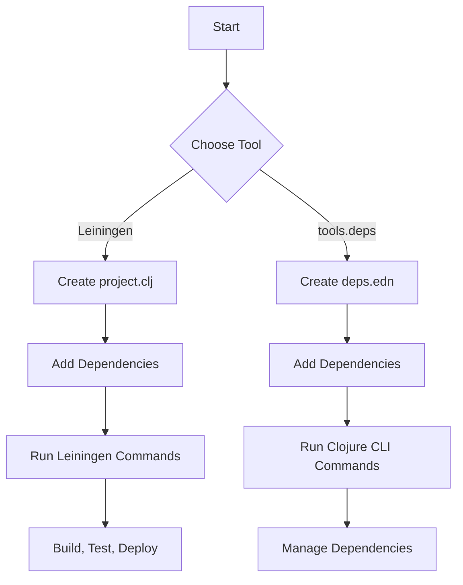

## 2.5.5 Comparing Leiningen and tools.deps

As experienced Java developers transitioning to Clojure, understanding the ecosystem's tools is crucial for efficient development. Two primary tools for managing Clojure projects are **Leiningen** and **tools.deps**. Each has its strengths and weaknesses, and the choice between them can significantly impact your workflow. In this section, we will explore these tools in detail, compare their features, and help you decide which one aligns best with your development needs.

### Introduction to Leiningen

**Leiningen** is a build automation tool for Clojure, akin to Maven or Gradle in the Java world. It is feature-rich, offering a wide array of plugins and configurations that cater to various aspects of Clojure development, from dependency management to project scaffolding and beyond.

#### Key Features of Leiningen

- **Comprehensive Build Tool**: Leiningen is not just for dependency management; it handles the entire build lifecycle, including compiling, testing, packaging, and deploying applications.
- **Extensive Plugin Ecosystem**: With a vast array of plugins, Leiningen can be extended to support additional functionalities like code linting, documentation generation, and more.
- **Project Templates**: Leiningen provides templates for quickly setting up new projects, which can be customized to fit specific needs.
- **REPL Integration**: It offers seamless integration with the Clojure REPL, making it easy to test and debug code interactively.

#### Leiningen Configuration Example

Leiningen uses a `project.clj` file for configuration. Here's a simple example:

```clojure
(defproject my-clojure-app "0.1.0-SNAPSHOT"
  :description "A simple Clojure application"
  :url "http://example.com/my-clojure-app"
  :dependencies [[org.clojure/clojure "1.10.3"]]
  :main ^:skip-aot my-clojure-app.core
  :target-path "target/%s"
  :profiles {:uberjar {:aot :all}})
```

**Explanation**:
- **`:dependencies`**: Specifies the libraries your project depends on.
- **`:main`**: Defines the entry point of the application.
- **`:profiles`**: Allows different configurations for development, testing, and production.

### Introduction to tools.deps

**tools.deps** is a more recent addition to the Clojure ecosystem, focusing primarily on dependency management. It is part of the Clojure CLI tools and offers a simpler, more flexible approach compared to Leiningen.

#### Key Features of tools.deps

- **Simplicity and Flexibility**: tools.deps is designed to be lightweight and flexible, allowing developers to manage dependencies without the overhead of a full build tool.
- **Data-Driven Configuration**: Uses a `deps.edn` file, which is a simple EDN (Extensible Data Notation) file, to specify dependencies and paths.
- **Focus on Dependency Management**: Unlike Leiningen, tools.deps does not handle the entire build lifecycle, making it ideal for projects where dependency management is the primary concern.
- **Integration with Clojure CLI**: Seamlessly integrates with the Clojure CLI tools, providing a straightforward command-line interface for managing projects.

#### tools.deps Configuration Example

Here's an example of a `deps.edn` file:

```clojure
{:deps {org.clojure/clojure {:mvn/version "1.10.3"}}
 :paths ["src" "resources"]
 :aliases {:dev {:extra-paths ["dev"]
                 :extra-deps {cider/cider-nrepl {:mvn/version "0.25.9"}}}}}
```

**Explanation**:
- **`:deps`**: Lists the dependencies with their Maven coordinates.
- **`:paths`**: Specifies the directories to include in the classpath.
- **`:aliases`**: Allows for custom configurations, such as adding extra dependencies for development.

### Comparing Leiningen and tools.deps

Now that we have a basic understanding of both tools, let's compare them across several dimensions to help you make an informed decision.

#### Feature Set

- **Leiningen**: Offers a comprehensive feature set with plugins and project templates, making it suitable for complex projects that require extensive build automation.
- **tools.deps**: Focuses on simplicity and flexibility, providing just enough functionality to manage dependencies effectively.

#### Configuration Complexity

- **Leiningen**: The `project.clj` file can become complex as more plugins and configurations are added. This complexity can be beneficial for large projects but may be overkill for smaller ones.
- **tools.deps**: The `deps.edn` file is straightforward and data-driven, making it easier to manage and understand, especially for projects that don't require extensive build configurations.

#### Community and Ecosystem

- **Leiningen**: Has been around longer and has a larger ecosystem of plugins and community support. It's a tried-and-tested tool for many Clojure developers.
- **tools.deps**: While newer, it is gaining traction due to its simplicity and integration with the Clojure CLI. The community is actively developing new tools and libraries that complement tools.deps.

#### Use Cases

- **Leiningen**: Ideal for projects that require a full build lifecycle management, including testing, packaging, and deployment.
- **tools.deps**: Best suited for projects where dependency management is the primary focus, or for developers who prefer a minimalist approach.

### Making the Decision

Choosing between Leiningen and tools.deps depends on your project's requirements and your personal preferences. Here are some questions to consider:

- **Do you need a full-featured build tool?** If yes, Leiningen might be the better choice.
- **Do you prefer simplicity and flexibility?** If so, tools.deps could be more suitable.
- **Are you working on a large project with complex build requirements?** Leiningen's extensive plugin ecosystem might be beneficial.
- **Do you want to leverage the latest Clojure CLI features?** tools.deps is tightly integrated with the Clojure CLI, making it a good fit.

### Code Comparison: Leiningen vs. tools.deps

Let's look at a practical example to see how each tool handles a simple task: adding a dependency and running a REPL.

#### Leiningen Example

1. Add a dependency to `project.clj`:

```clojure
:dependencies [[org.clojure/clojure "1.10.3"]
               [cheshire "5.10.0"]] ; JSON parsing library
```

2. Start a REPL with Leiningen:

```bash
lein repl
```

3. Use the dependency in the REPL:

```clojure
(require '[cheshire.core :as json])
(json/parse-string "{\"name\":\"Clojure\"}")
```

#### tools.deps Example

1. Add a dependency to `deps.edn`:

```clojure
{:deps {org.clojure/clojure {:mvn/version "1.10.3"}
        cheshire/cheshire {:mvn/version "5.10.0"}}}
```

2. Start a REPL with tools.deps:

```bash
clj
```

3. Use the dependency in the REPL:

```clojure
(require '[cheshire.core :as json])
(json/parse-string "{\"name\":\"Clojure\"}")
```

**Try It Yourself**: Modify the examples above to add a new dependency, such as `clj-http` for HTTP requests, and explore how each tool handles the change.

### Diagrams and Visual Aids

To further illustrate the differences, let's use a diagram to compare the workflow of Leiningen and tools.deps.



**Diagram Explanation**: This flowchart illustrates the typical workflow for setting up and managing a Clojure project using either Leiningen or tools.deps. It highlights the decision point and subsequent steps for each tool.

### Further Reading and Resources

For more information on Leiningen and tools.deps, consider exploring the following resources:

- [Leiningen Official Documentation](https://leiningen.org/)
- [tools.deps Guide](https://clojure.org/guides/deps_and_cli)
- [ClojureDocs](https://clojuredocs.org/)

### Exercises and Practice Problems

1. **Exercise 1**: Set up a new Clojure project using both Leiningen and tools.deps. Compare the setup process and note any differences in configuration and workflow.
2. **Exercise 2**: Add a new library to both a Leiningen and a tools.deps project. Document the steps and any challenges encountered.
3. **Exercise 3**: Create a simple Clojure application that reads from a file and prints its contents. Implement this using both tools and compare the ease of use and performance.

### Summary and Key Takeaways

- **Leiningen** is a comprehensive build tool with a rich ecosystem, suitable for projects requiring extensive build automation.
- **tools.deps** offers a simpler, more flexible approach focused on dependency management, ideal for projects where simplicity is key.
- The choice between these tools depends on your project's needs and your preference for complexity versus simplicity.
- Both tools have their strengths, and understanding them will help you make an informed decision for your Clojure development.

By exploring both Leiningen and tools.deps, you can leverage the strengths of each tool to enhance your Clojure development experience. Now that we've compared these essential tools, let's continue our journey into the world of Clojure, equipped with the knowledge to choose the right tool for the job.

## Quiz: Mastering Leiningen and tools.deps for Clojure Development



### Which tool is more feature-rich and offers extensive plugins?

- [x] Leiningen
- [ ] tools.deps
- [ ] Neither
- [ ] Both

> **Explanation:** Leiningen is known for its comprehensive feature set and extensive plugin ecosystem, making it suitable for complex projects.

### What is the primary focus of tools.deps?

- [x] Dependency management
- [ ] Full build lifecycle
- [ ] Testing automation
- [ ] Deployment

> **Explanation:** tools.deps is designed to be a lightweight tool focusing primarily on dependency management.

### Which file format does tools.deps use for configuration?

- [x] deps.edn
- [ ] project.clj
- [ ] build.xml
- [ ] pom.xml

> **Explanation:** tools.deps uses a `deps.edn` file, which is a simple EDN format for specifying dependencies and paths.

### What is a key advantage of using Leiningen?

- [x] Comprehensive build lifecycle management
- [ ] Simplicity and flexibility
- [ ] Minimalist approach
- [ ] Integration with Clojure CLI

> **Explanation:** Leiningen offers comprehensive build lifecycle management, including compiling, testing, and deploying applications.

### Which tool is tightly integrated with the Clojure CLI?

- [ ] Leiningen
- [x] tools.deps
- [ ] Both
- [ ] Neither

> **Explanation:** tools.deps is part of the Clojure CLI tools, providing a straightforward command-line interface for managing projects.

### What is a common use case for tools.deps?

- [x] Projects focusing on dependency management
- [ ] Complex build automation
- [ ] Extensive testing frameworks
- [ ] Deployment pipelines

> **Explanation:** tools.deps is ideal for projects where dependency management is the primary concern.

### Which tool uses a `project.clj` file for configuration?

- [x] Leiningen
- [ ] tools.deps
- [ ] Both
- [ ] Neither

> **Explanation:** Leiningen uses a `project.clj` file for configuration, specifying dependencies, plugins, and build settings.

### What is a benefit of using tools.deps over Leiningen?

- [x] Simplicity and ease of use
- [ ] Extensive plugin ecosystem
- [ ] Full build lifecycle management
- [ ] Project templates

> **Explanation:** tools.deps offers simplicity and ease of use, focusing on dependency management without the overhead of a full build tool.

### Which tool is better suited for large projects with complex build requirements?

- [x] Leiningen
- [ ] tools.deps
- [ ] Both
- [ ] Neither

> **Explanation:** Leiningen's extensive plugin ecosystem and comprehensive build lifecycle management make it suitable for large projects with complex build requirements.

### True or False: tools.deps can handle the entire build lifecycle like Leiningen.

- [ ] True
- [x] False

> **Explanation:** tools.deps focuses on dependency management and does not handle the entire build lifecycle like Leiningen.


