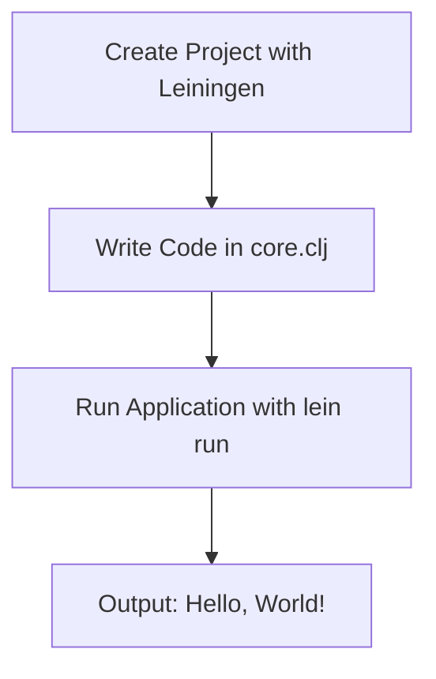

## 2.6.1 Writing a Simple "Hello, World!" Application

Welcome to your first step in Clojure programming! In this section, we will guide you through writing a simple "Hello, World!" application using Clojure. This exercise will help you get comfortable with the basic setup and execution of a Clojure program, leveraging your existing Java knowledge to ease the transition.

### Understanding the Basics

Before diving into the code, let's briefly discuss the tools we'll use:

- **Leiningen**: A build automation tool for Clojure, similar to Maven or Gradle in Java, which simplifies project management and dependencies.
- **Clojure CLI (`clj`)**: A command-line tool for running Clojure code, offering a straightforward way to execute scripts and manage dependencies.

### Setting Up Your First Clojure Project with Leiningen

Leiningen is a popular choice for managing Clojure projects. Let's create a simple project and run a "Hello, World!" application.

#### Step 1: Create a New Project

Open your terminal and execute the following command to create a new Leiningen project:

```bash
lein new app hello-world
```

This command creates a new directory named `hello-world` with a basic project structure. Let's explore the structure:

- **`project.clj`**: The project configuration file, similar to `pom.xml` in Maven.
- **`src/hello_world/core.clj`**: The main source file where we'll write our code.
- **`test/hello_world/core_test.clj`**: A placeholder for unit tests.

#### Step 2: Write the "Hello, World!" Code

Navigate to the `src/hello_world/core.clj` file and open it in your favorite editor. Replace its contents with the following code:

```clojure
(ns hello-world.core)

(defn -main
  "A simple function that prints 'Hello, World!' to the console."
  []
  (println "Hello, World!"))
```

**Explanation**:
- **`ns`**: Declares a namespace, similar to a package in Java.
- **`defn`**: Defines a function. Here, `-main` is the entry point of our application.
- **`println`**: A built-in function to print text to the console.

#### Step 3: Run the Application

To execute the program, navigate to the project directory in your terminal and run:

```bash
lein run
```

You should see the output:

```
Hello, World!
```

### Running a "Hello, World!" Program with Clojure CLI

The Clojure CLI offers a lightweight alternative to Leiningen for running Clojure code. Let's see how to achieve the same result using `clj`.

#### Step 1: Create a New Directory

Create a new directory for your project:

```bash
mkdir hello-world-cli
cd hello-world-cli
```

#### Step 2: Create a Source File

Inside the `hello-world-cli` directory, create a file named `hello_world.clj` and add the following code:

```clojure
(ns hello-world)

(defn -main
  "A simple function that prints 'Hello, World!' to the console."
  []
  (println "Hello, World!"))
```

#### Step 3: Create a `deps.edn` File

Create a `deps.edn` file in the same directory with the following content:

```clojure
{:paths ["."]
 :deps {}}
```

**Explanation**:
- **`:paths`**: Specifies directories to include in the classpath.
- **`:deps`**: Lists dependencies, which are empty for this simple example.

#### Step 4: Run the Application

Execute the following command to run your program:

```bash
clj -M -m hello-world
```

The `-M` flag specifies the main alias, and `-m` indicates the namespace containing the `-main` function. You should see:

```
Hello, World!
```

### Comparing Clojure and Java

Let's compare the Clojure "Hello, World!" with its Java counterpart:

**Java Example**:

```java
public class HelloWorld {
    public static void main(String[] args) {
        System.out.println("Hello, World!");
    }
}
```

**Comparison**:
- **Syntax**: Clojure's syntax is more concise, focusing on expressions rather than statements.
- **Entry Point**: Both use a `main` function, but Clojure's is defined with `defn`.
- **Printing**: Clojure uses `println`, similar to Java's `System.out.println`.

### Try It Yourself

Experiment with the following modifications to deepen your understanding:

- **Change the message**: Modify the string in `println` to print a different message.
- **Add a function**: Define a new function that returns a greeting message and call it from `-main`.
- **Use a loop**: Print "Hello, World!" multiple times using a loop construct.

### Visualizing the Flow

Below is a simple flowchart illustrating the process of creating and running a Clojure "Hello, World!" application using Leiningen:



**Diagram Explanation**: This flowchart outlines the steps from project creation to execution, highlighting the simplicity and efficiency of using Leiningen.

### Key Takeaways

- **Leiningen and Clojure CLI**: Both tools offer efficient ways to manage and run Clojure projects.
- **Conciseness**: Clojure's syntax is concise and expressive, reducing boilerplate code.
- **Functional Paradigm**: Emphasizes functions and immutability, contrasting with Java's object-oriented approach.

### Exercises

1. **Modify the Program**: Change the message to include your name.
2. **Add a Function**: Create a function that takes a name as an argument and prints a personalized greeting.
3. **Explore Leiningen**: Add a dependency to your `project.clj` and use it in your program.

### Further Reading

- [Official Clojure Documentation](https://clojure.org/)
- [Leiningen Documentation](https://leiningen.org/)
- [Clojure CLI Guide](https://clojure.org/guides/deps_and_cli)

Now that you've successfully written and executed your first Clojure program, you're ready to explore more complex applications and leverage Clojure's powerful features in your projects!

## Quiz: Test Your Understanding of Clojure "Hello, World!" Application



### What tool is used to create a new Clojure project in this guide?

- [x] Leiningen
- [ ] Maven
- [ ] Gradle
- [ ] Ant

> **Explanation:** Leiningen is the tool used to create and manage Clojure projects, similar to Maven or Gradle for Java.

### Which file contains the main function in a Leiningen project?

- [x] core.clj
- [ ] project.clj
- [ ] deps.edn
- [ ] build.gradle

> **Explanation:** The `core.clj` file typically contains the main function in a Leiningen project.

### How do you run a Clojure program using the Clojure CLI?

- [x] clj -M -m namespace
- [ ] java -jar program.jar
- [ ] lein run
- [ ] mvn exec:java

> **Explanation:** The `clj -M -m namespace` command runs a Clojure program using the Clojure CLI, specifying the main namespace.

### What is the purpose of the `println` function in Clojure?

- [x] To print text to the console
- [ ] To read input from the user
- [ ] To define a new function
- [ ] To declare a namespace

> **Explanation:** The `println` function in Clojure is used to print text to the console, similar to `System.out.println` in Java.

### What is the equivalent of Java's `System.out.println` in Clojure?

- [x] println
- [ ] print
- [ ] echo
- [ ] display

> **Explanation:** The `println` function in Clojure serves the same purpose as `System.out.println` in Java, printing text to the console.

### Which file is used to specify dependencies in a Clojure CLI project?

- [x] deps.edn
- [ ] project.clj
- [ ] pom.xml
- [ ] build.gradle

> **Explanation:** The `deps.edn` file is used to specify dependencies in a Clojure CLI project.

### What command is used to create a new Leiningen project?

- [x] lein new app project-name
- [ ] clj new project-name
- [ ] mvn archetype:generate
- [ ] gradle init

> **Explanation:** The `lein new app project-name` command creates a new Leiningen project.

### How do you define a function in Clojure?

- [x] defn
- [ ] function
- [ ] def
- [ ] fn

> **Explanation:** The `defn` keyword is used to define a function in Clojure.

### What is the purpose of the `ns` keyword in Clojure?

- [x] To declare a namespace
- [ ] To define a new function
- [ ] To print text to the console
- [ ] To import a library

> **Explanation:** The `ns` keyword is used to declare a namespace in Clojure, similar to a package in Java.

### True or False: Clojure's syntax is more concise than Java's.

- [x] True
- [ ] False

> **Explanation:** Clojure's syntax is generally more concise than Java's, focusing on expressions and reducing boilerplate code.


