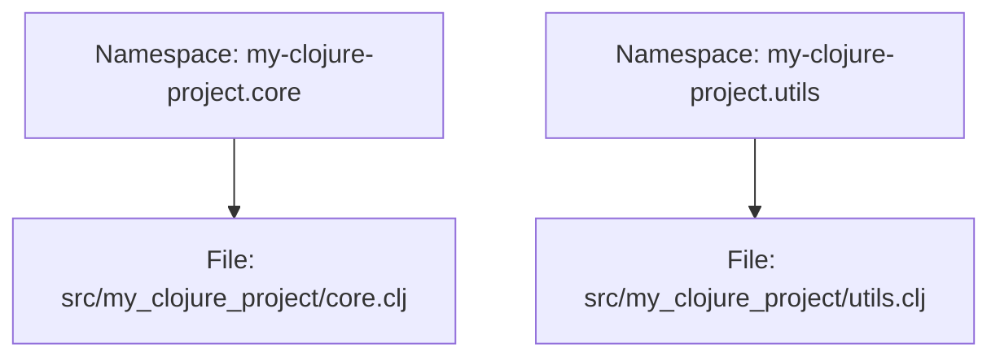

## 2.6.2 Understanding the Project Structure

As experienced Java developers, you're likely accustomed to the structured nature of Java projects, where packages, classes, and build configurations are clearly defined. Transitioning to Clojure, you'll find that while the language embraces simplicity and flexibility, it maintains a structured approach to project organization. In this section, we'll delve into the anatomy of a typical Clojure project, exploring the purpose of its directories and files, and how namespaces correspond to folder structures.

### The Anatomy of a Clojure Project

A well-organized Clojure project typically consists of several key components:

- **`src/` Directory**: This is where your source code resides. It is analogous to the `src/main/java` directory in a Java project.
- **`test/` Directory**: This directory holds your test code, similar to `src/test/java` in Java.
- **`project.clj` or `deps.edn`**: These files are used for project configuration, akin to `pom.xml` in Maven or `build.gradle` in Gradle.

Let's explore each of these components in detail.

### The `src/` Directory

The `src/` directory is the heart of your Clojure project. It contains all the source code that makes up your application. In Clojure, code is organized into **namespaces**, which are similar to Java packages. Each namespace corresponds to a file within the `src/` directory.

#### Example: Organizing Namespaces

Consider a simple Clojure project with the following structure:

```
my-clojure-project/
├── src/
│   └── my_clojure_project/
│       ├── core.clj
│       └── utils.clj
└── test/
    └── my_clojure_project/
        └── core_test.clj
```

In this structure, `my_clojure_project.core` and `my_clojure_project.utils` are namespaces. The `core.clj` file defines the `my_clojure_project.core` namespace, and `utils.clj` defines the `my_clojure_project.utils` namespace.

```clojure
;; src/my_clojure_project/core.clj
(ns my-clojure-project.core)

(defn greet [name]
  (str "Hello, " name "!"))

;; src/my_clojure_project/utils.clj
(ns my-clojure-project.utils)

(defn add [a b]
  (+ a b))
```

**Key Points:**

- **Namespace Declaration**: Each Clojure file begins with a `ns` form, declaring the namespace.
- **File Structure**: The directory structure mirrors the namespace hierarchy, using underscores for hyphens in file names.

### The `test/` Directory

The `test/` directory is where you place your test code. It mirrors the structure of the `src/` directory, ensuring that each namespace has a corresponding test file.

#### Example: Writing Tests

Continuing with our previous example, let's add a test for the `greet` function in `core.clj`.

```clojure
;; test/my_clojure_project/core_test.clj
(ns my-clojure-project.core-test
  (:require [clojure.test :refer :all]
            [my-clojure-project.core :refer :all]))

(deftest test-greet
  (testing "greet function"
    (is (= "Hello, Alice!" (greet "Alice")))))
```

**Key Points:**

- **Testing Framework**: Clojure uses `clojure.test` for unit testing, similar to JUnit in Java.
- **Test Structure**: Tests are organized in a parallel directory structure to the source code.

### Project Configuration: `project.clj` vs `deps.edn`

Clojure projects can be configured using either `project.clj` (for Leiningen) or `deps.edn` (for tools.deps). These files define dependencies, build configurations, and other project settings.

#### `project.clj` (Leiningen)

Leiningen is a popular build tool for Clojure, similar to Maven or Gradle in Java. The `project.clj` file is used to configure Leiningen projects.

```clojure
(defproject my-clojure-project "0.1.0-SNAPSHOT"
  :description "A simple Clojure project"
  :dependencies [[org.clojure/clojure "1.10.3"]]
  :main ^:skip-aot my-clojure-project.core
  :target-path "target/%s"
  :profiles {:uberjar {:aot :all}})
```

**Key Points:**

- **Dependencies**: Defined under `:dependencies`, similar to dependencies in `pom.xml`.
- **Main Namespace**: The `:main` key specifies the entry point of the application.
- **Profiles**: Used to define different build configurations, akin to Maven profiles.

#### `deps.edn` (tools.deps)

`tools.deps` is a newer dependency management tool for Clojure, offering a more flexible approach to project configuration.

```clojure
{:deps {org.clojure/clojure {:mvn/version "1.10.3"}}
 :paths ["src" "resources"]
 :aliases {:dev {:extra-paths ["dev"]
                 :extra-deps {cider/cider-nrepl {:mvn/version "0.25.9"}}}}}
```

**Key Points:**

- **Dependencies**: Specified under `:deps`, using Maven coordinates.
- **Paths**: The `:paths` key defines directories to include in the classpath.
- **Aliases**: Allow for custom configurations, similar to Maven profiles.

### Understanding Namespaces and Folder Structures

In Clojure, namespaces are a fundamental concept, providing a way to organize code and avoid naming conflicts. They are similar to Java packages but offer more flexibility.

#### Namespace and File Mapping

Namespaces in Clojure map directly to file paths. For example, the namespace `my-clojure-project.core` corresponds to the file `src/my_clojure_project/core.clj`.



*Diagram 1: Mapping of Clojure namespaces to file paths.*

**Key Points:**

- **Hyphen to Underscore**: In file names, hyphens in namespaces are replaced with underscores.
- **Directory Structure**: The directory structure reflects the namespace hierarchy.

### Comparing Clojure and Java Project Structures

While both Clojure and Java projects have structured approaches, there are notable differences:

- **Flexibility**: Clojure's namespace system is more flexible than Java's package system, allowing for easier refactoring and organization.
- **Configuration**: Clojure's `project.clj` and `deps.edn` offer simpler, more concise configurations compared to `pom.xml` or `build.gradle`.

#### Example: Java vs. Clojure Structure

**Java Project Structure:**

```
my-java-project/
├── src/
│   └── main/
│       └── java/
│           └── com/
│               └── example/
│                   └── App.java
└── pom.xml
```

**Clojure Project Structure:**

```
my-clojure-project/
├── src/
│   └── my_clojure_project/
│       └── core.clj
└── project.clj
```

**Key Differences:**

- **Directory Depth**: Java projects often have deeper directory structures due to package naming conventions.
- **Configuration Files**: Clojure's configuration files are typically shorter and more readable.

### Try It Yourself: Experimenting with Project Structure

To deepen your understanding, try the following exercises:

1. **Create a New Namespace**: Add a new namespace to your Clojure project and write a simple function. Ensure the directory structure reflects the namespace hierarchy.

2. **Write a Test**: Create a test for your new function in the `test/` directory. Use `clojure.test` to verify its behavior.

3. **Modify Configuration**: Experiment with adding a new dependency in `project.clj` or `deps.edn`. Observe how it affects your project's build process.

### Exercises and Practice Problems

1. **Namespace Refactoring**: Refactor an existing Java package structure into a Clojure namespace structure. Consider how the flexibility of namespaces can simplify your code organization.

2. **Dependency Management**: Compare the process of adding a dependency in Maven with adding one in Leiningen or tools.deps. What are the advantages and disadvantages of each approach?

3. **Build Configuration**: Explore the profiles feature in Leiningen. Create a profile for development and another for production, adjusting dependencies and configurations accordingly.

### Key Takeaways

- **Clojure Project Structure**: Understanding the structure of a Clojure project is crucial for effective development. The `src/` and `test/` directories, along with configuration files, form the backbone of your project.
- **Namespaces**: Clojure's namespace system offers flexibility and simplicity, allowing for clean code organization.
- **Configuration**: Whether using Leiningen or tools.deps, Clojure provides powerful tools for managing dependencies and build configurations.
- **Comparison with Java**: While there are similarities, Clojure's approach to project structure and configuration offers unique advantages, particularly in terms of flexibility and simplicity.

By mastering the structure of a Clojure project, you'll be well-equipped to transition from Java and harness the full power of Clojure's functional programming paradigm. Now that we've explored the project structure, let's move on to creating and running your first Clojure application.

## Quiz: Mastering Clojure Project Structure



### What is the primary purpose of the `src/` directory in a Clojure project?

- [x] To store the source code of the application
- [ ] To store test code
- [ ] To store configuration files
- [ ] To store compiled binaries

> **Explanation:** The `src/` directory is where the source code of the application resides, similar to `src/main/java` in a Java project.

### How do Clojure namespaces correspond to file paths?

- [x] Namespaces map directly to file paths, with hyphens replaced by underscores
- [ ] Namespaces are independent of file paths
- [ ] Namespaces map to file paths with no changes
- [ ] Namespaces map to file paths with underscores replaced by hyphens

> **Explanation:** In Clojure, namespaces map directly to file paths, with hyphens in the namespace replaced by underscores in the file name.

### Which file is used for project configuration in a Leiningen-based Clojure project?

- [x] `project.clj`
- [ ] `deps.edn`
- [ ] `pom.xml`
- [ ] `build.gradle`

> **Explanation:** `project.clj` is used for project configuration in a Leiningen-based Clojure project, similar to `pom.xml` in Maven.

### What is the role of the `test/` directory in a Clojure project?

- [x] To store test code
- [ ] To store source code
- [ ] To store configuration files
- [ ] To store documentation

> **Explanation:** The `test/` directory is used to store test code, mirroring the structure of the `src/` directory.

### In a `deps.edn` file, where are dependencies specified?

- [x] Under the `:deps` key
- [ ] Under the `:paths` key
- [ ] Under the `:aliases` key
- [ ] Under the `:profiles` key

> **Explanation:** In a `deps.edn` file, dependencies are specified under the `:deps` key.

### How does Clojure's namespace system compare to Java's package system?

- [x] Clojure's namespace system is more flexible
- [ ] Java's package system is more flexible
- [ ] Both systems are equally flexible
- [ ] Neither system is flexible

> **Explanation:** Clojure's namespace system is more flexible than Java's package system, allowing for easier refactoring and organization.

### What is a key advantage of using `deps.edn` over `project.clj`?

- [x] Greater flexibility in dependency management
- [ ] More detailed configuration options
- [ ] Better integration with Maven
- [ ] Easier to read for Java developers

> **Explanation:** `deps.edn` offers greater flexibility in dependency management compared to `project.clj`.

### What is the purpose of the `:main` key in `project.clj`?

- [x] To specify the entry point of the application
- [ ] To define the main dependency
- [ ] To set the main configuration file
- [ ] To indicate the main test file

> **Explanation:** The `:main` key in `project.clj` specifies the entry point of the application.

### True or False: In Clojure, the directory structure must exactly match the namespace hierarchy.

- [x] True
- [ ] False

> **Explanation:** In Clojure, the directory structure must match the namespace hierarchy, with hyphens in namespaces replaced by underscores in file names.

### Which tool is newer and offers a more flexible approach to project configuration in Clojure?

- [x] tools.deps
- [ ] Leiningen
- [ ] Maven
- [ ] Gradle

> **Explanation:** tools.deps is a newer tool that offers a more flexible approach to project configuration in Clojure.


