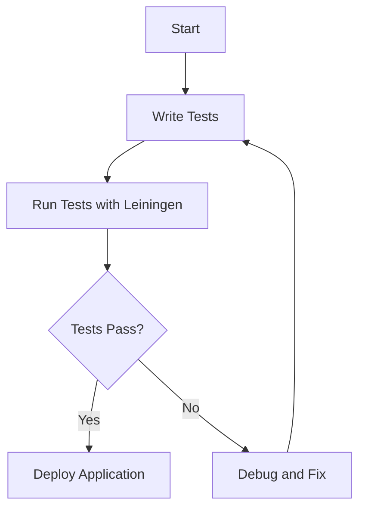

## 2.6.3 Running and Testing Your Clojure Application

As experienced Java developers, you're likely familiar with the importance of running and testing your applications to ensure they function correctly and efficiently. In this section, we will explore how to run and test Clojure applications, drawing parallels to Java where applicable. We'll cover writing tests using the `clojure.test` framework, running those tests with tools like Leiningen, and understanding the nuances of Clojure's testing ecosystem.

### Running Your Clojure Application

Running a Clojure application is straightforward, especially if you've set up your development environment correctly. Let's start by understanding how to execute a simple Clojure program.

#### Running a Clojure Program

To run a Clojure program, you typically use the REPL (Read-Eval-Print Loop) or a build tool like Leiningen. Here's a basic example of running a Clojure program using Leiningen:

1. **Create a Clojure Project**: If you haven't already, create a new Clojure project using Leiningen.

   ```bash
   lein new app my-clojure-app
   ```

2. **Navigate to the Project Directory**: Move into the newly created project directory.

   ```bash
   cd my-clojure-app
   ```

3. **Run the Application**: Use Leiningen to run the application.

   ```bash
   lein run
   ```

This command will execute the `-main` function defined in your `core.clj` file, similar to how you might run a Java application with a `main` method.

#### Understanding the `-main` Function

In Clojure, the `-main` function serves as the entry point for your application, akin to the `main` method in Java. Here's a simple example:

```clojure
(ns my-clojure-app.core)

(defn -main
  "A simple main function that prints a greeting."
  [& args]
  (println "Hello, Clojure World!"))
```

**Try It Yourself**: Modify the `-main` function to accept command-line arguments and print them. This exercise will help you understand how to handle input in Clojure applications.

### Writing Tests with `clojure.test`

Testing is a crucial part of software development, ensuring that your code behaves as expected. Clojure provides a built-in testing framework called `clojure.test`, which is similar to JUnit in Java.

#### Setting Up Your Test Environment

Before writing tests, ensure your project is set up to include a test directory. By default, Leiningen creates a `test` directory for you. Here's how your project structure might look:

```
my-clojure-app/
├── src/
│   └── my_clojure_app/
│       └── core.clj
└── test/
    └── my_clojure_app/
        └── core_test.clj
```

#### Writing Your First Test

Let's write a simple test for the `-main` function. Create a file named `core_test.clj` in the `test/my_clojure_app` directory:

```clojure
(ns my-clojure-app.core-test
  (:require [clojure.test :refer :all]
            [my-clojure-app.core :refer :all]))

(deftest test-main
  (testing "Main function output"
    (is (= "Hello, Clojure World!" (with-out-str (-main))))))
```

**Explanation**:
- **`deftest`**: Defines a test function.
- **`testing`**: Provides a description for the test.
- **`is`**: Asserts that the expression evaluates to true.
- **`with-out-str`**: Captures the output of the `-main` function for comparison.

#### Running Tests with Leiningen

To run your tests, use the following command:

```bash
lein test
```

This command will execute all tests in the `test` directory and report the results.

### Advanced Testing Techniques

Clojure's testing capabilities extend beyond simple assertions. Let's explore some advanced techniques that can enhance your testing strategy.

#### Property-Based Testing with `test.check`

Property-based testing allows you to define properties that your code should satisfy for a wide range of inputs. Clojure's `test.check` library facilitates this approach.

**Example**: Testing a function that reverses a list.

```clojure
(ns my-clojure-app.core-test
  (:require [clojure.test :refer :all]
            [clojure.test.check :as tc]
            [clojure.test.check.generators :as gen]
            [clojure.test.check.properties :as prop]))

(defn reverse-list [lst]
  (reverse lst))

(def reverse-property
  (prop/for-all [v (gen/vector gen/int)]
    (= v (reverse-list (reverse-list v)))))

(tc/quick-check 100 reverse-property)
```

**Explanation**:
- **`prop/for-all`**: Defines a property that should hold for all generated inputs.
- **`gen/vector`**: Generates vectors of integers.
- **`tc/quick-check`**: Runs the property test with a specified number of iterations.

**Try It Yourself**: Modify the `reverse-list` function to introduce a bug and observe how `test.check` detects it.

#### Mocking and Stubbing

In Clojure, you can use libraries like `with-redefs` to mock or stub functions during testing. This is similar to using Mockito in Java.

**Example**: Mocking a function that fetches data from an external API.

```clojure
(ns my-clojure-app.core-test
  (:require [clojure.test :refer :all]
            [my-clojure-app.core :refer :all]))

(defn fetch-data []
  ;; Simulate fetching data from an API
  {:status 200 :body "Data"})

(deftest test-fetch-data
  (with-redefs [fetch-data (fn [] {:status 200 :body "Mocked Data"})]
    (is (= {:status 200 :body "Mocked Data"} (fetch-data)))))
```

**Explanation**:
- **`with-redefs`**: Temporarily redefines a function for the scope of the test.

### Comparing Clojure Testing with Java

Let's compare Clojure's testing approach with Java's JUnit framework to highlight similarities and differences.

#### Similarities
- **Test Structure**: Both use annotations or macros to define test cases.
- **Assertions**: Both frameworks provide assertion mechanisms to validate test outcomes.

#### Differences
- **Functional vs. Object-Oriented**: Clojure's functional nature allows for more concise and expressive tests.
- **Immutability**: Clojure's immutable data structures simplify state management in tests.

### Visualizing the Testing Process

To better understand the testing workflow in Clojure, let's visualize it using a flowchart.



**Diagram Explanation**: This flowchart illustrates the iterative process of writing, running, and debugging tests in Clojure.

### Best Practices for Testing in Clojure

- **Write Small, Focused Tests**: Ensure each test covers a specific aspect of your code.
- **Use Property-Based Testing**: Leverage `test.check` for comprehensive input coverage.
- **Mock External Dependencies**: Use `with-redefs` to isolate tests from external systems.
- **Run Tests Frequently**: Integrate testing into your development workflow to catch issues early.

### Exercises and Practice Problems

1. **Exercise 1**: Write a test for a function that calculates the factorial of a number. Use both `clojure.test` and `test.check` to validate your implementation.

2. **Exercise 2**: Refactor a Java method that uses mutable state into a Clojure function with immutable data structures. Write tests to ensure functional equivalence.

3. **Exercise 3**: Create a mock for a function that interacts with a database. Write tests to verify the behavior of your application when the database is unavailable.

### Key Takeaways

- Running and testing Clojure applications is a seamless process with tools like Leiningen and `clojure.test`.
- Clojure's functional nature and immutability simplify testing and enhance code reliability.
- Advanced testing techniques, such as property-based testing, provide robust validation for your code.
- By leveraging your Java experience, you can effectively transition to Clojure's testing ecosystem and adopt best practices.

Now that we've explored running and testing Clojure applications, let's apply these concepts to ensure your applications are robust and reliable.

## Quiz: Mastering Clojure Application Testing



### What is the primary function used to define a test in Clojure?

- [x] `deftest`
- [ ] `defn`
- [ ] `defmacro`
- [ ] `def`

> **Explanation:** `deftest` is used to define a test in Clojure, similar to how you define a function with `defn`.

### Which command is used to run tests in a Clojure project using Leiningen?

- [x] `lein test`
- [ ] `lein run`
- [ ] `lein compile`
- [ ] `lein deploy`

> **Explanation:** `lein test` is the command used to execute tests in a Clojure project managed by Leiningen.

### What library in Clojure is used for property-based testing?

- [x] `test.check`
- [ ] `clojure.test`
- [ ] `midje`
- [ ] `speclj`

> **Explanation:** `test.check` is a Clojure library for property-based testing, allowing you to define properties that your code should satisfy.

### How can you temporarily redefine a function in Clojure for testing purposes?

- [x] `with-redefs`
- [ ] `defn`
- [ ] `let`
- [ ] `fn`

> **Explanation:** `with-redefs` is used to temporarily redefine a function within the scope of a test.

### What is the equivalent of Java's `main` method in a Clojure application?

- [x] `-main`
- [ ] `main`
- [ ] `start`
- [ ] `init`

> **Explanation:** The `-main` function serves as the entry point for a Clojure application, similar to Java's `main` method.

### Which of the following is a benefit of using immutable data structures in tests?

- [x] Simplified state management
- [ ] Increased complexity
- [ ] More memory usage
- [ ] Slower execution

> **Explanation:** Immutable data structures simplify state management by ensuring that data does not change unexpectedly during tests.

### What is the purpose of the `testing` macro in `clojure.test`?

- [x] To provide a description for a test
- [ ] To execute a test
- [ ] To define a test
- [ ] To import test libraries

> **Explanation:** The `testing` macro is used to provide a description for a test, helping to organize and document test cases.

### Which of the following is NOT a testing library in Clojure?

- [x] `clojure.core`
- [ ] `clojure.test`
- [ ] `test.check`
- [ ] `midje`

> **Explanation:** `clojure.core` is the core library of Clojure and not specifically a testing library.

### What is the role of `with-out-str` in a test?

- [x] To capture output for comparison
- [ ] To execute a function
- [ ] To define a test
- [ ] To import libraries

> **Explanation:** `with-out-str` captures the output of a function, allowing you to compare it against expected results in a test.

### True or False: Clojure's `clojure.test` framework is similar to Java's JUnit.

- [x] True
- [ ] False

> **Explanation:** Clojure's `clojure.test` framework is similar to Java's JUnit in that both provide a structured way to define and run tests.


