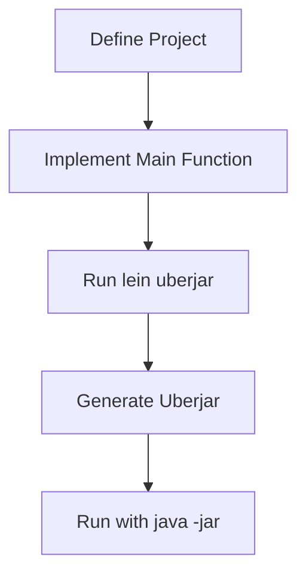

## 2.6.4 Packaging Your Application

As experienced Java developers, you're likely familiar with the concept of packaging applications into JAR files for distribution. In Clojure, we often use **Leiningen**, a popular build automation tool, to create an **uberjar**—a standalone executable JAR file that contains all the dependencies your application needs to run. This section will guide you through the process of creating an uberjar for your Clojure application and explain how to run it.

### Understanding the Uberjar

An **uberjar** is a JAR file that includes not only your compiled Clojure code but also all the libraries and dependencies your application requires. This makes it easy to distribute and run your application on any system with a compatible Java Runtime Environment (JRE).

#### Why Use an Uberjar?

- **Portability**: An uberjar is self-contained, meaning you can run it on any machine with a JRE without needing to install additional dependencies.
- **Simplicity**: It simplifies deployment by reducing the complexity of managing dependencies on the target system.
- **Consistency**: Ensures that the exact versions of libraries used during development are included in the deployment.

### Creating an Uberjar with Leiningen

Leiningen simplifies the process of building and packaging Clojure applications. Let's walk through the steps to create an uberjar.

#### Step 1: Define Your Project

First, ensure your project is set up correctly. Your `project.clj` file should define the necessary dependencies and configurations. Here's an example:

```clojure
(defproject my-clojure-app "0.1.0-SNAPSHOT"
  :description "A simple Clojure application"
  :url "http://example.com/my-clojure-app"
  :license {:name "Eclipse Public License"
            :url "http://www.eclipse.org/legal/epl-v10.html"}
  :dependencies [[org.clojure/clojure "1.10.3"]
                 [ring/ring-core "1.9.0"]
                 [compojure "1.6.2"]]
  :main ^:skip-aot my-clojure-app.core
  :target-path "target/%s"
  :profiles {:uberjar {:aot :all}})
```

**Key Points**:
- **`:main`**: Specifies the namespace containing the `-main` function, which serves as the entry point for your application.
- **`:profiles`**: The `:uberjar` profile is used to specify settings for building the uberjar, such as Ahead-of-Time (AOT) compilation.

#### Step 2: Implement the Main Function

Ensure your application has a `-main` function, which is the entry point when the uberjar is executed. Here's a simple example:

```clojure
(ns my-clojure-app.core
  (:gen-class))

(defn -main
  "The main entry point for the application."
  [& args]
  (println "Hello, Clojure World!"))
```

**Explanation**:
- **`:gen-class`**: This directive is necessary for generating a Java class file that can be executed by the JVM.
- **`-main`**: This function will be called when the uberjar is executed.

#### Step 3: Build the Uberjar

To create the uberjar, run the following command in your terminal:

```bash
lein uberjar
```

This command compiles your Clojure code, resolves dependencies, and packages everything into a single JAR file located in the `target` directory.

#### Step 4: Run the Packaged Application

Once the uberjar is created, you can run it using the `java -jar` command:

```bash
java -jar target/my-clojure-app-0.1.0-SNAPSHOT-standalone.jar
```

This command executes the `-main` function defined in your application, producing the output:

```
Hello, Clojure World!
```

### Comparing with Java

In Java, creating an executable JAR involves compiling your code and specifying a `Main-Class` attribute in the `MANIFEST.MF` file. Clojure's approach with Leiningen automates much of this process, making it more straightforward, especially when dealing with dependencies.

**Java Example**:
```java
// Main.java
public class Main {
    public static void main(String[] args) {
        System.out.println("Hello, Java World!");
    }
}
```

To package this Java application, you would typically use a build tool like Maven or Gradle, which involves more configuration compared to Leiningen's concise `project.clj`.

### Advanced Packaging Options

Leiningen provides several options to customize the packaging process:

- **Excluding Dependencies**: You can exclude certain dependencies from the uberjar if they are provided by the runtime environment.
- **Customizing the Manifest**: Modify the `:manifest` entry in `project.clj` to include additional metadata.
- **Including Resources**: Ensure that any non-code resources (e.g., configuration files) are included in the JAR.

### Try It Yourself

To deepen your understanding, try modifying the example application:

1. **Add a New Dependency**: Include a library like `cheshire` for JSON processing and update the `-main` function to parse a JSON string.
2. **Change the Entry Point**: Create a new namespace with a different `-main` function and update the `:main` entry in `project.clj`.
3. **Experiment with Profiles**: Define a new profile in `project.clj` for a different environment (e.g., development vs. production) and observe how it affects the build process.

### Visualizing the Packaging Process

Below is a diagram illustrating the flow of creating an uberjar with Leiningen:



**Diagram Explanation**: This flowchart shows the steps from defining your project to running the packaged application, highlighting the simplicity and efficiency of using Leiningen for Clojure projects.

### Further Reading

For more detailed information on Leiningen and uberjars, consider exploring the following resources:

- [Leiningen Official Documentation](https://leiningen.org/)
- [ClojureDocs: Leiningen](https://clojuredocs.org/leiningen)
- [Clojure's Official Guide on Packaging](https://clojure.org/guides/deployment)

### Exercises

1. **Create a New Clojure Project**: Set up a new project with Leiningen, add dependencies, and package it into an uberjar.
2. **Modify the Build Process**: Experiment with different profiles and observe how they affect the resulting JAR.
3. **Integrate with Java**: Create a simple Java class that calls your Clojure code packaged in an uberjar.

### Key Takeaways

- **Uberjars** provide a convenient way to package and distribute Clojure applications, ensuring all dependencies are included.
- **Leiningen** simplifies the build process, making it accessible even for complex projects.
- Understanding how to package applications effectively is crucial for deploying Clojure applications in production environments.

By mastering the process of creating and running uberjars, you can ensure your Clojure applications are ready for deployment in any environment. Now, let's apply these concepts to build robust, portable applications with Clojure!

## Quiz: Mastering Clojure Application Packaging



### What is an uberjar in Clojure?

- [x] A standalone executable JAR file containing all dependencies
- [ ] A JAR file without any dependencies
- [ ] A JAR file used only for testing
- [ ] A JAR file that cannot be executed

> **Explanation:** An uberjar is a standalone executable JAR file that includes all the dependencies needed to run a Clojure application.

### Which tool is commonly used to create an uberjar in Clojure?

- [x] Leiningen
- [ ] Maven
- [ ] Gradle
- [ ] Ant

> **Explanation:** Leiningen is the most commonly used tool for building and packaging Clojure applications, including creating uberjars.

### What is the purpose of the `:main` entry in `project.clj`?

- [x] To specify the namespace containing the entry point function
- [ ] To list all dependencies
- [ ] To define the version of Clojure being used
- [ ] To specify the output directory for the JAR file

> **Explanation:** The `:main` entry in `project.clj` specifies the namespace where the `-main` function is located, which serves as the entry point for the application.

### How do you run a Clojure uberjar?

- [x] Using the `java -jar` command
- [ ] Using the `lein run` command
- [ ] Using the `clj` command
- [ ] Using the `lein uberjar` command

> **Explanation:** Once an uberjar is created, it can be executed using the `java -jar` command, which runs the `-main` function defined in the application.

### What does the `:profiles` key in `project.clj` do?

- [x] It defines different build configurations
- [ ] It lists all project dependencies
- [ ] It specifies the main entry point
- [ ] It sets the project version

> **Explanation:** The `:profiles` key in `project.clj` is used to define different build configurations, such as settings for creating an uberjar.

### What is the benefit of using an uberjar?

- [x] It simplifies deployment by including all dependencies
- [ ] It reduces the size of the application
- [ ] It requires no Java Runtime Environment
- [ ] It is only used for testing

> **Explanation:** An uberjar simplifies deployment by packaging all necessary dependencies into a single executable JAR file.

### What command is used to create an uberjar with Leiningen?

- [x] `lein uberjar`
- [ ] `lein jar`
- [ ] `lein build`
- [ ] `lein package`

> **Explanation:** The `lein uberjar` command is used to compile the Clojure code, resolve dependencies, and package everything into a standalone JAR file.

### Can you exclude dependencies from an uberjar?

- [x] Yes, by configuring the `:profiles` in `project.clj`
- [ ] No, all dependencies must be included
- [ ] Yes, by manually editing the JAR file
- [ ] No, dependencies are always included automatically

> **Explanation:** You can exclude certain dependencies from an uberjar by configuring the `:profiles` in `project.clj`.

### What is the role of `:gen-class` in a Clojure namespace?

- [x] It generates a Java class file for execution
- [ ] It defines the main entry point
- [ ] It specifies the dependencies
- [ ] It sets the project version

> **Explanation:** The `:gen-class` directive is used to generate a Java class file that can be executed by the JVM, necessary for the `-main` function.

### True or False: An uberjar can be run on any system with a compatible JRE.

- [x] True
- [ ] False

> **Explanation:** True. An uberjar is self-contained and can be run on any system with a compatible Java Runtime Environment (JRE).


