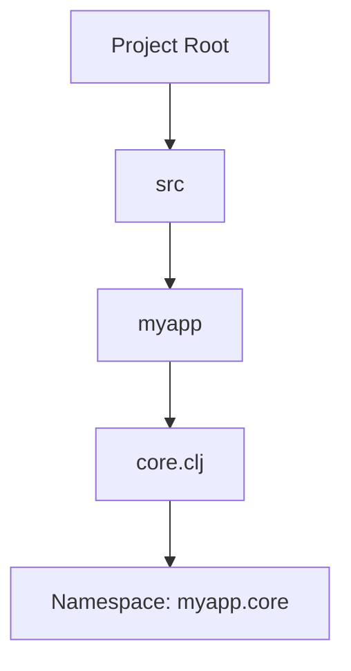

## 2.7.1 Namespaces and Files

As experienced Java developers, you're already familiar with the concept of packages and classes to organize code. In Clojure, we use **namespaces** to achieve a similar goal. This section will guide you through the intricacies of Clojure namespaces, how they relate to file paths, and how they differ from Java's approach. We'll explore namespace declaration with the `ns` macro, the correspondence between namespaces and file paths, and best practices for organizing your Clojure projects.

### Understanding Namespaces in Clojure

Namespaces in Clojure serve as a way to group related functions, macros, and variables, much like packages in Java. They help avoid naming conflicts and make code more modular and maintainable.

#### Namespace Declaration with `ns`

In Clojure, you declare a namespace using the `ns` macro at the top of your file. This declaration is crucial as it sets the context for the code that follows. Here's a simple example:

```clojure
(ns myapp.core
  (:require [clojure.string :as str]))

(defn greet [name]
  (str "Hello, " name "!"))
```

- **`ns` Macro**: Declares the namespace for the file. In this case, `myapp.core`.
- **`:require`**: Imports other namespaces. Here, we import `clojure.string` and alias it as `str`.

#### Correspondence Between Namespaces and File Paths

In Clojure, there's a direct correspondence between namespaces and file paths. This is similar to Java, where the package name corresponds to the directory structure. For example, the namespace `myapp.core` would typically be located in a file path like `src/myapp/core.clj`.

**Key Points:**

- **Namespace Hierarchy**: The hierarchy of namespaces is reflected in the directory structure.
- **File Naming**: The file name should match the last segment of the namespace. For `myapp.core`, the file should be `core.clj`.

#### Comparing with Java Packages

In Java, packages are declared with the `package` keyword, and classes are organized within these packages. Here's a comparison:

- **Java**: `package com.example.myapp;`
- **Clojure**: `(ns com.example.myapp)`

Both languages use a hierarchical structure, but Clojure's namespaces are more flexible as they can contain functions, macros, and variables without the need for class definitions.

### Code Example: Java vs. Clojure

Let's compare a simple Java class with a Clojure namespace to illustrate the differences:

**Java Example:**

```java
package com.example.myapp;

public class Greeter {
    public static String greet(String name) {
        return "Hello, " + name + "!";
    }
}
```

**Clojure Example:**

```clojure
(ns com.example.myapp)

(defn greet [name]
  (str "Hello, " name "!"))
```

**Key Differences:**

- **Class vs. Namespace**: Java requires a class to encapsulate methods, while Clojure uses namespaces to group functions.
- **Static Methods vs. Functions**: Java uses static methods for utility functions, whereas Clojure uses standalone functions.

### Best Practices for Organizing Clojure Code

1. **Consistent Naming**: Ensure that your namespace names reflect the directory structure and file names.
2. **Modular Design**: Break down your code into smaller, reusable namespaces.
3. **Use Aliases**: Use the `:as` keyword to create short aliases for frequently used namespaces.
4. **Avoid Circular Dependencies**: Design your namespaces to avoid circular dependencies, which can lead to complex and hard-to-maintain code.

### Try It Yourself

Experiment with creating a new Clojure project and organizing it using namespaces. Try the following:

- Create a new namespace for utility functions.
- Use the `:require` keyword to import this namespace into another file.
- Refactor a Java class into a Clojure namespace, focusing on the differences in structure and syntax.

### Diagrams and Visual Aids

To better understand the relationship between namespaces and file paths, let's look at a visual representation:



**Diagram Explanation**: This diagram illustrates how the file `core.clj` within the `myapp` directory corresponds to the namespace `myapp.core`.

### Exercises and Practice Problems

1. **Create a Namespace**: Write a Clojure file that declares a namespace and includes a few functions. Ensure the file path matches the namespace.
2. **Refactor Java Code**: Take a simple Java class and refactor it into a Clojure namespace. Focus on translating methods into functions.
3. **Namespace Aliasing**: Practice using the `:require` keyword with aliases. Create a small project that uses multiple namespaces and imports them with aliases.

### Key Takeaways

- **Namespaces in Clojure**: Serve as a way to organize code, similar to Java packages.
- **Direct Correspondence**: Between namespaces and file paths, ensuring a clear project structure.
- **Flexibility**: Clojure's namespaces provide more flexibility than Java's class-based structure.

By understanding and effectively using namespaces, you can create well-organized, maintainable Clojure projects. As you continue to explore Clojure, remember to leverage namespaces to keep your code modular and free from conflicts.

### Further Reading

For more information on Clojure namespaces and best practices, consider exploring the following resources:

- [Official Clojure Documentation on Namespaces](https://clojure.org/reference/namespaces)
- [ClojureDocs: Namespace Examples](https://clojuredocs.org/clojure.core/ns)
- [GitHub: Clojure Project Examples](https://github.com/clojure)

Now that we've explored how namespaces and files work in Clojure, let's apply these concepts to organize your projects effectively.

## Quiz: Mastering Clojure Namespaces and Files



### What is the primary purpose of namespaces in Clojure?

- [x] To organize code and avoid naming conflicts
- [ ] To compile code into bytecode
- [ ] To manage memory allocation
- [ ] To handle exceptions

> **Explanation:** Namespaces in Clojure are used to organize code and avoid naming conflicts, similar to packages in Java.

### How do you declare a namespace in Clojure?

- [x] Using the `ns` macro
- [ ] Using the `namespace` keyword
- [ ] Using the `package` keyword
- [ ] Using the `import` statement

> **Explanation:** The `ns` macro is used to declare a namespace in Clojure.

### What is the relationship between namespaces and file paths in Clojure?

- [x] Namespaces correspond directly to file paths
- [ ] Namespaces are independent of file paths
- [ ] Namespaces are only used at runtime
- [ ] Namespaces are stored in a separate configuration file

> **Explanation:** In Clojure, namespaces correspond directly to file paths, ensuring a clear project structure.

### How can you import another namespace in Clojure?

- [x] Using the `:require` keyword
- [ ] Using the `import` statement
- [ ] Using the `include` directive
- [ ] Using the `load` function

> **Explanation:** The `:require` keyword is used to import other namespaces in Clojure.

### Which of the following is a best practice for organizing Clojure code?

- [x] Use consistent naming for namespaces and file paths
- [ ] Avoid using namespaces altogether
- [x] Break down code into smaller, reusable namespaces
- [ ] Use a single namespace for the entire project

> **Explanation:** Consistent naming and modular design are best practices for organizing Clojure code.

### What is the equivalent of a Java package in Clojure?

- [x] A namespace
- [ ] A class
- [ ] A module
- [ ] A library

> **Explanation:** A namespace in Clojure serves a similar purpose to a package in Java.

### How do you create an alias for a namespace in Clojure?

- [x] Using the `:as` keyword
- [ ] Using the `alias` function
- [ ] Using the `rename` directive
- [ ] Using the `set-alias` command

> **Explanation:** The `:as` keyword is used to create an alias for a namespace in Clojure.

### What is a key difference between Java classes and Clojure namespaces?

- [x] Clojure namespaces can contain functions without classes
- [ ] Java classes cannot contain methods
- [ ] Clojure namespaces require class definitions
- [ ] Java classes are only used for data storage

> **Explanation:** Clojure namespaces can contain functions without the need for class definitions, unlike Java.

### Which keyword is used to avoid circular dependencies in Clojure?

- [x] There is no specific keyword; it's a design consideration
- [ ] `:avoid`
- [ ] `:nocircle`
- [ ] `:prevent`

> **Explanation:** Avoiding circular dependencies is a design consideration, not a specific keyword in Clojure.

### True or False: In Clojure, the file name must always match the namespace name.

- [x] True
- [ ] False

> **Explanation:** In Clojure, the file name should match the last segment of the namespace to maintain a clear project structure.


