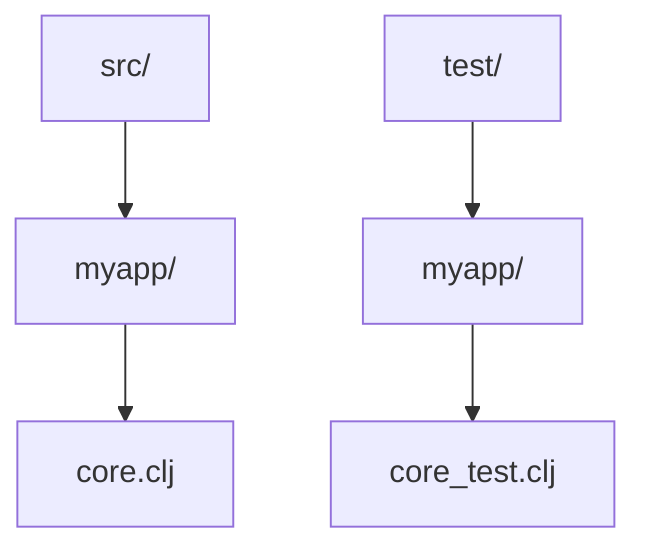

## 2.7.2 Source and Test Directories

As experienced Java developers, you're likely familiar with the importance of maintaining a clear and organized project structure. In Clojure, just like in Java, separating production code from test code is crucial for maintaining a clean codebase and ensuring efficient development and testing processes. In this section, we'll explore the best practices for organizing source and test directories in Clojure projects, drawing parallels with Java practices to facilitate your transition.

### Importance of Separating Source and Test Directories

Separating source and test directories is a fundamental practice in software development. It helps in:

- **Maintaining Clarity**: By keeping production code and test code in separate directories, you can easily navigate your project and focus on the relevant parts.
- **Facilitating Continuous Integration**: Automated build tools can easily distinguish between code that needs to be compiled and code that needs to be executed as tests.
- **Encouraging Best Practices**: A clear separation encourages developers to write tests and maintain a high standard of code quality.

In Java, this separation is typically achieved using directories like `src/main/java` for source code and `src/test/java` for test code. Clojure follows a similar pattern, but with its own conventions.

### Organizing Source and Test Directories in Clojure

In Clojure projects, the source and test directories are typically organized as follows:

- **Source Directory**: `src/`
- **Test Directory**: `test/`

This structure is straightforward and aligns with the conventions used by popular Clojure build tools like Leiningen and tools.deps. Let's delve deeper into how to organize these directories effectively.

#### Source Directory (`src/`)

The `src/` directory contains all the production code for your Clojure application. Each namespace in Clojure corresponds to a file within this directory. For example, a namespace `myapp.core` would be located at `src/myapp/core.clj`.

**Example:**

```clojure
(ns myapp.core)

(defn greet
  "Returns a greeting message."
  [name]
  (str "Hello, " name "!"))
```

**Key Points:**

- **Namespace Correspondence**: Ensure that the directory structure mirrors the namespace hierarchy. This makes it easier to locate files and understand the project organization.
- **File Naming**: Use lowercase with hyphens for file names, matching the namespace (e.g., `myapp.core` becomes `myapp/core.clj`).

#### Test Directory (`test/`)

The `test/` directory mirrors the structure of the `src/` directory, containing test files that correspond to each source file. This organization helps in locating tests for specific functionalities quickly.

**Example:**

```clojure
(ns myapp.core-test
  (:require [clojure.test :refer :all]
            [myapp.core :refer :all]))

(deftest test-greet
  (testing "greet function"
    (is (= "Hello, Alice!" (greet "Alice")))))
```

**Key Points:**

- **Mirrored Structure**: The test directory should mirror the source directory structure. For instance, tests for `myapp.core` should be in `test/myapp/core_test.clj`.
- **Naming Conventions**: Append `-test` to the namespace of the test files to distinguish them from source files.

### Comparing Clojure and Java Project Structures

In Java, the Maven or Gradle build tools enforce a structured directory layout, which includes separate directories for source and test code. Clojure's approach is similar, but with a focus on namespaces rather than package hierarchies.

**Java Example:**

```
src/
  main/
    java/
      com/
        example/
          MyApp.java
  test/
    java/
      com/
        example/
          MyAppTest.java
```

**Clojure Example:**

```
src/
  myapp/
    core.clj
test/
  myapp/
    core_test.clj
```

**Diagram: Clojure Project Structure**



*Caption: This diagram illustrates the typical structure of a Clojure project, highlighting the separation between source and test directories.*

### Best Practices for Organizing Clojure Projects

1. **Consistent Naming**: Ensure that namespaces and file paths are consistent. This consistency aids in navigation and reduces errors.
2. **Use of `clojure.test`**: Leverage the `clojure.test` library for writing and organizing tests. It provides a robust framework for unit testing in Clojure.
3. **Leverage Build Tools**: Use tools like Leiningen or tools.deps to manage dependencies and automate tasks like running tests and building the project.
4. **Documentation**: Include documentation within your source and test files to explain the purpose and functionality of the code.

### Try It Yourself: Organizing a Simple Clojure Project

Let's create a simple Clojure project and organize it using the principles discussed.

1. **Create a New Project**: Use Leiningen to create a new project.

   ```bash
   lein new app myapp
   ```

2. **Navigate to the Project Directory**:

   ```bash
   cd myapp
   ```

3. **Create a New Namespace**: Add a new namespace in `src/myapp/hello.clj`.

   ```clojure
   (ns myapp.hello)

   (defn say-hello
     "Returns a hello message."
     [name]
     (str "Hello, " name "!"))
   ```

4. **Add a Test**: Create a corresponding test in `test/myapp/hello_test.clj`.

   ```clojure
   (ns myapp.hello-test
     (:require [clojure.test :refer :all]
               [myapp.hello :refer :all]))

   (deftest test-say-hello
     (testing "say-hello function"
       (is (= "Hello, Bob!" (say-hello "Bob")))))
   ```

5. **Run the Tests**: Use Leiningen to run the tests.

   ```bash
   lein test
   ```

### Exercises

1. **Create a New Function**: Add a new function to your project and write corresponding tests.
2. **Refactor the Code**: Try refactoring the code to improve readability and maintainability, ensuring that all tests still pass.
3. **Explore Build Tools**: Experiment with different build tools like tools.deps and compare their features with Leiningen.

### Summary and Key Takeaways

- **Separation of Concerns**: Keeping source and test code separate is crucial for maintaining a clean and organized project structure.
- **Mirrored Structure**: Ensure that the test directory mirrors the source directory to facilitate easy navigation and testing.
- **Leverage Tools**: Use Clojure's build tools to automate tasks and manage dependencies efficiently.
- **Consistent Naming**: Maintain consistency in naming conventions for namespaces and files to reduce errors and improve code readability.

By following these practices, you'll be well-equipped to manage your Clojure projects effectively, leveraging your Java experience to ensure a smooth transition. Now that we've explored how to organize source and test directories in Clojure, let's apply these concepts to build robust and maintainable applications.

## Quiz: Mastering Source and Test Directories in Clojure



### What is the primary purpose of separating source and test directories in a Clojure project?

- [x] To maintain clarity and organization in the codebase
- [ ] To reduce the size of the project
- [ ] To increase the complexity of the project
- [ ] To make the project harder to navigate

> **Explanation:** Separating source and test directories helps maintain clarity and organization, making it easier to navigate and manage the codebase.

### In Clojure, where should the production code be placed?

- [x] In the `src/` directory
- [ ] In the `test/` directory
- [ ] In the `main/` directory
- [ ] In the `resources/` directory

> **Explanation:** The `src/` directory is used for production code in Clojure projects.

### How should test files be named in relation to their corresponding source files in Clojure?

- [x] Append `-test` to the namespace of the test files
- [ ] Use the same name as the source files
- [ ] Use uppercase letters for test files
- [ ] Use a different naming convention entirely

> **Explanation:** Test files should append `-test` to the namespace to distinguish them from source files.

### What is the equivalent of Java's `src/main/java` directory in a Clojure project?

- [x] `src/`
- [ ] `test/`
- [ ] `resources/`
- [ ] `lib/`

> **Explanation:** The `src/` directory in Clojure is equivalent to Java's `src/main/java` for production code.

### Which tool is commonly used in Clojure for managing dependencies and running tests?

- [x] Leiningen
- [ ] Maven
- [ ] Gradle
- [ ] Ant

> **Explanation:** Leiningen is a popular tool in Clojure for managing dependencies and running tests.

### What is the purpose of the `clojure.test` library?

- [x] To provide a framework for unit testing in Clojure
- [ ] To compile Clojure code
- [ ] To manage project dependencies
- [ ] To deploy Clojure applications

> **Explanation:** The `clojure.test` library provides a framework for writing and organizing unit tests in Clojure.

### How should the directory structure of the `test/` directory relate to the `src/` directory?

- [x] It should mirror the structure of the `src/` directory
- [ ] It should be completely different
- [ ] It should be a flat structure
- [ ] It should only contain one file

> **Explanation:** The `test/` directory should mirror the structure of the `src/` directory to facilitate easy navigation and testing.

### What is a key benefit of using consistent naming conventions in a Clojure project?

- [x] It reduces errors and improves code readability
- [ ] It increases the complexity of the project
- [ ] It makes the project harder to navigate
- [ ] It decreases code readability

> **Explanation:** Consistent naming conventions reduce errors and improve code readability, making the project easier to navigate and maintain.

### What command is used to run tests in a Leiningen-managed Clojure project?

- [x] `lein test`
- [ ] `lein run`
- [ ] `lein compile`
- [ ] `lein deploy`

> **Explanation:** The `lein test` command is used to run tests in a Leiningen-managed Clojure project.

### True or False: In Clojure, the `test/` directory is used for production code.

- [ ] True
- [x] False

> **Explanation:** False. The `test/` directory is used for test code, not production code.


