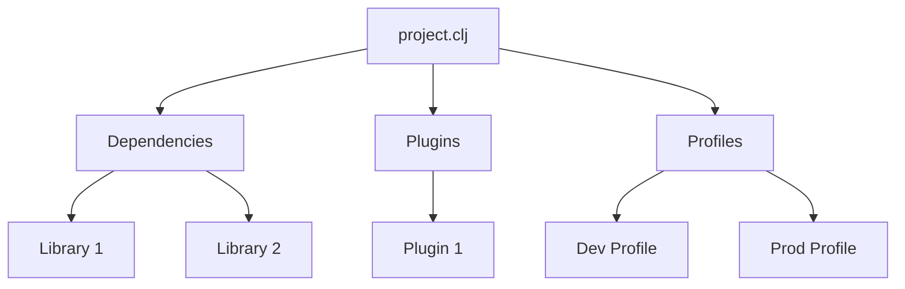
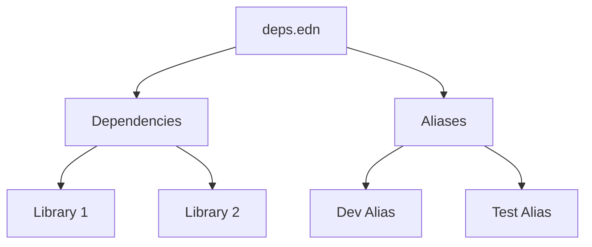

## 2.7.3 Configuration Files

As experienced Java developers transitioning to Clojure, understanding the role of configuration files is crucial for managing dependencies, build configurations, and environment-specific settings. In this section, we will delve into the intricacies of `project.clj` and `deps.edn`, the two primary configuration files used in Clojure projects. We will also explore `profiles.clj`, which is specific to Leiningen, for handling environment-specific configurations.

### Understanding Clojure's Configuration Files

Clojure projects rely on configuration files to define dependencies, manage build processes, and configure various aspects of the development environment. These files serve as the backbone of a Clojure project, akin to `pom.xml` in Maven or `build.gradle` in Gradle for Java projects.

#### `project.clj` in Leiningen

Leiningen is a popular build automation tool for Clojure, and `project.clj` is its configuration file. This file defines the project's metadata, dependencies, plugins, and build instructions.

##### Structure of `project.clj`

A typical `project.clj` file includes the following sections:

- **Project Metadata**: Defines the project name, version, and description.
- **Dependencies**: Lists the libraries and their versions required by the project.
- **Plugins**: Specifies Leiningen plugins for additional functionality.
- **Profiles**: Allows for environment-specific configurations.
- **Build Instructions**: Includes tasks such as compiling, testing, and packaging.

Here's an example of a simple `project.clj` file:

```clojure
(defproject my-clojure-project "0.1.0-SNAPSHOT"
  :description "A sample Clojure project"
  :url "http://example.com/my-clojure-project"
  :license {:name "Eclipse Public License"
            :url "http://www.eclipse.org/legal/epl-v10.html"}
  :dependencies [[org.clojure/clojure "1.10.3"]
                 [ring/ring-core "1.9.0"]]
  :plugins [[lein-ring "0.12.5"]]
  :profiles {:dev {:dependencies [[javax.servlet/servlet-api "2.5"]
                                  [ring/ring-mock "0.4.0"]]}})
```

**Explanation:**

- **Project Metadata**: The `defproject` macro defines the project name, version, and description.
- **Dependencies**: The `:dependencies` vector lists the required libraries, such as Clojure itself and Ring for web applications.
- **Plugins**: The `:plugins` vector specifies Leiningen plugins, like `lein-ring` for Ring applications.
- **Profiles**: The `:profiles` map allows for environment-specific settings, such as additional dependencies for development.

##### Comparing `project.clj` with Java's `pom.xml`

In Java, `pom.xml` is used to manage dependencies and build configurations in Maven projects. While `project.clj` serves a similar purpose, it is more concise and leverages Clojure's syntax for configuration. Here's a comparison:

- **Conciseness**: `project.clj` is typically shorter and easier to read than `pom.xml`.
- **Syntax**: `project.clj` uses Clojure's syntax, making it more consistent with the rest of the codebase.
- **Profiles**: Both `project.clj` and `pom.xml` support profiles for environment-specific configurations, but `project.clj` integrates them more seamlessly.

#### `deps.edn` in Tools.deps

Tools.deps is another popular tool for managing dependencies in Clojure, and `deps.edn` is its configuration file. Unlike Leiningen, Tools.deps focuses solely on dependency management, providing a more flexible and lightweight approach.

##### Structure of `deps.edn`

A typical `deps.edn` file includes the following sections:

- **Dependencies**: Lists the libraries and their versions required by the project.
- **Aliases**: Defines additional configurations and tasks.

Here's an example of a simple `deps.edn` file:

```clojure
{:deps {org.clojure/clojure {:mvn/version "1.10.3"}
        ring/ring-core {:mvn/version "1.9.0"}}
 :aliases {:dev {:extra-deps {javax.servlet/servlet-api {:mvn/version "2.5"}
                              ring/ring-mock {:mvn/version "0.4.0"}}}}}
```

**Explanation:**

- **Dependencies**: The `:deps` map lists the required libraries, using Maven coordinates for versioning.
- **Aliases**: The `:aliases` map allows for additional configurations, such as extra dependencies for development.

##### Comparing `deps.edn` with Java's `build.gradle`

In Java, `build.gradle` is used to manage dependencies and build configurations in Gradle projects. While `deps.edn` serves a similar purpose, it is more focused on dependency management and lacks the build automation features of Gradle. Here's a comparison:

- **Focus**: `deps.edn` is solely focused on dependencies, while `build.gradle` includes build automation features.
- **Syntax**: `deps.edn` uses Clojure's syntax, making it more consistent with the rest of the codebase.
- **Flexibility**: `deps.edn` provides more flexibility in defining dependencies and aliases.

#### `profiles.clj` for Environment-Specific Settings

In Leiningen, `profiles.clj` is used to define environment-specific settings, such as additional dependencies, plugins, and build instructions. This file allows developers to customize the development environment without modifying the main `project.clj` file.

##### Structure of `profiles.clj`

A typical `profiles.clj` file includes the following sections:

- **Profiles**: Defines environment-specific settings, such as additional dependencies and plugins.

Here's an example of a simple `profiles.clj` file:

```clojure
{:dev {:dependencies [[javax.servlet/servlet-api "2.5"]
                      [ring/ring-mock "0.4.0"]]
       :plugins [[lein-figwheel "0.5.20"]]}
 :prod {:jvm-opts ["-Dconf=prod-config.edn"]}}
```

**Explanation:**

- **Profiles**: The `:dev` profile includes additional dependencies and plugins for development, while the `:prod` profile specifies JVM options for production.

##### Comparing `profiles.clj` with Java's `application.properties`

In Java, `application.properties` is used to define environment-specific settings in Spring Boot projects. While `profiles.clj` serves a similar purpose, it provides more flexibility and integrates seamlessly with Leiningen. Here's a comparison:

- **Flexibility**: `profiles.clj` allows for more complex configurations, such as additional dependencies and plugins.
- **Integration**: `profiles.clj` integrates seamlessly with Leiningen, providing a unified configuration experience.

### Try It Yourself: Experimenting with Configuration Files

To gain a deeper understanding of Clojure's configuration files, try modifying the examples provided above. Here are some suggestions:

- **Add a New Dependency**: Add a new library to the `:dependencies` section of `project.clj` or `deps.edn` and observe how it affects the project.
- **Create a New Profile**: Create a new profile in `profiles.clj` with custom settings and test its impact on the development environment.
- **Compare with Java**: Create a similar configuration in a Java project using `pom.xml` or `build.gradle` and compare the differences.

### Diagrams and Visualizations

To enhance your understanding of Clojure's configuration files, let's explore some diagrams that illustrate the flow of data and configuration in a Clojure project.



**Diagram 1: Structure of `project.clj`**

This diagram illustrates the structure of a `project.clj` file, highlighting the relationships between dependencies, plugins, and profiles.



**Diagram 2: Structure of `deps.edn`**

This diagram illustrates the structure of a `deps.edn` file, highlighting the relationships between dependencies and aliases.

### Key Takeaways

- **Configuration Files**: `project.clj` and `deps.edn` are the primary configuration files in Clojure projects, defining dependencies and build configurations.
- **Environment-Specific Settings**: `profiles.clj` allows for environment-specific settings in Leiningen projects.
- **Comparison with Java**: Clojure's configuration files are more concise and flexible than their Java counterparts, providing a seamless integration with the Clojure ecosystem.

### Exercises and Practice Problems

1. **Modify `project.clj`**: Add a new dependency to a `project.clj` file and verify its inclusion in the project.
2. **Create a New Alias**: Add a new alias to a `deps.edn` file and test its functionality.
3. **Compare with Java**: Create a similar configuration in a Java project using `pom.xml` or `build.gradle` and compare the differences.
4. **Experiment with Profiles**: Create a new profile in `profiles.clj` and observe its impact on the development environment.

By mastering Clojure's configuration files, you will be well-equipped to manage dependencies, build configurations, and environment-specific settings in your projects. Now that we've explored the intricacies of configuration files, let's apply these concepts to streamline your development workflow.

## Quiz: Mastering Clojure Configuration Files



### What is the primary purpose of `project.clj` in a Clojure project?

- [x] To define dependencies, plugins, and build instructions
- [ ] To manage database connections
- [ ] To configure the operating system
- [ ] To store user credentials

> **Explanation:** `project.clj` is used to define dependencies, plugins, and build instructions in a Clojure project.

### Which file is used by Tools.deps for dependency management?

- [x] `deps.edn`
- [ ] `project.clj`
- [ ] `profiles.clj`
- [ ] `build.gradle`

> **Explanation:** `deps.edn` is the configuration file used by Tools.deps for managing dependencies in Clojure projects.

### What is the role of `profiles.clj` in Leiningen?

- [x] To define environment-specific settings
- [ ] To store application logs
- [ ] To manage user sessions
- [ ] To configure network settings

> **Explanation:** `profiles.clj` is used in Leiningen to define environment-specific settings, such as additional dependencies and plugins.

### How does `deps.edn` differ from `build.gradle`?

- [x] `deps.edn` focuses solely on dependency management
- [ ] `deps.edn` includes build automation features
- [ ] `deps.edn` is used for Java projects
- [ ] `deps.edn` is a binary file

> **Explanation:** `deps.edn` focuses solely on dependency management, unlike `build.gradle`, which includes build automation features.

### Which section in `project.clj` is used to specify additional dependencies for development?

- [x] `:profiles`
- [ ] `:dependencies`
- [ ] `:plugins`
- [ ] `:build`

> **Explanation:** The `:profiles` section in `project.clj` is used to specify additional dependencies for development.

### What is the equivalent of `pom.xml` in a Clojure project using Leiningen?

- [x] `project.clj`
- [ ] `deps.edn`
- [ ] `profiles.clj`
- [ ] `application.properties`

> **Explanation:** `project.clj` is the equivalent of `pom.xml` in a Clojure project using Leiningen.

### Which file allows for defining aliases in a Clojure project?

- [x] `deps.edn`
- [ ] `project.clj`
- [ ] `profiles.clj`
- [ ] `settings.xml`

> **Explanation:** `deps.edn` allows for defining aliases in a Clojure project.

### What is a key advantage of using `project.clj` over `pom.xml`?

- [x] Conciseness and readability
- [ ] Support for Java projects
- [ ] Binary format
- [ ] Integration with Python

> **Explanation:** `project.clj` is more concise and readable compared to `pom.xml`.

### Which file is specific to Leiningen for managing environment-specific settings?

- [x] `profiles.clj`
- [ ] `deps.edn`
- [ ] `project.clj`
- [ ] `build.gradle`

> **Explanation:** `profiles.clj` is specific to Leiningen for managing environment-specific settings.

### True or False: `deps.edn` can be used to define build automation tasks.

- [ ] True
- [x] False

> **Explanation:** `deps.edn` is focused solely on dependency management and does not include build automation tasks.


