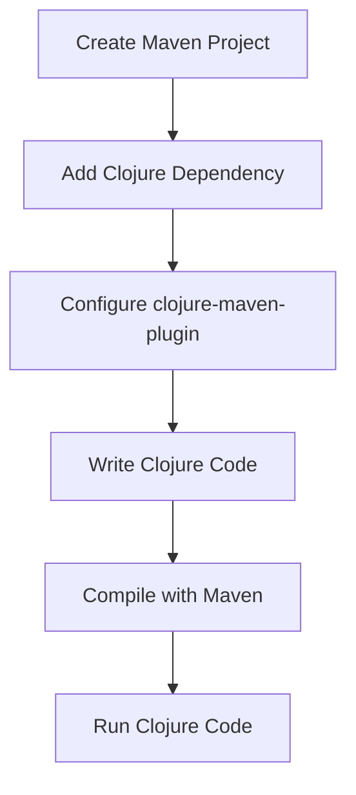

## 2.8.1 Using Clojure with Maven

As experienced Java developers, you're likely familiar with Maven, a powerful build automation tool used primarily for Java projects. In this section, we'll explore how to integrate Clojure into your Maven projects, allowing you to leverage the functional programming capabilities of Clojure alongside your existing Java codebase. We'll cover setting up a Maven project to include Clojure code, configuring the `pom.xml` with necessary dependencies and plugins, and using the `clojure-maven-plugin` for compilation.

### Setting Up a Maven Project for Clojure

To begin, let's set up a basic Maven project that includes Clojure code. This involves creating a standard Maven project structure and configuring the `pom.xml` file to recognize and compile Clojure code.

#### Step 1: Create a Maven Project

First, create a new Maven project using your preferred IDE or command line. If you're using the command line, you can execute the following command:

```bash
mvn archetype:generate -DgroupId=com.example -DartifactId=clojure-maven-example -DarchetypeArtifactId=maven-archetype-quickstart -DinteractiveMode=false
```

This command generates a simple Maven project with the group ID `com.example` and artifact ID `clojure-maven-example`.

#### Step 2: Project Structure

Once the project is created, you'll have a directory structure similar to the following:

```
clojure-maven-example/
├── pom.xml
└── src
    ├── main
    │   ├── java
    │   └── resources
    └── test
        ├── java
        └── resources
```

To integrate Clojure, we'll add a `clojure` directory under `src/main` for our Clojure source files:

```
clojure-maven-example/
└── src
    ├── main
    │   ├── clojure
    │   ├── java
    │   └── resources
    └── test
        ├── java
        └── resources
```

### Configuring `pom.xml` for Clojure

The `pom.xml` file is the heart of a Maven project, defining its configuration, dependencies, and build plugins. To include Clojure, we need to add the Clojure dependency and configure the `clojure-maven-plugin`.

#### Step 3: Add Clojure Dependency

Add the Clojure dependency to your `pom.xml`:

```xml
<dependencies>
    <dependency>
        <groupId>org.clojure</groupId>
        <artifactId>clojure</artifactId>
        <version>1.11.1</version>
    </dependency>
</dependencies>
```

This dependency ensures that the Clojure language is available for your project.

#### Step 4: Configure `clojure-maven-plugin`

The `clojure-maven-plugin` is essential for compiling and running Clojure code within a Maven project. Add the following plugin configuration to your `pom.xml`:

```xml
<build>
    <plugins>
        <plugin>
            <groupId>com.theoryinpractise</groupId>
            <artifactId>clojure-maven-plugin</artifactId>
            <version>1.8.4</version>
            <executions>
                <execution>
                    <goals>
                        <goal>compile</goal>
                        <goal>testCompile</goal>
                    </goals>
                </execution>
            </executions>
            <configuration>
                <sourceDirectories>
                    <sourceDirectory>${project.basedir}/src/main/clojure</sourceDirectory>
                </sourceDirectories>
            </configuration>
        </plugin>
    </plugins>
</build>
```

This configuration tells Maven to use the `clojure-maven-plugin` to compile Clojure source files located in `src/main/clojure`.

### Using the `clojure-maven-plugin`

With the `pom.xml` configured, you can now compile and run Clojure code within your Maven project. Let's explore how to do this with a simple example.

#### Step 5: Write Clojure Code

Create a new Clojure file in `src/main/clojure`. For example, create a file named `core.clj` with the following content:

```clojure
(ns com.example.core)

(defn hello-world []
  (println "Hello, World from Clojure!"))
```

This simple Clojure function prints a greeting message to the console.

#### Step 6: Compile and Run

To compile and run your Clojure code, use the following Maven commands:

- **Compile Clojure Code**: Run `mvn clojure:compile` to compile the Clojure source files.
- **Run Clojure Code**: Use `mvn clojure:run` to execute the Clojure code. You may need to specify the main class if your project has multiple entry points.

### Comparing with Java

To highlight the differences and similarities between Java and Clojure, let's compare a simple "Hello, World!" program in both languages.

**Java Example:**

```java
package com.example;

public class HelloWorld {
    public static void main(String[] args) {
        System.out.println("Hello, World from Java!");
    }
}
```

**Clojure Example:**

```clojure
(ns com.example.core)

(defn hello-world []
  (println "Hello, World from Clojure!"))
```

**Comparison:**

- **Syntax**: Clojure's syntax is more concise and expressive, focusing on functions and immutability.
- **Execution**: Both languages can be executed within a Maven project, but Clojure requires the `clojure-maven-plugin` for compilation.
- **Functional vs. Imperative**: Clojure emphasizes functional programming, while Java traditionally follows an imperative style.

### Try It Yourself

Experiment with the Clojure code by modifying the `hello-world` function to accept a name as a parameter and print a personalized greeting. Here's a starting point:

```clojure
(defn hello-world [name]
  (println (str "Hello, " name ", from Clojure!")))
```

### Diagrams and Visuals

To better understand the flow of data and compilation process, let's visualize the integration of Clojure with Maven using a flowchart.



**Diagram Caption**: This flowchart illustrates the steps to integrate Clojure into a Maven project, from project creation to running Clojure code.

### Further Reading

For more information on using Clojure with Maven, consider exploring the following resources:

- [Official Clojure Documentation](https://clojure.org/)
- [Clojure Maven Plugin GitHub Repository](https://github.com/talios/clojure-maven-plugin)
- [Maven Official Documentation](https://maven.apache.org/)

### Exercises

1. **Modify the Clojure Function**: Extend the `hello-world` function to include a farewell message.
2. **Integrate Java and Clojure**: Create a Java class that calls the Clojure `hello-world` function.
3. **Explore Maven Goals**: Experiment with different Maven goals such as `clean`, `install`, and `package`.

### Key Takeaways

- **Integration**: Clojure can be seamlessly integrated into Maven projects, allowing for a blend of functional and imperative programming styles.
- **Configuration**: Proper configuration of the `pom.xml` is crucial for compiling and running Clojure code.
- **Comparison**: Understanding the differences between Java and Clojure can help leverage the strengths of both languages in a single project.

By following these steps and experimenting with the examples, you'll gain a solid understanding of how to use Clojure with Maven, enhancing your ability to build robust, functional applications.

## Clojure with Maven Integration Quiz



### What is the primary purpose of the `clojure-maven-plugin`?

- [x] To compile and run Clojure code within a Maven project.
- [ ] To manage Java dependencies in a Maven project.
- [ ] To convert Java code to Clojure code.
- [ ] To optimize Maven build times.

> **Explanation:** The `clojure-maven-plugin` is used to compile and run Clojure code within a Maven project, enabling integration of Clojure into Java-based projects.

### Which directory should Clojure source files be placed in a Maven project?

- [x] `src/main/clojure`
- [ ] `src/main/java`
- [ ] `src/test/clojure`
- [ ] `src/resources`

> **Explanation:** Clojure source files should be placed in the `src/main/clojure` directory to be recognized and compiled by the `clojure-maven-plugin`.

### How do you add the Clojure dependency in a Maven `pom.xml`?

- [x] By adding a `<dependency>` element with `org.clojure` as the group ID.
- [ ] By adding a `<plugin>` element with `org.clojure` as the group ID.
- [ ] By adding a `<dependency>` element with `com.clojure` as the group ID.
- [ ] By adding a `<plugin>` element with `com.clojure` as the group ID.

> **Explanation:** The Clojure dependency is added by including a `<dependency>` element with `org.clojure` as the group ID in the `pom.xml`.

### What command is used to compile Clojure code in a Maven project?

- [x] `mvn clojure:compile`
- [ ] `mvn compile`
- [ ] `mvn clojure:run`
- [ ] `mvn package`

> **Explanation:** The command `mvn clojure:compile` is used to compile Clojure code in a Maven project, utilizing the `clojure-maven-plugin`.

### What is a key difference between Java and Clojure syntax?

- [x] Clojure syntax is more concise and expressive.
- [ ] Java syntax is more concise and expressive.
- [ ] Clojure uses curly braces for blocks.
- [ ] Java uses parentheses for function calls.

> **Explanation:** Clojure syntax is known for being more concise and expressive, focusing on functional programming constructs.

### Which Maven goal is used to execute Clojure code?

- [x] `mvn clojure:run`
- [ ] `mvn exec:java`
- [ ] `mvn clojure:compile`
- [ ] `mvn test`

> **Explanation:** The `mvn clojure:run` goal is used to execute Clojure code within a Maven project.

### How can you integrate Java and Clojure code in a Maven project?

- [x] By calling Clojure functions from Java classes.
- [ ] By converting Java code to Clojure code.
- [ ] By using a separate build tool for Clojure.
- [ ] By placing Java and Clojure code in the same directory.

> **Explanation:** Java and Clojure code can be integrated by calling Clojure functions from Java classes, allowing interoperability between the two languages.

### What is the role of the `pom.xml` file in a Maven project?

- [x] It defines the project's configuration, dependencies, and build plugins.
- [ ] It contains the project's source code.
- [ ] It stores the project's compiled binaries.
- [ ] It manages the project's version control.

> **Explanation:** The `pom.xml` file is crucial in a Maven project as it defines the project's configuration, dependencies, and build plugins.

### What is a benefit of using Clojure in a Maven project?

- [x] It allows for functional programming alongside Java code.
- [ ] It simplifies Java code syntax.
- [ ] It eliminates the need for a build tool.
- [ ] It automatically optimizes Java code performance.

> **Explanation:** Using Clojure in a Maven project allows developers to leverage functional programming paradigms alongside traditional Java code.

### True or False: Clojure can only be used in standalone projects, not within Maven.

- [ ] True
- [x] False

> **Explanation:** False. Clojure can be integrated into Maven projects, allowing it to be used alongside Java code in a single project structure.


