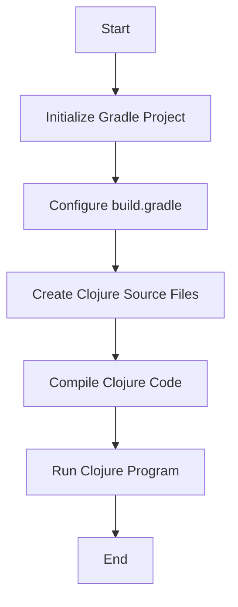

## 2.8.2 Using Clojure with Gradle

In this section, we will explore how to integrate Clojure into a Gradle project, configure the `build.gradle` file with the necessary plugins and dependencies, and build and run Clojure code using Gradle tasks. As experienced Java developers, you are likely familiar with Gradle as a powerful build automation tool. We'll leverage this knowledge to seamlessly incorporate Clojure into your existing workflow.

### Why Use Gradle with Clojure?

Gradle is a versatile build tool that offers several advantages when working with Clojure:

- **Dependency Management**: Gradle's robust dependency management system simplifies the process of managing Clojure libraries and their transitive dependencies.
- **Task Automation**: Gradle allows you to automate common tasks such as compiling, testing, and packaging your Clojure applications.
- **Integration with Java**: Gradle's seamless integration with Java makes it an ideal choice for projects that involve both Java and Clojure codebases.

### Setting Up a Clojure Project with Gradle

Let's start by setting up a basic Clojure project using Gradle. We'll walk through the steps of creating a new Gradle project, configuring the `build.gradle` file, and running a simple Clojure program.

#### Step 1: Create a New Gradle Project

First, create a new directory for your Clojure project and navigate into it:

```bash
mkdir clojure-gradle-project
cd clojure-gradle-project
```

Next, initialize a new Gradle project:

```bash
gradle init
```

Choose the following options when prompted:

- **Select type of project to generate**: basic
- **Select build script DSL**: groovy
- **Project name**: clojure-gradle-project
- **Source package**: (leave blank)

This command will generate a basic Gradle project structure.

#### Step 2: Configure `build.gradle`

Open the `build.gradle` file and configure it to support Clojure. We'll use the `clojure-gradle-plugin` to handle Clojure compilation and execution.

Add the following to your `build.gradle` file:

```groovy
plugins {
    id 'java'
    id 'clojure' version '0.6.0' // Use the latest version available
}

repositories {
    mavenCentral()
}

dependencies {
    implementation 'org.clojure:clojure:1.11.1' // Use the latest stable version
    testImplementation 'org.clojure:clojure:1.11.1'
}

sourceSets {
    main {
        clojure {
            srcDirs = ['src/main/clojure']
        }
    }
    test {
        clojure {
            srcDirs = ['src/test/clojure']
        }
    }
}

tasks.withType(ClojureCompile) {
    options.aotCompile = true // Enable Ahead-of-Time compilation
}
```

**Explanation:**

- **Plugins**: We apply the `java` plugin for Java compatibility and the `clojure` plugin for Clojure support.
- **Repositories**: We use Maven Central to fetch dependencies.
- **Dependencies**: We specify Clojure as a dependency for both implementation and testing.
- **SourceSets**: We define source directories for Clojure code.
- **Tasks**: We configure Clojure compilation tasks, enabling Ahead-of-Time (AOT) compilation for performance optimization.

#### Step 3: Create a Simple Clojure Program

Create the directory structure for your Clojure source files:

```bash
mkdir -p src/main/clojure
```

Create a new Clojure file named `hello_world.clj` in the `src/main/clojure` directory with the following content:

```clojure
(ns hello-world.core)

(defn -main
  "A simple Clojure program that prints 'Hello, World!'"
  []
  (println "Hello, World!"))
```

**Explanation:**

- **Namespace Declaration**: We declare a namespace `hello-world.core`.
- **Main Function**: We define a `-main` function that prints "Hello, World!" to the console.

#### Step 4: Build and Run the Clojure Program

To compile and run your Clojure program, use the following Gradle commands:

```bash
gradle compileClojure
gradle run
```

The `compileClojure` task compiles the Clojure source files, and the `run` task executes the `-main` function.

### Comparing with Java

Let's compare this setup with a typical Java project. In Java, you would use the `java` plugin and configure the `sourceSets` for Java files. The process is similar, but the key difference lies in the use of the `clojure` plugin and the configuration of Clojure-specific tasks.

#### Java Example

Here's a simple Java `build.gradle` configuration for comparison:

```groovy
plugins {
    id 'java'
}

repositories {
    mavenCentral()
}

dependencies {
    testImplementation 'junit:junit:4.13.2'
}

sourceSets {
    main {
        java {
            srcDirs = ['src/main/java']
        }
    }
    test {
        java {
            srcDirs = ['src/test/java']
        }
    }
}
```

**Key Differences:**

- **Plugins**: The Java project uses only the `java` plugin, while the Clojure project uses both `java` and `clojure`.
- **SourceSets**: The Java project specifies `src/main/java`, whereas the Clojure project uses `src/main/clojure`.
- **Dependencies**: The Java project includes a test dependency on JUnit, while the Clojure project includes Clojure as both an implementation and test dependency.

### Advanced Configuration

Now that we have a basic Clojure project set up with Gradle, let's explore some advanced configurations and tasks.

#### Adding Additional Dependencies

To add additional Clojure libraries, simply include them in the `dependencies` block. For example, to add the `clojure.string` library, update the `dependencies` block as follows:

```groovy
dependencies {
    implementation 'org.clojure:clojure:1.11.1'
    implementation 'org.clojure:clojure.string:1.11.1'
    testImplementation 'org.clojure:clojure:1.11.1'
}
```

#### Custom Gradle Tasks

You can define custom Gradle tasks to automate specific actions. For example, let's create a task to clean compiled Clojure files:

```groovy
task cleanClojure(type: Delete) {
    delete fileTree(dir: 'build/classes/clojure')
}
```

This task deletes the compiled Clojure files in the `build/classes/clojure` directory.

### Try It Yourself

Experiment with the following modifications to deepen your understanding:

1. **Add a New Dependency**: Include a new Clojure library and use it in your code.
2. **Create a Custom Task**: Define a Gradle task that performs a specific action, such as packaging your application.
3. **Modify the Source Directory**: Change the source directory for Clojure files and update the `build.gradle` configuration accordingly.

### Visualizing the Build Process

Let's visualize the flow of the build process using a Mermaid.js diagram:



**Diagram Explanation**: This flowchart illustrates the steps involved in setting up and running a Clojure project with Gradle, from initializing the project to executing the Clojure program.

### Further Reading

For more information on using Gradle with Clojure, consider exploring the following resources:

- [Official Clojure Documentation](https://clojure.org/)
- [Gradle User Manual](https://docs.gradle.org/current/userguide/userguide.html)
- [Clojure Gradle Plugin GitHub Repository](https://github.com/gradle-clojure/gradle-clojure)

### Exercises

1. **Create a New Clojure Function**: Write a new function in your Clojure program that performs a simple calculation, such as adding two numbers.
2. **Configure a Test Task**: Set up a test task in Gradle to run Clojure tests using `clojure.test`.
3. **Explore AOT Compilation**: Experiment with enabling and disabling AOT compilation in your `build.gradle` file and observe the impact on build performance.

### Key Takeaways

- Gradle provides a powerful and flexible environment for building and managing Clojure projects.
- The `clojure-gradle-plugin` simplifies the integration of Clojure into Gradle projects.
- Custom tasks and configurations can enhance your build process and automate repetitive tasks.

By following these steps and experimenting with the configurations, you'll be well-equipped to integrate Clojure into your Gradle projects effectively. Now that we've explored how to use Gradle with Clojure, let's apply these concepts to build robust and maintainable applications.

## Quiz: Mastering Clojure with Gradle



### What is the primary purpose of using Gradle with Clojure?

- [x] To automate the build and dependency management process
- [ ] To replace the need for a Clojure REPL
- [ ] To eliminate the need for Java in Clojure projects
- [ ] To create graphical user interfaces

> **Explanation:** Gradle is used to automate the build process and manage dependencies, making it easier to handle complex projects.

### Which plugin is essential for integrating Clojure with Gradle?

- [x] clojure
- [ ] kotlin
- [ ] scala
- [ ] groovy

> **Explanation:** The `clojure` plugin is necessary to compile and run Clojure code within a Gradle project.

### How do you specify the source directory for Clojure files in `build.gradle`?

- [x] Using the `sourceSets` block
- [ ] By setting the `clojureSourceDir` property
- [ ] Through the `repositories` block
- [ ] By modifying the `dependencies` block

> **Explanation:** The `sourceSets` block is used to define the directories for source files, including Clojure files.

### What is the purpose of Ahead-of-Time (AOT) compilation in Clojure?

- [x] To improve runtime performance by compiling Clojure code to Java bytecode
- [ ] To enable dynamic typing in Clojure
- [ ] To simplify the syntax of Clojure code
- [ ] To allow Clojure code to run without a JVM

> **Explanation:** AOT compilation converts Clojure code into Java bytecode, which can improve runtime performance.

### Which command is used to compile Clojure code in a Gradle project?

- [x] gradle compileClojure
- [ ] gradle buildClojure
- [ ] gradle runClojure
- [ ] gradle executeClojure

> **Explanation:** The `gradle compileClojure` command compiles the Clojure source files in the project.

### What is the role of the `repositories` block in `build.gradle`?

- [x] To specify where Gradle should look for dependencies
- [ ] To define the output directory for compiled code
- [ ] To set the Java version for the project
- [ ] To configure the build script language

> **Explanation:** The `repositories` block tells Gradle where to find the project's dependencies, such as Maven Central.

### How can you add a new Clojure library to your Gradle project?

- [x] By adding it to the `dependencies` block in `build.gradle`
- [ ] By creating a new `lib` directory and placing the library there
- [ ] By modifying the `sourceSets` block
- [ ] By using the `repositories` block

> **Explanation:** New libraries are added to the `dependencies` block, specifying the library's group, name, and version.

### What is the benefit of using custom Gradle tasks?

- [x] To automate repetitive tasks and customize the build process
- [ ] To replace the need for a version control system
- [ ] To eliminate the need for a `build.gradle` file
- [ ] To create user interfaces for Clojure applications

> **Explanation:** Custom tasks allow developers to automate and customize various aspects of the build process, improving efficiency.

### Which command runs the main function of a Clojure program in a Gradle project?

- [x] gradle run
- [ ] gradle execute
- [ ] gradle start
- [ ] gradle launch

> **Explanation:** The `gradle run` command executes the main function of the Clojure program defined in the project.

### True or False: Gradle can only be used for Java projects, not Clojure.

- [ ] True
- [x] False

> **Explanation:** Gradle is a versatile build tool that can be used for various languages, including Clojure, by using appropriate plugins.


